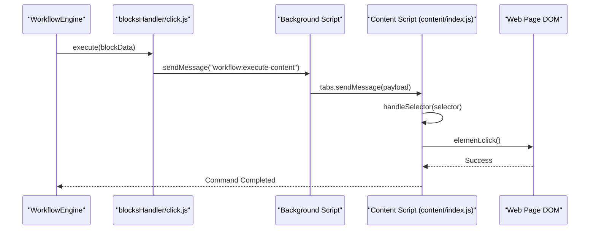

# Overview

<details>
<summary>Relevant source files</summary>

The following files were used as context for generating this wiki page:

- [LICENSE.txt](LICENSE.txt)
- [README.md](README.md)
- [package.json](package.json)
- [src/background/index.js](src/background/index.js)
- [src/components/newtab/workflow/WorkflowSettings.vue](src/components/newtab/workflow/WorkflowSettings.vue)
- [src/locales/en/blocks.json](src/locales/en/blocks.json)
- [src/locales/en/newtab.json](src/locales/en/newtab.json)
- [src/manifest.chrome.json](src/manifest.chrome.json)
- [src/manifest.firefox.json](src/manifest.firefox.json)
- [src/newtab/App.vue](src/newtab/App.vue)
- [src/newtab/pages/workflows/[id].vue](src/newtab/pages/workflows/[id].vue)
- [src/utils/helper.js](src/utils/helper.js)
- [src/utils/shared.js](src/utils/shared.js)
- [utils/env.js](utils/env.js)

</details>


Automa is a browser extension designed to automate web-based tasks by connecting functional blocks into a visual workflow. It operates as a low-code platform where users can build automation logic—ranging from simple form filling and data scraping to complex conditional loops and cross-tab browser manipulation—without writing extensive code.

The system is built as a multi-layered browser extension compatible with both Chrome (Manifest V3) and Firefox (Manifest V2) [src/manifest.chrome.json:1-89](), [src/manifest.firefox.json:1-70]().

### High-Level Architecture

Automa is divided into several primary subsystems that communicate via a centralized messaging bridge:

1.  **Dashboard & Editor (UI Layer):** A Vue.js Single Page Application (SPA) where workflows are designed, managed, and monitored [src/newtab/App.vue:1-72]().
2.  **Background Script (Orchestration Layer):** The persistent "brain" of the extension that manages workflow scheduling, browser-level events, and coordinates execution between tabs [src/background/index.js:1-161]().
3.  **Workflow Engine (Execution Layer):** The logic processor that interprets workflow graphs, resolves variables, and executes block-specific handlers [src/workflowEngine/helper.js:14]().
4.  **Content Scripts (Interaction Layer):** Scripts injected into web pages to perform DOM manipulations, such as clicking buttons or extracting text [src/manifest.chrome.json:33-40]().

### System Component Map

This diagram maps high-level concepts to the specific code entities that implement them.

**Bridge: Natural Language to Code Entity Space**

```mermaid
graph TD
    subgraph "User Interface Space"
        [Visual Editor] --> ["WorkflowEditor.vue"]
        [Workflow List] --> ["Workflows.vue"]
        [Block Config] --> ["EditTrigger.vue, etc."]
    end

    subgraph "Execution & Logic Space"
        ["WorkflowEditor.vue"] -- "Saves Graph" --> ["useWorkflowStore"]
        ["useWorkflowStore"] -- "Triggers" --> ["BackgroundWorkflowUtils"]
        ["BackgroundWorkflowUtils"] -- "Spawns" --> ["WorkflowEngine"]
        ["WorkflowEngine"] -- "Dispatches" --> ["blocksHandler"]
    end

    subgraph "Browser Interaction Space"
        ["blocksHandler"] -- "Messaging" --> ["ContentScript (index.js)"]
        ["ContentScript (index.js)"] -- "DOM Action" --> ["handleSelector.js"]
    end

    style [Visual Editor] stroke-dasharray: 5 5
    style [Workflow List] stroke-dasharray: 5 5
    style [Block Config] stroke-dasharray: 5 5
```
**Sources:** [src/newtab/pages/workflows/[id].vue:171-185](), [src/background/index.js:151-161](), [src/manifest.chrome.json:33-40]()

### Core Subsystems

#### 1. Workflow Engine & Block Architecture
Workflows are represented as JSON graphs. Each node in the graph is a **Block**, defined by a schema in `shared.js` [src/utils/shared.js:1-51](). Blocks are categorized into types like `general`, `browser`, and `interaction` [src/utils/shared.js:8, 105, 146]().
*   For details, see [Core Concepts & Block Architecture](#1.2).

#### 2. Background Process & Triggers
The background script acts as a singleton service. it listens for browser events (alarms, commands, navigation) and initiates workflow execution via the `BackgroundEventsListeners` [src/background/index.js:26-46](). It also manages the registration of workflow triggers like CRON jobs or specific URL visits [src/background/index.js:195-197]().

#### 3. UI Layer (Dashboard & Popup)
The Dashboard is the primary workspace, utilizing `VueFlow` for the node-based editor [src/newtab/pages/workflows/[id].vue:171-185](). It also provides views for execution logs stored in IndexedDB (`dbLogs`) and local data storage (`dbStorage`) [src/newtab/App.vue:178-188]().
*   For details, see [Getting Started & Project Setup](#1.1).

### Execution Flow Diagram

The following diagram illustrates how a "Click" command moves from the workflow engine to a physical element on a webpage.

**Bridge: Command Execution Pipeline**


**Sources:** [src/background/index.js:151-161](), [src/manifest.chrome.json:33-40](), [src/utils/shared.js:261-285]()

### Data Persistence
Automa uses **Dexie.js** to interface with IndexedDB for two primary databases:
*   **dbLogs**: Stores workflow execution history, logs, and context data [src/newtab/App.vue:178-191]().
*   **dbStorage**: Stores user-defined tables, variables, and credentials used across workflows [src/newtab/App.vue:80]().

### Technical Stack Summary

| Component | Technology |
| :--- | :--- |
| **Framework** | Vue 3 (Composition API) [package.json:94]() |
| **State Management** | Pinia [package.json:83]() |
| **Database** | IndexedDB via Dexie [package.json:68]() |
| **Styling** | Tailwind CSS [package.json:140]() |
| **Build System** | Webpack [package.json:144]() |
| **Visual Graph** | VueFlow [package.json:54]() |

---

### Child Pages
*   **[Getting Started & Project Setup](#1.1)**: Instructions for setting up the development environment, building for different browsers (Chrome vs. Firefox), and understanding the directory structure.
*   **[Core Concepts & Block Architecture](#1.2)**: Detailed breakdown of the block schema, the Drawflow/VueFlow graph format, and how individual tasks are defined.

---

