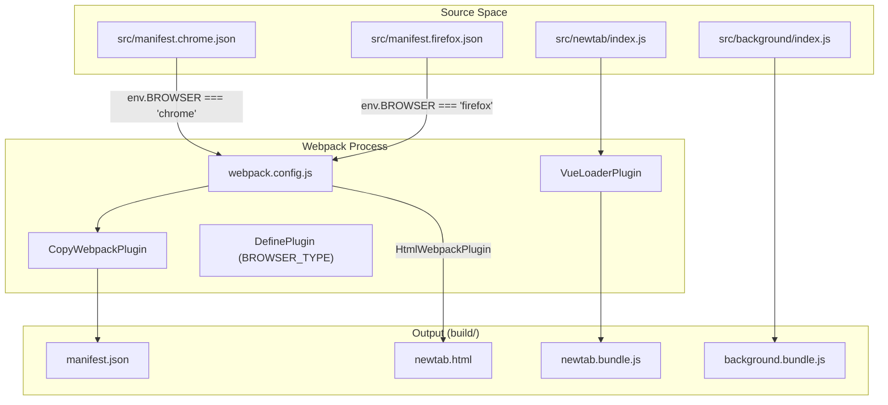
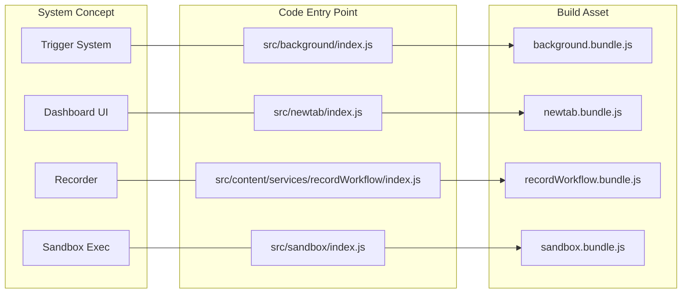

# Getting Started & Project Setup

<details>
<summary>Relevant source files</summary>

The following files were used as context for generating this wiki page:

- [.eslintrc.js](.eslintrc.js)
- [LICENSE.txt](LICENSE.txt)
- [README.md](README.md)
- [src/content/services/recordWorkflow/App.vue](src/content/services/recordWorkflow/App.vue)
- [src/manifest.chrome.json](src/manifest.chrome.json)
- [src/manifest.firefox.json](src/manifest.firefox.json)
- [src/utils/helper.js](src/utils/helper.js)
- [utils/env.js](utils/env.js)
- [webpack.config.js](webpack.config.js)

</details>


This page provides technical instructions for setting up the Automa development environment, building the extension for different browser targets, and understanding the project's build-time architecture.

## 1. Prerequisites & Environment Configuration

Automa requires a specific security utility file to be created manually before the build process can succeed. This file is used for internal data encryption/decryption routines.

### Security Setup
Create the file `src/utils/getPassKey.js` and export a default function returning a string of your choice [README.md:42-49]().

```javascript
export default function() {
  return 'your-secure-passkey';
}
```

### Installation
The project uses `pnpm` for package management [README.md:53]().
```bash
pnpm install
```

## 2. Build System & Webpack Configuration

Automa uses a complex Webpack setup to manage multiple entry points required by a browser extension (background scripts, content scripts, dashboard, popup, and sandboxed environments).

### Entry Points
The `webpack.config.js` defines several critical bundles [webpack.config.js:42-73]():
*   **`background`**: The persistent service worker/background script [src/background/index.js]().
*   **`contentScript`**: The script injected into web pages [src/content/index.js]().
*   **`newtab`**: The main Dashboard UI [src/newtab/index.js]().
*   **`popup`**: The extension's browser action menu [src/popup/index.js]().
*   **`sandbox`**: An isolated environment for executing potentially unsafe code [src/sandbox/index.js]().
*   **`offscreen`**: Used in MV3 to handle tasks like audio or DOM-related background work [src/offscreen/index.js]().

### Build-Time Environment Mapping
The build system uses a custom environment wrapper `utils/env.js` to determine the target browser and node environment [utils/env.js:1-7]().

| Variable | Default | Description |
| :--- | :--- | :--- |
| `NODE_ENV` | `development` | Build mode (production/development) |
| `BROWSER` | `chrome` | Target browser (chrome/firefox) |

**Sources:** [webpack.config.js:40-87](), [utils/env.js:1-7](), [README.md:51-72]()

## 3. Browser Manifests (MV3 vs MV2)

Automa supports both Chromium-based browsers (Chrome, Edge, Brave) and Firefox. Due to architectural differences in extension APIs, it maintains separate manifest files.

### Manifest Comparison

| Feature | Chrome (`src/manifest.chrome.json`) | Firefox (`src/manifest.firefox.json`) |
| :--- | :--- | :--- |
| **Manifest Version** | 3 (MV3) [src/manifest.chrome.json:2]() | 2 (MV2) [src/manifest.firefox.json:2]() |
| **Background** | `service_worker` [src/manifest.chrome.json:10]() | `scripts` (Persistent) [src/manifest.firefox.json:10-11]() |
| **Permissions** | Granular (includes `offscreen`, `scripting`) [src/manifest.chrome.json:59-70]() | Standard MV2 permissions [src/manifest.firefox.json:51-60]() |
| **Security** | Uses `sandbox` for JS execution [src/manifest.chrome.json:86-88]() | Uses `content_security_policy` string [src/manifest.firefox.json:68]() |

### Build Pipeline Flow
The diagram below illustrates how `webpack.config.js` transforms source code into the final browser-ready extension.

**Build Logic Flow: Source to Extension**

**Sources:** [webpack.config.js:144-200](), [src/manifest.chrome.json:1-89](), [src/manifest.firefox.json:1-70]()

## 4. Directory Structure & Business Logic

Automa employs a dual-licensing structure (AGPL and Commercial). This is reflected in the directory organization.

*   **`src/`**: Contains the core open-source logic (AGPL). This includes the workflow engine, dashboard components, and content scripts [LICENSE.txt:3]().
*   **`business/`**: Contains commercial-only features. The build system aliases `@business` to `business/dev` by default [webpack.config.js:17-18]().
*   **`secrets.js`**: Webpack looks for `secrets.development.js` or `secrets.production.js` to inject API keys and sensitive configuration at build time [webpack.config.js:20-38]().

### Path Aliasing
To simplify imports, the following aliases are configured [webpack.config.js:14-18]():
*   `@`: Points to `src/`
*   `secrets`: Points to the relevant secrets file.
*   `@business`: Points to the commercial features directory.

## 5. Running Locally

### Development Commands
```bash
# Chrome Development (Hot Reloading)
pnpm dev

# Firefox Development
pnpm dev:firefox

# Production Build
pnpm build
```
**Sources:** [README.md:51-72]()

### Local Installation
1.  **Chrome**:
    *   Navigate to `chrome://extensions`.
    *   Enable **Developer Mode**.
    *   Click **Load unpacked** and select the `automa/build` folder [README.md:78-83]().
2.  **Firefox**:
    *   Navigate to `about:debugging#/runtime/this-firefox`.
    *   Click **Load Temporary Add-on**.
    *   Select the `manifest.json` from the `automa/build` folder [README.md:85-90]().

### Code Entity Association
This diagram maps the high-level project concepts to the specific files responsible for their initialization.

**Entity Map: System Names to Code Entries**

**Sources:** [webpack.config.js:42-73](), [src/manifest.chrome.json:9-12](), [src/content/services/recordWorkflow/App.vue:1-35]()

---

