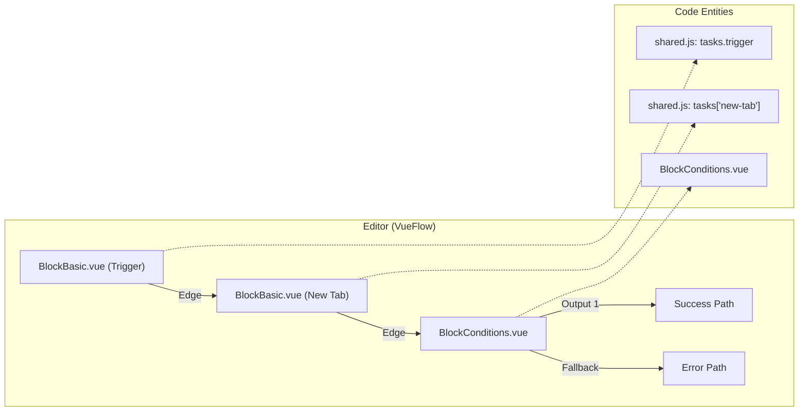
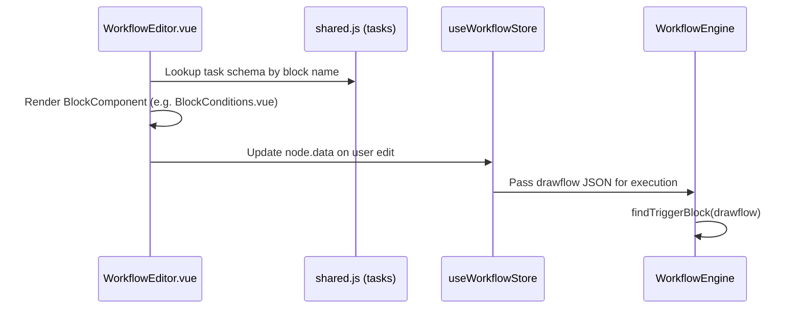

# Core Concepts & Block Architecture

Relevant source files

The following files were used as context for generating this wiki page:

- [.vscode/settings.json](.vscode/settings.json)
- [package.json](package.json)
- [src/assets/css/drawflow.css](src/assets/css/drawflow.css)
- [src/background/index.js](src/background/index.js)
- [src/components/block/BlockBase.vue](src/components/block/BlockBase.vue)
- [src/components/block/BlockBasic.vue](src/components/block/BlockBasic.vue)
- [src/components/block/BlockConditions.vue](src/components/block/BlockConditions.vue)
- [src/components/block/BlockElementExists.vue](src/components/block/BlockElementExists.vue)
- [src/components/newtab/workflow/WorkflowSettings.vue](src/components/newtab/workflow/WorkflowSettings.vue)
- [src/components/newtab/workflow/edit/EditConditions.vue](src/components/newtab/workflow/edit/EditConditions.vue)
- [src/locales/en/blocks.json](src/locales/en/blocks.json)
- [src/locales/en/newtab.json](src/locales/en/newtab.json)
- [src/locales/zh/blocks.json](src/locales/zh/blocks.json)
- [src/locales/zh/common.json](src/locales/zh/common.json)
- [src/locales/zh/newtab.json](src/locales/zh/newtab.json)
- [src/locales/zh/popup.json](src/locales/zh/popup.json)
- [src/manifest.chrome.json](src/manifest.chrome.json)
- [src/manifest.firefox.json](src/manifest.firefox.json)
- [src/newtab/App.vue](src/newtab/App.vue)
- [src/newtab/pages/workflows/[id].vue](src/newtab/pages/workflows/[id].vue)
- [src/offscreen/index.js](src/offscreen/index.js)
- [src/utils/helper.js](src/utils/helper.js)
- [src/utils/shared.js](src/utils/shared.js)

This page details the fundamental architecture of Automa workflows, focusing on the "Block" as the atomic unit of automation, the schema governing their behavior, and the graph structure that defines workflow logic.

## The Block: Atomic Unit of Automation

In Automa, a **Block** is a discrete functional unit that performs a specific task (e.g., opening a tab, clicking an element, or evaluating a condition). Every block is defined by a task schema that dictates its metadata, UI representation, and default data structure.

### Block Schema (tasks)
The master registry of all available blocks is located in `src/utils/shared.js`. Each entry in the `tasks` object defines the capabilities and constraints of a block.

| Property | Description |
| :--- | :--- |
| `name` | The display name of the block. |
| `component` | The Vue component used to render the block in the editor (e.g., `BlockBasic`, `BlockConditions`). |
| `editComponent` | The Vue component used in the sidebar to configure the block's settings (e.g., `EditTrigger`). |
| `category` | Categorization for the block palette (e.g., `general`, `browser`, `interaction`). |
| `inputs` / `outputs` | Integer values defining the number of connection ports. |
| `data` | The default state/configuration object for the block. |

**Example: Trigger Block Schema**
[src/utils/shared.js:2-51]() defines the `trigger` block, specifying it as the starting point of workflows with `inputs: 0` and `outputs: 1`.

### Block Categories
Blocks are grouped by their execution environment and purpose:
*   **General**: Workflow control and logic (Trigger, Execute Workflow). [src/utils/shared.js:2-99]()
*   **Browser**: Browser-level actions (New Tab, Proxy, Screenshot). [src/utils/shared.js:100-284]()
*   **Interaction**: DOM-level interactions (Click, Forms, Get Text).
*   **Control Flow**: Branching and loops (Conditions, Loop Data).

**Sources:**
* [src/utils/shared.js:1-284]()

---

## Workflow Graph Architecture

Automa workflows are represented as directed graphs where nodes are blocks and edges are the execution paths.

### Visual Representation vs. Data Model
The UI uses **VueFlow** to render the graph, but the underlying data structure is a JSON object. Historically, Automa used the `drawflow` format, which is still supported and often converted at runtime.

### The Drawflow Schema
A workflow's logic is stored in the `drawflow` property of a workflow object.
*   **Nodes**: Contain the block `id`, `name` (referencing the task schema), `data` (user configuration), and `pos_x`/`pos_y` for the editor.
*   **Edges (Connections)**: Defined within the node's `outputs` property, mapping specific output ports to the `input` port of a target node.

### Graph Logic Flow

**Sources:**
* [src/newtab/pages/workflows/[id].vue:171-185]()
* [src/components/block/BlockConditions.vue:1-79]()
* [src/utils/helper.js:153-157]()

---

## Block Implementation Hierarchy

Blocks are implemented using a tiered component strategy to maximize code reuse while allowing specialized behavior for complex blocks.

### 1. BlockBase.vue
The universal wrapper for all blocks in the editor. It handles common UI elements:
*   Block menus (Delete, Duplicate, Settings).
*   Execution status indicators (running, error, breakpoint).
*   The `Handle` components from `@vue-flow/core` for connections.
[src/components/block/BlockConditions.vue:2-12]()

### 2. Specialized Block Components
*   **BlockBasic.vue**: Standard blocks with one input and one output.
*   **BlockConditions.vue**: Implements dynamic output handles based on the number of conditions defined in the block's data. [src/components/block/BlockConditions.vue:33-78]()
*   **BlockGroup.vue**: Allows nesting multiple blocks inside a single container for organization.

### 3. Edit Components (Configuration)
When a user clicks a block, the `WorkflowEditor` triggers an edit event. The dashboard then renders the corresponding `editComponent` (e.g., `EditTrigger.vue`) in the sidebar.
[src/newtab/pages/workflows/[id].vue:17-24]()

### Data Flow: Editor to Engine
1.  **Editor**: User modifies block data via an `editComponent`. [src/newtab/pages/workflows/[id].vue:22]()
2.  **Persistence**: Changes are saved to the `workflow` store and eventually IndexedDB. [src/newtab/pages/workflows/[id].vue:182]()
3.  **Execution**: The `WorkflowEngine` parses the `drawflow` graph, starting from the `trigger` block found via `findTriggerBlock`. [src/utils/helper.js:57-71]()

**Sources:**
* [src/newtab/pages/workflows/[id].vue:17-32]()
* [src/utils/shared.js:1-51]()
* [src/utils/helper.js:57-71]()
* [src/components/block/BlockConditions.vue:83-86]()

---

## Task Data and Referencing
The `data` object within each block schema (defined in `shared.js`) supports a referencing system. Properties listed in `refDataKeys` are candidates for variable injection (e.g., `{{variableName}}`) before the block executes.

**Example: New Tab Block Data**
[src/utils/shared.js:126-138]() shows that `url` and `userAgent` are in `refDataKeys`, meaning the engine will attempt to resolve any mustache templates in those fields at runtime using `replaceMustache`.

**Sources:**
* [src/utils/shared.js:126-138]()
* [src/utils/helper.js:159-162]()

---

