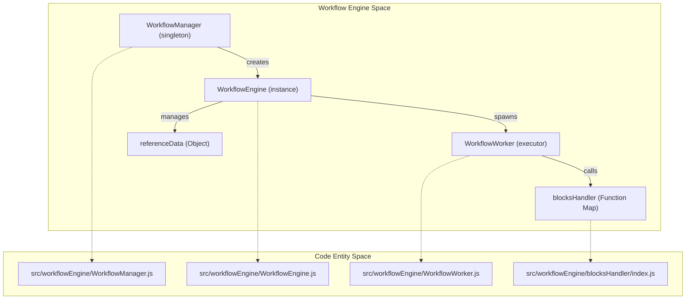
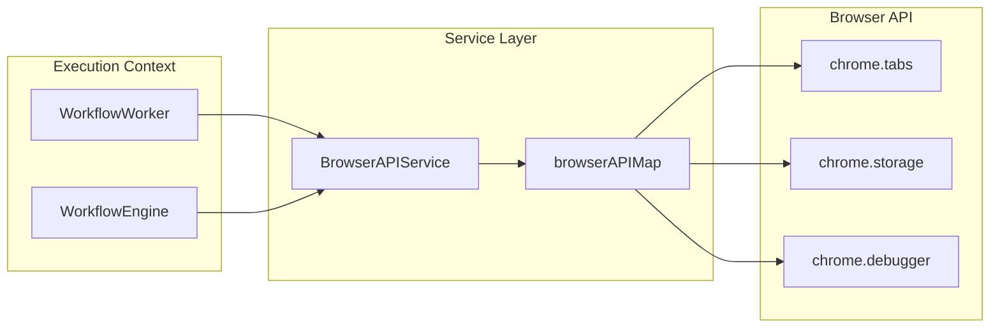

# Workflow Engine

Relevant source files

The following files were used as context for generating this wiki page:

- [pnpm-lock.yaml](pnpm-lock.yaml)
- [src/service/browser-api/BrowserAPIService.js](src/service/browser-api/BrowserAPIService.js)
- [src/service/browser-api/browser-api-map.js](src/service/browser-api/browser-api-map.js)
- [src/utils/serialization.js](src/utils/serialization.js)
- [src/workflowEngine/WorkflowEngine.js](src/workflowEngine/WorkflowEngine.js)
- [src/workflowEngine/WorkflowManager.js](src/workflowEngine/WorkflowManager.js)
- [src/workflowEngine/WorkflowWorker.js](src/workflowEngine/WorkflowWorker.js)

The Workflow Engine is the core execution environment of Automa, responsible for parsing the visual graph and executing block logic. It operates primarily in the browser's background context but coordinates with content scripts for DOM-level interactions.

## Core Execution Architecture

The engine is structured into three primary layers: the **Manager** (orchestration), the **Engine** (state and context management), and the **Worker** (block execution).

### 1. WorkflowManager
The `WorkflowManager` is a singleton class that serves as the entry point for starting, stopping, and resuming workflows [src/workflowEngine/WorkflowManager.js:25-37](). It handles the initial conversion of workflow data [src/workflowEngine/WorkflowManager.js:57]() and instantiates the `WorkflowEngine`. It also listens for the `destroyed` event to trigger notifications and post-execution events [src/workflowEngine/WorkflowManager.js:66-120]().

### 2. WorkflowEngine
The `WorkflowEngine` represents a single execution instance of a workflow [src/workflowEngine/WorkflowEngine.js:15-17](). It maintains the global state for that run, including:
*   **Reference Data**: Variables, table data, and global data [src/workflowEngine/WorkflowEngine.js:84-92]().
*   **Worker Pool**: A map of active `WorkflowWorker` instances to support parallel execution paths [src/workflowEngine/WorkflowEngine.js:29]().
*   **Execution History**: A log of every block executed during the run [src/workflowEngine/WorkflowEngine.js:43]().

### 3. WorkflowWorker
The `WorkflowWorker` is responsible for the actual execution of individual blocks [src/workflowEngine/WorkflowWorker.js:38-40](). Each worker maintains its own local execution context, such as the `activeTab` it is currently targeting [src/workflowEngine/WorkflowWorker.js:57-63](). When a workflow branches, the engine spawns new workers to handle the parallel paths [src/workflowEngine/WorkflowWorker.js:210-215]().

### Engine Entity Mapping

The following diagram bridges the natural language concepts to the specific classes and files in the codebase.

**Workflow Engine Class Relationships**

Sources: [src/workflowEngine/WorkflowManager.js:25-65](), [src/workflowEngine/WorkflowEngine.js:15-30](), [src/workflowEngine/WorkflowWorker.js:38-64]()

---

## Subsystem Overviews

### Engine Lifecycle & State
The lifecycle begins with `WorkflowManager.execute()`. Before execution starts, the engine checks if the workflow requires runtime parameters. If so, it redirects to `params.html` or sends a message to the active tab to collect user input [src/workflowEngine/WorkflowEngine.js:155-235](). During execution, state is persisted via `WorkflowState` to `chrome.storage.local` [src/workflowEngine/WorkflowManager.js:12-23]().

For details, see [Engine Lifecycle: Manager, Engine & Worker](#2.1).

### Templating & Data Resolution
Before a block's handler is called, the `WorkflowWorker` uses the templating system to resolve dynamic expressions (e.g., `{{variableName}}`) within the block's parameters [src/workflowEngine/WorkflowWorker.js:12-13](). This system supports mustache-style syntax and complex path parsing for table and global data.

For details, see [Templating & Data Reference System](#2.2).

### Block Handlers
The engine uses a factory pattern to load block handlers. Each block type (e.g., `click-element`, `http-request`) has a corresponding handler function that defines its execution logic [src/workflowEngine/WorkflowWorker.js:255-260]().

For details, see [Block Handlers Reference](#2.3).

### JavaScript & Sandboxing
The `javascript-code` block allows users to run custom scripts. These scripts are executed in a controlled environment where they can interact with the engine via a specialized `automa` API [src/workflowEngine/WorkflowWorker.js:48]().

For details, see [JavaScript Code Block & Sandbox](#2.4).

### Control Flow
The engine manages complex logic through branching, loops, and conditions. Branching is handled by `executeNextBlocks`, which identifies all outgoing connections from a finished block and assigns them to workers [src/workflowEngine/WorkflowWorker.js:154-217]().

For details, see [Conditions, Loops & Control Flow](#2.5).

---

## Browser API Integration

The engine interacts with the browser through the `BrowserAPIService`. This service provides a unified interface for both MV2 and MV3 manifests, handling cross-context messaging and function serialization [src/service/browser-api/BrowserAPIService.js:165-214]().

**Browser API Mapping**

Sources: [src/service/browser-api/BrowserAPIService.js:216-229](), [src/service/browser-api/browser-api-map.js:4-115]()

## Data Persistence
The engine utilizes two primary IndexedDB databases managed via Dexie:
*   `dbLogs`: Stores execution history, logs, and context data [src/workflowEngine/WorkflowEngine.js:45]().
*   `dbStorage`: Manages persistent variables and user-defined tables [src/workflowEngine/WorkflowWorker.js:131-137]().

Sources: [src/workflowEngine/WorkflowEngine.js:1-10](), [src/workflowEngine/WorkflowWorker.js:1-9]()

---

