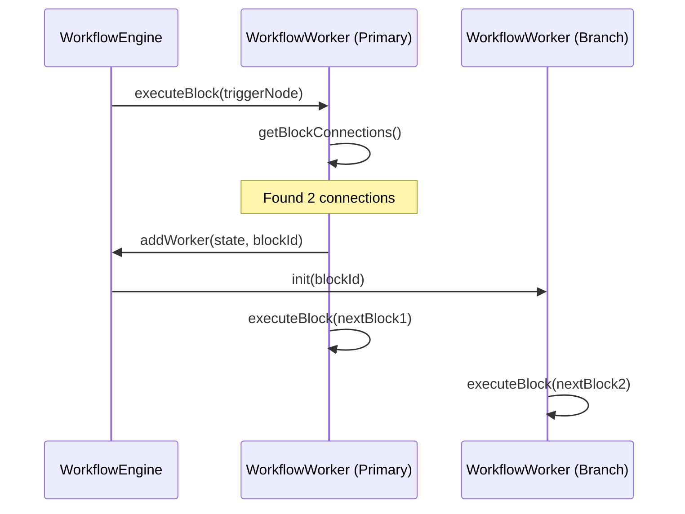

# Engine Lifecycle: Manager, Engine & Worker

<details>
<summary>Relevant source files</summary>

The following files were used as context for generating this wiki page:

- [pnpm-lock.yaml](pnpm-lock.yaml)
- [src/components/newtab/shared/SharedWorkflowState.vue](src/components/newtab/shared/SharedWorkflowState.vue)
- [src/components/newtab/workflow/WorkflowRunning.vue](src/components/newtab/workflow/WorkflowRunning.vue)
- [src/content/blocksHandler/handlerEventClick.js](src/content/blocksHandler/handlerEventClick.js)
- [src/content/blocksHandler/handlerJavascriptCode.js](src/content/blocksHandler/handlerJavascriptCode.js)
- [src/content/utils.js](src/content/utils.js)
- [src/service/browser-api/BrowserAPIService.js](src/service/browser-api/BrowserAPIService.js)
- [src/service/browser-api/browser-api-map.js](src/service/browser-api/browser-api-map.js)
- [src/utils/serialization.js](src/utils/serialization.js)
- [src/workflowEngine/WorkflowEngine.js](src/workflowEngine/WorkflowEngine.js)
- [src/workflowEngine/WorkflowManager.js](src/workflowEngine/WorkflowManager.js)
- [src/workflowEngine/WorkflowWorker.js](src/workflowEngine/WorkflowWorker.js)
- [src/workflowEngine/blocksHandler/handlerCreateElement.js](src/workflowEngine/blocksHandler/handlerCreateElement.js)
- [src/workflowEngine/helper.js](src/workflowEngine/helper.js)
- [src/workflowEngine/utils/javascriptBlockUtil.js](src/workflowEngine/utils/javascriptBlockUtil.js)

</details>


This page provides a deep dive into the three core entities responsible for executing Automa workflows: the `WorkflowManager`, the `WorkflowEngine`, and the `WorkflowWorker`. These classes form a hierarchical execution model where management, control flow, and block execution are decoupled.

## 1. Execution Hierarchy Overview

Automa's execution model follows a parent-child-leaf structure. The `WorkflowManager` acts as the singleton entry point for all executions. It spawns a `WorkflowEngine` for every workflow run, which in turn manages one or more `WorkflowWorker` instances to handle block-level execution and branching.

### 1.1 Code Entity Mapping

The following diagram bridges the conceptual lifecycle to the specific classes and methods within the codebase.

**Diagram: Execution Entity Mapping**
```mermaid
graph TD
    subgraph "Management Layer"
        Manager["WorkflowManager (Singleton)"]
        State["WorkflowState"]
    end

    subgraph "Control Layer"
        Engine["WorkflowEngine (Per Run)"]
        Logger["WorkflowLogger"]
    end

    subgraph "Execution Layer"
        Worker["WorkflowWorker (Block Executor)"]
        Handler["blocksHandler (Block Logic)"]
    end

    Manager -- "new WorkflowEngine()" --> Engine
    Manager -- "manages" --> State
    Engine -- "new WorkflowWorker()" --> Worker
    Engine -- "uses" --> Logger
    Worker -- "calls" --> Handler
    
    [src/workflowEngine/WorkflowManager.js] --> Manager
    [src/workflowEngine/WorkflowEngine.js] --> Engine
    [src/workflowEngine/WorkflowWorker.js] --> Worker
    [src/workflowEngine/WorkflowState.js] --> State
```
**Sources:** [src/workflowEngine/WorkflowManager.js:25-63](), [src/workflowEngine/WorkflowEngine.js:15-35](), [src/workflowEngine/WorkflowWorker.js:38-64]()

---

## 2. WorkflowManager: The Entry Point

`WorkflowManager` is a singleton class [src/workflowEngine/WorkflowManager.js:25-37]() that serves as the primary interface for starting, stopping, and resuming workflows.

### Key Responsibilities
- **Initialization**: Converts raw workflow data into an executable format using `convertWorkflowData` [src/workflowEngine/WorkflowManager.js:57]().
- **State Tracking**: Uses `WorkflowState` to persist the current status of running workflows in `browser.storage.local` under the key `workflowStates` [src/workflowEngine/WorkflowManager.js:12-23]().
- **Event Orchestration**: Listens for the `destroyed` event from the engine to trigger notifications and post-execution workflow events (e.g., success/failure webhooks) [src/workflowEngine/WorkflowManager.js:66-120]().

**Sources:** [src/workflowEngine/WorkflowManager.js:12-120]()

---

## 3. WorkflowEngine: The Run Controller

The `WorkflowEngine` manages the context for a single workflow execution. It holds the global state, reference data, and the collection of active workers.

### 3.1 Initialization and Triggering
When `init()` is called, the engine:
1. Validates the existence of blocks and a `trigger` node [src/workflowEngine/WorkflowEngine.js:133-147]().
2. **Parameter Collection**: If the trigger block defines parameters, the engine pauses and opens `params.html` (either in a popup window or a tab) to collect user input before proceeding [src/workflowEngine/WorkflowEngine.js:156-235]().
3. **Data Snapshots**: Initializes `referenceData` including `variables`, `globalData`, and `table` [src/workflowEngine/WorkflowEngine.js:84-92]().

### 3.2 Branching and Parallelism
The engine supports parallel execution through multiple workers. When a block has multiple outgoing connections, the current worker executes the first connection, while the engine spawns new workers for the subsequent branches [src/workflowEngine/WorkflowWorker.js:182-216]().

**Diagram: Data Flow & Worker Spawning**

**Sources:** [src/workflowEngine/WorkflowEngine.js:123-260](), [src/workflowEngine/WorkflowWorker.js:182-217]()

---

## 4. WorkflowWorker: The Executor

The `WorkflowWorker` is responsible for the actual execution of individual blocks. It maintains a local state (like `loopList` and `activeTab`) while interacting with the `WorkflowEngine` for shared resources.

### 4.1 Block Execution Pipeline
Every block execution goes through `executeBlock` [src/workflowEngine/WorkflowWorker.js:232]():
1. **Breakpoint Check**: If `testingMode` is active and a breakpoint is encountered, the worker saves its state to `breakpointState` and pauses [src/workflowEngine/WorkflowWorker.js:246-264]().
2. **Templating**: Block settings are passed through the templating engine to resolve variables [src/workflowEngine/WorkflowWorker.js:275-279]().
3. **Handler Invocation**: The specific logic for the block is executed via `blockExecutionWrapper`, which includes a configurable `blockTimeout` [src/workflowEngine/WorkflowWorker.js:15-36]().
4. **Data Persistence**: Results (like scraped text) are added to the engine's data table via `addDataToColumn` [src/workflowEngine/WorkflowWorker.js:77-110]().

### 4.2 Tab and Debugger Management
Workers track the `activeTab` [src/workflowEngine/WorkflowWorker.js:57-63](). For blocks requiring advanced interaction (like bypassing CSP), the worker utilizes `attachDebugger` to use the Chrome DevTools Protocol [src/workflowEngine/helper.js:95-112]().

**Sources:** [src/workflowEngine/WorkflowWorker.js:15-280](), [src/workflowEngine/helper.js:95-112]()

---

## 5. Lifecycle: Destroy and Cleanup

The destruction of an engine can be triggered by completion, manual stop, or a fatal error.

### 5.1 The `destroy` Process
When `engine.destroy(status)` is called:
1. `isDestroyed` is set to `true`, preventing further block executions [src/workflowEngine/WorkflowEngine.js:36]().
2. All active workers are cleared from the `workers` Map [src/workflowEngine/WorkflowEngine.js:29]().
3. **Cleanup**: Proxies are cleared, and the debugger is detached from any tabs [src/workflowEngine/WorkflowEngine.js:108-111]().
4. **Logging**: The final execution status and history are persisted to `dbLogs` [src/workflowEngine/WorkflowManager.js:66-84]().

### 5.2 Status Types
| Status | Description |
| :--- | :--- |
| `success` | Workflow reached the end of all branches without error. |
| `error` | A block failed, and no fallback was provided. |
| `stopped` | The user manually terminated the workflow via the Dashboard or Popup. |

**Sources:** [src/workflowEngine/WorkflowEngine.js:108-121](), [src/workflowEngine/WorkflowManager.js:66-105]()

---

