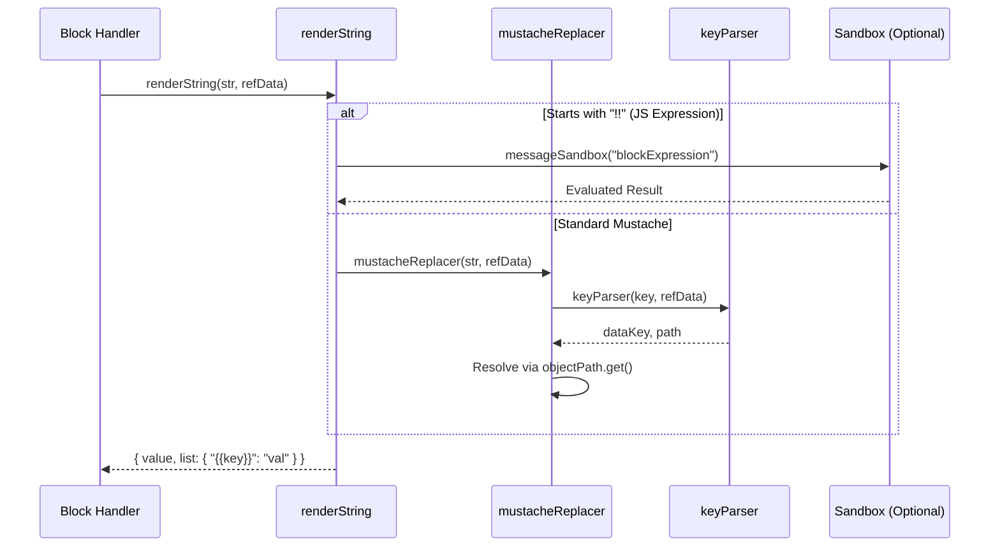
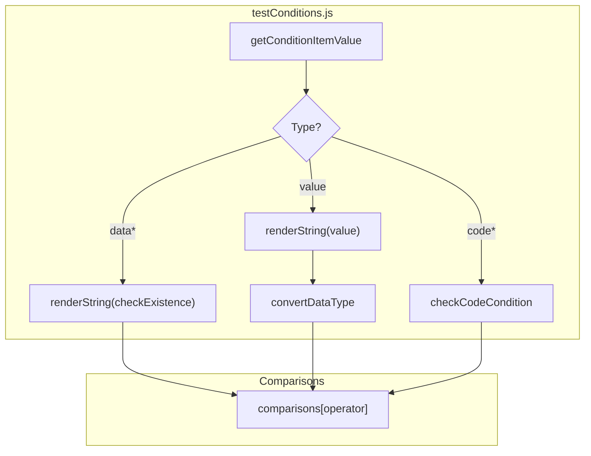

# Templating & Data Reference System

Relevant source files

The following files were used as context for generating this wiki page:

- [src/lib/tmpl.js](src/lib/tmpl.js)
- [src/sandbox/utils/handleBlockExpression.js](src/sandbox/utils/handleBlockExpression.js)
- [src/workflowEngine/blocksHandler/handlerConditions.js](src/workflowEngine/blocksHandler/handlerConditions.js)
- [src/workflowEngine/blocksHandler/handlerWebhook.js](src/workflowEngine/blocksHandler/handlerWebhook.js)
- [src/workflowEngine/blocksHandler/handlerWhileLoop.js](src/workflowEngine/blocksHandler/handlerWhileLoop.js)
- [src/workflowEngine/templating/index.js](src/workflowEngine/templating/index.js)
- [src/workflowEngine/templating/mustacheReplacer.js](src/workflowEngine/templating/mustacheReplacer.js)
- [src/workflowEngine/templating/renderString.js](src/workflowEngine/templating/renderString.js)
- [src/workflowEngine/utils/conditionCode.js](src/workflowEngine/utils/conditionCode.js)
- [src/workflowEngine/utils/testConditions.js](src/workflowEngine/utils/testConditions.js)
- [src/workflowEngine/utils/webhookUtil.js](src/workflowEngine/utils/webhookUtil.js)

The Templating & Data Reference System is a core subsystem of the Automa workflow engine that enables dynamic data injection into block parameters. It allows users to reference variables, table rows, loop data, secrets, and global data using a mustache-like syntax `{{variable}}`. The system handles parsing, data retrieval from the workflow context, and optional JavaScript expression evaluation.

## Architecture & Data Flow

The system operates by intercepting block data before execution and replacing template strings with actual values from the `refData` object. This process is primarily managed by `renderString` and `mustacheReplacer`.

### Core Pipeline Diagram

"Natural Language Space" to "Code Entity Space" mapping:

| Concept | Code Entity |
| --- | --- |
| Template String | `{{variables.name}}` or `!!js_expression` |
| Entry Point | `renderString` [src/workflowEngine/templating/renderString.js:6-37]() |
| Logic Engine | `mustacheReplacer` [src/workflowEngine/templating/mustacheReplacer.js:140-168]() |
| Key Resolver | `keyParser` [src/workflowEngine/templating/mustacheReplacer.js:29-62]() |
| Data Source | `refData` (Variables, Tables, LoopData, Secrets) |

### Execution Flow
The following diagram illustrates how a block's raw data is transformed into executed values.

"Template Resolution Sequence"

Sources: [src/workflowEngine/templating/renderString.js:6-37](), [src/workflowEngine/templating/mustacheReplacer.js:140-168](), [src/sandbox/utils/handleBlockExpression.js:10-17]()

## Key Components

### renderString
The main entry point for string interpolation. It detects if a string contains mustache tags `{{ }}` or if it is a JavaScript expression (starting with `!!`).
- **JavaScript Expressions**: If a string starts with `!!`, it bypasses standard mustache logic and sends the string to a sandboxed environment (`messageSandbox`) for evaluation using the `riot-tmpl` library [src/workflowEngine/templating/renderString.js:18-28]().
- **Standard Mustache**: Calls `mustacheReplacer` to process standard variables [src/workflowEngine/templating/renderString.js:33]().

### mustacheReplacer & keyParser
`mustacheReplacer` uses a regex `/\{\{(.*?)\}\}/g` to find tags. For each tag, it invokes `keyParser` to determine the source of the data [src/workflowEngine/templating/mustacheReplacer.js:149]().

**Key Parsing Logic (`keyParser`):**
- **Shorthand Mapping**: Maps `table`, `dataColumn`, and `dataColumns` to the same internal `table` data key [src/workflowEngine/templating/mustacheReplacer.js:6-10]().
- **Table References**: Supports `$last` for the final row index and defaults to index `0` if no index is provided (e.g., `{{table.columnName}}` becomes `table.0.columnName`) [src/workflowEngine/templating/mustacheReplacer.js:47-57]().
- **Loop Data**: Automatically injects a `.data.` segment for loop references (e.g., `{{loopData.loopId.key}}` becomes `loopData.loopId.data.key`) unless referencing `$index` [src/workflowEngine/templating/mustacheReplacer.js:37-41]().

### Templating Functions
Users can call built-in functions within templates using the `$functionName(args)` syntax.
- **Extraction**: `extractStrFunction` parses the function name and its parameters from the mustache tag [src/workflowEngine/templating/mustacheReplacer.js:12-27]().
- **Execution**: Functions are executed with `refData` as the context (`this.refData`) [src/workflowEngine/templating/mustacheReplacer.js:107]().

Sources: [src/workflowEngine/templating/mustacheReplacer.js:12-62](), [src/workflowEngine/templating/renderString.js:6-37]()

## Data Sources (refData)

The `refData` object is the source of truth during template resolution. It typically contains:

| Key | Description | Reference Syntax |
| --- | --- | --- |
| `variables` | User-defined workflow variables. | `{{variables.varName}}` |
| `table` | Data stored in the Automa table. | `{{table.columnName}}` |
| `loopData` | Data from the current iteration of a loop. | `{{loopData.loopId.key}}` |
| `secrets` | Encrypted credentials (decrypted on access). | `{{secrets.key}}` |
| `workflow` | Workflow metadata (id, name). | `{{workflow.name}}` |
| `globalData` | Data shared across all workflows. | `{{globalData.key}}` |

**Secret Handling**: When a key belongs to the `secrets` dataKey, the system automatically uses `credentialUtil.decrypt()` before returning the value [src/workflowEngine/templating/mustacheReplacer.js:121-124]().

Sources: [src/workflowEngine/templating/mustacheReplacer.js:6-10](), [src/workflowEngine/templating/mustacheReplacer.js:121-124]()

## Integration in Blocks

### General Block Data Resolution
The `templating/index.js` utility is used by the engine to iterate through specific keys of a block's data and render them before the block's handler is called.
- It accepts `refKeys` (an array of paths like `['url', 'headers.0.value']`) and updates the block object in place [src/workflowEngine/templating/index.js:5-15]().
- It tracks all replaced values in a `replacedValue` object for logging purposes [src/workflowEngine/templating/index.js:9-12]().

### Webhook Block Example
The `handlerWebhook` uses `renderString` manually to resolve headers and the URL before making the HTTP request.
- It iterates through headers and replaces each value [src/workflowEngine/blocksHandler/handlerWebhook.js:22-27]().
- It uses `executeWebhook` (from `webhookUtil.js`) which further renders the request body if it's a template [src/workflowEngine/utils/webhookUtil.js:113-115]().

### Condition Evaluation
The `testConditions` utility leverages `renderString` to resolve values before performing comparisons.
- **Data Existence**: Can check if a data path exists by passing `checkExistence: true` to `renderString` [src/workflowEngine/utils/testConditions.js:61-68]().
- **Type Conversion**: Supports prefixing values with types (e.g., `number::{{variables.val}}`) to ensure correct comparison logic [src/workflowEngine/utils/testConditions.js:89-93]().

"Condition Data Resolution"

Sources: [src/workflowEngine/utils/testConditions.js:51-96](), [src/workflowEngine/blocksHandler/handlerWebhook.js:22-29](), [src/workflowEngine/templating/index.js:5-40]()

---

