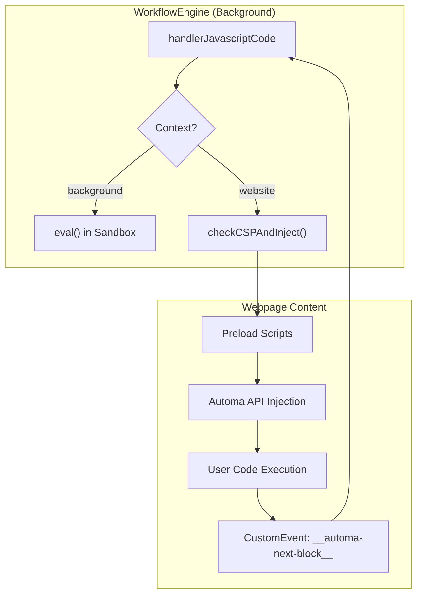
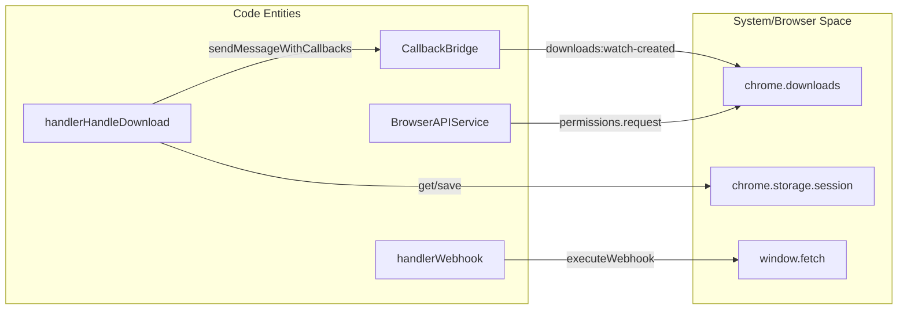

# Block Handlers Reference

Relevant source files

The following files were used as context for generating this wiki page:

- [src/components/newtab/settings/jsBlockWrap.js](src/components/newtab/settings/jsBlockWrap.js)
- [src/components/newtab/shared/SharedCodemirror.vue](src/components/newtab/shared/SharedCodemirror.vue)
- [src/components/newtab/workflow/edit/EditCreateElement.vue](src/components/newtab/workflow/edit/EditCreateElement.vue)
- [src/components/newtab/workflow/edit/EditExecuteWorkflow.vue](src/components/newtab/workflow/edit/EditExecuteWorkflow.vue)
- [src/components/newtab/workflow/edit/EditExportData.vue](src/components/newtab/workflow/edit/EditExportData.vue)
- [src/components/newtab/workflow/edit/EditGoogleDrive.vue](src/components/newtab/workflow/edit/EditGoogleDrive.vue)
- [src/components/newtab/workflow/edit/EditInsertData.vue](src/components/newtab/workflow/edit/EditInsertData.vue)
- [src/components/newtab/workflow/edit/EditJavascriptCode.vue](src/components/newtab/workflow/edit/EditJavascriptCode.vue)
- [src/components/newtab/workflow/edit/EditTabURL.vue](src/components/newtab/workflow/edit/EditTabURL.vue)
- [src/components/newtab/workflow/editor/EditorSearchBlocks.vue](src/components/newtab/workflow/editor/EditorSearchBlocks.vue)
- [src/components/newtab/workflow/settings/SettingsGeneral.vue](src/components/newtab/workflow/settings/SettingsGeneral.vue)
- [src/content/blocksHandler/handlerCreateElement.js](src/content/blocksHandler/handlerCreateElement.js)
- [src/content/blocksHandler/handlerUploadFile.js](src/content/blocksHandler/handlerUploadFile.js)
- [src/utils/callbackBridge.js](src/utils/callbackBridge.js)
- [src/utils/dataExporter.js](src/utils/dataExporter.js)
- [src/utils/getFile.js](src/utils/getFile.js)
- [src/utils/message.js](src/utils/message.js)
- [src/workflowEngine/WorkflowState.js](src/workflowEngine/WorkflowState.js)
- [src/workflowEngine/blocksHandler/handlerClipboard.js](src/workflowEngine/blocksHandler/handlerClipboard.js)
- [src/workflowEngine/blocksHandler/handlerCloseTab.js](src/workflowEngine/blocksHandler/handlerCloseTab.js)
- [src/workflowEngine/blocksHandler/handlerConditions.js](src/workflowEngine/blocksHandler/handlerConditions.js)
- [src/workflowEngine/blocksHandler/handlerCookie.js](src/workflowEngine/blocksHandler/handlerCookie.js)
- [src/workflowEngine/blocksHandler/handlerDataMapping.js](src/workflowEngine/blocksHandler/handlerDataMapping.js)
- [src/workflowEngine/blocksHandler/handlerDelay.js](src/workflowEngine/blocksHandler/handlerDelay.js)
- [src/workflowEngine/blocksHandler/handlerExecuteWorkflow.js](src/workflowEngine/blocksHandler/handlerExecuteWorkflow.js)
- [src/workflowEngine/blocksHandler/handlerExportData.js](src/workflowEngine/blocksHandler/handlerExportData.js)
- [src/workflowEngine/blocksHandler/handlerForwardPage.js](src/workflowEngine/blocksHandler/handlerForwardPage.js)
- [src/workflowEngine/blocksHandler/handlerGoBack.js](src/workflowEngine/blocksHandler/handlerGoBack.js)
- [src/workflowEngine/blocksHandler/handlerGoogleDrive.js](src/workflowEngine/blocksHandler/handlerGoogleDrive.js)
- [src/workflowEngine/blocksHandler/handlerHandleDownload.js](src/workflowEngine/blocksHandler/handlerHandleDownload.js)
- [src/workflowEngine/blocksHandler/handlerInsertData.js](src/workflowEngine/blocksHandler/handlerInsertData.js)
- [src/workflowEngine/blocksHandler/handlerInteractionBlock.js](src/workflowEngine/blocksHandler/handlerInteractionBlock.js)
- [src/workflowEngine/blocksHandler/handlerJavascriptCode.js](src/workflowEngine/blocksHandler/handlerJavascriptCode.js)
- [src/workflowEngine/blocksHandler/handlerLogData.js](src/workflowEngine/blocksHandler/handlerLogData.js)
- [src/workflowEngine/blocksHandler/handlerLoopBreakpoint.js](src/workflowEngine/blocksHandler/handlerLoopBreakpoint.js)
- [src/workflowEngine/blocksHandler/handlerLoopData.js](src/workflowEngine/blocksHandler/handlerLoopData.js)
- [src/workflowEngine/blocksHandler/handlerNewTab.js](src/workflowEngine/blocksHandler/handlerNewTab.js)
- [src/workflowEngine/blocksHandler/handlerParameterPrompt.js](src/workflowEngine/blocksHandler/handlerParameterPrompt.js)
- [src/workflowEngine/blocksHandler/handlerSaveAssets.js](src/workflowEngine/blocksHandler/handlerSaveAssets.js)
- [src/workflowEngine/blocksHandler/handlerTabUrl.js](src/workflowEngine/blocksHandler/handlerTabUrl.js)
- [src/workflowEngine/blocksHandler/handlerTakeScreenshot.js](src/workflowEngine/blocksHandler/handlerTakeScreenshot.js)
- [src/workflowEngine/blocksHandler/handlerWebhook.js](src/workflowEngine/blocksHandler/handlerWebhook.js)
- [src/workflowEngine/blocksHandler/handlerWhileLoop.js](src/workflowEngine/blocksHandler/handlerWhileLoop.js)
- [src/workflowEngine/templating/index.js](src/workflowEngine/templating/index.js)
- [src/workflowEngine/utils/conditionCode.js](src/workflowEngine/utils/conditionCode.js)
- [src/workflowEngine/utils/webhookUtil.js](src/workflowEngine/utils/webhookUtil.js)

The **Block Handlers** are the functional core of the Automa workflow engine. Each block in a workflow corresponds to a specific handler function in `src/workflowEngine/blocksHandler/` that implements the logic for that task. Handlers manage data flow, interact with browser APIs, and determine the next execution path.

## JavaScript Execution & Sandbox

The `javascript-code` block is the most versatile tool in Automa, allowing for custom logic execution in either the background script or the webpage context.

### Execution Contexts
*   **Website Context**: Scripts are injected into the active tab. In MV3, this often utilizes the `chrome.debugger` API or `chrome.scripting` to bypass Content Security Policy (CSP) [src/workflowEngine/blocksHandler/handlerJavascriptCode.js:59-73]().
*   **Background Context**: Scripts run within the extension's background process, providing access to extension-level APIs [src/components/newtab/workflow/edit/EditJavascriptCode.js:30-37]().

### The Automa Script API
When running in the webpage, Automa injects a set of helper functions into the script's scope to allow communication back to the engine:

| Function | Purpose |
| --- | --- |
| `automaNextBlock(data, insert?)` | Signals the engine to move to the next block, optionally passing data [src/workflowEngine/blocksHandler/handlerJavascriptCode.js:25-37](). |
| `automaSetVariable(name, value)` | Sets a workflow variable from within the script [src/workflowEngine/blocksHandler/handlerJavascriptCode.js:19-24](). |
| `automaRefData(keyword, path?)` | Retrieves data from the workflow context (variables, table, etc.) [src/workflowEngine/blocksHandler/handlerJavascriptCode.js:114-118](). |
| `automaFetch(type, resource)` | Performs a network request via the extension's background to bypass CORS [src/workflowEngine/blocksHandler/handlerJavascriptCode.js:50-52](). |

### Logic Flow: JavaScript Injection
Title: JavaScript Block Execution Pipeline

**Sources:** [src/workflowEngine/blocksHandler/handlerJavascriptCode.js:15-58](), [src/workflowEngine/blocksHandler/handlerJavascriptCode.js:193-207]().

---

## Data Management Blocks

Data blocks handle the ingestion, transformation, and exportation of information within a workflow.

### Insert Data Block
The `insert-data` handler allows users to manually define variables or table rows, or load them from external files (CSV, JSON, Excel) [src/workflowEngine/blocksHandler/handlerInsertData.js:7-13]().

*   **File Handling**: Uses `getFile` to fetch local or remote resources [src/utils/getFile.js:98-102]().
*   **Excel/CSV Parsing**: Utilizes `xlsx` for spreadsheet parsing and `papaparse` for CSV data [src/workflowEngine/blocksHandler/handlerInsertData.js:40-64]().
*   **Variable Assignment**: Values are resolved via `renderString` before being stored in the `WorkflowState` [src/workflowEngine/blocksHandler/handlerInsertData.js:84-90]().

### Export Data Block
The `export-data` handler facilitates saving workflow results to the local filesystem.
*   **Supported Formats**: CSV, JSON, Plain Text [src/components/newtab/workflow/edit/EditExportData.vue:65-73]().
*   **Permission Requirement**: Requires the `downloads` browser permission [src/components/newtab/workflow/edit/EditExportData.vue:9-16]().
*   **Conflict Resolution**: Options include `uniquify`, `overwrite`, or `prompt` [src/components/newtab/workflow/edit/EditExportData.vue:54-63]().

**Sources:** [src/workflowEngine/blocksHandler/handlerInsertData.js:1-101](), [src/workflowEngine/blocksHandler/handlerExportData.js](), [src/utils/getFile.js:1-28]().

---

## Online Service Integrations

### Webhook Block
The `webhook` handler executes HTTP requests to external APIs.
*   **Data Flow**: Supports `GET`, `POST`, and other methods. Request bodies can be `json`, `form-data`, or `x-www-form-urlencoded` [src/workflowEngine/utils/webhookUtil.js:76-82]().
*   **Response Handling**: Can save the entire `$response` object (status, headers, body) or extract specific fields using `dataPath` (via `object-path`) [src/workflowEngine/blocksHandler/handlerWebhook.js:63-101]().
*   **Fallback Path**: If a request fails (e.g., 404 or Timeout), the engine can follow a dedicated "fallback" output if connected [src/workflowEngine/blocksHandler/handlerWebhook.js:42-53]().

### Google Sheets & Drive
These handlers interface with Google's APIs using OAuth tokens managed by the `webService.js` utility. They handle 2D array transformations to map spreadsheet rows to Automa table columns.

**Sources:** [src/workflowEngine/blocksHandler/handlerWebhook.js:8-134](), [src/workflowEngine/utils/webhookUtil.js:84-127]().

---

## Browser & Interaction Blocks

### Interaction Blocks (Click, Forms, Get Text)
Most interaction blocks follow a factory pattern where the background `handlerInteractionBlock` dispatches a message to the content script's `blocksHandler` [src/workflowEngine/blocksHandler/handlerInteractionBlock.js]().
*   **Selector Engine**: Supports CSS and XPath selectors.
*   **Frame Traversal**: Can interact with elements inside `iframes` using the `|>` separator syntax.

### Handle Download Block
This block manages browser downloads initiated during a workflow.
*   **Listeners**: Registers `downloads.onCreated` and `downloads.onChanged` listeners in the background [src/workflowEngine/blocksHandler/handlerHandleDownload.js:53-78]().
*   **Renaming**: Can dynamically rename files as they are downloaded based on workflow data [src/workflowEngine/blocksHandler/handlerHandleDownload.js:96-99]().
*   **Storage**: Uses `browser.storage.session` to track active downloads across block executions [src/workflowEngine/blocksHandler/handlerHandleDownload.js:12-20]().

Title: Browser API Interaction Map

**Sources:** [src/workflowEngine/blocksHandler/handlerHandleDownload.js:80-135](), [src/service/browser-api/BrowserAPIService.js](), [src/utils/callbackBridge.js]().

---

## Control-Flow Blocks

Control-flow blocks determine the execution order and branching logic of the workflow graph.

| Block | Implementation Logic |
| --- | --- |
| **Conditions** | Evaluates expressions using `conditionCode.js`. Supports multiple outputs based on which condition returns `true`. |
| **While Loop** | Continues executing a branch as long as a condition is met [src/workflowEngine/blocksHandler/handlerWhileLoop.js](). |
| **Loop Data** | Iterates over an array (from a variable or table). Sets the current loop index and value in `WorkflowState` [src/workflowEngine/blocksHandler/handlerLoopData.js](). |
| **Loop Breakpoint** | Forces an exit or a jump to the next iteration of the current active loop [src/workflowEngine/blocksHandler/handlerLoopBreakpoint.js](). |
| **Delay** | Pauses execution for a specified duration using `setTimeout` wrapped in a Promise [src/workflowEngine/blocksHandler/handlerDelay.js](). |

**Sources:** [src/workflowEngine/blocksHandler/handlerConditions.js](), [src/workflowEngine/utils/conditionCode.js](), [src/workflowEngine/blocksHandler/handlerLoopData.js]().

---

