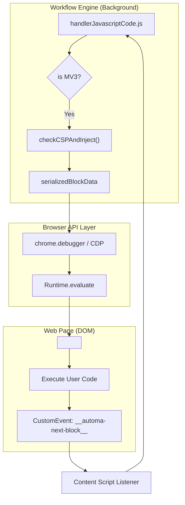
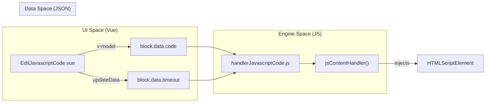

# JavaScript Code Block & Sandbox

<details>
<summary>Relevant source files</summary>

The following files were used as context for generating this wiki page:

- [src/components/newtab/settings/jsBlockWrap.js](src/components/newtab/settings/jsBlockWrap.js)
- [src/components/newtab/shared/SharedCodemirror.vue](src/components/newtab/shared/SharedCodemirror.vue)
- [src/components/newtab/workflow/edit/EditCreateElement.vue](src/components/newtab/workflow/edit/EditCreateElement.vue)
- [src/components/newtab/workflow/edit/EditJavascriptCode.vue](src/components/newtab/workflow/edit/EditJavascriptCode.vue)
- [src/components/newtab/workflow/settings/SettingsEvents.vue](src/components/newtab/workflow/settings/SettingsEvents.vue)
- [src/components/newtab/workflow/settings/SettingsGeneral.vue](src/components/newtab/workflow/settings/SettingsGeneral.vue)
- [src/components/newtab/workflow/settings/event/EventCodeAction.vue](src/components/newtab/workflow/settings/event/EventCodeAction.vue)
- [src/components/newtab/workflow/settings/event/EventCodeHTTP.vue](src/components/newtab/workflow/settings/event/EventCodeHTTP.vue)
- [src/content/blocksHandler/handlerCreateElement.js](src/content/blocksHandler/handlerCreateElement.js)
- [src/content/blocksHandler/handlerJavascriptCode.js](src/content/blocksHandler/handlerJavascriptCode.js)
- [src/sandbox/index.js](src/sandbox/index.js)
- [src/sandbox/utils/handleConditionCode.js](src/sandbox/utils/handleConditionCode.js)
- [src/sandbox/utils/handleJavascriptBlock.js](src/sandbox/utils/handleJavascriptBlock.js)
- [src/workflowEngine/blocksHandler/handlerCreateElement.js](src/workflowEngine/blocksHandler/handlerCreateElement.js)
- [src/workflowEngine/blocksHandler/handlerJavascriptCode.js](src/workflowEngine/blocksHandler/handlerJavascriptCode.js)
- [src/workflowEngine/utils/javascriptBlockUtil.js](src/workflowEngine/utils/javascriptBlockUtil.js)
- [src/workflowEngine/workflowEvent.js](src/workflowEngine/workflowEvent.js)

</details>


The JavaScript Code block allows users to execute custom logic within a workflow. Depending on the configuration and browser environment (MV2 vs MV3), this execution occurs either in the background script context or injected directly into the web page's DOM. Automa provides a specialized API (`automaNextBlock`, `automaRefData`, etc.) to facilitate communication between the custom script and the workflow engine.

## 1. Automa Script API

When a JavaScript block executes, Automa injects a set of helper functions into the execution scope. These functions allow the script to interact with workflow variables, fetch data, and signal the engine to proceed.

### Core API Functions
| Function | Description | Implementation |
| --- | --- | --- |
| `automaNextBlock(data, insert?)` | Signals the engine to move to the next block. `data` is passed as output. | [src/workflowEngine/blocksHandler/handlerJavascriptCode.js:25-37]() |
| `automaSetVariable(name, value)` | Updates or creates a workflow variable. | [src/workflowEngine/blocksHandler/handlerJavascriptCode.js:19-24]() |
| `automaRefData(keyword, path?)` | Retrieves data from the workflow context (e.g., `variables`, `table`). | [src/workflowEngine/blocksHandler/handlerJavascriptCode.js:114-118]() |
| `automaFetch(type, resource)` | Performs a network request via the background script to bypass CORS. | [src/workflowEngine/blocksHandler/handlerJavascriptCode.js:50-52]() |
| `automaResetTimeout() | Resets the execution timeout for the current block. | [src/workflowEngine/blocksHandler/handlerJavascriptCode.js:38-47]() |

**Sources:** [src/workflowEngine/blocksHandler/handlerJavascriptCode.js:15-58](), [src/workflowEngine/utils/javascriptBlockUtil.js:3-35]()

---

## 2. Execution Pipeline & Pipeline Security

Automa handles script execution differently based on the browser's Manifest Version and the user's selected context.

### Execution Contexts
1.  **Website Context**: The script is injected into the active tab. In MV3, this often requires bypassing Content Security Policy (CSP) using the Debugger API.
2.  **Background Context**: The script runs within the extension's background process (not available in Firefox or for certain block types).

### Script Injection Flow (MV3)
In Manifest V3, standard `eval()` or inline script injection is often blocked by CSP. Automa uses `checkCSPAndInject` to determine if a page is protected. If blocked, it utilizes the `chrome.debugger` API to execute the script.

#### Diagram: MV3 Injection Pipeline
This diagram traces the flow from the `handlerJavascriptCode` to the actual DOM injection.



**Sources:** [src/workflowEngine/blocksHandler/handlerJavascriptCode.js:75-152](), [src/workflowEngine/helper.js:7-10]() (referenced), [src/content/blocksHandler/handlerJavascriptCode.js:18-33]()

---

## 3. Sandboxed Execution Environment

For specific tasks like condition evaluation or when running in a restricted environment, Automa uses a sandboxed approach. It creates a temporary `<script>` element and uses `window.postMessage` to bridge the gap between the isolated script and the extension.

### Sandbox Implementation
The sandbox utility [src/sandbox/utils/handleJavascriptBlock.js]() creates a unique `propertyName` (e.g., `automa12345`) on the `window` object to store references and callback functions.

```javascript
// Example of sandbox property attachment
window[propertyName] = {
  refData: data.refData,
  nextBlock: (result) => {
    cleanUp();
    window.top.postMessage({ type: 'sandbox', result }, '*');
  }
};
```

**Key Sandbox Files:**
- `handleJavascriptBlock.js`: Manages the lifecycle of standard JS blocks in the sandbox [src/sandbox/utils/handleJavascriptBlock.js:3-141]().
- `handleConditionCode.js`: Specialized for evaluating logic in "Conditions" blocks [src/sandbox/utils/handleConditionCode.js:1-46]().

---

## 4. Preload Scripts

Users can specify external JS or CSS resources to load before their main script executes. 

1.  **Fetch**: The engine fetches the remote script content in the background [src/workflowEngine/blocksHandler/handlerCreateElement.js:57-66]().
2.  **Injection**: Scripts are injected as `textContent` within `<script>` tags to ensure they execute before the user's primary code [src/workflowEngine/utils/javascriptBlockUtil.js:123-131]().
3.  **Cleanup**: If `removeAfterExec` is enabled, the tags are purged from the DOM once `automaNextBlock` is called [src/workflowEngine/utils/javascriptBlockUtil.js:139-155]().

**Sources:** [src/workflowEngine/blocksHandler/handlerCreateElement.js:53-75](), [src/workflowEngine/utils/javascriptBlockUtil.js:123-131]()

---

## 5. UI and Editor Integration

The `EditJavascriptCode.vue` component provides the interface for writing code, using `SharedCodemirror.vue` for syntax highlighting.

### Code Editor Entities
- **Component**: `EditJavascriptCode.vue` [src/components/newtab/workflow/edit/EditJavascriptCode.vue:1-150]()
- **Editor**: `SharedCodemirror.vue` [src/components/newtab/shared/SharedCodemirror.vue:1-17]()
- **Autocomplete**: `automaFuncsCompletion` provides snippets for the Automa API [src/components/newtab/workflow/edit/EditJavascriptCode.vue:152-157]().

#### Diagram: UI to Code Execution Mapping
This diagram maps UI components to the data structures they modify and the handlers that consume them.



**Sources:** [src/components/newtab/workflow/edit/EditJavascriptCode.vue:185-197](), [src/workflowEngine/blocksHandler/handlerJavascriptCode.js:59-73]()

---

