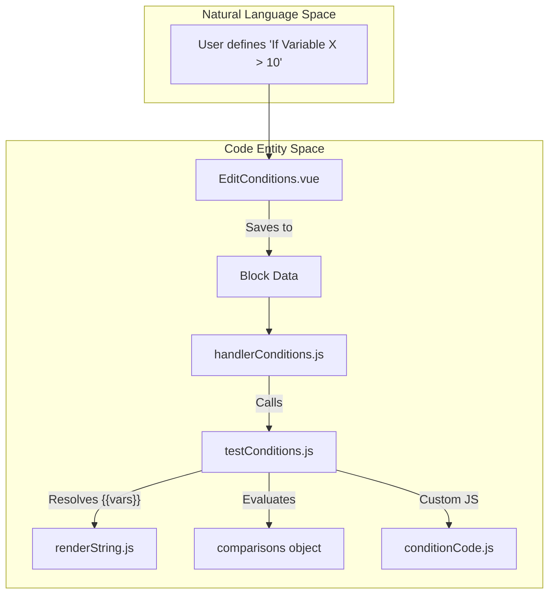
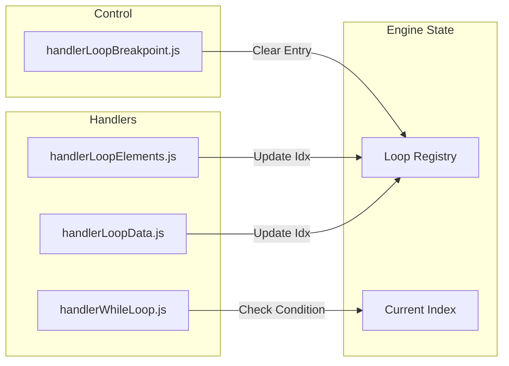

# Conditions, Loops & Control Flow

Relevant source files

The following files were used as context for generating this wiki page:

- [src/assets/css/drawflow.css](src/assets/css/drawflow.css)
- [src/components/block/BlockBase.vue](src/components/block/BlockBase.vue)
- [src/components/block/BlockBasic.vue](src/components/block/BlockBasic.vue)
- [src/components/block/BlockConditions.vue](src/components/block/BlockConditions.vue)
- [src/components/block/BlockElementExists.vue](src/components/block/BlockElementExists.vue)
- [src/components/newtab/shared/SharedElSelectorActions.vue](src/components/newtab/shared/SharedElSelectorActions.vue)
- [src/components/newtab/workflow/edit/EditConditions.vue](src/components/newtab/workflow/edit/EditConditions.vue)
- [src/components/newtab/workflow/edit/EditLoopElements.vue](src/components/newtab/workflow/edit/EditLoopElements.vue)
- [src/components/newtab/workflow/edit/EditPressKey.vue](src/components/newtab/workflow/edit/EditPressKey.vue)
- [src/content/blocksHandler/handlerLoopElements.js](src/content/blocksHandler/handlerLoopElements.js)
- [src/content/blocksHandler/handlerPressKey.js](src/content/blocksHandler/handlerPressKey.js)
- [src/lib/tmpl.js](src/lib/tmpl.js)
- [src/sandbox/utils/handleBlockExpression.js](src/sandbox/utils/handleBlockExpression.js)
- [src/workflowEngine/blocksHandler/handlerConditions.js](src/workflowEngine/blocksHandler/handlerConditions.js)
- [src/workflowEngine/blocksHandler/handlerLoopBreakpoint.js](src/workflowEngine/blocksHandler/handlerLoopBreakpoint.js)
- [src/workflowEngine/blocksHandler/handlerLoopData.js](src/workflowEngine/blocksHandler/handlerLoopData.js)
- [src/workflowEngine/blocksHandler/handlerWebhook.js](src/workflowEngine/blocksHandler/handlerWebhook.js)
- [src/workflowEngine/blocksHandler/handlerWhileLoop.js](src/workflowEngine/blocksHandler/handlerWhileLoop.js)
- [src/workflowEngine/templating/index.js](src/workflowEngine/templating/index.js)
- [src/workflowEngine/templating/mustacheReplacer.js](src/workflowEngine/templating/mustacheReplacer.js)
- [src/workflowEngine/templating/renderString.js](src/workflowEngine/templating/renderString.js)
- [src/workflowEngine/utils/conditionCode.js](src/workflowEngine/utils/conditionCode.js)
- [src/workflowEngine/utils/testConditions.js](src/workflowEngine/utils/testConditions.js)
- [src/workflowEngine/utils/webhookUtil.js](src/workflowEngine/utils/webhookUtil.js)

This section details the mechanisms Automa uses to manage execution paths, evaluate logical conditions, and iterate over data structures. Control flow in Automa is governed by specialized block handlers that interact with the `WorkflowEngine` to determine the next block in the execution sequence.

## Condition Evaluation System

Automa employs a robust condition evaluation system used primarily by the **Conditions** block and the **Element Exists** block. It supports complex logical trees, data path resolution, and custom JavaScript execution within conditions.

### `testConditions` Logic
The core evaluation logic resides in `src/workflowEngine/utils/testConditions.js`. It processes an array of condition groups and returns whether a match was found.

*   **Data Resolution**: It uses `renderString` to resolve variables or data columns before comparison [src/workflowEngine/utils/testConditions.js:78-82]().
*   **Type Casting**: Values can be explicitly cast using prefixes like `json::`, `string::`, `number::`, or `boolean::` [src/workflowEngine/utils/testConditions.js:89-93]().
*   **Comparison Operators**: Supported operators include standard equality (`eq`), case-insensitive equality (`eqi`), numeric comparisons (`gt`, `lt`), regex (`rgx`), and containment (`cnt`) [src/workflowEngine/utils/testConditions.js:14-36]().

### Code and Element Conditions
Beyond simple value comparisons, the system can evaluate:
1.  **Code Conditions**: Executes JavaScript via `checkCodeCondition` (using `conditionCode.js`) to return a boolean [src/workflowEngine/utils/testConditions.js:118-122]().
2.  **Element Conditions**: Sends a message to the content script (`condition-builder` type) to check DOM states like "Element visible" or "Element contains text" [src/workflowEngine/utils/testConditions.js:129-137]().

### Logic Flow: Condition Evaluation
The following diagram illustrates how the `testConditions` utility bridges high-level UI configurations to the engine's execution logic.

| System Component | Code Entity |
| :--- | :--- |
| **UI Builder** | `SharedConditionBuilder.vue` |
| **Data Evaluator** | `testConditions.js` |
| **JS Sandbox** | `conditionCode.js` |
| **Engine Handler** | `handlerConditions.js` |

**Condition Evaluation Data Flow**

Sources: [src/workflowEngine/utils/testConditions.js:45-50](), [src/workflowEngine/blocksHandler/handlerConditions.js:1-10](), [src/workflowEngine/utils/conditionCode.js:1-5]()

---

## Branching & Fallback Paths

Automa supports multi-output branching, allowing workflows to diverge based on logical outcomes or errors.

### Logical Branching (Conditions Block)
The `BlockConditions.vue` component renders multiple output handles [src/components/block/BlockConditions.vue:57-63](). 
*   **Paths**: Each path defined in the editor corresponds to a specific `sourceHandle` named `${id}-output-${item.id}`.
*   **Fallback**: If no conditions in any path are met, the engine follows the `fallback` handle [src/components/block/BlockConditions.vue:74-78]().

### Error Fallbacks
Many blocks (e.g., Webhook, Interaction blocks) implement a fallback mechanism via `BlockBasicWithFallback`.
*   **Implementation**: In `handlerWebhook.js`, if an HTTP request fails and a fallback connection exists, the engine returns the `fallbackOutput` as the `nextBlockId` [src/workflowEngine/blocksHandler/handlerWebhook.js:42-47]().
*   **UI Representation**: The `BlockBasic.vue` component conditionally renders a fallback handle if `data.onError.toDo === 'fallback'` [src/components/block/BlockBasic.vue:105-111]().

Sources: [src/components/block/BlockConditions.vue:57-78](), [src/workflowEngine/blocksHandler/handlerWebhook.js:10-48](), [src/components/block/BlockBasic.vue:105-111]()

---

## Loops and Iteration

Automa provides several mechanisms for repetition, ranging from data-driven loops to conditional while-loops.

### Loop Handlers
| Block Type | Handler File | Behavior |
| :--- | :--- | :--- |
| **Loop Data** | `handlerLoopData.js` | Iterates over arrays (JSON, Variables, or Table rows). |
| **Loop Elements** | `handlerLoopElements.js` | Iterates over DOM elements matching a CSS/XPath selector. |
| **While Loop** | `handlerWhileLoop.js` | Continues execution as long as a condition is true. |
| **Repeat Task** | `BlockRepeatTask.vue` | Re-executes a sequence a fixed number of times. |

### Loop Execution Lifecycle
1.  **Initialization**: The loop handler identifies the data source (e.g., `refData` via `mustacheReplacer`) [src/workflowEngine/blocksHandler/handlerLoopData.js:15-20]().
2.  **Index Tracking**: The engine tracks the current index. For `loop-data`, it uses `loopData` in the engine state.
3.  **Breakpoints**: The `handlerLoopBreakpoint.js` allows for early exit from a loop. It looks for the parent loop ID and signals the engine to stop iteration [src/workflowEngine/blocksHandler/handlerLoopBreakpoint.js:5-15]().

### Code Mapping: Loop System

Sources: [src/workflowEngine/blocksHandler/handlerLoopData.js:1-10](), [src/workflowEngine/blocksHandler/handlerLoopBreakpoint.js:1-15](), [src/workflowEngine/blocksHandler/handlerWhileLoop.js:1-10]()

---

## Key Components & Functions Reference

### `renderString.js` and `mustacheReplacer.js`
Used extensively in control flow to resolve dynamic paths.
*   **`keyParser`**: Breaks down keys like `loopData@loopId.name` into actionable data lookups [src/workflowEngine/templating/mustacheReplacer.js:29-35]().
*   **Loop Data Access**: Specifically handles the `$index` suffix to retrieve the current iteration count [src/workflowEngine/templating/mustacheReplacer.js:37-42]().

### UI Components
*   **`EditConditions.vue`**: Provides the interface for `SharedConditionBuilder`. It manages the creation of path IDs using `nanoid()` and ensures edges are updated when conditions are reordered [src/components/newtab/workflow/edit/EditConditions.vue:172-180]().
*   **`BlockBase.vue`**: The foundation for all control flow blocks. It handles the "Run from here" logic and breakpoint toggles (`data.$breakpoint`) [src/components/block/BlockBase.vue:57-59](), [src/components/block/BlockBase.vue:72-80]().

Sources: [src/workflowEngine/templating/mustacheReplacer.js:29-62](), [src/components/newtab/workflow/edit/EditConditions.vue:123-130](), [src/components/block/BlockBase.vue:72-80]()

---

