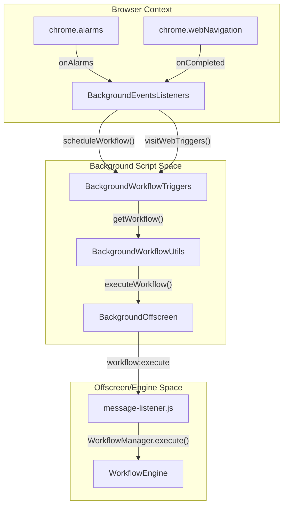
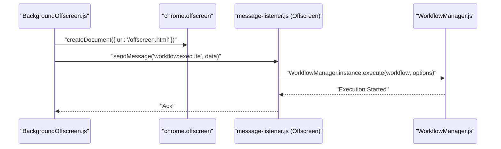

# Background Script & Trigger System

Relevant source files

The following files were used as context for generating this wiki page:

- [jsconfig.json](jsconfig.json)
- [src/background/BackgroundEventsListeners.js](src/background/BackgroundEventsListeners.js)
- [src/background/BackgroundOffscreen.js](src/background/BackgroundOffscreen.js)
- [src/background/BackgroundUtils.js](src/background/BackgroundUtils.js)
- [src/background/BackgroundWorkflowTriggers.js](src/background/BackgroundWorkflowTriggers.js)
- [src/background/BackgroundWorkflowUtils.js](src/background/BackgroundWorkflowUtils.js)
- [src/offscreen/index.html](src/offscreen/index.html)
- [src/offscreen/message-listener.js](src/offscreen/message-listener.js)
- [src/service/browser-api/BrowserAPIEventHandler.js](src/service/browser-api/BrowserAPIEventHandler.js)
- [src/workflowEngine/blocksHandler/handlerBrowserEvent.js](src/workflowEngine/blocksHandler/handlerBrowserEvent.js)

The Background Script serves as the central nervous system of Automa. It is responsible for monitoring browser events, managing the lifecycle of the extension, and orchestrating workflow execution. In Manifest V3 (MV3), the background process is primarily handled by a service worker that coordinates with an **Offscreen Document** to maintain complex state and execution logic that the service worker cannot handle alone.

## System Architecture

The background system bridges the gap between the browser's native event APIs and the [Workflow Engine](#2). It consists of three primary layers:
1.  **Event Listeners**: Classes that subscribe to browser-level events (alarms, navigation, context menus).
2.  **Trigger Registry**: Logic that determines if a specific browser event matches a workflow's trigger configuration.
3.  **Execution Bridge**: A communication layer that dispatches workflows to the engine, handling environment differences between Chrome (MV3) and Firefox (MV2).

### Background Execution Flow
The following diagram illustrates how a browser event (like a scheduled alarm) travels through the background script to trigger a workflow.

**Background Trigger Pipeline**

**Sources:** [src/background/BackgroundEventsListeners.js:91-104](), [src/background/BackgroundWorkflowTriggers.js:44-107](), [src/background/BackgroundWorkflowUtils.js:124-137](), [src/offscreen/message-listener.js:9-11]()

## Core Components

### Background Event Listeners & Lifecycle
The `BackgroundEventsListeners` class acts as the entry point for all browser-level signals. It handles the extension's initialization via `onRuntimeInstalled` and `onRuntimeStartup`, ensuring that triggers are re-registered when the browser starts or the extension updates. It also manages utility tasks like automated local backups and dashboard navigation.

For details, see [Background Event Listeners & Lifecycle](#3.1).

**Sources:** [src/background/BackgroundEventsListeners.js:78-163]()

### Workflow Trigger Registration
Automa supports diverse triggers including intervals, specific dates, cron expressions, website visits, and context menu interactions. The `BackgroundWorkflowTriggers` class manages these registrations. It utilizes `browser.alarms` for time-based triggers and `browser.webNavigation` for URL-based triggers. When a match is found, it retrieves the workflow data and passes it to the execution utility.

For details, see [Workflow Trigger Registration](#3.2).

**Sources:** [src/background/BackgroundWorkflowTriggers.js:11-208]()

### Browser API Service & Messaging
Because the workflow engine often runs in a different context (Offscreen document in MV3 or a separate process), Automa uses a sophisticated messaging system. The `BrowserAPIService` abstracts browser calls, while `BrowserAPIEventHandler` manages event listeners that need to persist across these contexts.

For details, see [Browser API Service & Cross-Context Messaging](#3.3).

**Sources:** [src/service/browser-api/BrowserAPIEventHandler.js:23-171](), [src/workflowEngine/blocksHandler/handlerBrowserEvent.js:2-103]()

## Cross-Context Communication

Automa must navigate the restrictions of MV3, where the background service worker is ephemeral. To ensure long-running workflows are not interrupted, the background script communicates with an `offscreen.html` document.

**Code Entity Interaction: Messaging Bridge**

**Sources:** [src/background/BackgroundOffscreen.js:38-55](), [src/offscreen/message-listener.js:9-11](), [src/background/BackgroundWorkflowUtils.js:133-136]()

### Key Utility Classes

| Class | Responsibility | File |
| :--- | :--- | :--- |
| `BackgroundUtils` | Managing dashboard tabs and sending messages to the UI. | [src/background/BackgroundUtils.js]() |
| `BackgroundWorkflowUtils` | Singleton that abstracts the execution logic (Offscreen vs. Direct). | [src/background/BackgroundWorkflowUtils.js]() |
| `BackgroundOffscreen` | Manages the lifecycle of the MV3 offscreen document. | [src/background/BackgroundOffscreen.js]() |
| `BrowserAPIEventHandler` | Proxies browser events (like `tabs.onRemoved`) to the engine. | [src/service/browser-api/BrowserAPIEventHandler.js]() |

**Sources:** [src/background/BackgroundUtils.js:4-60](), [src/background/BackgroundWorkflowUtils.js:5-140](), [src/background/BackgroundOffscreen.js:9-83](), [src/service/browser-api/BrowserAPIEventHandler.js:23-171]()

---

