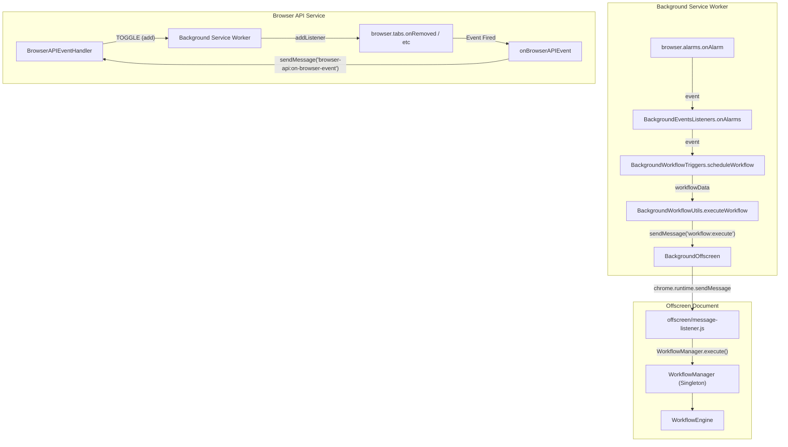

# Background Event Listeners & Lifecycle

Relevant source files

The following files were used as context for generating this wiki page:

- [jsconfig.json](jsconfig.json)
- [src/background/BackgroundEventsListeners.js](src/background/BackgroundEventsListeners.js)
- [src/background/BackgroundOffscreen.js](src/background/BackgroundOffscreen.js)
- [src/background/BackgroundUtils.js](src/background/BackgroundUtils.js)
- [src/background/BackgroundWorkflowTriggers.js](src/background/BackgroundWorkflowTriggers.js)
- [src/background/BackgroundWorkflowUtils.js](src/background/BackgroundWorkflowUtils.js)
- [src/offscreen/index.html](src/offscreen/index.html)
- [src/offscreen/message-listener.js](src/offscreen/message-listener.js)
- [src/service/browser-api/BrowserAPIEventHandler.js](src/service/browser-api/BrowserAPIEventHandler.js)
- [src/workflowEngine/blocksHandler/handlerBrowserEvent.js](src/workflowEngine/blocksHandler/handlerBrowserEvent.js)

The background process in Automa serves as the persistent orchestrator for the extension. It manages the lifecycle of the extension (install, startup, updates), listens for browser-level events to trigger workflows, and provides utility services for dashboard communication. In Manifest V3 (MV3), the background process also manages an **Offscreen Document** to maintain compatibility with features that require a persistent DOM or specific APIs not available in Service Workers.

## 1. Background Event Listeners

The `BackgroundEventsListeners` class is the central hub for handling browser events. It maps browser-specific events to Automa-specific logic, such as triggering workflows or opening the dashboard.

### Key Lifecycle Events
*   **Runtime Installed**: Handled by `onRuntimeInstalled`. On a fresh install, it initializes `browser.storage.local` with default keys (logs, shortcuts, workflows) and opens the welcome page [src/background/BackgroundEventsListeners.js:135-154](). On update, it triggers a re-registration of all workflow triggers [src/background/BackgroundEventsListeners.js:156-158]().
*   **Runtime Startup**: Handled by `onRuntimeStartup`. It clears temporary `workflowStates`, resets the extension badge text, and re-registers triggers specifically checking for "On Startup" trigger types [src/background/BackgroundEventsListeners.js:123-127]().
*   **Alarms**: Handled by `onAlarms`. This is used both for scheduled local backups and for the `BackgroundWorkflowTriggers` system to fire interval/cron-based workflows [src/background/BackgroundEventsListeners.js:91-98]().

### Browser Interaction Listeners
*   **Action/Command**: Listens for clicks on the extension icon (`onActionClicked`) or keyboard shortcuts like `open-dashboard` and `element-picker` [src/background/BackgroundEventsListeners.js:79-89]().
*   **Web Navigation**: `onWebNavigationCompleted` and `onHistoryStateUpdated` (for SPAs) invoke `visitWebTriggers` to check if the current URL matches any workflow "Visit Web" trigger [src/background/BackgroundEventsListeners.js:100-104, 129-133]().
*   **Context Menus**: `onContextMenuClicked` passes the event to `BackgroundWorkflowTriggers` to execute workflows associated with right-click menu items [src/background/BackgroundEventsListeners.js:106-108]().

**Sources:** [src/background/BackgroundEventsListeners.js:78-163](), [src/background/BackgroundWorkflowTriggers.js:12-42]()

---

## 2. Background Utilities & Dashboard Management

`BackgroundUtils` provides static methods to interact with the Dashboard (New Tab page) and manage messaging.

### Dashboard Operations
*   **`openDashboard(url, updateTab)`**: Locates an existing dashboard tab or creates a new one. It uses `browser.tabs.query` to find `newtab.html`. If found, it updates the URL and focuses the window; otherwise, it creates a new popup-style window [src/background/BackgroundUtils.js:5-48]().
*   **`sendMessageToDashboard(type, data)`**: Sends a message to the dashboard tab. It uses `waitTabLoaded` to ensure the recipient is ready before calling `browser.tabs.sendMessage` [src/background/BackgroundUtils.js:50-59]().

### Workflow Execution Bridge
`BackgroundWorkflowUtils` acts as a singleton bridge between the background triggers and the `WorkflowManager`. It abstracts the architectural difference between Firefox (MV2) and Chrome (MV3).

| Feature | Firefox (MV2) Implementation | Chrome (MV3) Implementation |
| :--- | :--- | :--- |
| **Execution** | Direct call to `WorkflowManager.instance.execute` [src/background/BackgroundWorkflowUtils.js:128-130]() | Message `workflow:execute` sent to Offscreen Document [src/background/BackgroundWorkflowUtils.js:133-136]() |
| **State Management** | Direct call to `WorkflowManager.updateExecution` [src/background/BackgroundWorkflowUtils.js:113-115]() | Message `workflow:update` sent to Offscreen Document [src/background/BackgroundWorkflowUtils.js:118-121]() |

**Sources:** [src/background/BackgroundUtils.js:4-60](), [src/background/BackgroundWorkflowUtils.js:5-140]()

---

## 3. MV3 Offscreen Document & Messaging

In Chrome MV3, the background script is a Service Worker, which cannot maintain the `WorkflowEngine` state indefinitely. Automa uses an **Offscreen Document** to host the engine.

### Offscreen Lifecycle
The `BackgroundOffscreen` class manages this document. Before sending any message, it calls `#ensureDocument()`, which checks if the document exists via `chrome.runtime.getContexts` and creates it if necessary using `chrome.offscreen.createDocument` with reasons like `BLOBS`, `CLIPBOARD`, and `IFRAME_SCRIPTING` [src/background/BackgroundOffscreen.js:38-55, 61-70]().

### System Architecture: Event Flow
This diagram shows how a browser event (like an Alarm) travels from the Background Service Worker to the Workflow Engine in the Offscreen Document.

**Title: Browser Event to Workflow Execution Flow**

**Sources:** [src/background/BackgroundEventsListeners.js:91-98](), [src/background/BackgroundWorkflowUtils.js:124-137](), [src/offscreen/message-listener.js:9-11](), [src/background/BackgroundOffscreen.js:78-82](), [src/service/browser-api/BrowserAPIEventHandler.js:11-17, 149-168]()

---

## 4. Trigger Registration & Scheduling

`BackgroundWorkflowTriggers` manages the persistence and firing of workflow triggers.

### Trigger Types & Implementation
1.  **Visit Web**: Checks `browser.storage.local` for `visitWebTriggers`. It matches the current tab URL against stored URLs or RegEx [src/background/BackgroundWorkflowTriggers.js:12-24]().
2.  **Scheduled (Alarms)**:
    *   **Interval**: If `fixedDelay` is true, it checks `workflowStates`. If the workflow is already running, it adds the ID to `workflowQueue` instead of starting a new instance [src/background/BackgroundWorkflowTriggers.js:75-95]().
    *   **Cron/Specific Day**: Uses `registerCronJob` and `registerSpecificDay` to calculate the next execution time and set a browser alarm [src/background/BackgroundWorkflowTriggers.js:111-117]().
3.  **On Startup**: During `reRegisterTriggers(true)`, workflows with the `on-startup` trigger type are executed immediately [src/background/BackgroundWorkflowTriggers.js:190-199]().

### Code Entity Mapping
The following table maps natural language trigger concepts to their specific code handlers.

| Trigger Concept | Code Entity / Function | Logic Location |
| :--- | :--- | :--- |
| **URL Matching** | `visitWebTriggers` | [src/background/BackgroundWorkflowTriggers.js:12-42]() |
| **Cron Parsing** | `registerCronJob` | [src/background/BackgroundWorkflowTriggers.js:115]() |
| **Context Menu** | `contextMenu` | [src/background/BackgroundWorkflowTriggers.js:123-151]() |
| **Startup Check** | `reRegisterTriggers` | [src/background/BackgroundWorkflowTriggers.js:153-207]() |
| **Backup Alarm** | `handleScheduleBackup` | [src/background/BackgroundEventsListeners.js:9-76]() |

**Sources:** [src/background/BackgroundWorkflowTriggers.js:1-210](), [src/background/BackgroundEventsListeners.js:9-76]()

---

## 5. Browser API Event Handling

To support blocks like `handlerBrowserEvent.js` [src/workflowEngine/blocksHandler/handlerBrowserEvent.js:1-123](), Automa implements a cross-context event bridge via `BrowserAPIEventHandler`.

### Event Subscription Pipeline
1.  **Offscreen/Engine**: A block requests to listen for `browser.tabs.onRemoved`. It calls `BrowserAPIEventHandler.instance.createEventListener('browser.tabs.onRemoved')` [src/service/browser-api/BrowserAPIEventHandler.js:63-65]().
2.  **Toggle Message**: The handler sends a `TOGGLE` message with type `add` to the background [src/service/browser-api/BrowserAPIEventHandler.js:82-91]().
3.  **Background**: The Service Worker receives the toggle, looks up the API in `browserAPIMap`, and attaches a real listener using `addListener` [src/service/browser-api/BrowserAPIEventHandler.js:149-168]().
4.  **Event Firing**: When the browser event occurs, the background executes `onBrowserAPIEvent`, which sends a `browser-api:on-browser-event` message back to the offscreen document [src/service/browser-api/BrowserAPIEventHandler.js:11-17]().
5.  **Dispatch**: The offscreen listener receives the event and triggers the local callbacks registered by the workflow blocks [src/service/browser-api/BrowserAPIEventHandler.js:140-144]().

**Sources:** [src/service/browser-api/BrowserAPIEventHandler.js:1-171](), [src/workflowEngine/blocksHandler/handlerBrowserEvent.js:91-103]()

---

