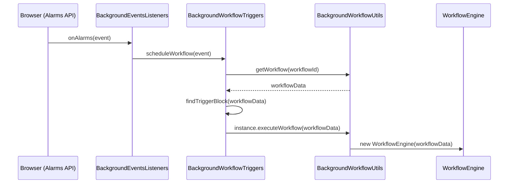
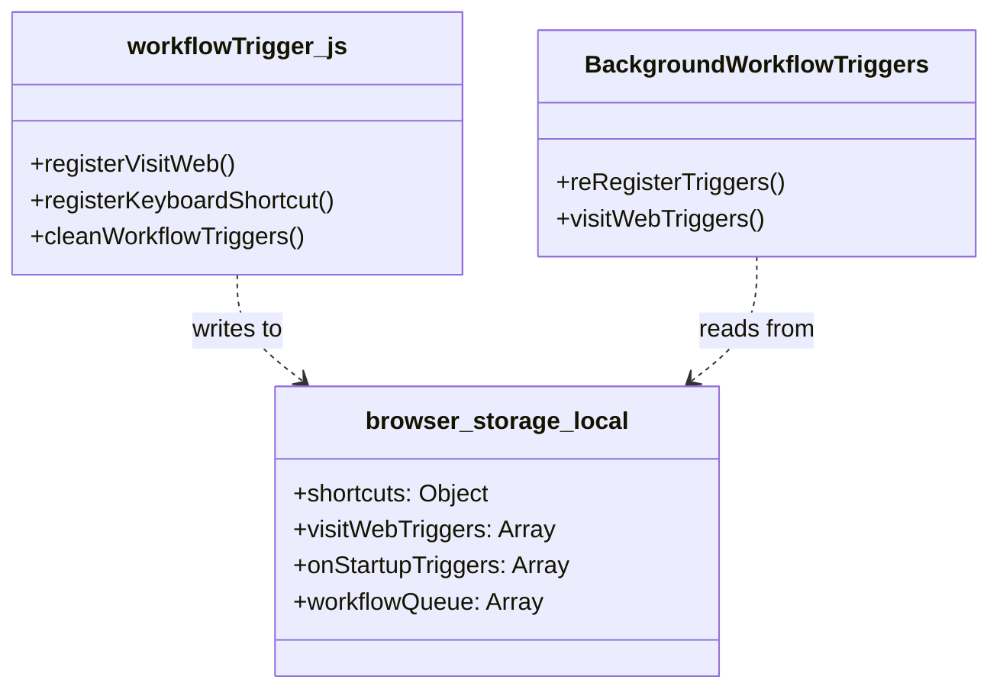

# Workflow Trigger Registration

Relevant source files

The following files were used as context for generating this wiki page:

- [src/background/BackgroundEventsListeners.js](src/background/BackgroundEventsListeners.js)
- [src/background/BackgroundUtils.js](src/background/BackgroundUtils.js)
- [src/background/BackgroundWorkflowTriggers.js](src/background/BackgroundWorkflowTriggers.js)
- [src/components/newtab/shared/SharedWorkflowTriggers.vue](src/components/newtab/shared/SharedWorkflowTriggers.vue)
- [src/components/newtab/workflow/edit/Trigger/TriggerCronJob.vue](src/components/newtab/workflow/edit/Trigger/TriggerCronJob.vue)
- [src/components/newtab/workflow/edit/Trigger/TriggerDate.vue](src/components/newtab/workflow/edit/Trigger/TriggerDate.vue)
- [src/components/newtab/workflow/edit/Trigger/TriggerElementChange.vue](src/components/newtab/workflow/edit/Trigger/TriggerElementChange.vue)
- [src/components/newtab/workflow/edit/Trigger/TriggerElementOptions.vue](src/components/newtab/workflow/edit/Trigger/TriggerElementOptions.vue)
- [src/components/newtab/workflow/edit/Trigger/TriggerInterval.vue](src/components/newtab/workflow/edit/Trigger/TriggerInterval.vue)
- [src/components/newtab/workflow/edit/Trigger/TriggerKeyboardShortcut.vue](src/components/newtab/workflow/edit/Trigger/TriggerKeyboardShortcut.vue)
- [src/components/newtab/workflow/edit/Trigger/TriggerSpecificDay.vue](src/components/newtab/workflow/edit/Trigger/TriggerSpecificDay.vue)
- [src/components/newtab/workflow/edit/Trigger/TriggerVisitWeb.vue](src/components/newtab/workflow/edit/Trigger/TriggerVisitWeb.vue)
- [src/content/showExecutedBlock.js](src/content/showExecutedBlock.js)
- [src/lib/cronstrue.js](src/lib/cronstrue.js)
- [src/newtab/index.js](src/newtab/index.js)
- [src/newtab/pages/ScheduledWorkflow.vue](src/newtab/pages/ScheduledWorkflow.vue)
- [src/newtab/pages/Welcome.vue](src/newtab/pages/Welcome.vue)
- [src/utils/convertWorkflowData.js](src/utils/convertWorkflowData.js)
- [src/utils/workflowTrigger.js](src/utils/workflowTrigger.js)

The Workflow Trigger Registration system manages how Automa workflows are scheduled and initiated by external events. This subsystem acts as a bridge between browser-level events (alarms, navigation, context menus) and the execution engine. It is primarily governed by `BackgroundWorkflowTriggers` for handling event logic and `workflowTrigger.js` for the low-level registration with Browser APIs.

## Overview of Trigger Lifecycle

Triggers are registered when a workflow is saved or when the extension starts. When an event occurs (e.g., an alarm fires), the background script identifies the associated workflow and adds it to the execution pipeline.

### Core Components

| Entity | Role |
| --- | --- |
| `BackgroundEventsListeners` | Entry point for all browser events (`onAlarms`, `onWebNavigationCompleted`, etc.) [src/background/BackgroundEventsListeners.js:78-163](). |
| `BackgroundWorkflowTriggers` | Orchestrates the logic for matching events to specific workflows and triggers [src/background/BackgroundWorkflowTriggers.js:11-208](). |
| `workflowTrigger.js` | Utility module providing functions to register/unregister triggers with Chrome/Firefox APIs [src/utils/workflowTrigger.js:1-244](). |
| `browser.alarms` | Used for time-based triggers (Interval, Cron, Specific Date) [src/utils/workflowTrigger.js:182-214](). |

---

## Trigger Types and Registration Logic

Automa supports several trigger types, each requiring different registration strategies within `workflowTrigger.js`.

### 1. Time-Based Triggers (Alarms)
Time-based triggers leverage the `browser.alarms` API.

*   **Interval**: Registered via `registerInterval`. It supports `periodInMinutes` and an optional `delayInMinutes` [src/utils/workflowTrigger.js:187-195]().
*   **Specific Date**: Registered via `registerSpecificDate`. It parses a date and time string into a Unix timestamp for the `when` property [src/utils/workflowTrigger.js:197-214]().
*   **Specific Day**: Registered via `registerSpecificDay`. It calculates the next occurrence of a specific weekday and time [src/utils/workflowTrigger.js:150-185]().
*   **Cron Job**: Registered via `registerCronJob`. It uses `cron-parser` to calculate the next execution time and schedules a one-time alarm that re-registers itself upon firing [src/utils/workflowTrigger.js:255-274]().

### 2. Interaction Triggers
*   **Context Menu**: Registered via `registerContextMenu`. It creates entries under a parent "Automa" menu [src/utils/workflowTrigger.js:6-69]().
*   **Keyboard Shortcut**: Stored in `browser.storage.local` under the `shortcuts` key. These are handled by content scripts or the background command listener [src/utils/workflowTrigger.js:244-253]().

### 3. Navigation Triggers
*   **Visit Web**: Registered via `registerVisitWeb`. Patterns are stored in `browser.storage.local.visitWebTriggers`. When navigation completes, `BackgroundEventsListeners` calls `visitWebTriggers` to check for URL matches [src/utils/workflowTrigger.js:216-242](), [src/background/BackgroundEventsListeners.js:100-104]().

---

## Execution Flow: Event to Engine

The following diagram illustrates how a browser event (Alarm) travels through the system to trigger a workflow execution.

### Event Propagation Diagram

**Sources:** [src/background/BackgroundEventsListeners.js:91-98](), [src/background/BackgroundWorkflowTriggers.js:44-121](), [src/background/BackgroundWorkflowTriggers.js:107-107]()

---

## Trigger Cleanup and Re-registration

To prevent orphaned triggers and ensure consistency, Automa performs aggressive cleanup.

### Cleanup Process
The function `cleanWorkflowTriggers` is called whenever a workflow is updated or deleted:
1.  **Alarms**: Clears all `browser.alarms` containing the `workflowId` [src/utils/workflowTrigger.js:86-91]().
2.  **Storage**: Filters out the workflow from `shortcuts`, `onStartupTriggers`, and `visitWebTriggers` in local storage [src/utils/workflowTrigger.js:93-120]().
3.  **Context Menus**: Removes the specific menu items using `browser.contextMenus.remove` [src/utils/workflowTrigger.js:122-144]().
4.  **Queue**: Removes the workflow from the `workflowQueue` [src/utils/workflowTrigger.js:71-82]().

### Startup Re-registration
When the browser starts or the extension updates, `BackgroundEventsListeners` triggers `reRegisterTriggers`.
*   It iterates through all local, hosted, and team workflows [src/background/BackgroundWorkflowTriggers.js:154-173]().
*   It checks for `isDisabled` status [src/background/BackgroundWorkflowTriggers.js:176-176]().
*   It identifies the `triggerBlock` and calls `registerWorkflowTrigger` for each active workflow [src/background/BackgroundWorkflowTriggers.js:180-204]().

**Sources:** [src/utils/workflowTrigger.js:84-148](), [src/background/BackgroundWorkflowTriggers.js:153-208]()

---

## Technical Reference: Workflow Queue and Alarms

Automa uses a "Workflow Queue" to manage execution, especially for interval triggers with the `fixedDelay` setting.

### Fixed Delay Logic
If a workflow has an interval trigger with `fixedDelay` enabled:
1.  The alarm fires.
2.  `BackgroundWorkflowTriggers.scheduleWorkflow` checks if the workflow is already running by looking at `workflowStates` [src/background/BackgroundWorkflowTriggers.js:75-81]().
3.  If running, the `workflowId` is pushed to `workflowQueue` in storage instead of immediate execution [src/background/BackgroundWorkflowTriggers.js:83-92]().

### Code Mapping: Triggers to Storage

**Sources:** [src/utils/workflowTrigger.js:216-253](), [src/background/BackgroundWorkflowTriggers.js:12-42]()

### Trigger Registration Mapping

| Trigger Type | Storage/API Target | Code Reference |
| --- | --- | --- |
| **Cron** | `browser.alarms` | `registerCronJob` [src/utils/workflowTrigger.js:255]() |
| **Interval** | `browser.alarms` | `registerInterval` [src/utils/workflowTrigger.js:187]() |
| **Visit Web** | `visitWebTriggers` (Storage) | `registerVisitWeb` [src/utils/workflowTrigger.js:216]() |
| **Shortcut** | `shortcuts` (Storage) | `registerKeyboardShortcut` [src/utils/workflowTrigger.js:244]() |
| **Startup** | `onStartupTriggers` (Storage) | `registerWorkflowTrigger` [src/utils/workflowTrigger.js:276]() |

**Sources:** [src/utils/workflowTrigger.js:187-280](), [src/background/BackgroundWorkflowTriggers.js:12-42]()

---

