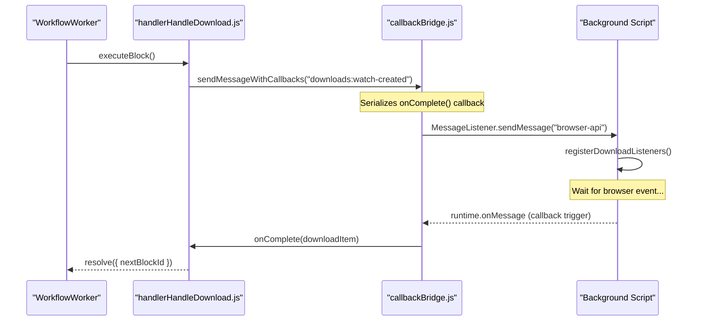
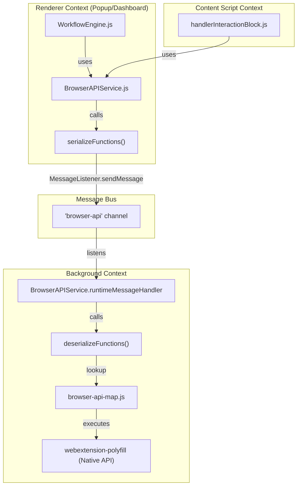

# Browser API Service & Cross-Context Messaging

Relevant source files

The following files were used as context for generating this wiki page:

- [pnpm-lock.yaml](pnpm-lock.yaml)
- [src/components/newtab/workflow/edit/EditTabURL.vue](src/components/newtab/workflow/edit/EditTabURL.vue)
- [src/service/browser-api/BrowserAPIService.js](src/service/browser-api/BrowserAPIService.js)
- [src/service/browser-api/browser-api-map.js](src/service/browser-api/browser-api-map.js)
- [src/utils/callbackBridge.js](src/utils/callbackBridge.js)
- [src/utils/serialization.js](src/utils/serialization.js)
- [src/workflowEngine/WorkflowEngine.js](src/workflowEngine/WorkflowEngine.js)
- [src/workflowEngine/WorkflowManager.js](src/workflowEngine/WorkflowManager.js)
- [src/workflowEngine/WorkflowWorker.js](src/workflowEngine/WorkflowWorker.js)
- [src/workflowEngine/blocksHandler/handlerClipboard.js](src/workflowEngine/blocksHandler/handlerClipboard.js)
- [src/workflowEngine/blocksHandler/handlerCookie.js](src/workflowEngine/blocksHandler/handlerCookie.js)
- [src/workflowEngine/blocksHandler/handlerHandleDownload.js](src/workflowEngine/blocksHandler/handlerHandleDownload.js)
- [src/workflowEngine/blocksHandler/handlerInteractionBlock.js](src/workflowEngine/blocksHandler/handlerInteractionBlock.js)
- [src/workflowEngine/blocksHandler/handlerSaveAssets.js](src/workflowEngine/blocksHandler/handlerSaveAssets.js)
- [src/workflowEngine/blocksHandler/handlerTabUrl.js](src/workflowEngine/blocksHandler/handlerTabUrl.js)
- [src/workflowEngine/blocksHandler/handlerTakeScreenshot.js](src/workflowEngine/blocksHandler/handlerTakeScreenshot.js)

This page details the communication infrastructure of Automa. It explains how the system bridges the gap between different execution contexts (Background Script, Content Scripts, and Dashboard/Popup Renderer) using a unified `BrowserAPIService` and specialized messaging patterns.

## BrowserAPIService Abstraction

The `BrowserAPIService` serves as a proxy layer for the `webextension-polyfill` (`browser` API). Its primary purpose is to provide a consistent interface regardless of whether the calling code has direct access to browser APIs [src/service/browser-api/BrowserAPIService.js:165-214]().

### Availability Logic
The service determines availability via the `IS_BROWSER_API_AVAILABLE` constant, which checks for the presence of the `tabs` namespace in the global `Browser` object [src/service/browser-api/BrowserAPIService.js:21-21]().

1.  **Direct Access:** If APIs are available (e.g., in the Background Script), the service calls the native browser methods directly [src/service/browser-api/BrowserAPIService.js:219-220]().
2.  **Proxy Access:** If APIs are unavailable (e.g., in a content script or a restricted renderer context), the service serializes the request and sends it to the Background Script via `MessageListener.sendMessage('browser-api', ...)` [src/service/browser-api/BrowserAPIService.js:23-34]().

### The Browser API Map
The mapping between service paths and actual browser functions is defined in `browser-api-map.js`. This registry includes standard APIs like `tabs`, `windows`, `storage`, and `debugger` [src/service/browser-api/browser-api-map.js:4-115]().

| Path | Native API Reference | Type |
| :--- | :--- | :--- |
| `tabs.query` | `Browser.tabs.query` | Method |
| `tabs.onRemoved` | `Browser.tabs.onRemoved` | Event |
| `storage.local.set` | `Browser.storage.local.set` | Method |
| `debugger.attach` | `chrome.debugger.attach` | Method |

**Sources:** [src/service/browser-api/BrowserAPIService.js:21-34](), [src/service/browser-api/browser-api-map.js:4-115]()

## Cross-Process Function Serialization

When a component sends a message to the Background Script to execute a Browser API, it often needs to pass complex data. Automa uses a serialization utility to handle cases where functions are passed as arguments (e.g., in custom callbacks).

### Implementation
*   **`serializeFunctions`**: Recursively traverses an object. If it encounters a function, it converts it to a string and wraps it in a descriptor object: `{ __type: 'function', __value: string }` [src/utils/serialization.js:1-24]().
*   **`deserializeFunctions`**: Reconstructs functions from the descriptor using the `new Function()` constructor [src/utils/serialization.js:26-47]().

This allows the `BrowserAPIService` to pass logic across the process boundary between the Renderer and the Background process [src/service/browser-api/BrowserAPIService.js:24-30]().

**Sources:** [src/utils/serialization.js:1-47](), [src/service/browser-api/BrowserAPIService.js:23-34]()

## CallbackBridge Pattern

Standard `chrome.runtime.sendMessage` is a one-shot request-response mechanism. For complex operations—like monitoring a download that might take minutes—Automa uses the `CallbackBridge`.

### Workflow of `sendMessageWithCallbacks`
This pattern is heavily used in handlers like `handlerHandleDownload.js`. It allows the Background script to "call back" to the sender multiple times or at a much later stage [src/workflowEngine/blocksHandler/handlerHandleDownload.js:144-154]().

1.  **Registration:** The caller invokes `sendMessageWithCallbacks` with a payload containing callback functions (e.g., `onComplete`) [src/workflowEngine/blocksHandler/handlerHandleDownload.js:150-152]().
2.  **Listener:** The Background script receives the message via `MessageListener` and executes the requested logic [src/workflowEngine/blocksHandler/handlerHandleDownload.js:68-72]().
3.  **Callback Execution:** When the event occurs (e.g., a download finishes), the Background script sends a specific message back to the original context to trigger the registered callback.

### Bridge Entity Map
The following diagram illustrates how the code entities interact to bridge the "Natural Language" intent of "Downloading a file" to the "Code Space" execution.

**Download Bridge Sequence**

**Sources:** [src/workflowEngine/blocksHandler/handlerHandleDownload.js:137-160](), [src/service/browser-api/BrowserAPIService.js:23-34]()

## Data Flow Architecture

The `BrowserAPIService` acts as the central nervous system for all browser interactions within the `WorkflowEngine`.

### Context Interaction Diagram
This diagram maps the code classes and files involved in a cross-context API call.

### Key Functions and Call Sites
*   **`init()` in `WorkflowEngine`**: Uses `BrowserAPIService.tabs.query` to find existing tabs for parameter input [src/workflowEngine/WorkflowEngine.js:162-166]().
*   **`handleDownload()`**: Uses `BrowserAPIService.permissions.request` to dynamically ask for 'downloads' permission [src/workflowEngine/blocksHandler/handlerHandleDownload.js:88-90]().
*   **`logData()` in `handlerTabUrl`**: Uses `BrowserAPIService.tabs.get` to retrieve the URL of the current active tab [src/workflowEngine/blocksHandler/handlerTabUrl.js:9-10]().
*   **`executeBlock()` in `WorkflowWorker`**: Uses `BrowserAPIService.storage.local` via the `engine.states` object to verify if the workflow should continue running [src/workflowEngine/WorkflowWorker.js:233-240]().

**Sources:** [src/workflowEngine/WorkflowEngine.js:162-181](), [src/workflowEngine/blocksHandler/handlerHandleDownload.js:84-94](), [src/workflowEngine/blocksHandler/handlerTabUrl.js:6-10](), [src/workflowEngine/WorkflowWorker.js:233-240]()

---

