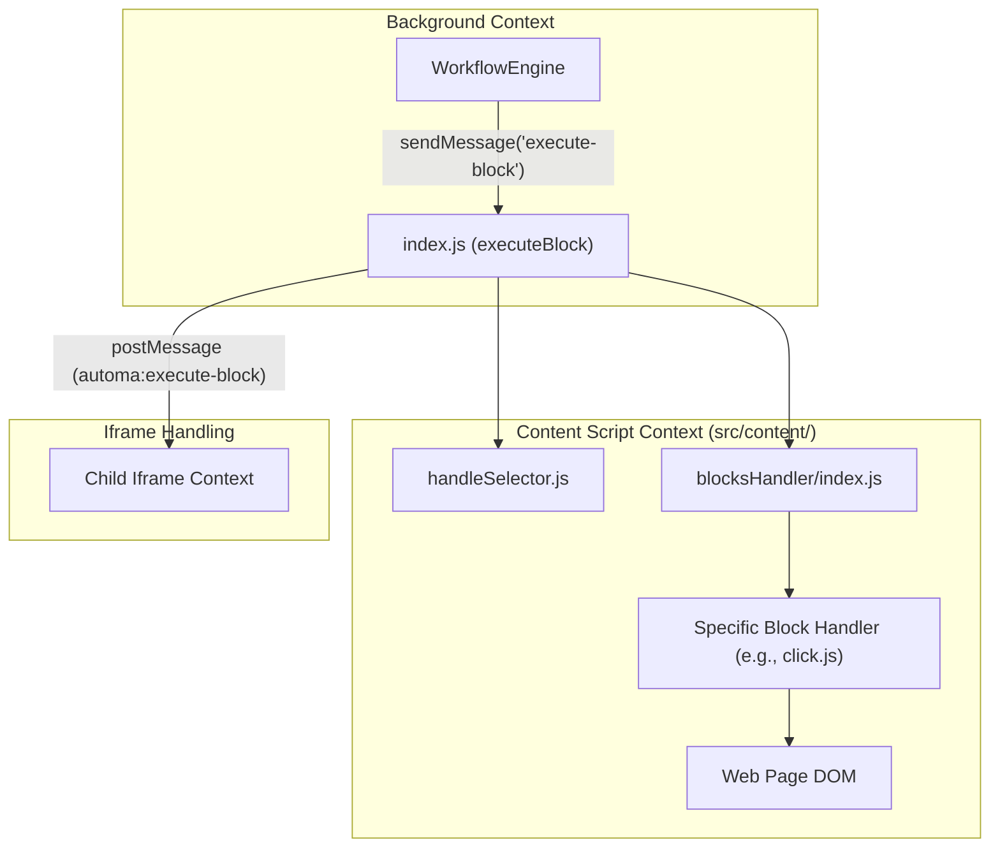
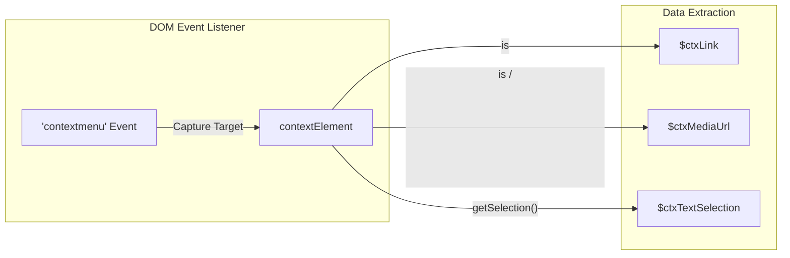

# Content Scripts & DOM Interaction

Relevant source files

The following files were used as context for generating this wiki page:

- [src/content/handleSelector.js](src/content/handleSelector.js)
- [src/content/index.js](src/content/index.js)

Automa interacts with web pages by injecting content scripts that execute logic directly within the browser's Document Object Model (DOM). These scripts bridge the gap between the high-level workflow engine and the low-level web elements, enabling actions like clicking buttons, extracting text, and navigating complex iframe structures.

## Overview

The content script layer is responsible for locating elements, handling events, and managing the visual state of the automation within the page. It consists of a block execution pipeline, a sophisticated iframe traversal system, and several UI overlays (Element Selector, Command Palette).

### System Architecture

The following diagram illustrates how the content script receives commands from the background script and dispatches them to specific handlers.

**Content Script Execution Pipeline**

Sources: [src/content/index.js:52-120](), [src/content/handleSelector.js:60-117]()

---

## Block Execution & Iframe Traversal

The entry point for all DOM interactions is `executeBlock` in `src/content/index.js`. This function determines whether a block should be executed in the current frame or delegated to a child iframe.

- **Iframe Traversal**: Automa uses a custom separator `|>` to traverse nested iframes. For example, `iframe#login |> button.submit` tells the engine to find the iframe, then execute the click inside its context. [src/content/index.js:54-57]()
- **Cross-Frame Messaging**: When an iframe is cross-origin, Automa uses `window.postMessage` to send the block data to the child frame, which has its own instance of the content script listener. [src/content/index.js:143-186]()
- **Element Selection**: The `handleSelector` utility abstracts the complexity of finding elements via CSS or XPath, including support for `waitForSelector` and marking elements for debugging. [src/content/handleSelector.js:29-57]()

For more details on the messaging protocol and frame selection, see **[Content Script Block Execution](#4.1)**.

Sources: [src/content/index.js:52-106](), [src/content/handleSelector.js:12-27]()

---

## Content Block Handlers

Once the correct frame and element are identified, the task is passed to a specific handler. Automa maintains a factory of handlers in `src/content/blocksHandler/`.

| Handler Category | Key Functions / Entities | Description |
| --- | --- | --- |
| **Interaction** | `click`, `press-key`, `forms` | Simulates user input and mouse events using `simulateEvent`. |
| **Data Extraction** | `get-text`, `attribute-value` | Reads content or attributes from the DOM to return to the engine. |
| **Flow Control** | `loop-elements`, `element-exists` | Logic that depends on the presence or count of DOM elements. |
| **Visual** | `take-screenshot`, `element-scroll` | Manipulates the viewport or captures element-specific images. |

For a full reference of available handlers, see **[Content Block Handlers](#4.2)**.

Sources: [src/content/index.js:107-114](), [src/content/blocksHandler/index.js:1-10]()

---

## Element Selector Tool

To simplify workflow creation, Automa injects a visual **Element Selector** into the page. This tool allows users to hover over elements to generate precise CSS or XPath selectors automatically.

- **Visual Overlay**: Injected as a Vue app (`App.vue`) to avoid style conflicts with the host page.
- **Cross-Origin Bridging**: Uses `selectorFrameContext` to track mouse movements even when the cursor enters an iframe.
- **Selector Generation**: Utilizes `findSelector` to create the most resilient selector possible. [src/content/index.js:1-1]()

For details on the selector's implementation, see **[Element Selector Tool](#4.3)**.

Sources: [src/content/utils.js:17-17]()

---

## Command Palette & Shortcut Listener

Automa provides an in-page interface for manual interaction via the **Command Palette** and **Shortcut Listener**.

- **Command Palette**: A Shadow DOM-encapsulated UI (`automa-palette`) that allows users to search and trigger workflows without leaving the current tab. [src/content/index.js:9-9]()
- **Shortcut Listener**: Uses the `Mousetrap` library to listen for global keyboard combos defined in the workflow settings, triggering the `WorkflowEngine` via the background script. [src/content/index.js:14-14]()

For details on these interfaces, see **[Command Palette & Shortcut Listener](#4.4)**.

Sources: [src/content/index.js:195-195](), [src/content/services/shortcutListener.js:1-5]()

---

## Context Menu Integration

The content script tracks the "last right-clicked element" to support context-menu-based triggers. It captures the target element, any associated links, and media URLs (images/video) to populate variables like `$ctxLink` and `$ctxMediaUrl`.

**Context Data Capture Logic**

Sources: [src/content/index.js:205-238]()

---

