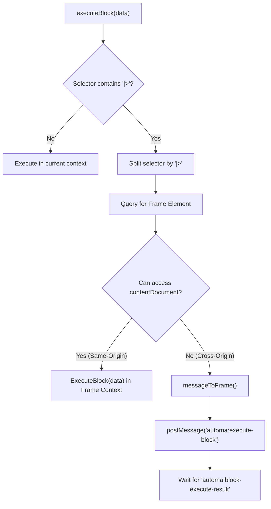

# Content Script Block Execution

Relevant source files

The following files were used as context for generating this wiki page:

- [src/content/blocksHandler/handlerEventClick.js](src/content/blocksHandler/handlerEventClick.js)
- [src/content/handleSelector.js](src/content/handleSelector.js)
- [src/content/index.js](src/content/index.js)
- [src/content/utils.js](src/content/utils.js)
- [src/lib/query-selector-shadow-dom/index.js](src/lib/query-selector-shadow-dom/index.js)
- [src/lib/query-selector-shadow-dom/normalize.js](src/lib/query-selector-shadow-dom/normalize.js)
- [src/utils/FindElement.js](src/utils/FindElement.js)
- [src/workflowEngine/helper.js](src/workflowEngine/helper.js)

This page details the technical implementation of the content script execution pipeline. It covers how automation blocks are dispatched from the background engine to the DOM, the resolution of complex iframe selectors, and the cross-frame communication protocol used to interact with nested web contexts.

## Execution Entry Point

The content script lifecycle begins in `src/content/index.js`. When the background script sends a message to execute a block, the content script's `messageListener` verifies the request and invokes `executeBlock`.

### Block Dispatch Pipeline

The `executeBlock` function is the central router for DOM-side operations. It performs three primary tasks:
1.  **Iframe Resolution**: Parses the selector for iframe traversal tokens (`|>`).
2.  **Visual Feedback**: Triggers `showExecutedBlock` to highlight the active element for the user [src/content/index.js:53-53]().
3.  **Handler Mapping**: Converts the block name to camelCase and retrieves the corresponding function from the `blocksHandler` factory [src/content/index.js:107-109]().

### The blocksHandler Factory
The `blocksHandler` function (imported from `./blocksHandler`) returns a mapping of block names (e.g., `clickElement`, `getText`) to their implementation functions. Each handler receives the `blockData` and a reference to the `handleSelector` utility [src/content/index.js:110-110]().

**Content Script Dispatch Flow**
"Background Engine" -> "content/index.js:messageListener" : "automa:execute-block"
"content/index.js:messageListener" -> "content/index.js:executeBlock" : "blockData"
"content/index.js:executeBlock" -> "content/handleSelector.js" : "Query DOM"
"content/index.js:executeBlock" -> "content/blocksHandler" : "Get Implementation"
"content/blocksHandler" -> "Individual Handlers" : "Execute (e.g., click)"

Sources: [src/content/index.js:107-114](), [src/content/index.js:143-162]()

---

## Iframe Selector Syntax (`|>`)

Automa uses a custom separator `|>` to denote traversal through the Shadow DOM or Iframe boundaries.

### Syntax Breakdown
*   **CSS/XPath**: Standard selectors (e.g., `#submit-btn`).
*   **Shadow DOM (`>>`)**: Used to pierce open shadow roots [src/utils/FindElement.js:35-36]().
*   **Iframe Boundary (`|>`)**: Used to chain selectors across frames. For example, `#iframe-1 |> .btn-inside` tells the engine to find `#iframe-1` in the top document, then find `.btn-inside` within that iframe's `contentDocument` [src/content/index.js:54-57]().

### Cross-Origin postMessage Protocol
If an iframe is cross-origin, the content script cannot access `frameElement.contentDocument` directly. In this scenario, `executeBlock` uses a `postMessage` protocol:

1.  **Token Generation**: A unique `messageId` is generated using `nanoid` [src/content/index.js:39-39]().
2.  **Storage Handshake**: The ID is stored in `browser.storage.local` to validate the message on the receiving end [src/content/index.js:40-40]().
3.  **Message Relay**: The block data is sent to the target frame via `postMessage` with the type `automa:execute-block` [src/content/index.js:41-49]().
4.  **Verification**: The receiving frame's `messageListener` checks `browser.storage.local` for the `messageId`. If valid, it executes the block and sends back `automa:block-execute-result` [src/content/index.js:144-165]().

**Iframe Traversal Logic**

Sources: [src/content/index.js:21-51](), [src/content/index.js:54-106](), [src/content/index.js:143-186]()

---

## Selector Handling and `FindElement`

The `handleSelector.js` module abstracts the complexity of finding elements, waiting for them to appear, and marking them.

### `queryElements` Function
This function implements the "Wait for selector" logic. It repeatedly attempts to find the element using `FindElement` until the `waitSelectorTimeout` is reached [src/content/handleSelector.js:29-58]().

### `FindElement` Class
This utility provides static methods for different selection strategies:
*   **`cssSelector`**: Supports standard CSS, Sizzle-specific pseudo-classes like `:equal()` or `:contains()`, and deep shadow DOM piercing via `>>` [src/utils/FindElement.js:22-52]().
*   **`xpath`**: Uses the native `document.evaluate` to resolve XPath expressions [src/utils/FindElement.js:54-82]().

### Marking Elements
When `markEl` is enabled in the block configuration, `handleSelector` applies a temporary attribute `block--{id}` to the target element. This prevents the same element from being processed multiple times in specific loop configurations [src/content/handleSelector.js:6-10]().

Sources: [src/content/handleSelector.js:29-58](), [src/utils/FindElement.js:11-20](), [src/utils/FindElement.js:21-83]()

---

## Error Recovery and Loop Execution

Content script execution includes specific mechanisms to handle failures and iterative tasks.

### Loop Selector Generation
For blocks like "Loop Elements", the content script generates unique selectors for each element in a collection. The `generateLoopSelectors` utility assigns a temporary `automa-loop` attribute to elements, allowing the background engine to target them individually in subsequent iterations [src/content/utils.js:16-38]().

### Error Reporting
If a selector is not found or an iframe is missing, the content script throws a structured error. If this occurs during a cross-frame execution, the error is serialized and sent back to the parent frame via `postMessage`, where it is re-thrown as a standard JavaScript `Error` object [src/content/index.js:26-30]().

| Error Message | Cause |
| :--- | :--- |
| `selector-empty` | The block configuration lacks a selector string [src/content/handleSelector.js:65-65](). |
| `iframe-not-found` | The frame specified in the `|>` syntax does not exist [src/content/handleSelector.js:72-72](). |
| `element-not-found` | The element could not be found within the timeout period [src/content/handleSelector.js:83-83](). |
| `not-iframe` | The selector before `|>` resolved to a non-frame element [src/content/index.js:86-86](). |

Sources: [src/content/index.js:76-87](), [src/content/handleSelector.js:64-86](), [src/content/utils.js:16-38]()

---

