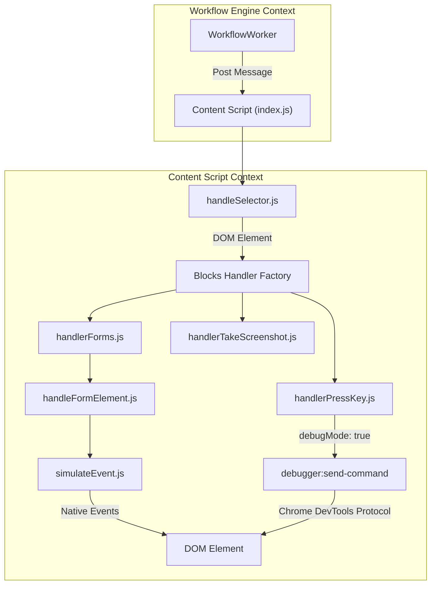

# Content Block Handlers

<details>
<summary>Relevant source files</summary>

The following files were used as context for generating this wiki page:

- [business/dev/index.js](business/dev/index.js)
- [src/components/newtab/shared/SharedElSelectorActions.vue](src/components/newtab/shared/SharedElSelectorActions.vue)
- [src/components/newtab/workflow/edit/EditAttributeValue.vue](src/components/newtab/workflow/edit/EditAttributeValue.vue)
- [src/components/newtab/workflow/edit/EditForms.vue](src/components/newtab/workflow/edit/EditForms.vue)
- [src/components/newtab/workflow/edit/EditGetText.vue](src/components/newtab/workflow/edit/EditGetText.vue)
- [src/components/newtab/workflow/edit/EditLoopElements.vue](src/components/newtab/workflow/edit/EditLoopElements.vue)
- [src/components/newtab/workflow/edit/EditPressKey.vue](src/components/newtab/workflow/edit/EditPressKey.vue)
- [src/components/newtab/workflow/edit/EditTakeScreenshot.vue](src/components/newtab/workflow/edit/EditTakeScreenshot.vue)
- [src/components/newtab/workflow/edit/EditTriggerEvent.vue](src/components/newtab/workflow/edit/EditTriggerEvent.vue)
- [src/content/blocksHandler/handlerAttributeValue.js](src/content/blocksHandler/handlerAttributeValue.js)
- [src/content/blocksHandler/handlerConditions.js](src/content/blocksHandler/handlerConditions.js)
- [src/content/blocksHandler/handlerElementScroll.js](src/content/blocksHandler/handlerElementScroll.js)
- [src/content/blocksHandler/handlerForms.js](src/content/blocksHandler/handlerForms.js)
- [src/content/blocksHandler/handlerLoopElements.js](src/content/blocksHandler/handlerLoopElements.js)
- [src/content/blocksHandler/handlerPressKey.js](src/content/blocksHandler/handlerPressKey.js)
- [src/content/blocksHandler/handlerTakeScreenshot.js](src/content/blocksHandler/handlerTakeScreenshot.js)
- [src/utils/handleFormElement.js](src/utils/handleFormElement.js)
- [tailwind.config.js](tailwind.config.js)

</details>


Content Block Handlers are the core execution modules within the content script context. They are responsible for direct DOM manipulation, event simulation, and data extraction from web pages. When the `WorkflowWorker` dispatches a block to the content script, these handlers translate high-level block data into low-level browser operations.

## Architecture Overview

The content block handlers reside in `src/content/blocksHandler/` and are typically invoked by the content script entry point after a selector has been resolved via `handleSelector`.

### Data Flow: Block to DOM
The following diagram illustrates how a block configuration is transformed into a DOM interaction.

**Interaction Logic Flow**

**Sources:** [src/content/blocksHandler/handlerForms.js:1-9](), [src/content/blocksHandler/handlerPressKey.js:156-173](), [src/utils/handleFormElement.js:101-110]()

---

## Form Element Handling

The `forms` block handles complex interactions with inputs, textareas, selects, checkboxes, and radio buttons. It utilizes a specialized utility `handleFormElement` to ensure compatibility with modern frontend frameworks like React.

### `handleFormElement` Logic
This utility performs several critical steps to ensure the browser and the web application recognize the programmatic input:
1.  **React State Synchronization**: It uses `nativeInputValueSetter` to bypass React's internal value tracking, allowing the application to "see" the change [src/utils/handleFormElement.js:5-15]().
2.  **Event Simulation**: It dispatches `input`, `keydown`, `keyup`, and `change` events for every character typed to mimic human behavior [src/utils/handleFormElement.js:17-61]().
3.  **Delay & Typing**: If a delay is specified, it iterates through the string, sleeping between characters [src/utils/handleFormElement.js:67-81]().

### Debug Mode (CDP)
When `debugMode` is enabled, `handlerForms.js` bypasses standard DOM events and sends commands to the background script to use the `chrome.debugger` API. This allows for lower-level input simulation that can bypass certain bot detection scripts [src/content/blocksHandler/handlerForms.js:28-64]().

**Sources:** [src/utils/handleFormElement.js:101-165](), [src/content/blocksHandler/handlerForms.js:27-73]()

---

## Keyboard Interaction

The `pressKey` block supports two primary execution paths: standard JavaScript events and Chrome DevTools Protocol (CDP) commands.

### Execution Strategies
| Strategy | Function | Mechanism |
| :--- | :--- | :--- |
| **Standard JS** | `pressKeyWithJs` | Dispatches `KeyboardEvent` to the active or selected element [src/content/blocksHandler/handlerPressKey.js:14-44](). |
| **CDP (Debug)** | `pressKeyWithCommand` | Sends `Input.dispatchKeyEvent` via background debugger service [src/content/blocksHandler/handlerPressKey.js:94-154](). |

### Modifier Keys
The handler maps human-readable keys (e.g., "Alt", "Control") to their respective bitwise modifiers for CDP or property flags for JS events [src/content/blocksHandler/handlerPressKey.js:7-12]().

**Sources:** [src/content/blocksHandler/handlerPressKey.js:156-183](), [src/components/newtab/workflow/edit/EditPressKey.vue:103-109]()

---

## Screen Capture Logic

The `takeScreenshot` handler is unique as it orchestrates interactions between the content script and the background script to capture parts of the page or the entire scrollable area.

### Full Page Screenshot Algorithm
1.  **Scrollable Detection**: Finds the primary scrollable element using `findScrollableElement` [src/content/blocksHandler/handlerTakeScreenshot.js:5-33]().
2.  **Style Injection**: Injects CSS to hide scrollbars and handle sticky/fixed elements during the process [src/content/blocksHandler/handlerTakeScreenshot.js:34-42]().
3.  **Iterative Capture**: 
    *   Scrolls the element incrementally [src/content/blocksHandler/handlerTakeScreenshot.js:238]().
    *   Requests a viewport screenshot from the background via `get:tab-screenshot` [src/content/blocksHandler/handlerTakeScreenshot.js:57-61]().
    *   Stitches the images together onto a `canvas` [src/content/blocksHandler/handlerTakeScreenshot.js:225-235]().
4.  **Base64 Conversion**: Returns the final image as a data URL [src/content/blocksHandler/handlerTakeScreenshot.js:249]().

**Sources:** [src/content/blocksHandler/handlerTakeScreenshot.js:134-250]()

---

## Loop Elements Handler

The `loop-elements` block enables iteration over multiple DOM elements matching a selector.

### Key Capabilities
*   **Load More**: Supports several strategies to find more elements during iteration: `click-element`, `scroll`, and `scroll-up` [src/components/newtab/workflow/edit/EditLoopElements.vue:119]().
*   **Wait Time**: Configurable `actionElMaxWaitTime` to wait for new elements to appear after a "load more" action [src/components/newtab/workflow/edit/EditLoopElements.vue:68-74]().
*   **Reverse Order**: Can iterate through the found elements in reverse [src/components/newtab/workflow/edit/EditLoopElements.vue:24-30]().

**Sources:** [src/components/newtab/workflow/edit/EditLoopElements.vue:31-100]()

---

## Utility: Event Simulation

Most handlers rely on `simulateEvent` (imported in several handlers) to trigger browser behaviors.

**Code Entity Association**
```mermaid
classDiagram
    class BlocksHandler {
        +forms(block)
        +pressKey(block)
        +takeScreenshot(block)
        +attributeValue(block)
    }
    class Utilities {
        +handleFormElement(el, data)
        +simulateEvent(el, type, options)
        +queryElements(selector)
    }
    class BackgroundBridge {
        +sendMessage(type, payload, target)
    }

    BlocksHandler ..> Utilities : Uses
    BlocksHandler ..> BackgroundBridge : Request Screenshot/Debugger
    Utilities ..> BackgroundBridge : debugger:type
```

### Attribute Value Handler
The `attributeValue` handler (`src/content/blocksHandler/handlerAttributeValue.js`) allows for both retrieving (`get`) and modifying (`set`) DOM attributes. When setting, it targets `data.attributeName` with `data.attributeValue` [src/components/newtab/workflow/edit/EditAttributeValue.vue:4-33]().

**Sources:** [src/components/newtab/workflow/edit/EditAttributeValue.vue:1-42](), [src/utils/handleFormElement.js:3-15]()

---

