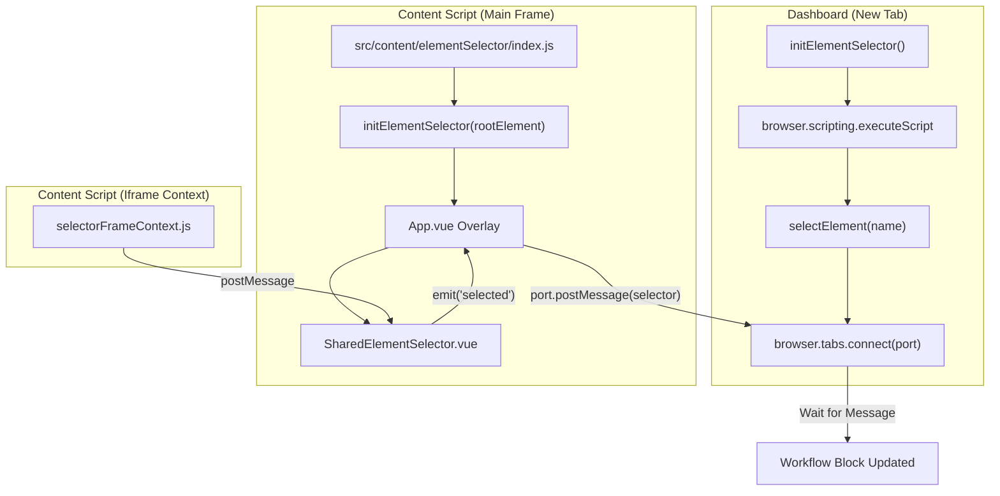
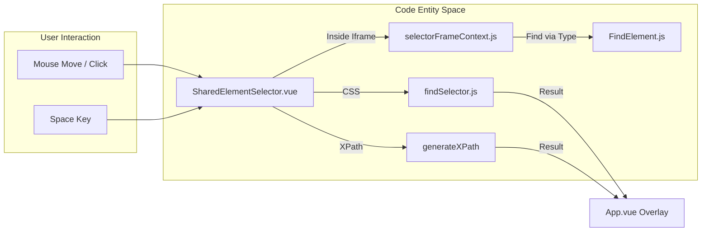

# Element Selector Tool

Relevant source files

The following files were used as context for generating this wiki page:

- [src/assets/css/flow.css](src/assets/css/flow.css)
- [src/components/content/selector/SelectorElementList.vue](src/components/content/selector/SelectorElementList.vue)
- [src/components/content/selector/SelectorElementsDetail.vue](src/components/content/selector/SelectorElementsDetail.vue)
- [src/components/content/selector/SelectorQuery.vue](src/components/content/selector/SelectorQuery.vue)
- [src/components/content/shared/SharedElementHighlighter.vue](src/components/content/shared/SharedElementHighlighter.vue)
- [src/components/content/shared/SharedElementSelector.vue](src/components/content/shared/SharedElementSelector.vue)
- [src/components/newtab/workflow/editor/EditorLocalCtxMenu.vue](src/components/newtab/workflow/editor/EditorLocalCtxMenu.vue)
- [src/content/blocksHandler/handlerVerifySelector.js](src/content/blocksHandler/handlerVerifySelector.js)
- [src/content/elementSelector/App.vue](src/content/elementSelector/App.vue)
- [src/content/elementSelector/compsUi.js](src/content/elementSelector/compsUi.js)
- [src/content/elementSelector/generateElementsSelector.js](src/content/elementSelector/generateElementsSelector.js)
- [src/content/elementSelector/getSelectorOptions.js](src/content/elementSelector/getSelectorOptions.js)
- [src/content/elementSelector/icons.js](src/content/elementSelector/icons.js)
- [src/content/elementSelector/index.js](src/content/elementSelector/index.js)
- [src/content/elementSelector/listSelector.js](src/content/elementSelector/listSelector.js)
- [src/content/elementSelector/selectorFrameContext.js](src/content/elementSelector/selectorFrameContext.js)
- [src/lib/findSelector.js](src/lib/findSelector.js)
- [src/newtab/pages/Recording.vue](src/newtab/pages/Recording.vue)
- [src/newtab/utils/RecordWorkflowUtils.js](src/newtab/utils/RecordWorkflowUtils.js)
- [src/newtab/utils/elementSelector.js](src/newtab/utils/elementSelector.js)
- [src/newtab/utils/startRecordWorkflow.js](src/newtab/utils/startRecordWorkflow.js)

The Element Selector Tool is a visual utility injected into web pages that allows users to pick DOM elements for use in workflows. It provides real-time feedback, supports CSS and XPath generation, handles cross-origin iframes, and allows for selecting lists of elements through pattern matching.

## Overview and Injection Logic

The tool is initialized as a content script (`elementSelector.bundle.js`). It behaves differently depending on whether it is running in the top-level frame or an iframe.

- **Main Frame:** Creates a Shadow DOM container (`#app-container`) and mounts the Vue-based UI `App.vue` [src/content/elementSelector/index.js:10-22]().
- **Iframes:** Injects basic helper styles and initializes `selectorFrameContext` to handle cross-origin messaging with the main frame [src/content/elementSelector/index.js:23-30]().

The tool is typically invoked from the Workflow Editor via `selectElement` which establishes a runtime port to receive the final selector [src/newtab/utils/elementSelector.js:81-107]().

### Selector Injection Data Flow

**Sources:** [src/newtab/utils/elementSelector.js:16-47](), [src/content/elementSelector/index.js:6-34](), [src/newtab/utils/elementSelector.js:81-107]()

---

## Core Components

### App.vue Overlay
The main interface (`src/content/elementSelector/App.vue`) provides the control panel for the selector. It manages state for selector types (CSS/XPath), element lists, and selector settings [src/content/elementSelector/App.vue:184-210]().

Key features include:
- **Selector Querying:** Manual editing and refinement of selectors [src/content/elementSelector/App.vue:47-57]().
- **Hierarchy Navigation:** Moving up to a parent or down to a child element [src/content/elementSelector/App.vue:55-56]().
- **Settings:** Toggling whether to include IDs, Tag Names, Class Names, or specific attributes (like `data-testid`) in the generated CSS selector [src/content/elementSelector/App.vue:90-132]().

### SharedElementSelector
This component manages the actual mouse and keyboard tracking. It uses a transparent overlay and `document.elementsFromPoint` to identify what the user is hovering over without interfering with the page's own event listeners [src/components/content/shared/SharedElementSelector.vue:146-155]().

**Functionality:**
- **Mouse Tracking:** Calculates the bounding box of hovered and selected elements [src/components/content/shared/SharedElementSelector.vue:202-226]().
- **Keyboard Selection:** Listens for the `Space` key to lock an element selection [src/components/content/shared/SharedElementSelector.vue:274-278]().
- **Highlighter:** Renders SVG rectangles over elements using `SharedElementHighlighter.vue` [src/components/content/shared/SharedElementSelector.vue:15-27]().

**Sources:** [src/content/elementSelector/App.vue:1-152](), [src/components/content/shared/SharedElementSelector.vue:43-261]()

---

## Selector Generation

Automa uses two primary methods for generating selectors:
1. **CSS Selectors:** Powered by a customized version of `@medv/finder` [src/lib/findSelector.js:1-21]().
2. **XPath:** Generated via the `generateXPath` utility [src/content/utils:48]().

### List Selection Logic
When "Select List" is enabled, the tool attempts to find siblings or similar elements.
- It uses `findElementList` to identify patterns [src/components/content/shared/SharedElementSelector.vue:208-211]().
- It marks identified elements with the `automa-el-list` attribute for visual feedback [src/content/elementSelector/generateElementsSelector.js:48-50]().

### Iframe Cross-Origin Bridging
Since content scripts cannot directly access elements inside cross-origin iframes, Automa uses a `postMessage` protocol:
1. **Main Frame** detects the mouse is over an `IFRAME` [src/components/content/shared/SharedElementSelector.vue:160-165]().
2. It sends `automa:get-element-rect` to the iframe's `contentWindow` [src/components/content/shared/SharedElementSelector.vue:173-192]().
3. **Iframe Context** (`selectorFrameContext.js`) calculates the element under the point and sends the data back via `window.top.postMessage` [src/content/elementSelector/selectorFrameContext.js:19-69]().
4. The **Main Frame** prepends the iframe's selector to the element's selector using the `|>` separator (e.g., `#iframe-id |> .button-class`) [src/components/content/shared/SharedElementSelector.vue:241-244]().

**Sources:** [src/content/elementSelector/generateElementsSelector.js:4-60](), [src/content/elementSelector/selectorFrameContext.js:1-123](), [src/lib/findSelector.js:7-20]()

---

## Visual Interaction System

The interaction system maps physical screen coordinates to DOM elements and then to the Automa selector representation.

### Key Functions and Classes

| Entity | Role | File Reference |
| :--- | :--- | :--- |
| `getElementRectWithOffset` | Calculates element position including iframe offsets and scroll. | [src/components/content/shared/SharedElementSelector.vue:108-126]() |
| `generateElementsSelector` | Logic for determining if a single element or a list selector is needed. | [src/content/elementSelector/generateElementsSelector.js:4-61]() |
| `selectorFrameContext` | Listener inside iframes to handle element picking for the parent frame. | [src/content/elementSelector/selectorFrameContext.js:120-122]() |
| `findElementList` | Utility to find multiple elements based on a common parent/pattern. | [src/content/elementSelector/listSelector.js:1-3]() |
| `verifySelector` | Tests if a generated selector still points to a valid element. | [src/newtab/utils/elementSelector.js:49-79]() |

**Sources:** [src/components/content/shared/SharedElementSelector.vue:108-261](), [src/content/elementSelector/selectorFrameContext.js:19-70](), [src/newtab/utils/elementSelector.js:49-79]()

---

