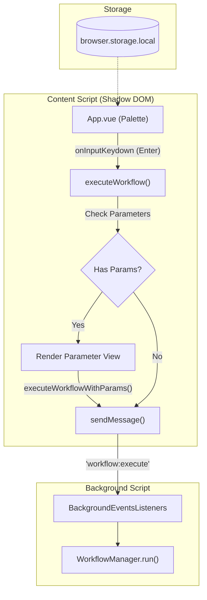
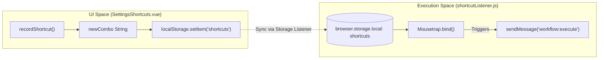

# Command Palette & Shortcut Listener

Relevant source files

The following files were used as context for generating this wiki page:

- [.gitignore](.gitignore)
- [src/components/newtab/app/AppSidebar.vue](src/components/newtab/app/AppSidebar.vue)
- [src/components/ui/UiModal.vue](src/components/ui/UiModal.vue)
- [src/composable/shortcut.js](src/composable/shortcut.js)
- [src/content/commandPalette/App.vue](src/content/commandPalette/App.vue)
- [src/content/commandPalette/compsUi.js](src/content/commandPalette/compsUi.js)
- [src/content/commandPalette/icons.js](src/content/commandPalette/icons.js)
- [src/content/commandPalette/index.js](src/content/commandPalette/index.js)
- [src/content/commandPalette/main.js](src/content/commandPalette/main.js)
- [src/content/services/shortcutListener.js](src/content/services/shortcutListener.js)
- [src/manifest.chrome.dev.json](src/manifest.chrome.dev.json)
- [src/newtab/pages/Settings.vue](src/newtab/pages/Settings.vue)
- [src/newtab/pages/settings/SettingsProfile.vue](src/newtab/pages/settings/SettingsProfile.vue)
- [src/newtab/pages/settings/SettingsShortcuts.vue](src/newtab/pages/settings/SettingsShortcuts.vue)
- [src/newtab/router.js](src/newtab/router.js)

The Command Palette and Shortcut Listener provide in-page access to Automa's workflow execution capabilities without requiring the user to navigate to the dashboard or popup. The Command Palette (`automa-palette`) is a searchable interface injected into the DOM via a Shadow Root, while the Shortcut Listener binds specific keyboard combinations directly to workflow triggers.

## Command Palette Implementation

The Command Palette is a Vue-based application injected into every web page as a content script. To avoid CSS collisions with the host page, it utilizes a Shadow DOM container [src/content/commandPalette/index.js:1-10]().

### Shadow DOM Injection
When the command palette is initialized, it creates a `div` element with the ID `automa-palette`. It then attaches a Shadow Root in `open` mode and mounts the Vue application (`App.vue`) inside this root [src/content/commandPalette/index.js:5-15](). This ensures that the palette's styles remain encapsulated and do not leak into the host website.

### Workflow Search and Selection
The palette retrieves workflows from `browser.storage.local`, including local workflows, hosted workflows, and team workflows [src/content/commandPalette/App.vue:220-235](). 
- **Filtering**: The `onInput` function filters the workflow list based on the user's query [src/content/commandPalette/App.vue:274-285]().
- **Navigation**: Users can navigate the list using the arrow keys, managed by `onInputKeydown` [src/content/commandPalette/App.vue:287-305]().
- **Execution**: Pressing `Enter` or clicking a workflow triggers the execution logic.

### Runtime Parameter Collection
If a selected workflow contains parameters, the palette switches to a "Parameter View" [src/content/commandPalette/App.vue:49-81](). It dynamically renders input components based on the parameter type:
- **String**: Uses `ParameterInputValue.vue` [src/content/commandPalette/App.vue:196-200]().
- **JSON**: Uses `ParameterJsonValue.vue` [src/content/commandPalette/App.vue:201-205]().

Once parameters are filled, `executeWorkflowWithParams` merges the inputs into the workflow's options and sends a `workflow:execute` message to the background script [src/content/commandPalette/App.vue:326-340]().

**Sources:**
- [src/content/commandPalette/App.vue:1-174]() (Template and component structure)
- [src/content/commandPalette/App.vue:220-235]() (Data retrieval)
- [src/content/commandPalette/index.js:1-15]() (Shadow DOM injection logic)

## Shortcut Listener System

The `shortcutListener.js` service is responsible for global keyboard shortcuts within the browser tab context. It uses the `Mousetrap` library to bind keys to specific workflow IDs.

### Keybinding Logic
The system supports two types of shortcuts:
1.  **System Shortcuts**: Defined in `mapShortcuts`, these handle navigation (e.g., `Alt+W` for workflows) [src/composable/shortcut.js:6-59]().
2.  **Workflow Triggers**: Custom shortcuts assigned by the user to specific workflows [src/content/services/shortcutListener.js:27-49]().

### Input Context Sensitivity
The listener checks if the user is currently focused on an input element (e.g., `INPUT`, `TEXTAREA`, or `contentEditable` elements) [src/content/services/shortcutListener.js:52-54](). Unless the workflow trigger is explicitly configured with `activeInInput: true`, the shortcut will be ignored to prevent accidental execution while typing [src/content/services/shortcutListener.js:56-60]().

### Custom Event Listener
In addition to keyboard shortcuts, the listener registers window-level event listeners for `automa:execute-workflow` [src/content/services/shortcutListener.js:24-25](). This allows external scripts or the host page to programmatically trigger Automa workflows by dispatching a `CustomEvent` with the workflow ID [src/content/services/shortcutListener.js:10-22]().

**Sources:**
- [src/content/services/shortcutListener.js:27-64]() (Workflow shortcut binding)
- [src/content/services/shortcutListener.js:9-26]() (Custom event listeners)
- [src/composable/shortcut.js:65-82]() (Shortcut string parsing)

## Data Flow: Palette to Background

The following diagram illustrates how a user interaction in the Command Palette traverses the system to trigger a workflow execution in the background script.

### Palette Execution Pipeline
Title: Palette to Background Execution

Sources: [src/content/commandPalette/App.vue:307-340](), [src/utils/message.js:1-10](), [src/content/services/shortcutListener.js:65-81]()

## Shortcut Configuration & Mapping

Shortcuts are managed through a centralized mapping system that handles OS-specific differences (e.g., `Command` on Mac vs `Ctrl` on Windows).

### Readable Shortcut Translation
The `getReadableShortcut` function converts internal combo strings (like `mod+s`) into human-readable labels based on the user's operating system [src/composable/shortcut.js:65-82]().

| Internal Combo | Mac Display | Win/Linux Display |
| :--- | :--- | :--- |
| `mod` | `⌘` | `ctrl` |
| `option` | `option` | `alt` |

### Settings UI
The Shortcuts Settings page (`SettingsShortcuts.vue`) allows users to record new key combinations using the `recordShortcut` utility [src/newtab/pages/settings/SettingsShortcuts.vue:146-149](). These are persisted to `localStorage` for UI shortcuts and `browser.storage.local` for the global `automaShortcut` that opens the palette [src/newtab/pages/settings/SettingsShortcuts.vue:175-181]().

### Shortcut Entity Mapping
Title: Shortcut Logic Mapping

Sources: [src/newtab/pages/settings/SettingsShortcuts.vue:156-199](), [src/content/services/shortcutListener.js:100-120](), [src/composable/shortcut.js:84-93]()

## Key Functions and Classes

| Entity | Location | Role |
| :--- | :--- | :--- |
| `useShortcut` | [src/composable/shortcut.js:95]() | A Vue composable that binds Mousetrap keys to handlers and manages lifecycle (mount/unmount). |
| `workflowShortcutsListener` | [src/content/services/shortcutListener.js:27]() | Iterates through stored workflow shortcuts and binds them to background execution messages. |
| `executeWorkflow` | [src/content/commandPalette/App.vue:307]() | Determines if a workflow can run immediately or requires parameter input. |
| `getWorkflows` | [src/content/services/shortcutListener.js:65]() | Aggregates workflows from multiple storage keys (local, hosts, teams) for the listener. |
| `Mousetrap.stopCallback` | [src/content/services/shortcutListener.js:5]() | Overridden to allow shortcuts to fire even when focused on input fields (conditional logic handled manually). |

**Sources:**
- [src/composable/shortcut.js:95-145]()
- [src/content/services/shortcutListener.js:1-127]()
- [src/content/commandPalette/App.vue:307-340]()

---

