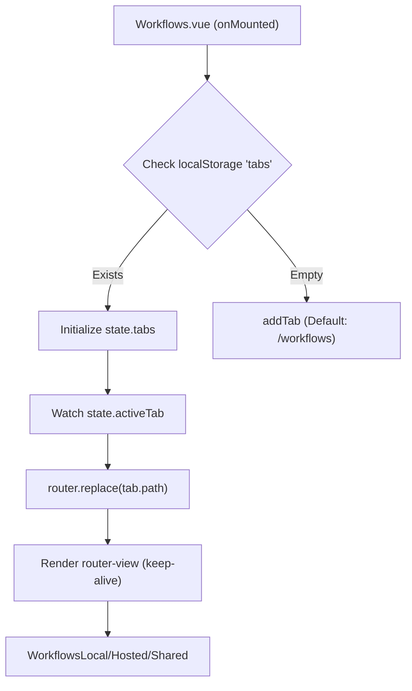
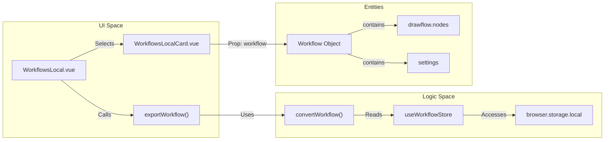

# Workflow List & Management

Relevant source files

The following files were used as context for generating this wiki page:

- [src/components/newtab/logs/LogsVariables.vue](src/components/newtab/logs/LogsVariables.vue)
- [src/components/newtab/settings/SettingsCloudBackup.vue](src/components/newtab/settings/SettingsCloudBackup.vue)
- [src/components/newtab/shared/SharedCard.vue](src/components/newtab/shared/SharedCard.vue)
- [src/components/newtab/shared/SharedPermissionsModal.vue](src/components/newtab/shared/SharedPermissionsModal.vue)
- [src/components/newtab/workflows/WorkflowsHosted.vue](src/components/newtab/workflows/WorkflowsHosted.vue)
- [src/components/newtab/workflows/WorkflowsLocal.vue](src/components/newtab/workflows/WorkflowsLocal.vue)
- [src/components/newtab/workflows/WorkflowsShared.vue](src/components/newtab/workflows/WorkflowsShared.vue)
- [src/components/popup/home/HomeTeamWorkflows.vue](src/components/popup/home/HomeTeamWorkflows.vue)
- [src/components/ui/UiSelect.vue](src/components/ui/UiSelect.vue)
- [src/locales/en/common.json](src/locales/en/common.json)
- [src/newtab/pages/Workflows.vue](src/newtab/pages/Workflows.vue)
- [src/newtab/pages/settings/SettingsBackup.vue](src/newtab/pages/settings/SettingsBackup.vue)
- [src/newtab/pages/workflows/Shared.vue](src/newtab/pages/workflows/Shared.vue)
- [src/newtab/pages/workflows/index.vue](src/newtab/pages/workflows/index.vue)
- [src/stores/hostedWorkflow.js](src/stores/hostedWorkflow.js)
- [src/stores/sharedWorkflow.js](src/stores/sharedWorkflow.js)
- [src/stores/workflow.js](src/stores/workflow.js)
- [src/utils/firstWorkflows.js](src/utils/firstWorkflows.js)
- [src/utils/workflowData.js](src/utils/workflowData.js)

The Workflows dashboard is the primary interface for managing the lifecycle of automation scripts within Automa. It provides a multi-tabbed environment for organizing local, hosted, shared, and team workflows, alongside tools for importing, exporting, and bulk management.

## 1. Dashboard Layout & Tab Management

The dashboard uses a persistent tab system managed in `Workflows.vue`, allowing users to keep multiple views (like different folders or specific shared workflows) open simultaneously.

### Tab Implementation
- **State Persistence**: Tabs are synchronized with `localStorage` (key: `tabs`) to persist across sessions [src/newtab/pages/Workflows.vue:155-161]().
- **Dynamic Routing**: The `activeTab` state triggers `router.replace(tab.path)` to update the view while maintaining the tab's context [src/newtab/pages/Workflows.vue:112-127]().
- **Components**: Uses `vuedraggable` for reordering tabs [src/newtab/pages/Workflows.vue:4-39]().

### Data Flow: Tab Synchronization

Sources: [src/newtab/pages/Workflows.vue:65-90](), [src/newtab/pages/Workflows.vue:163-171]()

---

## 2. Workflow Categories & Storage

Workflows are categorized based on their origin and ownership. Each category is handled by a specific component and Pinia store.

| Category | Store | Component | Description |
| :--- | :--- | :--- | :--- |
| **Local** | `useWorkflowStore` | `WorkflowsLocal.vue` | Workflows stored in browser's `local.storage` [src/stores/workflow.js:94-113](). |
| **Hosted** | `useHostedWorkflowStore` | `WorkflowsHosted.vue` | Local workflows synced to Automa Cloud for backup [src/components/newtab/workflows/WorkflowsHosted.vue:1-20](). |
| **Shared** | `useSharedWorkflowStore` | `WorkflowsShared.vue` | Workflows published to the public marketplace [src/newtab/pages/workflows/Shared.vue:156-163](). |
| **Team** | `useTeamWorkflowStore` | `HomeTeamWorkflows.vue` | Workflows shared within a specific team context [src/newtab/pages/workflows/index.vue:60-85](). |

Sources: [src/stores/workflow.js:94-113](), [src/newtab/pages/workflows/index.vue:98-133]()

---

## 3. Workflow CRUD Operations

Management operations are centralized in `useWorkflowStore` and the `workflowData.js` utility.

### Workflow Creation & Defaults
New workflows are initialized with a `defaultWorkflow` schema, which includes a mandatory `trigger` block [src/stores/workflow.js:16-65]().
- **ID Generation**: Uses `nanoid()` [src/stores/workflow.js:18]().
- **Default Settings**: Configures `saveLog: true`, `onError: 'stop-workflow'`, and `blockDelay: 0` [src/stores/workflow.js:47-62]().

### Import & Export Logic
The `workflowData.js` utility handles serialization and dependency resolution.
- **Export**: `exportWorkflow` recursively finds "Included Workflows" (sub-workflows called via the `execute-workflow` block) and packages them into a single `.automa.json` file [src/utils/workflowData.js:235-250]().
- **Import**: `importWorkflow` uses `openFilePicker` to read JSON files. It checks for `includedWorkflows` and inserts them into the store before importing the main workflow [src/utils/workflowData.js:95-148]().

### Workflow Execution
Workflows are executed via `RendererWorkflowService.executeWorkflow(workflow)`, which bridges the dashboard UI to the background script engine [src/components/newtab/workflows/WorkflowsLocal.vue:29]().

Sources: [src/utils/workflowData.js:235-250](), [src/stores/workflow.js:141-167]()

---

## 4. Selection & Bulk Actions

The `WorkflowsLocal.vue` component implements advanced selection features using the `@viselect/vanilla` library.

### Selection Logic
- **Area Selection**: Users can click and drag to select multiple workflows [src/components/newtab/workflows/WorkflowsLocal.vue:172-180]().
- **Visual Feedback**: Selected elements are highlighted using the `ring-2` CSS class [src/components/newtab/workflows/WorkflowsLocal.vue:193-200]().
- **Actions**: Bulk deletion or moving to folders is supported via the `state.selectedWorkflows` array [src/components/newtab/workflows/WorkflowsLocal.vue:201-206]().

### Code Entity Mapping: Management Flow

Sources: [src/components/newtab/workflows/WorkflowsLocal.vue:172-206](), [src/utils/workflowData.js:177-200]()

---

## 5. Permissions Management

Before execution or import, Automa validates required browser permissions based on the blocks present in the workflow.

- **`getWorkflowPermissions(drawflow)`**: Iterates through all nodes in the workflow graph to identify blocks requiring specific permissions (e.g., `cookies`, `notifications`, `downloads`) [src/utils/workflowData.js:70-93]().
- **Permission Map**: Defined in `requiredPermissions`, mapping block labels to browser API strings [src/utils/workflowData.js:15-68]().

### Required Permissions Table
| Block Label | Browser Permission |
| :--- | :--- |
| `trigger` (context-menu) | `contextMenus` / `menus` |
| `clipboard` | `clipboardRead` |
| `handle-download` | `downloads` |
| `cookie` | `cookies` |

Sources: [src/utils/workflowData.js:15-68](), [src/utils/workflowData.js:70-93]()

---

## 6. Cloud & Backup Integration

The `SettingsBackup.vue` and `SettingsCloudBackup.vue` components manage synchronization between local IndexedDB storage and the Automa Cloud API.

- **Encryption**: Backups can be encrypted using AES before being saved [src/newtab/pages/settings/SettingsBackup.vue:80-82]().
- **Cloud Sync**: `syncBackupWorkflows` fetches workflows from the cloud and merges them into the local store using `insertOrUpdate` with date-checking to avoid overwriting newer local versions [src/stores/workflow.js:215-246](), [src/newtab/pages/settings/SettingsBackup.vue:39-43]().
- **Automatic Backups**: Users can schedule backups using cron expressions, which are registered as browser alarms [src/newtab/pages/settings/SettingsBackup.vue:134-158]().

Sources: [src/newtab/pages/settings/SettingsBackup.vue:1-43](), [src/components/newtab/settings/SettingsCloudBackup.vue:153-213]()

---

