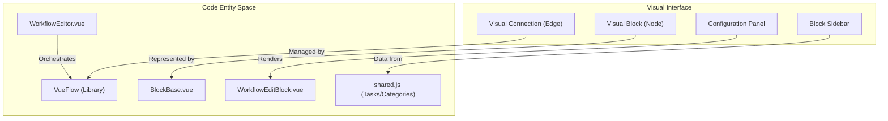
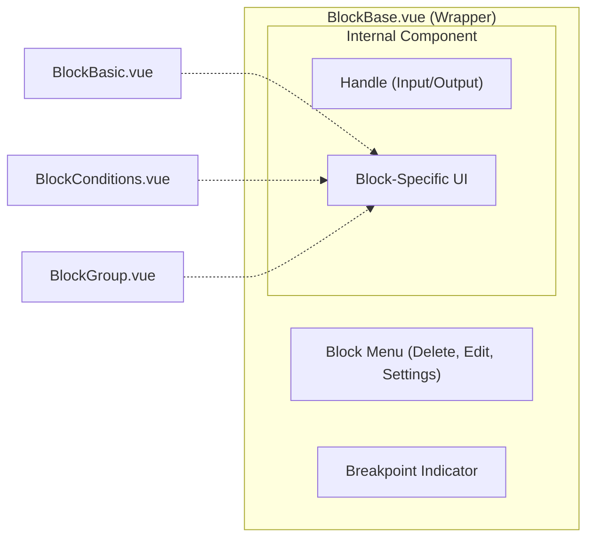

# Workflow Editor

Relevant source files

The following files were used as context for generating this wiki page:

- [src/assets/css/drawflow.css](src/assets/css/drawflow.css)
- [src/components/block/BlockBase.vue](src/components/block/BlockBase.vue)
- [src/components/block/BlockBasic.vue](src/components/block/BlockBasic.vue)
- [src/components/block/BlockConditions.vue](src/components/block/BlockConditions.vue)
- [src/components/block/BlockDelay.vue](src/components/block/BlockDelay.vue)
- [src/components/block/BlockElementExists.vue](src/components/block/BlockElementExists.vue)
- [src/components/block/BlockGroup.vue](src/components/block/BlockGroup.vue)
- [src/components/block/BlockLoopBreakpoint.vue](src/components/block/BlockLoopBreakpoint.vue)
- [src/components/block/BlockRepeatTask.vue](src/components/block/BlockRepeatTask.vue)
- [src/components/newtab/workflow/WorkflowDetailsCard.vue](src/components/newtab/workflow/WorkflowDetailsCard.vue)
- [src/components/newtab/workflow/WorkflowEditBlock.vue](src/components/newtab/workflow/WorkflowEditBlock.vue)
- [src/components/newtab/workflow/WorkflowEditor.vue](src/components/newtab/workflow/WorkflowEditor.vue)
- [src/components/newtab/workflow/edit/BlockSetting/BlockSettingGeneral.vue](src/components/newtab/workflow/edit/BlockSetting/BlockSettingGeneral.vue)
- [src/components/newtab/workflow/edit/EditBlockSettings.vue](src/components/newtab/workflow/edit/EditBlockSettings.vue)
- [src/components/newtab/workflow/edit/EditConditions.vue](src/components/newtab/workflow/edit/EditConditions.vue)
- [src/components/newtab/workflow/edit/EditTrigger.vue](src/components/newtab/workflow/edit/EditTrigger.vue)
- [src/components/newtab/workflow/editor/EditorDebugging.vue](src/components/newtab/workflow/editor/EditorDebugging.vue)
- [src/components/newtab/workflow/editor/EditorLocalActions.vue](src/components/newtab/workflow/editor/EditorLocalActions.vue)
- [src/components/ui/UiInput.vue](src/components/ui/UiInput.vue)
- [src/lib/vRemixicon.js](src/lib/vRemixicon.js)

The Workflow Editor is a visual, node-based interface that allows users to construct automation logic by connecting functional blocks. It is built using the `VueFlow` library, which handles the graph rendering, node positioning, and edge management.

## Core Editor Implementation

The primary component for the graph interface is `WorkflowEditor.vue`. It integrates `VueFlow` and provides the canvas where blocks (nodes) and connections (edges) are manipulated.

### Graph Rendering & VueFlow Integration
The editor initializes the `VueFlow` instance with specific configurations for zoom levels, deletion keys, and selection modifiers [src/components/newtab/workflow/WorkflowEditor.vue:163-177]().

- **Node Types**: The editor dynamically resolves node components by scanning the `src/components/block` directory using `require.context` [src/components/newtab/workflow/WorkflowEditor.vue:143-157]().
- **Edge Validation**: Connections are handled via `editor.onConnect`. It prevents invalid states, such as connecting two output handles together [src/components/newtab/workflow/WorkflowEditor.vue:178-190]().
- **Minimap**: A visual overview of the graph is provided, with nodes color-coded based on their category [src/components/newtab/workflow/WorkflowEditor.vue:216-221]().

### Data Flow: Editor to Code
The following diagram illustrates how visual interactions in the `WorkflowEditor` map to specific code entities and data structures.

**Visual to Code Mapping**

Sources: [src/components/newtab/workflow/WorkflowEditor.vue:2-78](), [src/components/block/BlockBase.vue:2-85](), [src/components/newtab/workflow/WorkflowEditBlock.vue:23-34]().

---

## Block Architecture

Blocks are the atomic units of a workflow. They are categorized into several visual types based on their logic and output requirements.

### Block Categories and Types
| Component | Logic Type | Description |
|---|---|---|
| `BlockBasic.vue` | Sequential | Standard blocks with one input and one output [src/components/block/BlockBasic.vue:14-113](). |
| `BlockConditions.vue` | Branching | Multi-output block for "if/else" logic [src/components/block/BlockConditions.vue:29-79](). |
| `BlockGroup.vue` | Nested | A container block that holds a sub-list of blocks [src/components/block/BlockGroup.vue:40-118](). |

### Common Block Features (`BlockBase.vue`)
All visual blocks wrap their content in `BlockBase.vue`, which provides a standardized menu for:
- **Block ID**: Clicking the ID copies it to the clipboard [src/components/block/BlockBase.vue:14-19]().
- **Settings**: Opens the `EditBlockSettings` modal [src/components/block/BlockBase.vue:31-36]().
- **Enable/Disable**: Toggles the `disableBlock` property [src/components/block/BlockBase.vue:47-56]().
- **Breakpoints**: Allows setting a execution pause point when `testingMode` is active [src/components/block/BlockBase.vue:72-80]().

**Block Structure Diagram**

Sources: [src/components/block/BlockBase.vue:2-85](), [src/components/block/BlockBasic.vue:1-113](), [src/components/block/BlockConditions.vue:1-80]().

---

## Block Configuration & Editing

When a user clicks "Edit" on a block, the `WorkflowEditBlock.vue` component is rendered, usually in a sidebar or modal.

### Dynamic Edit Components
The editor uses a dynamic component resolution strategy to load the correct configuration UI for each block type:
1. It imports all components starting with `Edit` from the `./edit/` directory [src/components/newtab/workflow/WorkflowEditBlock.vue:43-56]().
2. It matches the `editComponent` property defined in the block's schema to the imported Vue component [src/components/newtab/workflow/WorkflowEditBlock.vue:137-142]().

### Specialized Editors
- **Conditions Editor (`EditConditions.vue`)**: Uses `SharedConditionBuilder` to construct complex logical expressions and manages multiple output paths [src/components/newtab/workflow/edit/EditConditions.vue:113-117]().
- **Trigger Editor (`EditTrigger.vue`)**: Manages workflow entry points (intervals, cron, etc.) and execution parameters [src/components/newtab/workflow/edit/EditTrigger.vue:33-42]().
- **Block Settings (`EditBlockSettings.vue`)**: Handles universal block configurations like error handling (`onError`) and general settings like `debugMode` [src/components/newtab/workflow/edit/EditBlockSettings.vue:71-85]().

---

## BlockGroup Nesting

The `BlockGroup.vue` component implements a "workflow within a block" pattern. It uses `vuedraggable` to allow users to drag blocks from the main sidebar or the graph into the group [src/components/block/BlockGroup.vue:40-48]().

- **Drag and Drop**: When a block is dropped into a group, `handleDrop` parses the `dataTransfer` and adds the block to the group's internal array [src/components/block/BlockGroup.vue:219-226]().
- **Validation**: Certain blocks (like the Trigger block) are excluded from being added to groups [src/components/block/BlockGroup.vue:228-236]().
- **Internal State**: The group maintains an array of blocks, each with its own `itemId` and configuration data [src/components/block/BlockGroup.vue:165-169]().

---

## Editor Toolbar & Actions

The editor interface includes a toolbar (`EditorLocalActions.vue`) and bottom controls for workflow-level operations.

### Toolbar Actions
- **Execution**: The `executeCurrWorkflow` function triggers the workflow run [src/components/newtab/workflow/editor/EditorLocalActions.vue:149-152]().
- **Testing Mode**: Toggles `testingMode`, which enables breakpoint visualization and debugging features [src/components/newtab/workflow/editor/EditorLocalActions.vue:138-141]().
- **Hosting & Sharing**: Interface for uploading the workflow to the Automa host or sharing it with a team/community [src/components/newtab/workflow/editor/EditorLocalActions.vue:14-91]().

### Navigation Controls
- **Zooming**: Buttons for `zoomIn`, `zoomOut`, and `fitView` (reset zoom) [src/components/newtab/workflow/WorkflowEditor.vue:26-49]().
- **Search**: `EditorSearchBlocks.vue` allows users to quickly find and jump to specific blocks on the canvas [src/components/newtab/workflow/WorkflowEditor.vue:23]().

Sources: [src/components/newtab/workflow/editor/EditorLocalActions.vue:1-225](), [src/components/newtab/workflow/WorkflowEditor.vue:18-50]().

---

