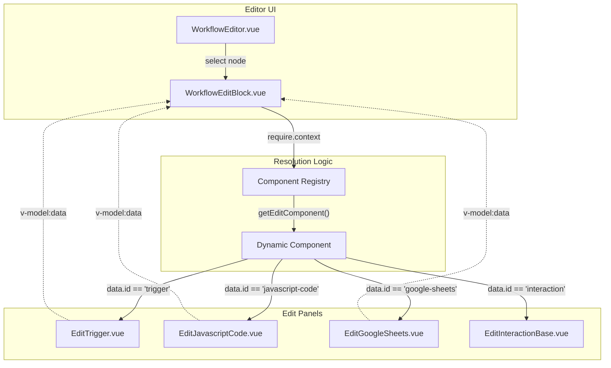
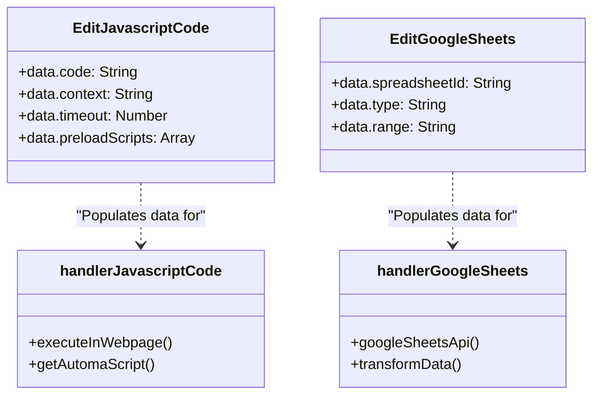

# Block Configuration Panels (Edit Components)

Relevant source files

The following files were used as context for generating this wiki page:

- [src/assets/images/default.png](src/assets/images/default.png)
- [src/assets/images/smooth-step.png](src/assets/images/smooth-step.png)
- [src/assets/images/step.png](src/assets/images/step.png)
- [src/assets/images/straight.png](src/assets/images/straight.png)
- [src/components/newtab/settings/jsBlockWrap.js](src/components/newtab/settings/jsBlockWrap.js)
- [src/components/newtab/shared/SharedCodemirror.vue](src/components/newtab/shared/SharedCodemirror.vue)
- [src/components/newtab/workflow/WorkflowBlockList.vue](src/components/newtab/workflow/WorkflowBlockList.vue)
- [src/components/newtab/workflow/WorkflowDetailsCard.vue](src/components/newtab/workflow/WorkflowDetailsCard.vue)
- [src/components/newtab/workflow/WorkflowEditBlock.vue](src/components/newtab/workflow/WorkflowEditBlock.vue)
- [src/components/newtab/workflow/edit/BlockSetting/BlockSettingLines.vue](src/components/newtab/workflow/edit/BlockSetting/BlockSettingLines.vue)
- [src/components/newtab/workflow/edit/BlockSetting/BlockSettingOnError.vue](src/components/newtab/workflow/edit/BlockSetting/BlockSettingOnError.vue)
- [src/components/newtab/workflow/edit/EditAiWorkflow.vue](src/components/newtab/workflow/edit/EditAiWorkflow.vue)
- [src/components/newtab/workflow/edit/EditAttributeValue.vue](src/components/newtab/workflow/edit/EditAttributeValue.vue)
- [src/components/newtab/workflow/edit/EditCloseTab.vue](src/components/newtab/workflow/edit/EditCloseTab.vue)
- [src/components/newtab/workflow/edit/EditCreateElement.vue](src/components/newtab/workflow/edit/EditCreateElement.vue)
- [src/components/newtab/workflow/edit/EditElementExists.vue](src/components/newtab/workflow/edit/EditElementExists.vue)
- [src/components/newtab/workflow/edit/EditForms.vue](src/components/newtab/workflow/edit/EditForms.vue)
- [src/components/newtab/workflow/edit/EditGetText.vue](src/components/newtab/workflow/edit/EditGetText.vue)
- [src/components/newtab/workflow/edit/EditGoogleSheets.vue](src/components/newtab/workflow/edit/EditGoogleSheets.vue)
- [src/components/newtab/workflow/edit/EditGoogleSheetsDrive.vue](src/components/newtab/workflow/edit/EditGoogleSheetsDrive.vue)
- [src/components/newtab/workflow/edit/EditInteractionBase.vue](src/components/newtab/workflow/edit/EditInteractionBase.vue)
- [src/components/newtab/workflow/edit/EditJavascriptCode.vue](src/components/newtab/workflow/edit/EditJavascriptCode.vue)
- [src/components/newtab/workflow/edit/EditLoopData.vue](src/components/newtab/workflow/edit/EditLoopData.vue)
- [src/components/newtab/workflow/edit/EditNewTab.vue](src/components/newtab/workflow/edit/EditNewTab.vue)
- [src/components/newtab/workflow/edit/EditProxy.vue](src/components/newtab/workflow/edit/EditProxy.vue)
- [src/components/newtab/workflow/edit/EditTakeScreenshot.vue](src/components/newtab/workflow/edit/EditTakeScreenshot.vue)
- [src/components/newtab/workflow/edit/EditTrigger.vue](src/components/newtab/workflow/edit/EditTrigger.vue)
- [src/components/newtab/workflow/edit/EditTriggerEvent.vue](src/components/newtab/workflow/edit/EditTriggerEvent.vue)
- [src/components/newtab/workflow/edit/EditWebhook.vue](src/components/newtab/workflow/edit/EditWebhook.vue)
- [src/components/newtab/workflow/settings/SettingsGeneral.vue](src/components/newtab/workflow/settings/SettingsGeneral.vue)
- [src/components/ui/UiExpand.vue](src/components/ui/UiExpand.vue)
- [src/components/ui/UiFileInput.vue](src/components/ui/UiFileInput.vue)
- [src/components/ui/UiInput.vue](src/components/ui/UiInput.vue)
- [src/components/ui/UiPaginatedSelect.vue](src/components/ui/UiPaginatedSelect.vue)
- [src/components/ui/UiTextarea.vue](src/components/ui/UiTextarea.vue)
- [src/content/blocksHandler/handlerAttributeValue.js](src/content/blocksHandler/handlerAttributeValue.js)
- [src/content/blocksHandler/handlerCreateElement.js](src/content/blocksHandler/handlerCreateElement.js)
- [src/content/services/webService.js](src/content/services/webService.js)
- [src/utils/getAIPoweredInfo.js](src/utils/getAIPoweredInfo.js)
- [src/utils/googleSheetsApi.js](src/utils/googleSheetsApi.js)
- [src/utils/openGDriveFilePicker.js](src/utils/openGDriveFilePicker.js)
- [src/workflowEngine/blocksHandler/handlerAiWorkflow.js](src/workflowEngine/blocksHandler/handlerAiWorkflow.js)
- [src/workflowEngine/blocksHandler/handlerGoogleSheets.js](src/workflowEngine/blocksHandler/handlerGoogleSheets.js)
- [src/workflowEngine/blocksHandler/handlerJavascriptCode.js](src/workflowEngine/blocksHandler/handlerJavascriptCode.js)

The Block Configuration Panels are a suite of specialized Vue components located in `src/components/newtab/workflow/edit/`. These components provide the user interface for modifying the internal data and behavior of individual blocks within the workflow editor.

## Dynamic Component Resolution

Automa utilizes a dynamic loading pattern to render the correct configuration panel when a user selects a block in the editor. This is primarily managed by `WorkflowEditBlock.vue`.

### Implementation Detail
The `WorkflowEditBlock` component uses Webpack's `require.context` to automatically register all components in the `./edit` directory that follow the naming convention `Edit*.vue` [src/components/newtab/workflow/WorkflowEditBlock.vue:43-56](). It also merges custom business-logic components from `@business/blocks/editComponents` [src/components/newtab/workflow/WorkflowEditBlock.vue:38-58]().

When a block is selected, the `getEditComponent` function determines which panel to display based on the block's `editComponent` property [src/components/newtab/workflow/WorkflowEditBlock.vue:137-142]().

### Data Flow: Editor to Panel
The configuration data flows through a `v-model:data` binding.
1. **Parent (`WorkflowEditBlock`)**: Maintains `blockData` as a computed property that emits an `update` event when the child panel modifies the data [src/components/newtab/workflow/WorkflowEditBlock.vue:84-91]().
2. **Child (`Edit*.vue`)**: Receives the `data` prop and emits `update:data` to push changes back up [src/components/newtab/workflow/edit/EditTrigger.vue:52-58]().

### Component Mapping Architecture
Title: Component Resolution Flow

Sources: [src/components/newtab/workflow/WorkflowEditBlock.vue:23-58](), [src/components/newtab/workflow/edit/EditTrigger.vue:52-58]()

---

## Key Configuration Panels

### 1. EditTrigger (`EditTrigger.vue`)
Used for the starting block of a workflow. It manages execution schedules and input parameters.
- **Triggers**: Opens a modal for `SharedWorkflowTriggers.vue` to configure intervals, CRON jobs, or specific dates [src/components/newtab/workflow/edit/EditTrigger.vue:33-42]().
- **Parameters**: Interfaces with `EditWorkflowParameters.vue` to define variables that users must provide when starting the workflow manually [src/components/newtab/workflow/edit/EditTrigger.vue:26-32]().

### 2. EditJavascriptCode (`EditJavascriptCode.vue`)
Provides a sophisticated environment for writing custom scripts.
- **CodeMirror Integration**: Uses `SharedCodemirror.vue` for syntax highlighting and autocompletion [src/components/newtab/workflow/edit/EditJavascriptCode.vue:81-86]().
- **Context Selection**: Allows choosing between `website` (content script) or `background` execution [src/components/newtab/workflow/edit/EditJavascriptCode.vue:19-37]().
- **Preload Scripts**: Users can add external JS libraries via URL to be loaded before the main script execution [src/components/newtab/workflow/edit/EditJavascriptCode.vue:118-146]().

### 3. EditGoogleSheets (`EditGoogleSheets.vue`)
Manages integration with Google Sheets API.
- **Action Types**: Supports `get`, `update`, `append`, `create`, `getRange`, and `add-sheet` [src/components/newtab/workflow/edit/EditGoogleSheets.vue:9-17]().
- **Validation**: `WorkflowEditBlock` performs a specific check for Google Sheets blocks to ensure `spreadsheetId` and `range` are present before closing the panel [src/components/newtab/workflow/WorkflowEditBlock.vue:93-128]().
- **Data Mapping**: Provides UI for mapping sheet rows to Automa variables or columns [src/components/newtab/workflow/edit/EditGoogleSheets.vue:186-203]().

### 4. EditLoopData (`EditLoopData.vue`)
Configures iteration logic.
- **Loop Sources**: Supports looping through `data-columns`, `numbers`, `google-sheets`, `variable`, `custom-data` (JSON/CSV), and `elements` (DOM) [src/components/newtab/workflow/edit/EditLoopData.vue:208-215]().
- **File Import**: Includes a `PapaParse` integration to convert CSV files into JSON for custom data loops [src/components/newtab/workflow/edit/EditLoopData.vue:183-184]().

### 5. EditInteractionBase (`EditInteractionBase.vue`)
A base component used by most DOM-interaction blocks (Click, Forms, Get Text).
- **Selector Engine**: Provides a toggle between `cssSelector` and `xpath` [src/components/newtab/workflow/edit/EditInteractionBase.vue:14-23]().
- **Element Selector**: Integrates `SharedElSelectorActions.vue` to trigger the visual element picker [src/components/newtab/workflow/edit/EditInteractionBase.vue:24-30]().
- **Wait Options**: Configures `waitForSelector` and associated timeouts [src/components/newtab/workflow/edit/EditInteractionBase.vue:75-89]().

---

## Logic Bridge: UI to Engine
The configuration defined in these panels directly populates the `data` object of a block, which is then consumed by the `WorkflowWorker` and its specific `blocksHandler`.

Title: Data Schema Bridge (Edit to Execution)

Sources: [src/workflowEngine/blocksHandler/handlerJavascriptCode.js:15-58](), [src/components/newtab/workflow/edit/EditJavascriptCode.vue:174-180](), [src/components/newtab/workflow/edit/EditGoogleSheets.vue:1-20]()

---

## Shared UI Utilities in Panels

The edit panels rely on several shared components to maintain consistency:

| Component | Purpose | File Reference |
| :--- | :--- | :--- |
| `SharedCodemirror` | Code editing with Automa API autocomplete. | [src/components/newtab/shared/SharedCodemirror.vue]() |
| `EditAutocomplete` | Provides a dropdown for variable/column selection within inputs. | [src/components/newtab/workflow/edit/EditAutocomplete.vue]() |
| `InsertWorkflowData` | Utility to inject expressions or variables into fields. | [src/components/newtab/workflow/edit/InsertWorkflowData.vue]() |
| `SharedElSelectorActions` | Buttons to start/stop the element picker and preview selectors. | [src/components/newtab/shared/SharedElSelectorActions.vue]() |

Sources: [src/components/newtab/workflow/edit/EditInteractionBase.vue:98-99](), [src/components/newtab/workflow/edit/EditJavascriptCode.vue:170-172](), [src/components/newtab/workflow/edit/EditLoopData.vue:185-186]()

---

