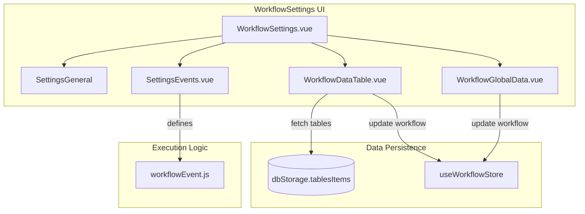
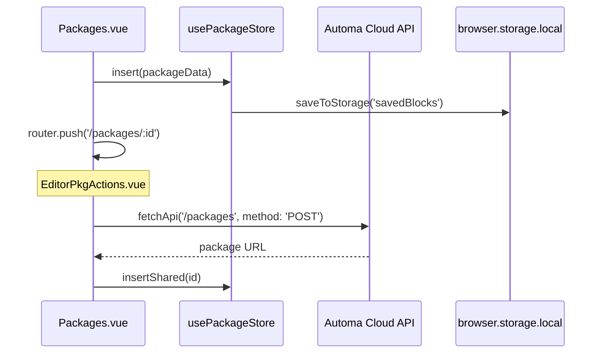
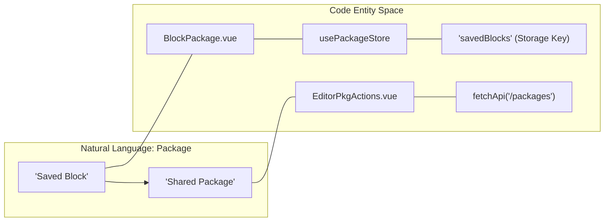

# Workflow Settings & Packages

Relevant source files

The following files were used as context for generating this wiki page:

- [src/components/block/BlockBasicWithFallback.vue](src/components/block/BlockBasicWithFallback.vue)
- [src/components/block/BlockPackage.vue](src/components/block/BlockPackage.vue)
- [src/components/newtab/package/PackageDetails.vue](src/components/newtab/package/PackageDetails.vue)
- [src/components/newtab/workflow/WorkflowDataTable.vue](src/components/newtab/workflow/WorkflowDataTable.vue)
- [src/components/newtab/workflow/WorkflowGlobalData.vue](src/components/newtab/workflow/WorkflowGlobalData.vue)
- [src/components/newtab/workflow/editor/EditorLocalSavedBlocks.vue](src/components/newtab/workflow/editor/EditorLocalSavedBlocks.vue)
- [src/components/newtab/workflow/editor/EditorPkgActions.vue](src/components/newtab/workflow/editor/EditorPkgActions.vue)
- [src/components/newtab/workflow/settings/SettingsEvents.vue](src/components/newtab/workflow/settings/SettingsEvents.vue)
- [src/components/newtab/workflow/settings/event/EventCodeAction.vue](src/components/newtab/workflow/settings/event/EventCodeAction.vue)
- [src/components/newtab/workflow/settings/event/EventCodeHTTP.vue](src/components/newtab/workflow/settings/event/EventCodeHTTP.vue)
- [src/components/ui/UiButton.vue](src/components/ui/UiButton.vue)
- [src/newtab/pages/Packages.vue](src/newtab/pages/Packages.vue)
- [src/sandbox/index.js](src/sandbox/index.js)
- [src/sandbox/utils/handleConditionCode.js](src/sandbox/utils/handleConditionCode.js)
- [src/sandbox/utils/handleJavascriptBlock.js](src/sandbox/utils/handleJavascriptBlock.js)
- [src/stores/package.js](src/stores/package.js)
- [src/workflowEngine/workflowEvent.js](src/workflowEngine/workflowEvent.js)

This section details the configuration layers for workflows and the modular Package system in Automa. It covers how global workflow behaviors are defined, how data is managed via internal or connected tables, and the architecture of the Package system which allows for modular block grouping and sharing.

## Workflow Settings

Workflow settings are managed through a series of components that allow users to define global data, connected storage, and event-triggered logic.

### Workflow Data & Tables
Workflows can manage data using two primary methods: `WorkflowGlobalData` for static/initial variables and `WorkflowDataTable` for structured row-based storage.

*   **Global Data**: Handled by `WorkflowGlobalData.vue`. It provides a JSON editor (via `SharedCodemirror`) to define a `globalData` object accessible throughout the workflow execution. It enforces a character limit of 10,000 [src/components/newtab/workflow/WorkflowGlobalData.vue:29-43]().
*   **Data Table**: Handled by `WorkflowDataTable.vue`. This component allows a workflow to either define its own local columns or connect to a centralized storage table from `dbStorage` [src/components/newtab/workflow/WorkflowDataTable.vue:2-57]().
    *   **Internal Table**: Columns are stored directly in the workflow object (`workflow.table`) [src/components/newtab/workflow/WorkflowDataTable.vue:199-203]().
    *   **Connected Table**: When `connectedTable` is set to a table ID, the workflow syncs its schema with that table from `dbStorage.tablesItems` [src/components/newtab/workflow/WorkflowDataTable.vue:169-180]().

### Event Settings
The `SettingsEvents.vue` component allows users to define logic that executes on specific workflow lifecycle events (e.g., `onFinish`, `onError`). These events can trigger HTTP requests or custom JavaScript snippets, managed by `EventCodeHTTP.vue` and `EventCodeAction.vue`.

**Workflow Settings Data Flow**

**Sources:** [src/components/newtab/workflow/WorkflowGlobalData.vue:1-46](), [src/components/newtab/workflow/WorkflowDataTable.vue:98-240](), [src/workflowEngine/workflowEvent.js:1-50]().

---

## The Package System

Packages are reusable modules containing a sub-graph of blocks. They allow users to encapsulate complex logic into a single "Block Package" node in the editor.

### BlockPackage Component
`BlockPackage.vue` is the visual representation of a package within the Workflow Editor. Unlike standard blocks, its inputs and outputs are dynamic, based on the `inputs` and `outputs` arrays defined within the package metadata [src/components/block/BlockPackage.vue:48-79]().

*   **Installation**: If a package is external (downloaded from the marketplace), the component provides an `installPackage` function that persists it to the local `packageStore` [src/components/block/BlockPackage.vue:133-139]().
*   **Synchronization**: When a package is updated in the store, `updatePackage` identifies existing connections in the editor and reconnects them to the new handles by matching handle IDs [src/components/block/BlockPackage.vue:163-174]().

### Package Management & Storage
Packages are stored in the `usePackageStore`, which maps to the `savedBlocks` key in `browser.storage.local` [src/stores/package.js:25-27]().

| Feature | Description |
| :--- | :--- |
| **Schema** | Defined by `defaultPackage` including `nodes`, `edges`, `inputs`, and `outputs` [src/stores/package.js:6-22](). |
| **CRUD** | `insert`, `update`, and `delete` actions handle local persistence [src/stores/package.js:43-73](). |
| **Sharing** | `loadShared` fetches packages authored by the user from the Automa API [src/stores/package.js:91-107](). |

### Editor Package Actions
`EditorPkgActions.vue` provides the interface for managing a package while it is open in the editor. It includes logic for:
*   **Sharing**: Toggling the `isPkgShared` state by calling the `/packages` POST/DELETE endpoints [src/components/newtab/workflow/editor/EditorPkgActions.vue:180-231]().
*   **Saving**: Converting the current VueFlow graph to a plain object using `editor.toObject()` and updating the store [src/components/newtab/workflow/editor/EditorPkgActions.vue:169-179]().

**Package Lifecycle Diagram**

**Sources:** [src/stores/package.js:1-110](), [src/components/block/BlockPackage.vue:96-179](), [src/components/newtab/workflow/editor/EditorPkgActions.vue:98-260]().

---

## Packages Management Page

The `Packages.vue` page serves as the dashboard for all saved and installed packages.

*   **Search & Filter**: Uses a `state.query` and `state.activeCat` to filter the packages list [src/newtab/pages/Packages.vue:48-64]().
*   **Import/Export**: Supports exporting packages as JSON files and importing them back into the store [src/newtab/pages/Packages.vue:23-32]().
*   **Local Saved Blocks**: In the workflow editor, the `EditorLocalSavedBlocks.vue` component provides a searchable drawer that allows users to drag-and-drop saved packages onto the canvas [src/components/newtab/workflow/editor/EditorLocalSavedBlocks.vue:27-36]().

### Package Update Logic
When a package definition changes (e.g., adding a new input handle), existing workflows using that package must be updated. `EditorLocalSavedBlocks.vue` contains `updatePackages(item)`, which:
1.  Finds all nodes in the current editor matching the package ID [src/components/newtab/workflow/editor/EditorLocalSavedBlocks.vue:184-187]().
2.  Calls `removeConnections` to clean up edges connected to handles that no longer exist [src/components/newtab/workflow/editor/EditorLocalSavedBlocks.vue:190-201]().
3.  Replaces the node data with the updated package definition [src/components/newtab/workflow/editor/EditorLocalSavedBlocks.vue:203]().

**Code Entity Association**

**Sources:** [src/newtab/pages/Packages.vue:1-193](), [src/components/newtab/workflow/editor/EditorLocalSavedBlocks.vue:149-206](), [src/stores/package.js:24-41]().

---

