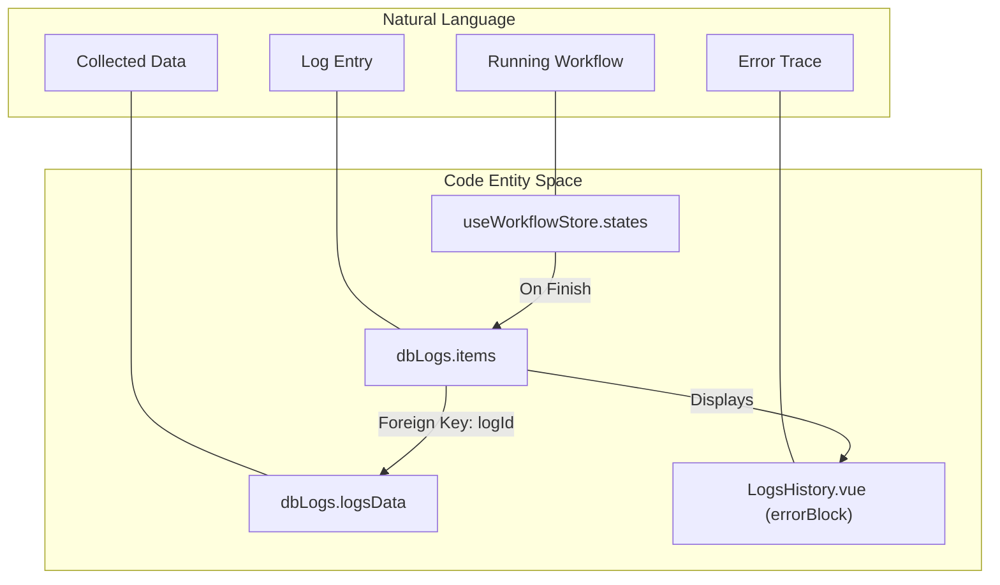
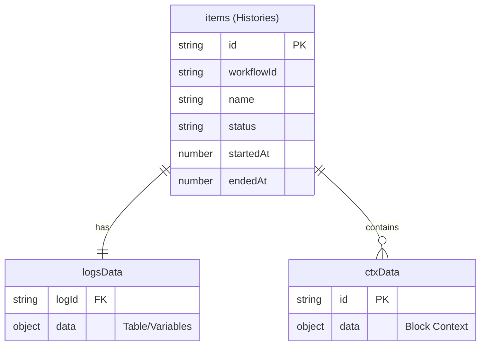

# Logs & Execution History

Relevant source files

The following files were used as context for generating this wiki page:

- [src/components/newtab/app/AppLogs.vue](src/components/newtab/app/AppLogs.vue)
- [src/components/newtab/app/AppLogsItem.vue](src/components/newtab/app/AppLogsItem.vue)
- [src/components/newtab/app/AppLogsItemRunning.vue](src/components/newtab/app/AppLogsItemRunning.vue)
- [src/components/newtab/app/AppLogsItems.vue](src/components/newtab/app/AppLogsItems.vue)
- [src/components/newtab/logs/LogsDataViewer.vue](src/components/newtab/logs/LogsDataViewer.vue)
- [src/components/newtab/logs/LogsFilters.vue](src/components/newtab/logs/LogsFilters.vue)
- [src/components/newtab/logs/LogsHistory.vue](src/components/newtab/logs/LogsHistory.vue)
- [src/components/newtab/logs/LogsVariables.vue](src/components/newtab/logs/LogsVariables.vue)
- [src/components/newtab/shared/SharedLogsTable.vue](src/components/newtab/shared/SharedLogsTable.vue)
- [src/components/ui/UiSelect.vue](src/components/ui/UiSelect.vue)
- [src/newtab/pages/logs/[id].vue](src/newtab/pages/logs/[id].vue)
- [src/newtab/pages/settings/SettingsBackup.vue](src/newtab/pages/settings/SettingsBackup.vue)
- [src/stores/workflow.js](src/stores/workflow.js)
- [src/utils/firstWorkflows.js](src/utils/firstWorkflows.js)

The Logs and Execution History system provides a comprehensive interface for monitoring active workflows and reviewing past executions. It bridges the Gap between the high-level dashboard and the low-level execution state stored in IndexedDB.

## Overview and Data Flow

Automa distinguishes between **Running States** (volatile, held in Pinia) and **Completed Logs** (persistent, stored in IndexedDB).

1.  **Execution Phase**: As a workflow runs, the `WorkflowEngine` emits events. These are captured and stored in the `useWorkflowStore` state array [src/stores/workflow.js:99-101]().
2.  **Persistence Phase**: Upon completion or if the "Save Log" setting [src/stores/workflow.js:51-51]() is enabled, data is moved from memory to the `dbLogs` database.
3.  **Visualization Phase**: The Dashboard components query both the Pinia store (for active runs) and `dbLogs` (for history) to present a unified view.

### Code Entity Bridge: Execution to UI

The following diagram maps natural language concepts to the specific code entities that handle them.

Title: Log System Entity Mapping

Sources: [src/stores/workflow.js:94-113](), [src/components/newtab/logs/LogsHistory.vue:15-42](), [src/components/newtab/logs/LogsDataViewer.vue:104-116]()

---

## Logs Dashboard Components

### LogsHistory
The primary viewer for a single execution's timeline. It displays a chronological list of blocks executed, their durations, and status messages [src/components/newtab/logs/LogsHistory.vue:85-111]().

*   **Jump to Error**: If a log ended in an error, the component identifies the `errorBlock` and provides a link to jump directly to that item in the list [src/components/newtab/logs/LogsHistory.vue:15-42]().
*   **Duration Calculation**: Uses `countDuration` utility to show time elapsed per block [src/components/newtab/logs/LogsHistory.vue:105-110]().
*   **Navigation**: Supports deep-linking back to the Workflow Editor at the specific block ID [src/components/newtab/logs/LogsHistory.vue:165-175]().

### SharedLogsTable
A reusable table component used in `AppLogsItems` and other views to list multiple log entries.

*   **Unified View**: Merges active states (running) and historical records (logs) into a single list [src/components/newtab/shared/SharedLogsTable.vue:10-69]().
*   **Execution Control**: Provides a "Stop" button that calls `RendererWorkflowService.stopWorkflowExecution` for active runs [src/components/newtab/shared/SharedLogsTable.vue:162-164]().

### LogsDataViewer
Handles the visualization of data collected during a run (Table rows and Variables).

*   **Data Retrieval**: Queries `dbLogs.logsData` using the `logId` [src/components/newtab/logs/LogsDataViewer.vue:104-105]().
*   **CodeMirror Integration**: Uses `SharedCodemirror` to display JSON data in a read-only, syntax-highlighted editor [src/components/newtab/logs/LogsDataViewer.vue:41-47]().
*   **Export**: Integrates `dataExporter` to allow downloading the log data as CSV, JSON, or TXT [src/components/newtab/logs/LogsDataViewer.vue:96-102]().

Sources: [src/components/newtab/logs/LogsHistory.vue:1-180](), [src/components/newtab/shared/SharedLogsTable.vue:1-130](), [src/components/newtab/logs/LogsDataViewer.vue:1-118]()

---

## Log Filtering and Management

The `LogsFilters` component provides the UI for querying the execution history.

| Filter Type | Implementation | Description |
| :--- | :--- | :--- |
| **Search** | `filters.query` | Filters by workflow name or log message [src/components/newtab/logs/LogsFilters.vue:3-10](). |
| **Status** | `filters.byStatus` | Filters by `success`, `error`, or `stopped` [src/components/newtab/logs/LogsFilters.vue:99-104](). |
| **Date Range** | `filters.byDate` | Filters logs from last 1, 7, or 30 days [src/components/newtab/logs/LogsFilters.vue:105-110](). |
| **Sort** | `sortsBuilder` | Sorts by `name` or `startedAt` (ascending/descending) [src/components/newtab/logs/LogsFilters.vue:111-114](). |

Sources: [src/components/newtab/logs/LogsFilters.vue:1-123]()

---

## Database Schema (`dbLogs`)

The log system relies on a dedicated Dexie IndexedDB instance named `dbLogs`.

Title: dbLogs Schema and Relationships

*   **`items`**: Stores metadata for each execution (run duration, final status) [src/components/newtab/app/AppLogsItems.vue:159-159]().
*   **`logsData`**: Stores the actual output of the workflow (the "Table" and "Variables" snapshots) [src/components/newtab/logs/LogsDataViewer.vue:105-105]().
*   **`ctxData`**: Stores the execution context for individual blocks within a log, allowing the `LogsHistory` to show detailed block-level inputs/outputs [src/components/newtab/logs/LogsHistory.vue:89-89]().

Sources: [src/components/newtab/logs/LogsDataViewer.vue:104-116](), [src/components/newtab/app/AppLogsItems.vue:139-159](), [src/components/newtab/logs/LogsHistory.vue:85-95]()

---

## Backup and Synchronization

Logs can be included in the extension's backup system.

*   **Cloud/Local Backup**: The `SettingsBackup.vue` component allows users to export their configuration. While workflows are the primary focus, the system supports including related data [src/newtab/pages/settings/SettingsBackup.vue:98-116]().
*   **Automatic Backup**: Users can schedule backups (via `BACKUP_SCHEDULES`) which may trigger downloads of the workflow state and associated history [src/newtab/pages/settings/SettingsBackup.vue:134-147]().

Sources: [src/newtab/pages/settings/SettingsBackup.vue:1-180]()

---

