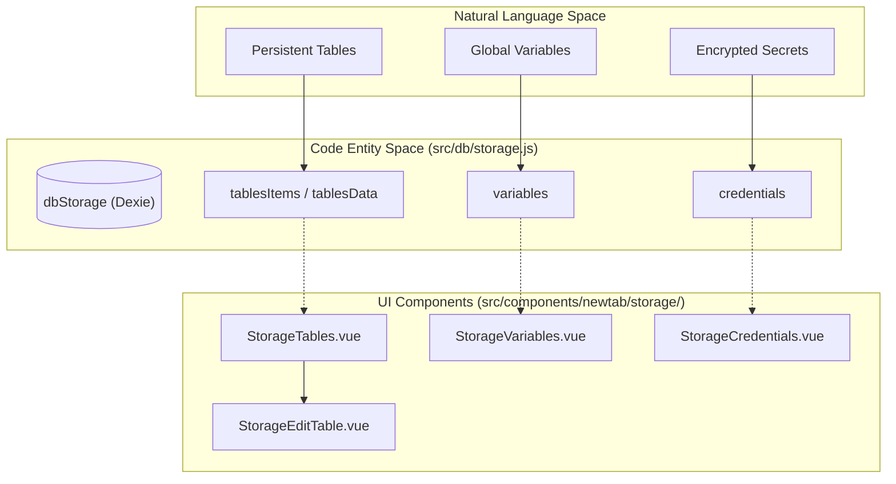
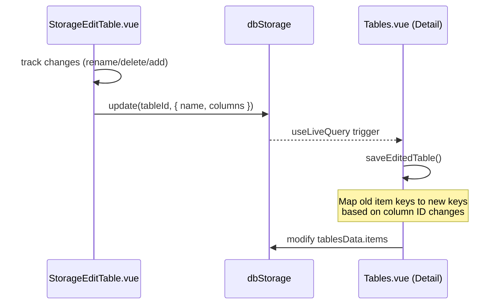

# Storage, Tables & Credentials

Relevant source files

The following files were used as context for generating this wiki page:

- [src/components/newtab/logs/LogsTable.vue](src/components/newtab/logs/LogsTable.vue)
- [src/components/newtab/storage/StorageCredentials.vue](src/components/newtab/storage/StorageCredentials.vue)
- [src/components/newtab/storage/StorageEditTable.vue](src/components/newtab/storage/StorageEditTable.vue)
- [src/components/newtab/storage/StorageTables.vue](src/components/newtab/storage/StorageTables.vue)
- [src/components/newtab/storage/StorageVariables.vue](src/components/newtab/storage/StorageVariables.vue)
- [src/components/newtab/workflow/edit/Parameter/ParameterJsonValue.vue](src/components/newtab/workflow/edit/Parameter/ParameterJsonValue.vue)
- [src/components/newtab/workflow/editor/EditorUsedCredentials.vue](src/components/newtab/workflow/editor/EditorUsedCredentials.vue)
- [src/components/ui/UiTable.vue](src/components/ui/UiTable.vue)
- [src/newtab/pages/Storage.vue](src/newtab/pages/Storage.vue)
- [src/newtab/pages/storage/Tables.vue](src/newtab/pages/storage/Tables.vue)
- [src/utils/codeEditorAutocomplete.js](src/utils/codeEditorAutocomplete.js)

The Storage subsystem in Automa provides a persistent data layer for workflows to store, retrieve, and reference structured data, global variables, and sensitive credentials. It is built on top of IndexedDB using the Dexie.js wrapper to manage local storage within the browser extension context.

## Overview & Architecture

The Storage dashboard is the central interface for managing three distinct data types: **Tables**, **Variables**, and **Credentials** [src/newtab/pages/Storage.vue:17-25](). It leverages a reactive data flow where the UI components use the `useLiveQuery` composable to synchronize with the underlying `dbStorage` Dexie instance [src/newtab/pages/storage/Tables.vue:90-111]().

### Storage System Mapping

The following diagram maps the Natural Language concepts to the specific Code Entities that implement them.

**Concept to Code Entity Mapping**

Sources: [src/newtab/pages/Storage.vue:41-43](), [src/db/storage.js:1-10](), [src/newtab/pages/storage/Tables.vue:95-111]()

---

## Tables Management

Tables allow users to store structured data in rows and columns. Unlike standard logs, Tables are persistent across multiple workflow runs and can be modified by the "Insert Data" or "Update Data" blocks.

### Data Structure
Table data is split into two Dexie stores to optimize performance:
1.  **`tablesItems`**: Stores metadata including `name`, `columns` definition (id, name, type), `rowsCount`, and timestamps [src/components/newtab/storage/StorageTables.vue:129-135]().
2.  **`tablesData`**: Stores the actual row content in an `items` array and a `columnsIndex` for mapping column IDs to their respective data keys [src/components/newtab/storage/StorageTables.vue:136-140]().

### Table Operations Flow
The `StorageEditTable.vue` component handles the creation and schema modification of tables. It uses `vuedraggable` for column reordering [src/components/newtab/storage/StorageEditTable.vue:30-36]().

**Table Schema Update Logic**

Sources: [src/newtab/pages/storage/Tables.vue:152-209](), [src/components/newtab/storage/StorageEditTable.vue:113-139]()

---

## Global Variables

Variables provide a flat key-value store for data that needs to be shared across different workflows or persisted between executions of the same workflow.

-   **Data Type**: Values are stored as parsed JSON. If a user enters a JSON string in the UI, it is converted to an object before saving [src/components/newtab/storage/StorageVariables.vue:137-151]().
-   **Validation**: The system prevents duplicate variable names [src/components/newtab/storage/StorageVariables.vue:128-135]().
-   **Usage**: Variables are referenced in workflows using the `{{variables@name}}` syntax.

Sources: [src/components/newtab/storage/StorageVariables.vue:72-158]()

---

## Credentials & Secrets

Credentials are a specialized storage type for sensitive information (API keys, passwords).

### Security & Encryption
-   **Encryption**: Values are encrypted before being stored in IndexedDB using `credentialUtil.encrypt(value)` [src/components/newtab/storage/StorageCredentials.vue:129-136]().
-   **UI Masking**: In the `StorageCredentials.vue` table, the actual value is never displayed; it is masked with asterisks [src/components/newtab/storage/StorageCredentials.vue:25]().

### Workflow Integration
Workflows reference credentials using `{{secrets@name}}`. The `EditorUsedCredentials.vue` component scans the workflow nodes for these regex patterns (`/\{\{\s*secrets@(.*?)\}\}/`) to show a list of used secrets in the editor sidebar [src/components/newtab/workflow/editor/EditorUsedCredentials.vue:71-96]().

Sources: [src/components/newtab/storage/StorageCredentials.vue:129-136](), [src/components/newtab/workflow/editor/EditorUsedCredentials.vue:71-84]()

---

## UI Components

### UiTable (`src/components/ui/UiTable.vue`)
A reusable component used across the Storage dashboard for displaying lists of tables, variables, and credentials.
-   **Pagination**: Supports client-side pagination with configurable `perPage` [src/components/ui/UiTable.vue:56-81]().
-   **Sorting**: Uses `arraySorter` utility to handle column-based sorting [src/components/ui/UiTable.vue:132-146]().
-   **Filtering**: Implements a `filteredItems` computed property that searches across all columns marked as `filterable` [src/components/ui/UiTable.vue:147-166]().

### StorageEditTable (`src/components/newtab/storage/StorageEditTable.vue`)
A modal-based editor for table schemas.
-   **Column Management**: Users can add columns with types: `string`, `number`, `boolean`, `date`, or `any` [src/components/newtab/storage/StorageEditTable.vue:158-162]().
-   **Change Tracking**: It maintains a `changes` object to record renames or deletions, which is then used by the parent to migrate existing row data [src/components/newtab/storage/StorageEditTable.vue:113-139]().

Sources: [src/components/ui/UiTable.vue:85-166](), [src/components/newtab/storage/StorageEditTable.vue:83-163]()

---

## Data Export

The storage system supports exporting table data into multiple formats (JSON, CSV, etc.) via the `dataExporter` utility.

-   **Implementation**: `Tables.vue` and `LogsTable.vue` both utilize the `dataExportTypes` constant and the `dataExporter` function [src/newtab/pages/storage/Tables.vue:145-151](), [src/components/newtab/logs/LogsTable.vue:93-99]().
-   **Scope**: Exports the entire `items` array from the `tablesData` store [src/newtab/pages/storage/Tables.vue:147]().

Sources: [src/newtab/pages/storage/Tables.vue:93-96](), [src/utils/dataExporter.js:1-10]()

---

