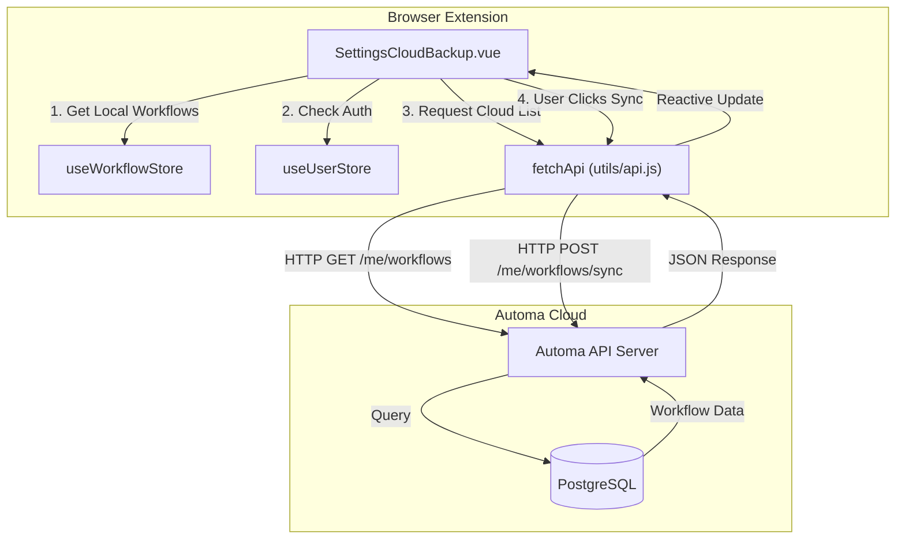
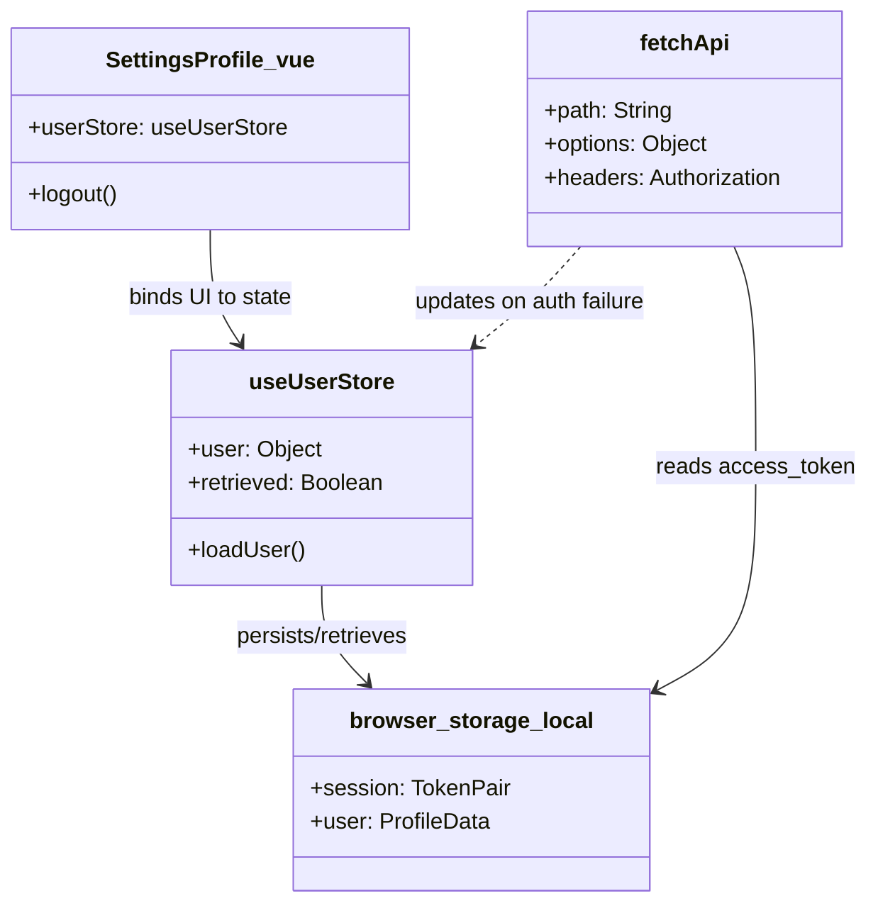

# Settings & User Profile

Relevant source files

The following files were used as context for generating this wiki page:

- [.gitignore](.gitignore)
- [src/components/newtab/app/AppSidebar.vue](src/components/newtab/app/AppSidebar.vue)
- [src/components/newtab/logs/LogsVariables.vue](src/components/newtab/logs/LogsVariables.vue)
- [src/components/newtab/settings/SettingsCloudBackup.vue](src/components/newtab/settings/SettingsCloudBackup.vue)
- [src/components/newtab/shared/SharedPermissionsModal.vue](src/components/newtab/shared/SharedPermissionsModal.vue)
- [src/components/newtab/workflow/WorkflowShareTeam.vue](src/components/newtab/workflow/WorkflowShareTeam.vue)
- [src/components/newtab/workflow/editor/EditorCustomEdge.vue](src/components/newtab/workflow/editor/EditorCustomEdge.vue)
- [src/components/newtab/workflows/WorkflowsUserTeam.vue](src/components/newtab/workflows/WorkflowsUserTeam.vue)
- [src/components/ui/UiSelect.vue](src/components/ui/UiSelect.vue)
- [src/composable/shortcut.js](src/composable/shortcut.js)
- [src/manifest.chrome.dev.json](src/manifest.chrome.dev.json)
- [src/newtab/pages/Settings.vue](src/newtab/pages/Settings.vue)
- [src/newtab/pages/settings/SettingsAbout.vue](src/newtab/pages/settings/SettingsAbout.vue)
- [src/newtab/pages/settings/SettingsBackup.vue](src/newtab/pages/settings/SettingsBackup.vue)
- [src/newtab/pages/settings/SettingsEditor.vue](src/newtab/pages/settings/SettingsEditor.vue)
- [src/newtab/pages/settings/SettingsIndex.vue](src/newtab/pages/settings/SettingsIndex.vue)
- [src/newtab/pages/settings/SettingsProfile.vue](src/newtab/pages/settings/SettingsProfile.vue)
- [src/newtab/pages/workflows/Shared.vue](src/newtab/pages/workflows/Shared.vue)
- [src/newtab/router.js](src/newtab/router.js)
- [src/stores/hostedWorkflow.js](src/stores/hostedWorkflow.js)
- [src/stores/main.js](src/stores/main.js)
- [src/stores/sharedWorkflow.js](src/stores/sharedWorkflow.js)
- [src/stores/teamWorkflow.js](src/stores/teamWorkflow.js)
- [src/stores/user.js](src/stores/user.js)
- [src/stores/workflow.js](src/stores/workflow.js)
- [src/utils/api.js](src/utils/api.js)
- [src/utils/firstWorkflows.js](src/utils/firstWorkflows.js)
- [src/utils/workflowData.js](src/utils/workflowData.js)

The Settings and User Profile section manages the global configuration of the Automa extension, including appearance, data persistence (backups), editor behavior, and user authentication. These settings are primarily managed through the `main` Pinia store and persisted in the browser's local storage.

## General Settings

The general settings allow users to configure the extension's appearance and basic behavior. This is implemented in `SettingsIndex.vue` [src/newtab/pages/settings/SettingsIndex.vue:1-91]().

### Configuration Parameters
- **Theme**: Users can select between Light, Dark, and System themes. The `useTheme` composable handles the application of CSS classes to the document root [src/newtab/pages/settings/SettingsIndex.vue:103-110]().
- **Language**: Controls the i18n locale. Changing the locale updates the `settings.locale` property in the `main` store, which triggers a reactive update across the UI using `vue-i18n` [src/newtab/pages/settings/SettingsIndex.vue:111-115]().
- **Log Management**:
    - `deleteLogAfter`: Determines the retention period for workflow logs (e.g., 7, 14, 30 days, or "never") [src/newtab/pages/settings/SettingsIndex.vue:61-71]().
    - `logsLimit`: Sets a maximum count for logs stored in IndexedDB to prevent storage bloat [src/newtab/pages/settings/SettingsIndex.vue:81-89]().

**Sources:** [src/newtab/pages/settings/SettingsIndex.vue:1-117](), [src/stores/main.js:18-31]()

---

## Editor Preferences

The Workflow Editor has its own set of preferences that dictate how the visual graph behaves. These are stored within the `settings.editor` object in the `main` store [src/stores/main.js:22-30]().

| Setting | Code Property | Description |
| --- | --- | --- |
| Zoom Range | `minZoom`, `maxZoom` | Constraints for the VueFlow canvas zoom level. |
| Snap to Grid | `snapToGrid` | Boolean to enable/disable node snapping. |
| Grid Size | `snapGrid` | Array defining [x, y] grid intervals (default: 15x15). |
| Connection Type | `lineType` | Determines the visual style of edges (e.g., bezier, straight, step). |
| Auto-save | `saveWhenExecute` | Automatically saves the workflow state before a run is initiated. |

**Sources:** [src/stores/main.js:22-30](), [src/newtab/pages/settings/SettingsEditor.vue:1-50]()

---

## Backup & Synchronization

Automa provides two primary methods for data persistence: Local JSON backups and Cloud synchronization.

### Local Backup (AES Encryption)
Users can export their entire library or specific workflows to a `.automa.json` file.
- **Encryption**: If enabled, the exported data is encrypted.
- **Inclusions**: The backup can optionally include storage tables, variables, and credentials [src/newtab/pages/settings/SettingsBackup.vue:98-117]().
- **Scheduling**: Automated local backups can be scheduled using Cron expressions or predefined intervals (Daily, Weekly). This utilizes the `downloads` permission to save files to the user's disk automatically [src/newtab/pages/settings/SettingsBackup.vue:121-165]().

### Cloud Backup
Cloud synchronization connects the local extension to the Automa API.
- **Implementation**: Managed by `SettingsCloudBackup.vue` [src/components/newtab/settings/SettingsCloudBackup.vue:1-152]().
- **Data Flow**:
    1. The client fetches the list of cloud-stored workflows via `fetchApi('/me/workflows')` [src/utils/api.js:110-156]().
    2. Local workflows are compared against cloud records using their unique IDs [src/components/newtab/settings/SettingsCloudBackup.vue:187-196]().
    3. Users can "Push" (upload) local changes to the cloud or "Pull" (sync) cloud versions to local storage [src/components/newtab/settings/SettingsCloudBackup.vue:82-96]().

### Data Flow Diagram: Cloud Sync
The following diagram illustrates the interaction between the UI, Pinia stores, and the external API.

**Sources:** [src/components/newtab/settings/SettingsCloudBackup.vue:153-214](), [src/utils/api.js:5-42](), [src/stores/workflow.js:105-113]()

---

## Shortcuts Configuration

Automa uses the `Mousetrap` library to handle keyboard shortcuts. Shortcuts are categorized into Page navigation (e.g., opening logs), Actions (e.g., search), and Editor-specific commands [src/composable/shortcut.js:6-59]().

### Implementation Detail
- **Default Shortcuts**: Defined in `src/composable/shortcut.js`.
- **Customization**: User-defined shortcuts are stored in `localStorage` under the key `shortcuts` and merged with defaults using `defu` [src/composable/shortcut.js:60-62]().
- **OS Awareness**: The `getReadableShortcut` function converts generic keys (like `mod` or `option`) into OS-specific symbols (⌘ for Mac, Ctrl for Windows) [src/composable/shortcut.js:64-82]().

**Sources:** [src/composable/shortcut.js:1-145](), [src/newtab/pages/settings/SettingsShortcuts.vue:1-40]()

---

## Profile & Authentication

User identity and API access are managed via the `useUserStore`.

### Authentication Flow
1. **Sign In**: Redirects the user to `extension.automa.site/auth` [src/newtab/pages/settings/SettingsBackup.vue:51]().
2. **Session Storage**: Upon successful login, a `session` object (containing `access_token` and `refresh_token`) is stored in `browser.storage.local` [src/utils/api.js:12-14]().
3. **Token Refresh**: The `fetchApi` utility automatically checks if the token is expired (using `session.expires_at`). If expired, it calls the refresh endpoint before proceeding with the original request [src/utils/api.js:20-31]().

### System Entity Mapping
The diagram below maps UI components to their underlying store and API entities.

**Sources:** [src/utils/api.js:5-42](), [src/stores/user.js:1-50](), [src/newtab/pages/settings/SettingsProfile.vue:1-60]()

---

## About Page

The About page provides metadata about the extension.
- **Version**: Retrieved dynamically via `browser.runtime.getManifest().version` [src/newtab/app/AppSidebar.vue:121]().
- **Links**: Provides navigation to documentation, GitHub repository, and community forums (Discord, Twitter) [src/newtab/app/AppSidebar.vue:74-93]().
- **Update Check**: Links to the official site to check for the latest features or plan upgrades.

**Sources:** [src/newtab/pages/settings/SettingsAbout.vue:1-30](), [src/newtab/app/AppSidebar.vue:121-159]()

---

