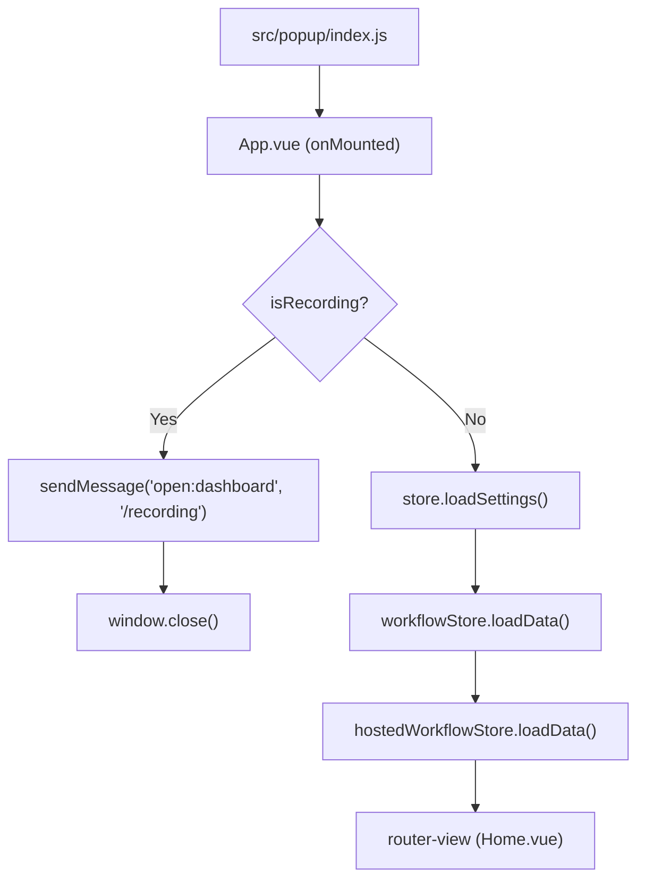
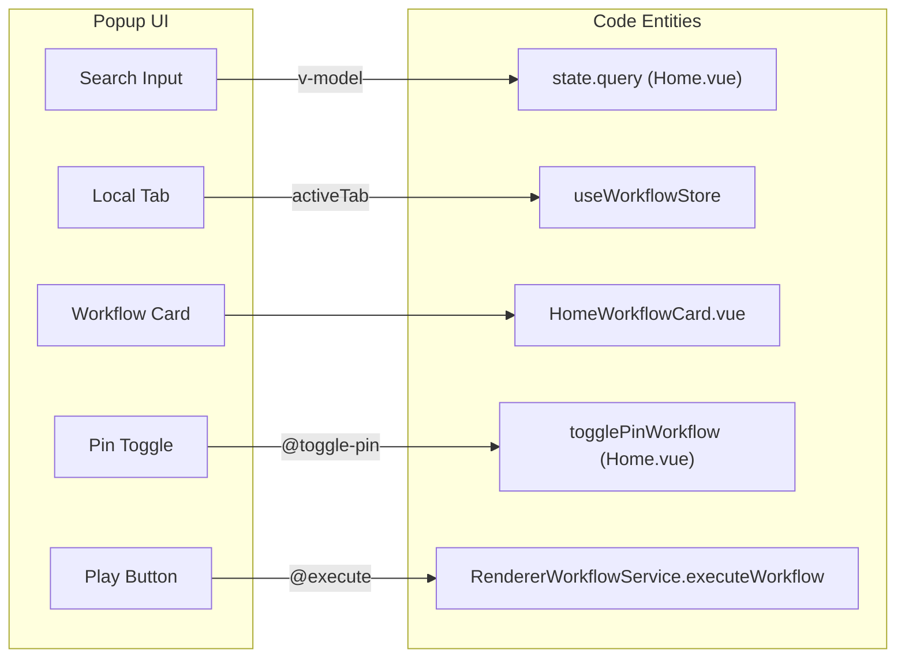

# Popup Interface

Relevant source files

The following files were used as context for generating this wiki page:

- [src/components/newtab/shared/SharedCard.vue](src/components/newtab/shared/SharedCard.vue)
- [src/components/newtab/workflows/WorkflowsHosted.vue](src/components/newtab/workflows/WorkflowsHosted.vue)
- [src/components/newtab/workflows/WorkflowsShared.vue](src/components/newtab/workflows/WorkflowsShared.vue)
- [src/components/popup/home/HomeTeamWorkflows.vue](src/components/popup/home/HomeTeamWorkflows.vue)
- [src/components/popup/home/HomeWorkflowCard.vue](src/components/popup/home/HomeWorkflowCard.vue)
- [src/locales/en/common.json](src/locales/en/common.json)
- [src/newtab/pages/Workflows.vue](src/newtab/pages/Workflows.vue)
- [src/popup/App.vue](src/popup/App.vue)
- [src/popup/index.html](src/popup/index.html)
- [src/popup/index.js](src/popup/index.js)
- [src/popup/pages/Home.vue](src/popup/pages/Home.vue)
- [src/popup/router.js](src/popup/router.js)

The Popup Interface is the primary entry point for users to interact with Automa without opening the full dashboard. It provides a compact view for searching, managing, and executing workflows, as well as quick access to the Element Selector and the recording system.

## Entry Point and Initialization

The popup is a Vue SPA initialized in `src/popup/index.js` [src/popup/index.js:1-18](). It uses a dedicated router [src/popup/router.js:4-10]() and mounts onto `src/popup/index.html` [src/popup/index.html:1-12]().

The root component `App.vue` handles the initial data hydration and recording detection:
- **Recording Detection**: On startup, it checks `browser.storage.local` for the `isRecording` flag. If true, it immediately redirects the user to the dashboard's recording page and closes the popup [src/popup/App.vue:22-28]().
- **Data Hydration**: It loads user settings, localizes the UI using `vue-i18n`, and populates the `workflowStore` and `hostedWorkflowStore` before rendering the main view [src/popup/App.vue:30-44]().

### Popup Initialization Flow

Sources: [src/popup/App.vue:22-44](), [src/popup/index.js:12-18]()

## Home View and Workflow Management

The `Home.vue` component serves as the main interface. It organizes workflows into three primary tabs: **Local**, **Host** (hosted workflows), and **Team** [src/popup/pages/Home.vue:51-65]().

### Workflow Listing and Organization
- **Search & Filter**: Users can search workflows by name [src/popup/pages/Home.vue:43-50]() and filter them by Folder [src/popup/pages/Home.vue:111-120]().
- **Sorting**: Workflows can be sorted by Name, Created Date, Last Update, or Most Used in ascending/descending order [src/popup/pages/Home.vue:121-144]().
- **Pinned Workflows**: Workflows marked as pinned are displayed in a dedicated section at the top of the list for quick access [src/popup/pages/Home.vue:87-106]().

### Quick Actions
The header provides three critical utility buttons:
1.  **Recording Info**: Links to documentation regarding workflow recording [src/popup/pages/Home.vue:13-22]().
2.  **Element Selector**: Triggers `initElementSelector` to start the visual picker on the active tab [src/popup/pages/Home.vue:23-32]().
3.  **Dashboard**: Opens the full Automa dashboard [src/popup/pages/Home.vue:33-40]().

For details on the execution logic and folder navigation, see [Popup Home & Workflow Execution](#6.1).

Sources: [src/popup/pages/Home.vue:10-158]()

## Workflow Cards

Individual workflows are rendered using specialized card components depending on their type.

| Component | Usage | Key Features |
|---|---|---|
| `HomeWorkflowCard` | Local and Hosted workflows in Popup | Pinning, renaming, deleting, and execution toggle [src/components/popup/home/HomeWorkflowCard.vue:30-59](). |
| `HomeTeamWorkflows` | Team workflows in Popup | Displays team-specific tags and handles team-scoped execution [src/components/popup/home/HomeTeamWorkflows.vue:1-30](). |
| `SharedCard` | Shared/Hosted workflows in Dashboard | High-level preview with icon support and description [src/components/newtab/shared/SharedCard.vue:1-70](). |

### Entity Mapping: Popup UI to Code

Sources: [src/popup/pages/Home.vue:44](), [src/popup/pages/Home.vue:92-105](), [src/components/popup/home/HomeWorkflowCard.vue:15](), [src/service/renderer/RendererWorkflowService.js]()

## Workflow Execution Flow

When a user clicks the execute (play) button on a workflow card, the popup initiates the execution pipeline.

1.  **Local/Hosted Workflows**: These use `RendererWorkflowService.executeWorkflow(workflow)` [src/components/newtab/workflows/WorkflowsHosted.vue:7](). This service acts as a bridge, communicating with the background script to start the engine.
2.  **Team Workflows**: These send a direct message `workflow:execute` to the background script [src/components/popup/home/HomeTeamWorkflows.vue:62-64]().
3.  **Parameters**: If a workflow defines variables or requires input, the interface may transition to a parameter collection state before the engine starts.

For details on how parameters are collected and passed to the engine, see [Workflow Parameters & Runtime Input](#6.2).

Sources: [src/components/popup/home/HomeWorkflowCard.vue:15](), [src/components/popup/home/HomeTeamWorkflows.vue:62-64](), [src/service/renderer/RendererWorkflowService.js]()

## Child Pages
- [Popup Home & Workflow Execution](#6.1): Deep dive into search, sorting, folder management, and the `RendererWorkflowService` bridge.
- [Workflow Parameters & Runtime Input](#6.2): Details on the parameter collection window and mid-run `Parameter Prompt` blocks.

---

