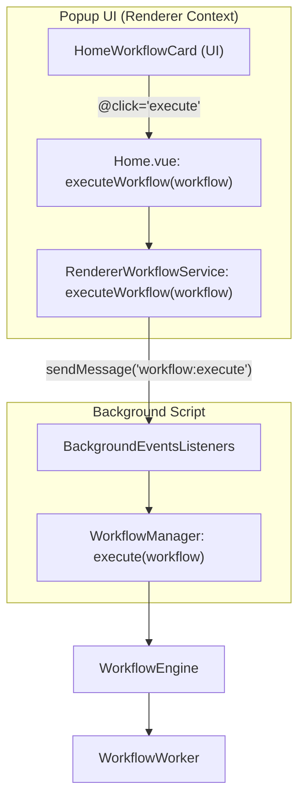
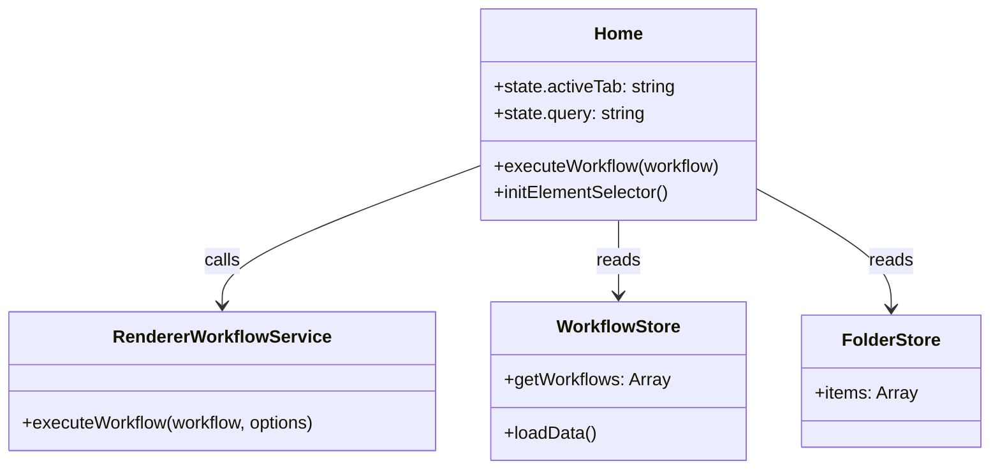

# Popup Home & Workflow Execution

Relevant source files

The following files were used as context for generating this wiki page:

- [src/components/newtab/workflows/WorkflowsLocal.vue](src/components/newtab/workflows/WorkflowsLocal.vue)
- [src/components/popup/home/HomeWorkflowCard.vue](src/components/popup/home/HomeWorkflowCard.vue)
- [src/newtab/pages/workflows/index.vue](src/newtab/pages/workflows/index.vue)
- [src/popup/App.vue](src/popup/App.vue)
- [src/popup/index.html](src/popup/index.html)
- [src/popup/index.js](src/popup/index.js)
- [src/popup/pages/Home.vue](src/popup/pages/Home.vue)
- [src/popup/router.js](src/popup/router.js)

The Automa popup serves as the primary quick-access interface for users to trigger workflows, manage pinned automations, and navigate to the dashboard. It is a Vue-based Single Page Application (SPA) that communicates with the background script to initiate execution.

## Popup Lifecycle & Initialization

The popup entry point is `src/popup/index.js`, which mounts `App.vue` [src/popup/index.js:12-18](). Upon mounting, `App.vue` performs several critical checks:

1.  **Recording Detection**: It checks `browser.storage.local` for an `isRecording` flag. If true, it immediately redirects the user to the dashboard's recording page and closes the popup [src/popup/App.vue:22-28]().
2.  **Data Hydration**: It loads user settings, localizes the UI using `vueI18n`, and hydrates the `workflowStore` and `hostedWorkflowStore` from IndexedDB [src/popup/App.vue:30-44]().
3.  **Routing**: It uses `vue-router` to navigate to the `Home.vue` page by default [src/popup/router.js:4-10]().

### Component Architecture
The Home page is composed of specialized components for different workflow sources:
- `Home.vue`: The main container managing search, sorting, and tabs [src/popup/pages/Home.vue:1-182]().
- `HomeWorkflowCard.vue`: Individual workflow items providing execution and management actions [src/components/popup/home/HomeWorkflowCard.vue:1-60]().
- `HomeTeamWorkflows.vue`: Dedicated view for workflows shared within teams [src/popup/pages/Home.vue:67-71]().

Sources: [src/popup/index.js:1-18](), [src/popup/App.vue:22-44](), [src/popup/router.js:4-10](), [src/popup/pages/Home.vue:1-182]().

## Workflow Management & Navigation

The Home page provides a multi-tabbed interface to filter workflows based on their storage location: **Local**, **Hosted**, and **Team** [src/popup/pages/Home.vue:58-65]().

### Search, Sort, and Filter
Users can organize their workflows through several mechanisms:
- **Search**: A text input bound to `state.query` filters the visible workflows by name [src/popup/pages/Home.vue:43-50]().
- **Folders**: A `ui-select` dropdown allows filtering workflows by their assigned folder via `folderStore` [src/popup/pages/Home.vue:111-120]().
- **Sorting**: Workflows can be sorted by various criteria (e.g., name, date created) in ascending or descending order using the `arraySorter` utility [src/popup/pages/Home.vue:121-145]().

### Pinned Workflows
Workflows marked as "pinned" are hoisted to a dedicated section at the top of the list for immediate access [src/popup/pages/Home.vue:87-106](). This state is managed via `state.pinnedWorkflows` within the component [src/popup/pages/Home.vue:151]().

### Workflow Actions
Each `HomeWorkflowCard` emits events that trigger specific management functions:
| Action | Function | Description |
| :--- | :--- | :--- |
| `execute` | `executeWorkflow` | Starts the workflow execution engine. |
| `details` | `openWorkflowPage` | Opens the workflow editor in the dashboard. |
| `rename` | `renameWorkflow` | Opens a dialog to change the workflow name locally. |
| `delete` | `deleteWorkflow` | Removes the workflow from storage after confirmation. |
| `toggle-pin`| `togglePinWorkflow`| Adds/removes the workflow ID from the pinned list. |

Sources: [src/popup/pages/Home.vue:43-158](), [src/components/popup/home/HomeWorkflowCard.vue:71-77]().

## Workflow Execution Flow

Execution from the popup is bridged to the background engine through the `RendererWorkflowService`.

### Execution Bridge Diagram
This diagram illustrates how a user interaction in the `HomeWorkflowCard` traverses the service layer to reach the `WorkflowManager` in the background.

Sources: [src/popup/pages/Home.vue:101](), [src/components/popup/home/HomeWorkflowCard.vue:15](), [src/service/renderer/RendererWorkflowService.js]().

### The Execution Process
When `executeWorkflow` is called:
1.  **Permission Check**: The system verifies if the workflow requires optional browser permissions [src/utils/workflowData.js]().
2.  **Parameter Collection**: If the workflow has variables defined as "parameters", the popup may trigger a parameter input window (covered in section 6.2).
3.  **Background Dispatch**: `RendererWorkflowService` sends a message to the background script.
4.  **UI Feedback**: The popup provides a visual cue or closes if the workflow is set to run in the background.

## UI Components & Services

The popup relies on several shared services and stores to maintain state and provide functionality.

### Key Data Entities

### Element Selector Integration
The popup includes a button to initialize the **Element Selector** [src/popup/pages/Home.vue:33](). This calls `initElementSelectorFunc`, which injects the selection logic into the active tab, allowing users to pick DOM elements without opening the full dashboard [src/popup/pages/Home.vue:29-32]().

Sources: [src/popup/pages/Home.vue:23-41](), [src/service/renderer/RendererWorkflowService.js](), [src/stores/workflow.js](), [src/stores/folder.js]().

---

