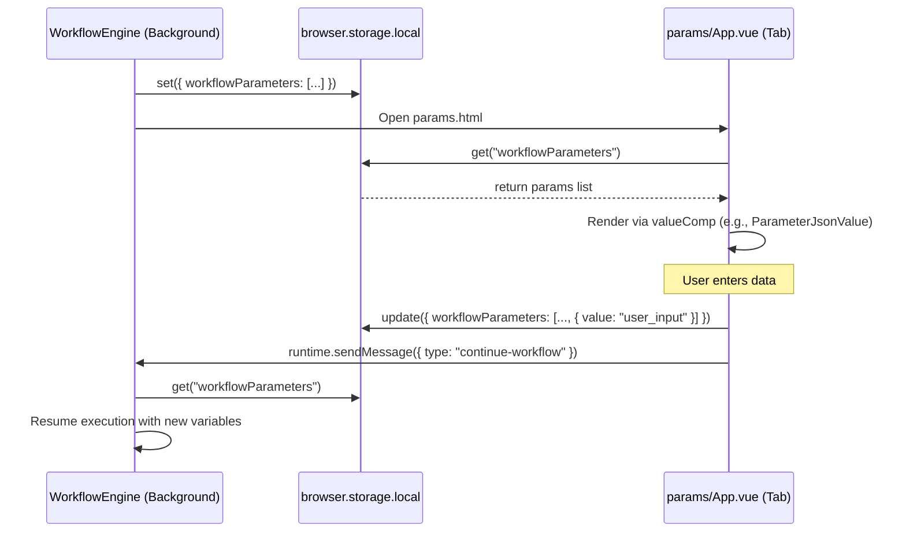
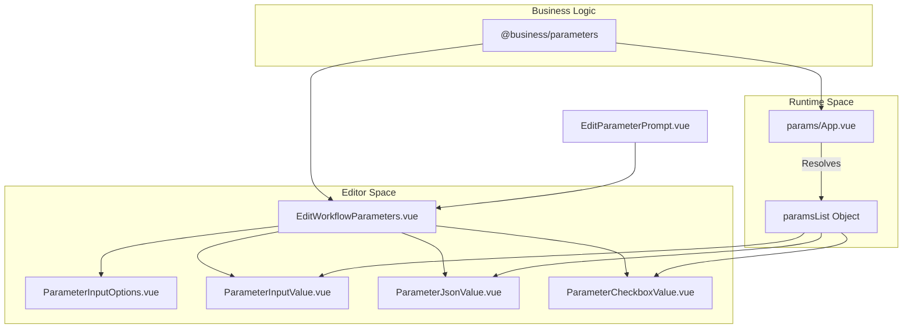

# Workflow Parameters & Runtime Input

<details>
<summary>Relevant source files</summary>

The following files were used as context for generating this wiki page:

- [src/components/newtab/workflow/edit/EditLoopData.vue](src/components/newtab/workflow/edit/EditLoopData.vue)
- [src/components/newtab/workflow/edit/EditNewTab.vue](src/components/newtab/workflow/edit/EditNewTab.vue)
- [src/components/newtab/workflow/edit/EditParameterPrompt.vue](src/components/newtab/workflow/edit/EditParameterPrompt.vue)
- [src/components/newtab/workflow/edit/EditProxy.vue](src/components/newtab/workflow/edit/EditProxy.vue)
- [src/components/newtab/workflow/edit/EditWebhook.vue](src/components/newtab/workflow/edit/EditWebhook.vue)
- [src/components/newtab/workflow/edit/EditWorkflowParameters.vue](src/components/newtab/workflow/edit/EditWorkflowParameters.vue)
- [src/components/newtab/workflow/edit/Parameter/ParameterCheckboxValue.vue](src/components/newtab/workflow/edit/Parameter/ParameterCheckboxValue.vue)
- [src/params/App.vue](src/params/App.vue)
- [src/workflowEngine/blocksHandler/handlerActiveTab.js](src/workflowEngine/blocksHandler/handlerActiveTab.js)

</details>


Automa provides a robust mechanism for collecting input from users either before a workflow begins or during its execution. This system is primarily driven by the `params/App.vue` interface, which acts as a bridge between the workflow engine and the user.

## Overview

Workflow parameters allow for dynamic execution by injecting values into the workflow context. These values are accessible via the `{{variables}}` or `{{parameters}}` syntax. The system supports two primary modes of input:
1.  **Pre-execution Parameters**: Defined at the workflow level and collected before the engine starts.
2.  **Runtime Input (Parameter Prompt)**: Triggered by a specific block during execution, pausing the workflow until user input is received.

### Parameter Synchronization Data Flow

The communication between the execution engine (background script) and the parameter UI (a separate tab/window) relies on browser storage and messaging.

| Component | Role | File |
| --- | --- | --- |
| **Workflow Engine** | Pauses execution and registers a pending parameter request in `browser.storage.local`. | [src/workflowEngine/WorkflowEngine.js]() |
| **Params App** | Monitors storage for new requests, renders the UI, and saves results back to storage. | [src/params/App.vue:1-123]() |
| **Edit Components** | Provide the schema definition and UI for configuring parameters in the editor. | [src/components/newtab/workflow/edit/EditWorkflowParameters.vue:1-138]() |

## Schema Definition: EditWorkflowParameters

The `EditWorkflowParameters.vue` component is used in the Workflow Settings and the Parameter Prompt block to define the expected inputs. It manages a list of parameter objects, each containing metadata for rendering.

### Supported Parameter Types
The system supports several built-in types, defined in the `paramTypes` object:
*   **string**: Standard text input with optional masking. [src/components/newtab/workflow/edit/EditWorkflowParameters.vue:163-174]()
*   **number**: Numeric input. [src/components/newtab/workflow/edit/EditWorkflowParameters.vue:175-181]()
*   **json**: A CodeMirror-based JSON editor. [src/components/newtab/workflow/edit/EditWorkflowParameters.vue:182-189]()
*   **checkbox**: Boolean toggle. [src/components/newtab/workflow/edit/EditWorkflowParameters.vue:190-197]()

### Configuration Interface
The editor allows users to:
*   **Name**: Define the variable name (spaces are automatically converted to underscores). [src/components/newtab/workflow/edit/EditWorkflowParameters.vue:222-224]()
*   **Default Value**: Set an initial value using type-specific components like `ParameterInputValue.vue` or `ParameterJsonValue.vue`. [src/components/newtab/workflow/edit/EditWorkflowParameters.vue:57-65]()
*   **Required**: Mark fields as mandatory for execution. [src/components/newtab/workflow/edit/EditWorkflowParameters.vue:102-110]()

**Sources:** [src/components/newtab/workflow/edit/EditWorkflowParameters.vue]()

## The Parameter Prompt Block

The `parameter-prompt` block allows a workflow to stop mid-run and request information. 

### Block Configuration
The configuration UI (`EditParameterPrompt.vue`) includes:
*   **Timeout**: Duration in milliseconds before the block fails if no input is provided. [src/components/newtab/workflow/edit/EditParameterPrompt.vue:9-15]()
*   **Parameters**: A nested instance of `EditWorkflowParameters` to define the runtime fields. [src/components/newtab/workflow/edit/EditParameterPrompt.vue:24-28]()

### Execution Logic
When the engine encounters this block:
1.  It generates a unique ID for the request.
2.  It pushes the parameter schema into the `workflowParameters` array in local storage.
3.  It opens the `params/App.vue` window if it isn't already open.
4.  It waits for a corresponding entry in storage containing the user's submitted values.

**Sources:** [src/components/newtab/workflow/edit/EditParameterPrompt.vue](), [src/params/App.vue]()

## Parameter Collection UI (params/App.vue)

The `params/App.vue` file is the entry point for the standalone window that appears when parameters are required.

### Dynamic Rendering
The UI uses a dynamic component pattern to render the correct input field based on the parameter type defined in the schema. It maps types to specific components:
*   `string` -> `ParameterInputValue`
*   `json` -> `ParameterJsonValue`
*   `checkbox` -> `ParameterCheckboxValue`

```javascript
const paramsList = {
  string: { id: 'string', valueComp: ParameterInputValue },
  json: { id: 'json', valueComp: ParameterJsonValue },
  checkbox: { id: 'checkbox', valueComp: ParameterCheckboxValue },
};
```
[src/params/App.vue:136-155]()

### Implementation Diagram: Runtime Input Sync

The following diagram illustrates how the `WorkflowEngine` synchronizes with `params/App.vue` via `browser.storage`.

"Engine-UI Synchronization"

**Sources:** [src/params/App.vue:56-69](), [src/params/App.vue:136-155]()

## Code Entity Mapping

The following diagram maps the logical "Parameter Space" to the specific Vue components and business logic files.

"Parameter System Entity Map"

**Sources:** [src/components/newtab/workflow/edit/EditWorkflowParameters.vue:140-150](), [src/params/App.vue:125-132](), [src/components/newtab/workflow/edit/EditParameterPrompt.vue:35]()

## Validation & Execution

Before allowing a workflow to start or continue, the UI validates the inputs based on the `required` flag in the parameter data.

*   **Validation**: The `isValidParams` function (called in the template) ensures all required fields are populated. [src/params/App.vue:98]()
*   **Execution (Start)**: For pre-execution parameters, `runWorkflow` is called, which triggers the initial engine start. [src/params/App.vue:112]()
*   **Execution (Continue)**: For mid-run prompts, `continueWorkflow` is called, which signals the engine to resume. [src/params/App.vue:100]()

**Sources:** [src/params/App.vue:87-118]()

---

