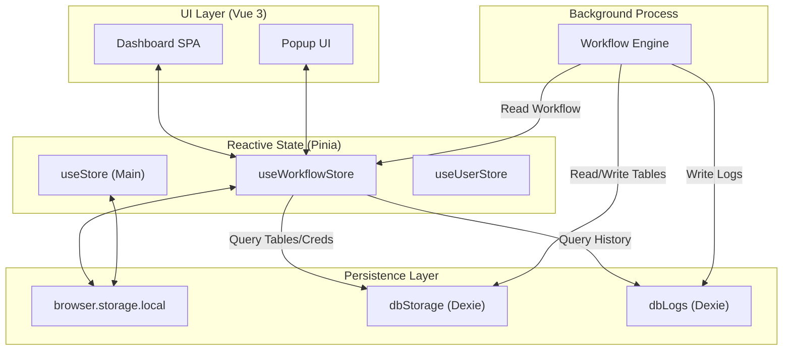

# State Management & Data Persistence

Relevant source files

The following files were used as context for generating this wiki page:

- [src/components/newtab/logs/LogsVariables.vue](src/components/newtab/logs/LogsVariables.vue)
- [src/components/newtab/workflow/editor/EditorCustomEdge.vue](src/components/newtab/workflow/editor/EditorCustomEdge.vue)
- [src/components/ui/UiSelect.vue](src/components/ui/UiSelect.vue)
- [src/newtab/pages/settings/SettingsAbout.vue](src/newtab/pages/settings/SettingsAbout.vue)
- [src/newtab/pages/settings/SettingsBackup.vue](src/newtab/pages/settings/SettingsBackup.vue)
- [src/newtab/pages/settings/SettingsEditor.vue](src/newtab/pages/settings/SettingsEditor.vue)
- [src/newtab/pages/settings/SettingsIndex.vue](src/newtab/pages/settings/SettingsIndex.vue)
- [src/stores/main.js](src/stores/main.js)
- [src/stores/workflow.js](src/stores/workflow.js)
- [src/utils/firstWorkflows.js](src/utils/firstWorkflows.js)

Automa utilizes a multi-layered approach to state management and data persistence, combining reactive application state via **Pinia** with durable storage via the **Browser Storage API** and **IndexedDB (Dexie.js)**. This architecture ensures that workflow configurations, user preferences, and execution logs remain consistent across different extension contexts (dashboard, popup, and background scripts).

## High-Level Architecture

The persistence layer is divided into three primary domains:
1.  **Reactive Stores (Pinia):** Manages in-memory state for the UI, such as active workflows, user settings, and editor configurations.
2.  **Browser Storage:** Used for lightweight persistence of workflow metadata and extension settings.
3.  **IndexedDB (Dexie):** Handles heavy data workloads, including execution logs, large tables, and sensitive credentials.

### Data Flow Diagram
The following diagram illustrates how data moves between the UI components, Pinia stores, and the underlying persistence layers.

**State & Persistence Data Flow**

**Sources:** [src/stores/workflow.js:94-113](), [src/stores/main.js:7-41]().

---

## Pinia Stores

Automa uses Pinia to manage global state. The primary store is `useWorkflowStore`, which acts as the central hub for workflow CRUD operations and trigger synchronization.

*   **`useWorkflowStore`**: Manages the `workflows` object, where keys are workflow IDs. It handles the registration of triggers via `registerWorkflowTrigger` when a workflow is updated or enabled [src/stores/workflow.js:168-200](). It also defines the `defaultWorkflow` schema used for new creations [src/stores/workflow.js:16-65]().
*   **`useStore` (Main)**: Manages global extension `settings` (locale, theme, log limits) and integration states for services like Google Drive [src/stores/main.js:18-41]().
*   **Specialized Stores**: Includes `useUserStore` for authentication, `useFolderStore` for organization, and `useHostedWorkflowStore` for cloud-synced workflows.

For detailed information on store actions, getters, and the workflow schema, see [Pinia Stores](#7.1).

**Sources:** [src/stores/workflow.js:94-113](), [src/stores/main.js:12-41]().

---

## Database Layer (IndexedDB / Dexie)

For data that is too large or complex for `browser.storage.local`, Automa utilizes **Dexie.js** to interface with IndexedDB. This is split into two distinct databases to separate operational data from historical logs.

### Database Definitions
| Database | Purpose | Key Tables |
| --- | --- | --- |
| `dbStorage` | Operational workflow data | `tablesData`, `tablesItems`, `variables`, `credentials` |
| `dbLogs` | Historical execution data | `logsData`, `histories`, `ctxData`, `items` |

The `WorkflowEngine` interacts directly with these databases during execution. For example, it writes logs to `dbLogs` [src/stores/workflow.js:51-52]() and reads/writes to `dbStorage` when blocks interact with global variables or Automa tables.

For schema details and execution-time persistence logic, see [Database Layer (IndexedDB / Dexie)](#7.2).

**Sources:** [src/stores/workflow.js:47-62](), [src/newtab/pages/settings/SettingsIndex.vue:57-90]().

---

## Backup & Synchronization

Automa provides mechanisms to export and sync state to prevent data loss.

*   **Cloud Backup**: Users can sync workflows to Automa's servers via `syncBackupWorkflows` [src/newtab/pages/settings/SettingsBackup.vue:39]().
*   **Local Backup**: Workflows and associated data (collections, storage) can be exported as encrypted JSON files [src/newtab/pages/settings/SettingsBackup.vue:80-82]().
*   **Auto-Backup**: The system supports scheduled backups using the `Downloads` permission and cron-like expressions [src/newtab/pages/settings/SettingsBackup.vue:119-158]().

**Sources:** [src/newtab/pages/settings/SettingsBackup.vue:1-43](), [src/newtab/pages/settings/SettingsBackup.vue:134-165]().

---

## Code-to-System Mapping

This table bridges the natural language concepts to the specific code entities responsible for state and persistence.

| System Concept | Code Entity | File Path |
| --- | --- | --- |
| **Workflow Schema** | `defaultWorkflow` | [src/stores/workflow.js:16]() |
| **Settings Persistence** | `loadSettings` / `updateSettings` | [src/stores/main.js:43-52]() |
| **Trigger Sync** | `registerWorkflowTrigger` | [src/utils/workflowTrigger.js]() |
| **Initial Data** | `firstWorkflows` | [src/utils/firstWorkflows.js]() |
| **Theme Management** | `useTheme` | [src/composable/theme.js]() |

**Sources:** [src/stores/workflow.js:16-80](), [src/stores/main.js:42-52](), [src/utils/firstWorkflows.js:3-10]().

---

