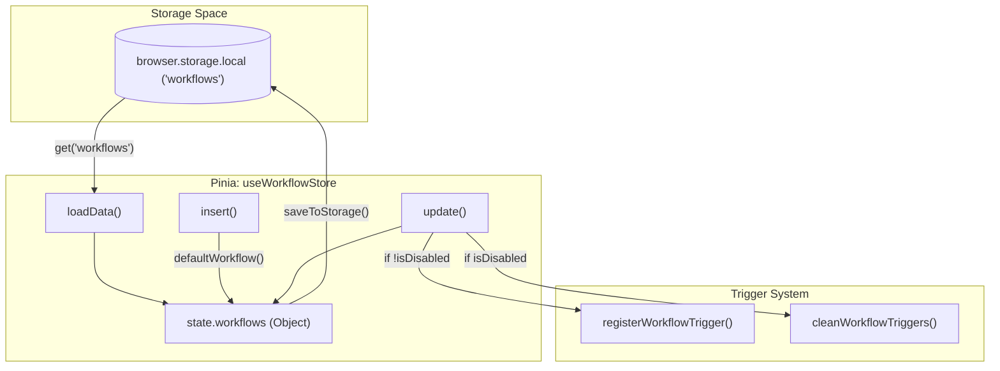
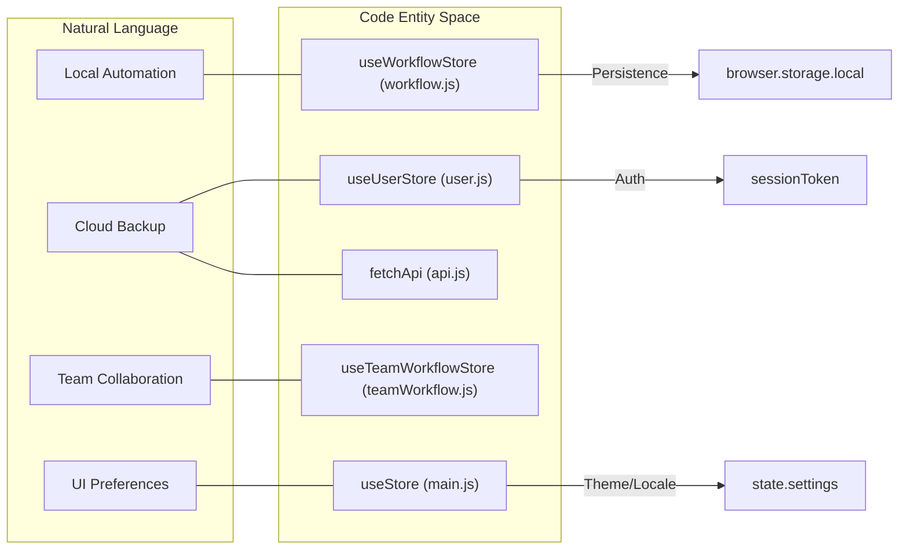

# Pinia Stores

Relevant source files

The following files were used as context for generating this wiki page:

- [src/components/newtab/logs/LogsVariables.vue](src/components/newtab/logs/LogsVariables.vue)
- [src/components/newtab/settings/SettingsCloudBackup.vue](src/components/newtab/settings/SettingsCloudBackup.vue)
- [src/components/newtab/shared/SharedPermissionsModal.vue](src/components/newtab/shared/SharedPermissionsModal.vue)
- [src/components/newtab/workflow/WorkflowShareTeam.vue](src/components/newtab/workflow/WorkflowShareTeam.vue)
- [src/components/newtab/workflow/editor/EditorCustomEdge.vue](src/components/newtab/workflow/editor/EditorCustomEdge.vue)
- [src/components/newtab/workflows/WorkflowsUserTeam.vue](src/components/newtab/workflows/WorkflowsUserTeam.vue)
- [src/components/ui/UiSelect.vue](src/components/ui/UiSelect.vue)
- [src/lib/pinia.js](src/lib/pinia.js)
- [src/newtab/pages/settings/SettingsAbout.vue](src/newtab/pages/settings/SettingsAbout.vue)
- [src/newtab/pages/settings/SettingsBackup.vue](src/newtab/pages/settings/SettingsBackup.vue)
- [src/newtab/pages/settings/SettingsEditor.vue](src/newtab/pages/settings/SettingsEditor.vue)
- [src/newtab/pages/settings/SettingsIndex.vue](src/newtab/pages/settings/SettingsIndex.vue)
- [src/newtab/pages/workflows/Shared.vue](src/newtab/pages/workflows/Shared.vue)
- [src/stores/hostedWorkflow.js](src/stores/hostedWorkflow.js)
- [src/stores/main.js](src/stores/main.js)
- [src/stores/sharedWorkflow.js](src/stores/sharedWorkflow.js)
- [src/stores/teamWorkflow.js](src/stores/teamWorkflow.js)
- [src/stores/user.js](src/stores/user.js)
- [src/stores/workflow.js](src/stores/workflow.js)
- [src/utils/api.js](src/utils/api.js)
- [src/utils/firstWorkflows.js](src/utils/firstWorkflows.js)
- [src/utils/workflowData.js](src/utils/workflowData.js)

Automa utilizes Pinia for centralized state management across the dashboard, popup, and background scripts. These stores handle everything from local workflow CRUD operations to cloud synchronization, user authentication, and editor configuration.

## Workflow Store (`useWorkflowStore`)

The `useWorkflowStore` is the primary store for managing local workflows stored in the browser's `localStorage`. It handles the lifecycle of a workflow, including creation from a default schema, updating triggers, and persistence.

### Default Workflow Schema
When a new workflow is created, it is initialized using the `defaultWorkflow` function [src/stores/workflow.js:16-80](). This ensures all necessary properties are present:
*   **Identification**: `id` (nanoid), `name`, `icon`.
*   **Structure**: `drawflow` (nodes and edges), `table` (data columns).
*   **Execution Settings**: `settings` object containing `blockDelay`, `debugMode`, `onError` strategies, and `execContext` [src/stores/workflow.js:47-62]().
*   **Metadata**: `createdAt`, `updatedAt`, `version`.

### Key Actions
*   **`loadData`**: Retrieves workflows from `browser.storage.local`. If it's the user's first time, it populates the store with example workflows from `firstWorkflows.js` [src/stores/workflow.js:115-137]().
*   **`insert`**: Adds new workflows to the state and triggers `saveToStorage` [src/stores/workflow.js:141-167]().
*   **`update`**: Merges new data into an existing workflow. Importantly, if the `isDisabled` state changes, it calls `cleanWorkflowTriggers` or `registerWorkflowTrigger` to sync with the background trigger system [src/stores/workflow.js:168-214]().
*   **`delete`**: Removes the workflow and cleans up its associated triggers [src/stores/workflow.js:247-257]().

### Workflow State Transitions
The following diagram illustrates how workflow data moves through the store during common operations.

**Workflow Data Flow**

**Sources:** [src/stores/workflow.js:94-257](), [src/utils/workflowTrigger.js:1-7]()

---

## Main Store (`useStore`)

The `useStore` (aliased as `main`) manages global application settings and integrations that aren't specific to a single workflow.

*   **Settings**: Stores UI preferences like `locale`, `theme`, and log retention policies (`deleteLogAfter`, `logsLimit`) [src/stores/main.js:18-31]().
*   **Editor Config**: Manages VueFlow settings such as `minZoom`, `maxZoom`, `snapToGrid`, and `saveWhenExecute` [src/stores/main.js:22-30]().
*   **Integrations**: Tracks the status of Google Drive/Sheets connectivity. The `checkGDriveIntegration` action validates OAuth tokens via `fetchGapi` [src/stores/main.js:53-90]().

**Sources:** [src/stores/main.js:7-41](), [src/newtab/pages/settings/SettingsIndex.vue:108-110]()

---

## User & Cloud Stores

Automa uses several stores to manage data synced with the Automa Cloud API.

### User Store (`useUserStore`)
Manages the authenticated user's profile, backup IDs, and team access levels.
*   **`loadUser`**: Fetches the profile from `/me` and caches it using `cacheApi` [src/stores/user.js:27-82]().
*   **`validateTeamAccess`**: A getter that checks if the current user has specific permissions (e.g., 'owner', 'create') within a given team [src/stores/user.js:15-24]().

### Hosted, Shared, and Team Stores
These stores separate workflows based on their source and ownership:
*   **`useHostedWorkflowStore`**: Workflows hosted by the user on Automa's servers.
*   **`useSharedWorkflowStore`**: Public workflows shared by the community.
*   **`useTeamWorkflowStore`**: Workflows belonging to a team. It provides `getByTeam` to filter workflows by `teamId` [src/components/newtab/workflows/WorkflowsUserTeam.vue:139]().

---

## Integration Mapping: Code to Concept

This diagram maps natural language concepts to the specific Pinia entities and utility functions used to manage them.

**System Entity Mapping**

**Sources:** [src/stores/workflow.js:94-98](), [src/stores/main.js:7-12](), [src/stores/user.js:5-12](), [src/utils/api.js:5-42]()

---

## Store Synchronization & Persistence

Pinia stores in Automa often implement a `storageMap` pattern to automatically persist state to `browser.storage.local`.

| Store | Storage Key | Description |
| :--- | :--- | :--- |
| `useWorkflowStore` | `workflows` | Map of local workflow objects [src/stores/workflow.js:95-97]() |
| `useStore` (Main) | `settings`, `tabs` | Global app and editor settings [src/stores/main.js:8-11]() |
| `useUserStore` | `user`, `backupIds` | Cached user profile and backup metadata [src/stores/user.js:73-77]() |

### API Interaction (`fetchApi`)
Most cloud-related actions in `useUserStore` and `useTeamWorkflowStore` utilize the `fetchApi` utility. This wrapper handles:
1.  **Authorization**: Automatically attaches the `Bearer` token from the `session` [src/utils/api.js:15-34]().
2.  **Token Refresh**: If the `access_token` is expired, it calls `/me/refresh-auth-session` using the `refresh_token` before proceeding with the original request [src/utils/api.js:20-31]().

**Sources:** [src/utils/api.js:5-42](), [src/stores/workflow.js:94-97](), [src/stores/main.js:7-11]()

---

