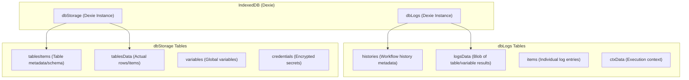
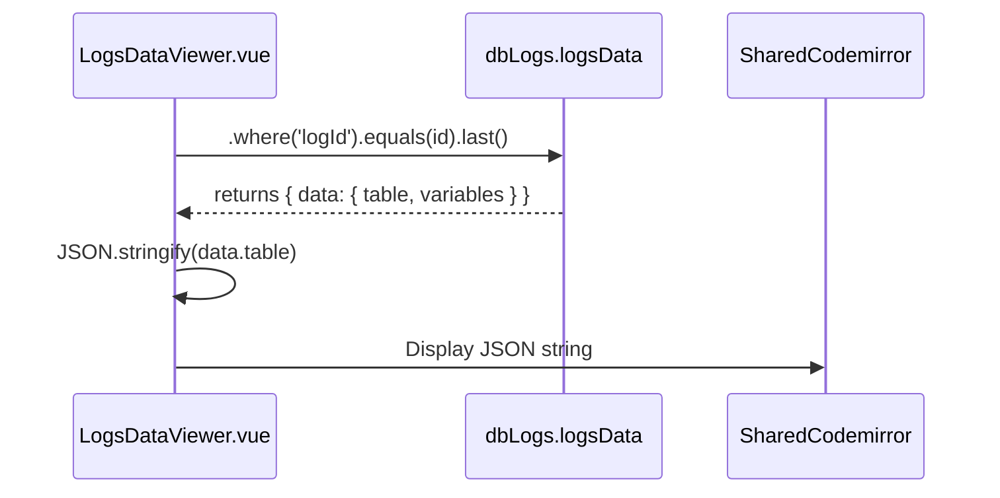
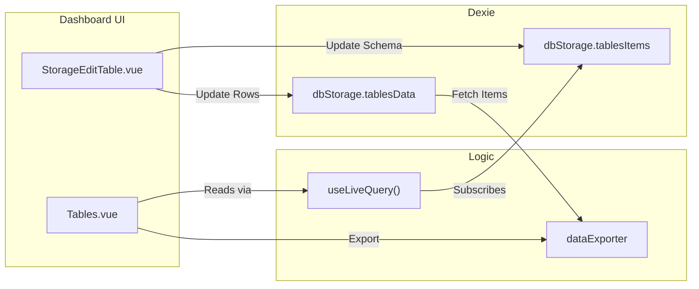

# Database Layer (IndexedDB / Dexie)

Relevant source files

The following files were used as context for generating this wiki page:

- [src/components/newtab/logs/LogsDataViewer.vue](src/components/newtab/logs/LogsDataViewer.vue)
- [src/components/newtab/logs/LogsFilters.vue](src/components/newtab/logs/LogsFilters.vue)
- [src/components/newtab/logs/LogsTable.vue](src/components/newtab/logs/LogsTable.vue)
- [src/components/newtab/logs/LogsVariables.vue](src/components/newtab/logs/LogsVariables.vue)
- [src/components/newtab/shared/SharedLogsTable.vue](src/components/newtab/shared/SharedLogsTable.vue)
- [src/components/newtab/storage/StorageCredentials.vue](src/components/newtab/storage/StorageCredentials.vue)
- [src/components/newtab/storage/StorageEditTable.vue](src/components/newtab/storage/StorageEditTable.vue)
- [src/components/newtab/storage/StorageTables.vue](src/components/newtab/storage/StorageTables.vue)
- [src/components/newtab/storage/StorageVariables.vue](src/components/newtab/storage/StorageVariables.vue)
- [src/components/ui/UiSelect.vue](src/components/ui/UiSelect.vue)
- [src/components/ui/UiTable.vue](src/components/ui/UiTable.vue)
- [src/newtab/pages/logs/[id].vue](src/newtab/pages/logs/[id].vue)
- [src/newtab/pages/settings/SettingsBackup.vue](src/newtab/pages/settings/SettingsBackup.vue)
- [src/newtab/pages/storage/Tables.vue](src/newtab/pages/storage/Tables.vue)
- [src/stores/workflow.js](src/stores/workflow.js)
- [src/utils/firstWorkflows.js](src/utils/firstWorkflows.js)

Automa utilizes **Dexie.js**, a wrapper for IndexedDB, to manage large-scale data persistence that exceeds the storage limits of `browser.storage.local`. The architecture is split into two primary databases: `dbLogs` for execution history and `dbStorage` for user-defined tables, variables, and credentials.

## Overview of Database Architecture

While workflow definitions and extension settings are stored in `browser.storage.local` [src/stores/workflow.js:116-119](), the execution data (logs, table items, and variables) is handled by Dexie to ensure performance and scalability.

### Database Separation
- **`dbLogs`**: Specifically designed to store high-frequency execution data. This database grows over time and is often targeted by cleanup routines.
- **`dbStorage`**: Stores structured data that users interact with directly via the "Storage" dashboard, such as custom tables and shared variables.

### Code-to-Entity Mapping
The following diagram maps the high-level storage concepts to the specific Dexie database instances and their internal tables.

**Database Entity Map**

Sources: [src/newtab/pages/storage/Tables.vue:95-111](), [src/components/newtab/logs/LogsDataViewer.vue:58-105](), [src/stores/workflow.js:247-256]()

---

## 1. dbLogs: Execution & History

The `dbLogs` database is the primary sink for data generated during a workflow run. When a workflow executes, the `WorkflowEngine` records its progress and final output here.

### Key Tables & Schema
- **`histories`**: Stores the high-level record of a run (status, start/end time, workflow name).
- **`logsData`**: A specialized table where the `logId` is used to retrieve a large object containing the final state of the `table` and `variables` at the end of execution [src/components/newtab/logs/LogsDataViewer.vue:105-114]().
- **`items`**: Detailed step-by-step execution logs for every block processed.

### Log Persistence Flow
During execution, the system determines whether to save logs based on the workflow setting `settings.saveLog` [src/stores/workflow.js:51]().

**Log Retrieval Sequence**

Sources: [src/components/newtab/logs/LogsDataViewer.vue:104-116](), [src/components/newtab/logs/LogsTable.vue:47-53]()

---

## 2. dbStorage: Structured User Data

The `dbStorage` database manages data that persists across different workflow executions and is accessible via the dashboard's "Storage" tab.

### Tables System
Automa implements a "Table" abstraction where metadata (columns, names) is separated from the actual row data to optimize query performance.

- **`tablesItems`**: Contains the table schema.
  - `columns`: Array of objects defining `{ id, name, type }` [src/newtab/pages/storage/Tables.vue:166-179]().
  - `rowsCount`: Integer count of records [src/newtab/pages/storage/Tables.vue:242-245]().
- **`tablesData`**: Contains the actual items.
  - `items`: Array of objects representing rows.
  - `columnsIndex`: A mapping used to track the insertion order or specific column metadata [src/newtab/pages/storage/Tables.vue:163-173]().

### Data Interaction: `useLiveQuery`
The dashboard uses the `useLiveQuery` composable to create reactive bindings to Dexie. This ensures that if a background workflow updates a table, the UI refreshes automatically.

**Table Data Flow**

Sources: [src/newtab/pages/storage/Tables.vue:106-111](), [src/newtab/pages/storage/Tables.vue:152-160](), [src/newtab/pages/storage/Tables.vue:242-250]()

---

## 3. Implementation Details

### Data Exporting
The system provides a unified way to export data from both `dbLogs` and `dbStorage` using the `dataExporter` utility. It supports multiple formats (JSON, CSV, etc.) defined in `dataExportTypes` [src/utils/shared.js]().

- **Log Export**: Exports the `table` result from a specific execution [src/components/newtab/logs/LogsTable.vue:93-99]().
- **Storage Export**: Exports the entire content of a user-created table [src/newtab/pages/storage/Tables.vue:145-151]().

### CRUD Operations in `Tables.vue`
The management of storage tables involves complex index synchronization:
1. **Renaming Columns**: When a column is renamed in `tablesItems`, the system iterates through all items in `tablesData` to update the keys [src/newtab/pages/storage/Tables.vue:186-197]().
2. **Deleting Rows**: Removing a row requires updating the `rowsCount` in the metadata table and splicing the array in the data table [src/newtab/pages/storage/Tables.vue:216-245]().

### Integration with Workflow Store
The `useWorkflowStore` manages the high-level lifecycle but triggers database cleanups. For instance, when a workflow is deleted, the store is responsible for initiating the removal of associated logs and history from IndexedDB [src/stores/workflow.js:247-256]().

Sources: [src/newtab/pages/storage/Tables.vue:152-215](), [src/components/newtab/logs/LogsDataViewer.vue:96-102](), [src/stores/workflow.js:16-65]()

---

