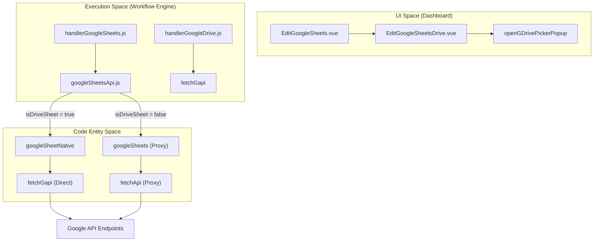
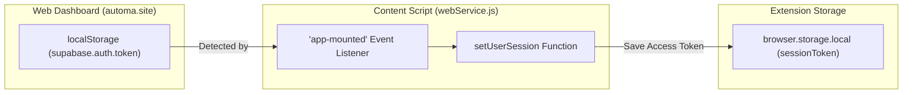

# Google Sheets & Google Drive

Relevant source files

The following files were used as context for generating this wiki page:

- [src/components/newtab/workflow/edit/EditGoogleDrive.vue](src/components/newtab/workflow/edit/EditGoogleDrive.vue)
- [src/components/newtab/workflow/edit/EditGoogleSheets.vue](src/components/newtab/workflow/edit/EditGoogleSheets.vue)
- [src/components/newtab/workflow/edit/EditGoogleSheetsDrive.vue](src/components/newtab/workflow/edit/EditGoogleSheetsDrive.vue)
- [src/components/newtab/workflow/editor/EditorSearchBlocks.vue](src/components/newtab/workflow/editor/EditorSearchBlocks.vue)
- [src/content/services/webService.js](src/content/services/webService.js)
- [src/utils/googleSheetsApi.js](src/utils/googleSheetsApi.js)
- [src/utils/openGDriveFilePicker.js](src/utils/openGDriveFilePicker.js)
- [src/workflowEngine/blocksHandler/handlerGoogleDrive.js](src/workflowEngine/blocksHandler/handlerGoogleDrive.js)
- [src/workflowEngine/blocksHandler/handlerGoogleSheets.js](src/workflowEngine/blocksHandler/handlerGoogleSheets.js)

The Google Sheets and Google Drive integration allows Automa workflows to interact with cloud spreadsheets and file storage. This system handles authentication via OAuth, provides a high-level abstraction for the Google Sheets API (v4), and manages data transformation between Automa's internal data structures and the 2D arrays required by Google.

## Overview and Data Flow

Automa interacts with Google Services through two primary modes: a **Proxy mode** (using Automa's backend API) and a **Native mode** (using direct calls to Google APIs with the user's session token).

### System Architecture Diagram

This diagram illustrates the flow from the UI components to the execution handlers and the API abstraction layer.

"Workflow Execution Flow"

Sources: `[src/workflowEngine/blocksHandler/handlerGoogleSheets.js:1-15]()`, `[src/utils/googleSheetsApi.js:129-131]()`, `[src/components/newtab/workflow/edit/EditGoogleSheetsDrive.vue:70-76]()`.

## Google Sheets Block

The Google Sheets block (`google-sheets`) supports multiple operations including retrieving values, updating cells, appending rows, clearing ranges, and creating new spreadsheets.

### Execution Handler (`handlerGoogleSheets.js`)
The handler dispatches requests based on the `data.type` property. It performs critical data transformations:
*   **Object to 2D Array**: When updating or appending, it converts Automa's table objects into 2D arrays using `convertArrObjTo2DArr` `[src/workflowEngine/blocksHandler/handlerGoogleSheets.js:76-85]()`.
*   **2D Array to Object**: When retrieving data with `firstRowAsKey` enabled, it transforms the Google API response into an array of objects using `convert2DArrayToArrayObj` `[src/workflowEngine/blocksHandler/handlerGoogleSheets.js:25-27]()`.

### API Abstraction (`googleSheetsApi.js`)
Automa provides a unified interface for Google Sheets operations through a factory function:
*   **Native Mode (`googleSheetNative`)**: Uses `fetchGapi` to send requests directly to `https://sheets.googleapis.com/v4/` using the user's local OAuth token `[src/utils/googleSheetsApi.js:15-23]()`.
*   **Proxy Mode (`googleSheets`)**: Uses `fetchApi` to route requests through Automa's hosted service at `/services/google-sheets` `[src/utils/googleSheetsApi.js:88-96]()`.

**Key Operations:**
| Operation | Handler Function | API Method |
| :--- | :--- | :--- |
| Get Values | `getSpreadsheetValues` | `GET /values/{range}` |
| Update | `updateSpreadsheetValues` | `PUT /values/{range}` |
| Append | `updateSpreadsheetValues` | `POST /values/{range}:append` |
| Create | `actionHandlers.create` | `POST /spreadsheets` |

Sources: `[src/workflowEngine/blocksHandler/handlerGoogleSheets.js:125-186]()`, `[src/utils/googleSheetsApi.js:15-131]()`.

## Google Drive Integration

The Google Drive integration focuses on file management, specifically file uploads and file picking.

### File Picker and Connector
The `EditGoogleSheetsDrive.vue` component allows users to connect specific spreadsheets from their Drive. It utilizes `openGDrivePickerPopup` to open a secure window to `extension.automa.site/picker` `[src/utils/openGDriveFilePicker.js:43-46]()`. Once a file is selected, it is added to the `connectedSheets` list in the Pinia `mainStore` `[src/components/newtab/workflow/edit/EditGoogleSheetsDrive.vue:104-115]()`.

### File Upload Handler (`handlerGoogleDrive.js`)
The `googleDrive` handler supports uploading files from various sources (URLs, local paths, or previous download IDs).
1.  **Session Validation**: It checks for a valid `sessionToken` in local storage `[src/workflowEngine/blocksHandler/handlerGoogleDrive.js:20-23]()`.
2.  **Path Resolution**: Resolves variables in file paths using `renderString` `[src/workflowEngine/blocksHandler/handlerGoogleDrive.js:28-29]()`.
3.  **Resumable Upload**:
    *   Initiates a session via `POST` to the resumable upload endpoint `[src/workflowEngine/blocksHandler/handlerGoogleDrive.js:47-60]()`.
    *   Retrieves the `location` URI from headers `[src/workflowEngine/blocksHandler/handlerGoogleDrive.js:61]()`.
    *   Reads the file as an `ArrayBuffer` and performs a `PUT` request to upload the data `[src/workflowEngine/blocksHandler/handlerGoogleDrive.js:71-77]()`.

Sources: `[src/components/newtab/workflow/edit/EditGoogleSheetsDrive.vue:95-119]()`, `[src/workflowEngine/blocksHandler/handlerGoogleDrive.js:19-87]()`, `[src/utils/openGDriveFilePicker.js:43-64]()`.

## OAuth Token Management

Authentication is managed via `webService.js`, which bridges the Automa web dashboard and the browser extension.

### Token Synchronization Flow

"Authentication and Token Sync"

When a user logs into the Automa dashboard, `webService.js` detects the Supabase auth token in `localStorage` `[src/content/services/webService.js:203-209]()`. If the provider is Google, it extracts the access token and stores it in the extension's `browser.storage.local` under the `sessionToken` key `[src/content/services/webService.js:215-230]()`. This token is then used by `fetchGapi` for direct Google API calls.

Sources: `[src/content/services/webService.js:203-230]()`, `[src/workflowEngine/blocksHandler/handlerGoogleDrive.js:20-25]()`.

## Data Transformation Logic

The integration relies on utility functions to bridge the gap between JSON-like objects and Spreadsheet grids.

*   **`convert2DArrayToArrayObj`**: Takes a 2D array (rows/columns) from Google and uses the first row as keys to create an array of objects.
*   **`convertArrObjTo2DArr`**: Takes an array of objects and flattens it into a 2D array. If `keysAsFirstRow` is true, the object keys are inserted as the first row `[src/workflowEngine/blocksHandler/handlerGoogleSheets.js:78-82]()`.
*   **Data Cleaning**: The handler ensures that values are valid types (boolean, string, number). Any invalid data or empty cells are normalized to a single space character to maintain grid integrity `[src/workflowEngine/blocksHandler/handlerGoogleSheets.js:88-96]()`.

Sources: `[src/workflowEngine/blocksHandler/handlerGoogleSheets.js:2-7]()`, `[src/workflowEngine/blocksHandler/handlerGoogleSheets.js:76-96]()`.

---

