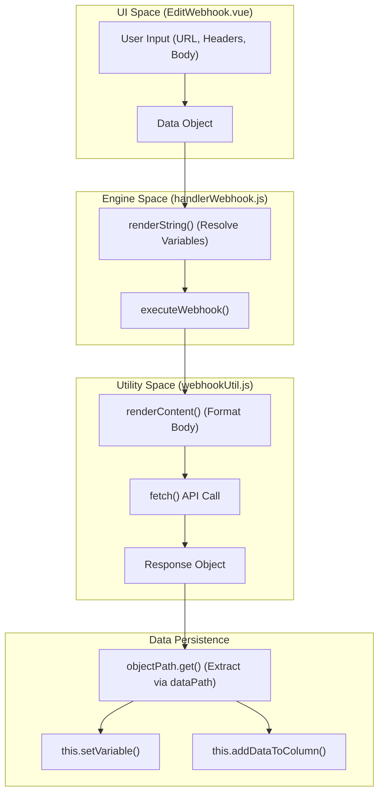
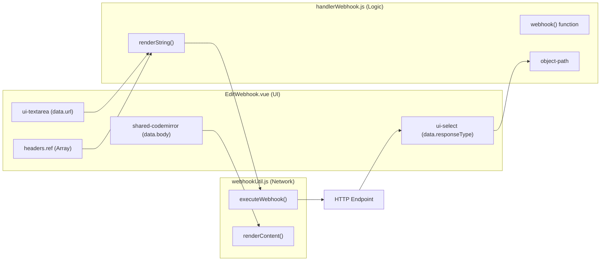

# Webhooks & HTTP Requests

Relevant source files

The following files were used as context for generating this wiki page:

- [src/components/newtab/workflow/edit/EditLoopData.vue](src/components/newtab/workflow/edit/EditLoopData.vue)
- [src/components/newtab/workflow/edit/EditNewTab.vue](src/components/newtab/workflow/edit/EditNewTab.vue)
- [src/components/newtab/workflow/edit/EditProxy.vue](src/components/newtab/workflow/edit/EditProxy.vue)
- [src/components/newtab/workflow/edit/EditWebhook.vue](src/components/newtab/workflow/edit/EditWebhook.vue)
- [src/workflowEngine/blocksHandler/handlerConditions.js](src/workflowEngine/blocksHandler/handlerConditions.js)
- [src/workflowEngine/blocksHandler/handlerWebhook.js](src/workflowEngine/blocksHandler/handlerWebhook.js)
- [src/workflowEngine/blocksHandler/handlerWhileLoop.js](src/workflowEngine/blocksHandler/handlerWhileLoop.js)
- [src/workflowEngine/templating/index.js](src/workflowEngine/templating/index.js)
- [src/workflowEngine/utils/conditionCode.js](src/workflowEngine/utils/conditionCode.js)
- [src/workflowEngine/utils/webhookUtil.js](src/workflowEngine/utils/webhookUtil.js)

The Webhook system in Automa enables workflows to communicate with external APIs and services. It provides a robust interface for sending HTTP requests (GET, POST, PUT, etc.) and processing responses, supporting various data formats including JSON, Form Data, and Base64.

## Webhook Configuration (EditWebhook UI)

The `EditWebhook.vue` component provides the user interface for configuring HTTP requests within the workflow editor. It manages complex state including headers, body content, and response handling.

### Key UI Features
- **Method Selection**: Supports `GET`, `POST`, `PUT`, `PATCH`, `DELETE`, and `HEAD` [src/components/newtab/workflow/edit/EditWebhook.vue:176-176]().
- **Dynamic Headers**: Users can add multiple key-value pairs for HTTP headers [src/components/newtab/workflow/edit/EditWebhook.vue:73-95]().
- **Body Editor**: Integrates `SharedCodemirror` for editing request bodies, with visibility toggled based on the selected HTTP method (e.g., hidden for GET/HEAD) [src/components/newtab/workflow/edit/EditWebhook.vue:61-63, 136-141]().
- **Response Handling**: Allows users to define the expected `responseType` (`json`, `text`, or `base64`) and a `dataPath` to extract specific values using dot notation [src/components/newtab/workflow/edit/EditWebhook.vue:105-122]().

**Sources:** [src/components/newtab/workflow/edit/EditWebhook.vue:1-208]()

## Execution Logic (handlerWebhook)

The `webhook` handler manages the lifecycle of an HTTP request during workflow execution. It handles template rendering for dynamic URLs/headers, executes the request via `webhookUtil`, and processes the resulting data.

### Execution Flow
1. **Validation**: Checks if the URL is provided and starts with `http` [src/workflowEngine/blocksHandler/handlerWebhook.js:13-19]().
2. **Template Rendering**: Uses `renderString` to resolve variables or expressions within the headers before sending the request [src/workflowEngine/blocksHandler/handlerWebhook.js:22-27]().
3. **Request Dispatch**: Calls `executeWebhook` from `webhookUtil` [src/workflowEngine/blocksHandler/handlerWebhook.js:29-29]().
4. **Error/Fallback Handling**: If the request fails (non-2xx status), it checks for a "fallback" output connection. If present, execution branches to the fallback path; otherwise, it throws an error [src/workflowEngine/blocksHandler/handlerWebhook.js:31-54]().
5. **Data Extraction**:
    - For `json`: Uses `object-path` to extract data based on the user-defined `dataPath` [src/workflowEngine/blocksHandler/handlerWebhook.js:66-73]().
    - For `base64`: Converts the response blob to a data URL using `FileReader` [src/workflowEngine/blocksHandler/handlerWebhook.js:74-84]().
    - Special Keyword `$response`: If found in `dataPath`, the handler returns an object containing the status, statusText, URL, and the actual data [src/workflowEngine/blocksHandler/handlerWebhook.js:89-101]().
6. **Persistence**: Saves the extracted data to workflow variables or the data table as configured [src/workflowEngine/blocksHandler/handlerWebhook.js:103-112]().

**Sources:** [src/workflowEngine/blocksHandler/handlerWebhook.js:8-134]()

## Webhook Utilities (webhookUtil)

`webhookUtil.js` provides the underlying abstraction for the browser's `fetch` API, handling timeouts and content-type formatting.

### Content Type Rendering
The `renderContent` function transforms the request body based on the `contentType` [src/workflowEngine/utils/webhookUtil.js:4-61]():
| Content Type | Transformation Logic |
| :--- | :--- |
| `text` | Returns raw string. |
| `json` | Stringifies the JSON object. |
| `form` | Converts JSON to `URLSearchParams`. |
| `form-data` | Converts a 2D array into a `FormData` object, supporting file uploads via `getFile`. |

### Request Execution
The `executeWebhook` function handles the actual `fetch` call. It supports an `AbortController` to implement request timeouts if configured by the user [src/workflowEngine/utils/webhookUtil.js:95-100, 117-117]().

**Sources:** [src/workflowEngine/utils/webhookUtil.js:4-127]()

## Data Flow Diagram

The following diagram illustrates the flow from UI configuration to HTTP execution and data persistence.

### Webhook Data Pipeline

**Sources:** [src/workflowEngine/blocksHandler/handlerWebhook.js:29-112](), [src/workflowEngine/utils/webhookUtil.js:84-127](), [src/components/newtab/workflow/edit/EditWebhook.vue:184-186]()

## Entity Mapping: UI to Handler

This diagram bridges the visual configuration elements to their corresponding execution logic in the engine.

### UI to Code Entity Mapping

**Sources:** [src/components/newtab/workflow/edit/EditWebhook.vue:19-31](), [src/workflowEngine/blocksHandler/handlerWebhook.js:22-29](), [src/workflowEngine/utils/webhookUtil.js:4-61]()

---

