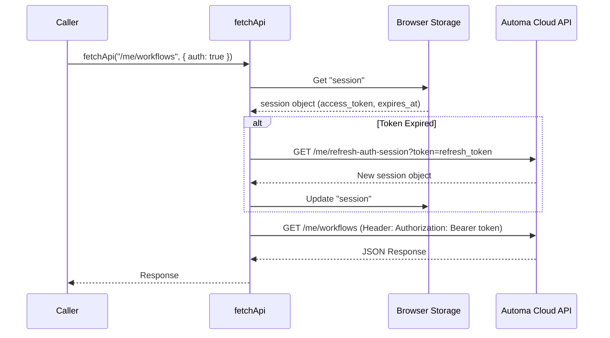
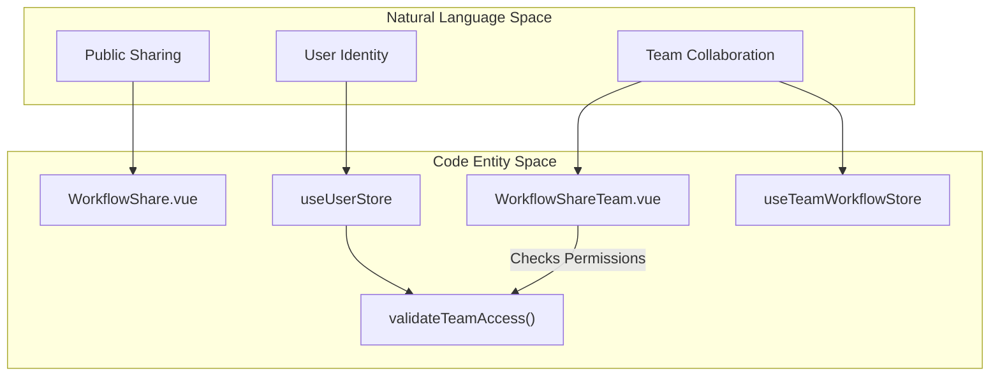

# Automa Cloud API & Team Features

Relevant source files

The following files were used as context for generating this wiki page:

- [src/components/newtab/settings/SettingsCloudBackup.vue](src/components/newtab/settings/SettingsCloudBackup.vue)
- [src/components/newtab/shared/SharedPermissionsModal.vue](src/components/newtab/shared/SharedPermissionsModal.vue)
- [src/components/newtab/workflow/WorkflowShare.vue](src/components/newtab/workflow/WorkflowShare.vue)
- [src/components/newtab/workflow/WorkflowShareTeam.vue](src/components/newtab/workflow/WorkflowShareTeam.vue)
- [src/components/newtab/workflow/editor/EditorLogs.vue](src/components/newtab/workflow/editor/EditorLogs.vue)
- [src/components/newtab/workflows/WorkflowsUserTeam.vue](src/components/newtab/workflows/WorkflowsUserTeam.vue)
- [src/content/blocksHandler/handlerLoopData.js](src/content/blocksHandler/handlerLoopData.js)
- [src/newtab/pages/workflows/Host.vue](src/newtab/pages/workflows/Host.vue)
- [src/newtab/pages/workflows/Shared.vue](src/newtab/pages/workflows/Shared.vue)
- [src/stores/hostedWorkflow.js](src/stores/hostedWorkflow.js)
- [src/stores/sharedWorkflow.js](src/stores/sharedWorkflow.js)
- [src/stores/teamWorkflow.js](src/stores/teamWorkflow.js)
- [src/stores/user.js](src/stores/user.js)
- [src/utils/api.js](src/utils/api.js)
- [src/utils/workflowData.js](src/utils/workflowData.js)

This section covers the integration between the Automa browser extension and its online ecosystem. It details the mechanisms for authentication, the utility layer for API communication, and the management of hosted, shared, and team-based workflows.

## API Communication & Authentication

Automa interacts with the cloud backend through a set of utility functions that handle request signing, token refreshing, and response caching.

### fetchApi Utility
The `fetchApi` function is the primary wrapper for making requests to the Automa API. It automatically attaches the `Authorization` header using the session token stored in the browser's local storage [src/utils/api.js:5-10]().

*   **Session Management**: It retrieves the session object from `BrowserAPIService.storage.local` [src/utils/api.js:12-14]().
*   **Token Refresh Flow**: If the current access token is near expiration (within 2 seconds), it calls the `/me/refresh-auth-session` endpoint using the `refresh_token` to obtain a new session object before proceeding with the original request [src/utils/api.js:20-31]().
*   **Base Configuration**: It prepends the `baseApiUrl` from the project's secrets to the requested path [src/utils/api.js:36]().

### cacheApi Utility
To minimize redundant network traffic, `cacheApi` provides a wrapper around asynchronous calls (typically API fetches) to store results in `sessionStorage` [src/utils/api.js:44-53]().

*   **TTL (Time To Live)**: Defaults to 100 seconds [src/utils/api.js:47]().
*   **Validation**: It checks if the cached data exists and if the current time is within the TTL window relative to the stored `cache-time` key [src/utils/api.js:58-64]().

### Authentication Data Flow
The following diagram illustrates how the system ensures valid authentication tokens are present before an API request is dispatched.

**Diagram: Authentication and Refresh Logic**

Sources: [src/utils/api.js:5-42](), [src/stores/user.js:83-103]()

---

## Hosted Workflows

Hosted workflows are versions of local workflows stored on Automa's servers, allowing for synchronization across devices and simplified management.

### Synchronization (Sync)
The `useHostedWorkflowStore` manages the state of these workflows. The `fetchWorkflows` action sends a list of `hostId`s to the backend [src/stores/hostedWorkflow.js:59-65]().
*   **Update Logic**: If the backend returns a status of `updated`, the store updates the local representation and re-registers any triggers (e.g., cron or intervals) found in the workflow's `drawflow` [src/stores/hostedWorkflow.js:79-81]().
*   **Deletion Logic**: If the status is `deleted`, the workflow is removed from the local store and its triggers are cleaned up [src/stores/hostedWorkflow.js:74-77]().

### Hosted Editor
When viewing a hosted workflow in the dashboard (`Host.vue`), the editor is set to a restricted mode where nodes are not draggable and the graph is read-only [src/newtab/pages/workflows/Host.vue:134-141](). Users can trigger a manual sync via `syncWorkflow` which refreshes the local copy from the cloud [src/newtab/pages/workflows/Host.vue:172-193]().

Sources: [src/stores/hostedWorkflow.js:10-94](), [src/newtab/pages/workflows/Host.vue:1-106]()

---

## Shared and Team Workflows

Automa supports two types of collaborative sharing: public sharing (Shared) and private organizational sharing (Team).

### Shared Workflows
Publicly shared workflows are managed via the `WorkflowShare.vue` component.
*   **Publishing**: The `publishWorkflow` function uses `convertWorkflow` to sanitize the data, removing extension-specific versioning and ensuring the description fits within 300 characters [src/components/newtab/workflow/WorkflowShare.vue:122-132]().
*   **Drafting**: Users can save a local draft of their sharing configuration (description, category) to `browser.storage.local` before publishing [src/components/newtab/workflow/WorkflowShare.vue:172-181]().

### Team Workflows
Team workflows allow groups of users to share automation logic within a private workspace.
*   **Access Control**: The `useUserStore` provides a `validateTeamAccess` getter that checks if the authenticated user has specific permissions (e.g., 'owner', 'create') for a given `teamId` [src/stores/user.js:15-24]().
*   **Deployment**: When publishing to a team, the `WorkflowShareTeam.vue` component sends a `POST` request to `/teams/${teamId}/workflows` [src/components/newtab/workflow/WorkflowShareTeam.vue:189-193]().
*   **Environment Tagging**: Team workflows support environment tags (e.g., `stage`, `production`) to differentiate between development and live versions [src/components/newtab/workflow/WorkflowShareTeam.vue:131-135]().

### Code Entity Association

**Diagram: Collaboration Logic Mapping**

Sources: [src/components/newtab/workflow/WorkflowShare.vue:90-110](), [src/components/newtab/workflow/WorkflowShareTeam.vue:140-166](), [src/stores/user.js:5-25]()

---

## Cloud Backup

The cloud backup system allows users to store their entire workflow library in the Automa cloud.

### Location Management
The `SettingsCloudBackup.vue` component provides a toggle between `local` and `cloud` locations [src/components/newtab/settings/SettingsCloudBackup.vue:14-32]().
*   **Backup Action**: `backupWorkflowsToCloud` converts local workflow data using `convertWorkflow` and uploads it to the server [src/components/newtab/settings/SettingsCloudBackup.vue:158-162]().
*   **Sync to Local**: The `syncCloudToLocal` function allows users to retrieve a cloud-stored workflow and insert it into their local IndexedDB [src/components/newtab/settings/SettingsCloudBackup.vue:85-95]().
*   **Limits**: The system calculates a `workflowLimit` based on the user's subscription tier retrieved from `userStore.user.limit.backupWorkflow` [src/components/newtab/settings/SettingsCloudBackup.vue:209-213]().

### Data Transformation
Before any workflow is sent to the cloud (for backup or sharing), it passes through `convertWorkflow` in `workflowData.js`. This ensures only the necessary fields (`name`, `icon`, `drawflow`, `settings`, etc.) are included, stripping out local execution state or logs [src/utils/workflowData.js:177-200]().

Sources: [src/components/newtab/settings/SettingsCloudBackup.vue:153-214](), [src/utils/workflowData.js:177-200]()

---

## Summary of API Utilities

| Function | Purpose | Storage/Endpoint |
| :--- | :--- | :--- |
| `fetchApi` | Authenticated HTTP requests | `secrets.baseApiUrl` |
| `cacheApi` | Generic result caching | `sessionStorage` |
| `getUserWorkflows` | Fetches backup/hosted list | `/me/workflows` |
| `getSharedWorkflows` | Fetches user's shared items | `/me/workflows/shared` |
| `validateOauthToken` | Validates/Refreshes Google OAuth | `googleapis.com/.../tokeninfo` |

Sources: [src/utils/api.js:5-156]()

---

