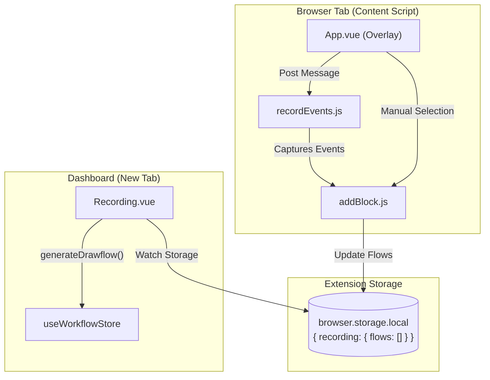
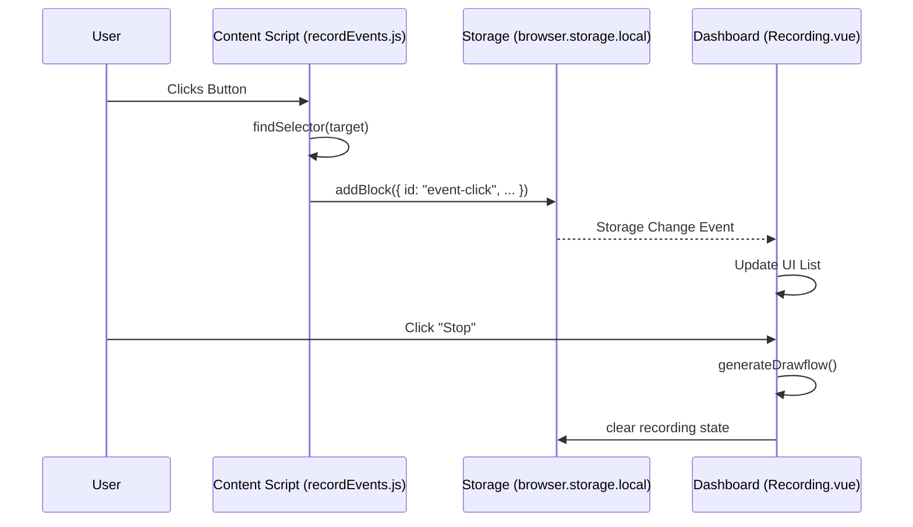

# Workflow Recording

Relevant source files

The following files were used as context for generating this wiki page:

- [src/assets/css/flow.css](src/assets/css/flow.css)
- [src/components/newtab/workflow/editor/EditorLocalCtxMenu.vue](src/components/newtab/workflow/editor/EditorLocalCtxMenu.vue)
- [src/content/blocksHandler/handlerVerifySelector.js](src/content/blocksHandler/handlerVerifySelector.js)
- [src/content/services/recordWorkflow/App.vue](src/content/services/recordWorkflow/App.vue)
- [src/content/services/recordWorkflow/addBlock.js](src/content/services/recordWorkflow/addBlock.js)
- [src/content/services/recordWorkflow/index.js](src/content/services/recordWorkflow/index.js)
- [src/content/services/recordWorkflow/recordEvents.js](src/content/services/recordWorkflow/recordEvents.js)
- [src/newtab/pages/Recording.vue](src/newtab/pages/Recording.vue)
- [src/newtab/utils/RecordWorkflowUtils.js](src/newtab/utils/RecordWorkflowUtils.js)
- [src/newtab/utils/elementSelector.js](src/newtab/utils/elementSelector.js)
- [src/newtab/utils/startRecordWorkflow.js](src/newtab/utils/startRecordWorkflow.js)
- [webpack.config.js](webpack.config.js)

The **Workflow Recording** system allows users to generate automation workflows by simply interacting with a browser. It captures DOM events (clicks, typing, scrolling), browser-level navigation (tab switching, URL changes), and manual element selections, converting them into a structured sequence of workflow blocks.

## System Overview

The recording lifecycle involves three distinct environments:
1.  **Content Scripts**: `recordWorkflow.bundle.js` is injected into every tab to listen for DOM interactions.
2.  **Background/Storage**: The recording state is persisted in `browser.storage.local` to maintain a consistent "session" across multiple tabs and page reloads.
3.  **Dashboard UI**: The `Recording.vue` page provides a live view of captured blocks and handles the final conversion into a VueFlow/Drawflow graph.

### Recording Architecture

**Sources:** [src/content/services/recordWorkflow/index.js:1-40](), [src/newtab/pages/Recording.vue:241-250](), [src/content/services/recordWorkflow/addBlock.js:1-20]()

---

## Recording Engine

The engine is responsible for the low-level detection of user actions. When recording starts, `recordWorkflow.bundle.js` is injected into all frames of active tabs [src/newtab/utils/startRecordWorkflow.js:36-63]().

### Event Capture (`recordEvents.js`)
This module attaches listeners for various browser events and maps them to Automa block definitions:
*   **Clicks**: Captured by `onClick`. It distinguishes between standard clicks (`event-click`) and link navigations (`link`) [src/content/services/recordWorkflow/recordEvents.js:176-228]().
*   **Forms & Inputs**: The `onChange` listener detects value changes in inputs, textareas, and selects, mapping them to `forms` or `upload-file` blocks [src/content/services/recordWorkflow/recordEvents.js:42-113]().
*   **Keyboard**: `onKeydown` uses `recordPressedKey` to capture shortcuts and "Enter" key submissions [src/content/services/recordWorkflow/recordEvents.js:114-175]().
*   **Scrolling**: `onScroll` debounces scroll events to update `element-scroll` blocks [src/content/services/recordWorkflow/recordEvents.js:257-275]().

### Block Generation (`addBlock.js`)
Every captured event is passed to `addBlockToFlow`. This utility retrieves the current session from storage, appends the new block to the `flows` array, and saves it back [src/content/services/recordWorkflow/addBlock.js:3-20](). It supports a functional update pattern to allow blocks to modify themselves based on the previous block (e.g., grouping consecutive key presses) [src/content/services/recordWorkflow/recordEvents.js:158-164]().

For details on event capture logic and block mapping, see **[Recording Engine](#9.1)**.

---

## Recording UI & Workflow Conversion

The UI provides the user with control over the recording session and manages the final "compilation" of events into a functional workflow.

### In-Page Overlay (`App.vue`)
An overlay is injected into the web page [src/content/services/recordWorkflow/index.js:16](), allowing users to:
*   **Manually Select Elements**: Trigger the `shared-element-selector` to pick specific elements for data extraction [src/content/services/recordWorkflow/App.vue:183-195]().
*   **Define Actions**: Assign tasks like `get-text` or `attribute-value` to selected elements and map them to variables or table columns [src/content/services/recordWorkflow/App.vue:108-161]().

### Workflow Conversion Logic
When the user clicks "Stop Recording", the `Recording.vue` dashboard page executes `generateDrawflow`.

| Step | Entity | Description |
| :--- | :--- | :--- |
| **1. Initialization** | `trigger` block | Creates the entry point node for the new workflow [src/newtab/pages/Recording.vue:104-115](). |
| **2. Iteration** | `state.flows` | Loops through all recorded events captured in storage [src/newtab/pages/Recording.vue:123](). |
| **3. Grouping** | `blocks-group` | Collapses consecutive related actions (like typing) into a single group block [src/newtab/pages/Recording.vue:124-140](). |
| **4. Node Creation** | `tasks[id].component` | Maps the recorded ID to a VueFlow component and default data [src/newtab/pages/Recording.vue:142-148](). |
| **5. Edge Linking** | `addEdge` | Programmatically connects the output handle of the previous node to the input handle of the current node [src/newtab/pages/Recording.vue:153-160](). |

For details on the UI overlay and the conversion algorithm, see **[Recording UI & Workflow Conversion](#9.2)**.

---

## Utilities and Browser Integration

The system relies on `RecordWorkflowUtils.js` to handle events that content scripts cannot see, such as browser-level navigation.

*   **Tab Management**: `onTabCreated` and `onTabsActivated` record `new-tab` and `switch-tab` blocks respectively [src/newtab/utils/RecordWorkflowUtils.js:20-67]().
*   **Navigation**: `onWebNavigationCommited` detects URL changes via the address bar or "typed" transitions [src/newtab/utils/RecordWorkflowUtils.js:69-101]().
*   **Injection**: `onWebNavigationCompleted` ensures that if a user navigates to a new page during a session, the recording content script is re-injected immediately [src/newtab/utils/RecordWorkflowUtils.js:103-128]().

### Data Flow Diagram

**Sources:** [src/content/services/recordWorkflow/recordEvents.js:176-187](), [src/newtab/pages/Recording.vue:241-250](), [src/newtab/pages/Recording.vue:82-174](), [src/newtab/utils/RecordWorkflowUtils.js:7-18]()

---

