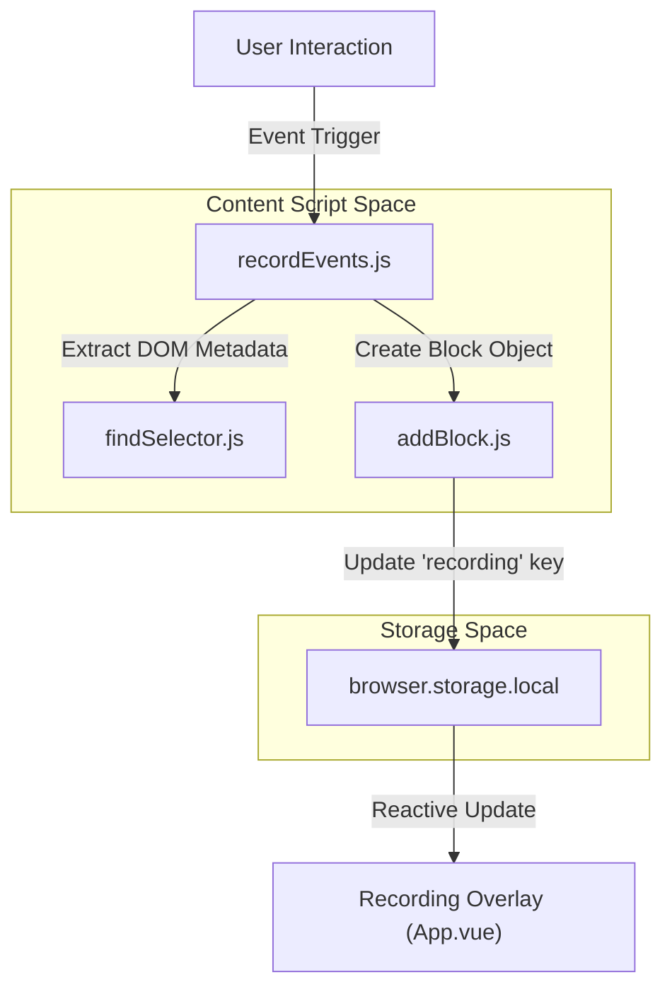
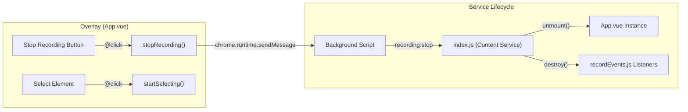

# Recording Engine

Relevant source files

The following files were used as context for generating this wiki page:

- [src/content/services/recordWorkflow/App.vue](src/content/services/recordWorkflow/App.vue)
- [src/content/services/recordWorkflow/addBlock.js](src/content/services/recordWorkflow/addBlock.js)
- [src/content/services/recordWorkflow/index.js](src/content/services/recordWorkflow/index.js)
- [src/content/services/recordWorkflow/recordEvents.js](src/content/services/recordWorkflow/recordEvents.js)
- [webpack.config.js](webpack.config.js)

The Recording Engine is a specialized subsystem of Automa designed to capture user interactions within the browser and translate them into executable workflow blocks. It operates primarily as a content service injected into web pages, utilizing event listeners to monitor the DOM and a persistent storage mechanism to build a sequence of automation tasks.

## Architecture Overview

The recording process is orchestrated by several interconnected components within the `src/content/services/recordWorkflow/` directory. It relies on `browser.storage.local` to maintain the state of the current recording session across page navigations and multiple browser tabs.

### System Flow: Interaction to Block

The following diagram illustrates how a physical user interaction (like a click) is transformed into a structured block within the recording session.

**User Interaction Capture Pipeline**

Sources: [src/content/services/recordWorkflow/recordEvents.js:15-40](), [src/content/services/recordWorkflow/addBlock.js:3-19]()

## Event Capture: recordEvents.js

The `recordEvents.js` file is the entry point for monitoring user activity. It initializes listeners for various DOM events and maps them to Automa block definitions.

### Key Event Handlers
- **`onClick(event)`**: Captures mouse clicks. It filters out clicks on the Automa UI itself using `isAutomaInstance` [src/content/services/recordWorkflow/recordEvents.js:176-178](). If the target is a link (`<a>`), it creates a `link` block; otherwise, it creates an `event-click` block [src/content/services/recordWorkflow/recordEvents.js:189-228]().
- **`onChange({ target })`**: Specifically handles form elements like `<select>` (mapping to a `forms` block) and file inputs (mapping to `upload-file`) [src/content/services/recordWorkflow/recordEvents.js:42-113]().
- **`onKeydown(event)`**: Utilizes `recordPressedKey` from utilities to capture keyboard shortcuts. It creates `press-key` blocks and handles form submission logic if the "Enter" key is pressed in a text field [src/content/services/recordWorkflow/recordEvents.js:114-175]().
- **`onScroll`**: Debounced listener that captures vertical and horizontal scroll positions, generating `element-scroll` blocks [src/content/services/recordWorkflow/recordEvents.js:257-285]().

### Cross-Frame Recording
Recording supports iframes by checking `window.self === window.top`. If an event occurs inside an iframe, `recordEvents.js` calculates the `frameSelector` and uses `window.top.postMessage` to send the event data to the main frame [src/content/services/recordWorkflow/recordEvents.js:19-36](). The main frame then appends the iframe selector using the `|>` separator [src/content/services/recordWorkflow/recordEvents.js:230-256]().

Sources: [src/content/services/recordWorkflow/recordEvents.js:1-285](), [src/content/services/recordWorkflow/index.js:9-10]()

## Block Generation: addBlock.js

The `addBlock.js` module acts as the persistence layer for the recording engine. It ensures that every captured event is appended to the `flows` array of the active recording object in local storage.

| Functionality | Implementation |
|---|---|
| **Storage Retrieval** | Fetches `isRecording` and `recording` from `browser.storage.local` [src/content/services/recordWorkflow/addBlock.js:4-7](). |
| **Data Injection** | Appends the new block to `recording.flows`. It supports both direct object injection and functional updates for complex logic [src/content/services/recordWorkflow/addBlock.js:11-14](). |
| **Persistence** | Updates the local storage to ensure data survives page reloads [src/content/services/recordWorkflow/addBlock.js:16]() |

Sources: [src/content/services/recordWorkflow/addBlock.js:1-20]()

## Recording UI Overlay (App.vue)

When a recording session is active, a floating UI (`App.vue`) is injected into the page. This overlay provides manual controls and real-time feedback.

### UI Capabilities
1.  **Manual Element Selection**: Users can click "Select element" to trigger `startSelecting()`. This activates the `shared-element-selector` component, allowing for precise targeting of elements for blocks like `get-text` or `attribute-value` [src/content/services/recordWorkflow/App.vue:38-50]().
2.  **Data Extraction Configuration**: When an element is selected manually, the UI allows the user to define variable names or table columns to store the extracted data [src/content/services/recordWorkflow/App.vue:109-161]().
3.  **Session Control**: The "Stop recording" button triggers `stopRecording`, which sends a `recording:stop` message to the background script and unmounts the recording service [src/content/services/recordWorkflow/App.vue:20-31]().

**Recording Control Logic**

Sources: [src/content/services/recordWorkflow/App.vue:197-210](), [src/content/services/recordWorkflow/index.js:26-35]()

## Session Lifecycle Management

The recording session is managed via browser messages and the extension's entry points.

1.  **Initialization**: The recording service is bundled as `recordWorkflow.bundle.js` [webpack.config.js:51-58](). It is injected into the tab when a user starts recording from the popup or dashboard.
2.  **Startup**: `index.js` initializes `recordEvents.js` and, if in the main frame, mounts the `App.vue` overlay [src/content/services/recordWorkflow/index.js:6-16]().
3.  **Termination**: Upon receiving the `recording:stop` message, the engine removes event listeners and cleans up the DOM by unmounting the Vue instance [src/content/services/recordWorkflow/index.js:27-34]().

Sources: [src/content/services/recordWorkflow/index.js:1-40](), [webpack.config.js:51-58]()

---

