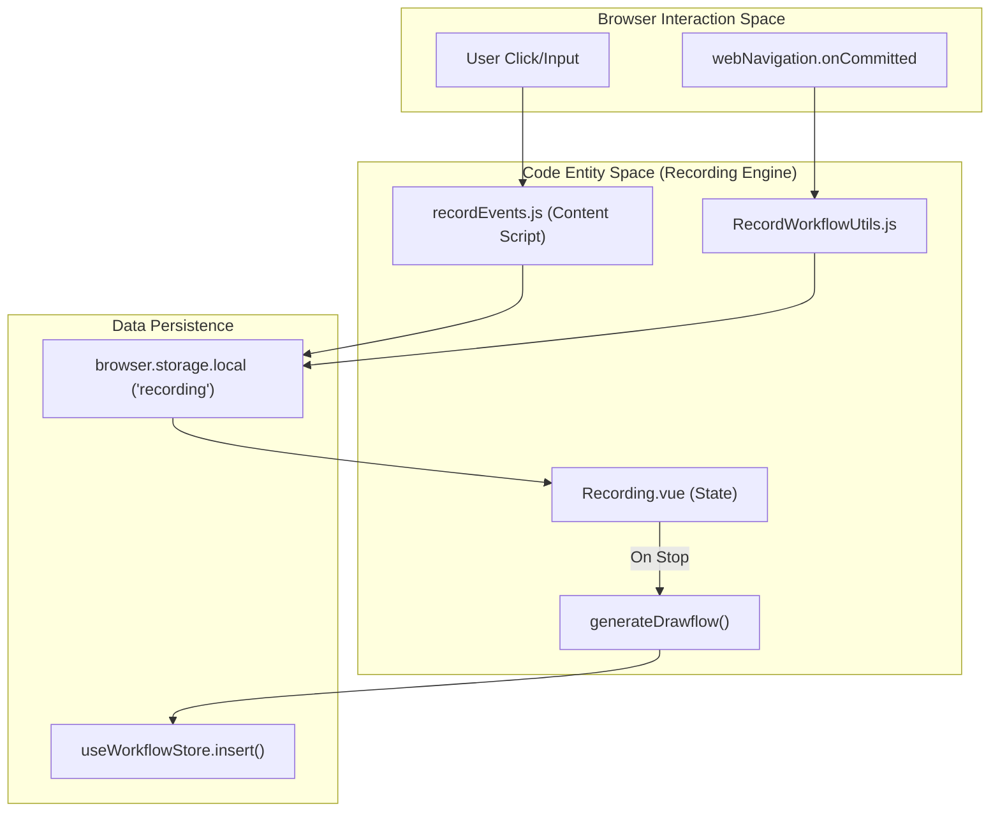
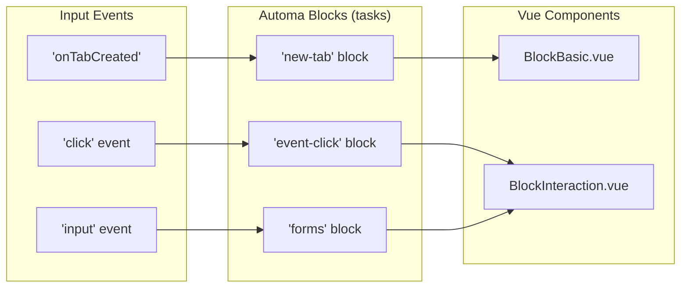

# Recording UI & Workflow Conversion

Relevant source files

The following files were used as context for generating this wiki page:

- [src/assets/css/flow.css](src/assets/css/flow.css)
- [src/components/newtab/shared/SharedWorkflowTriggers.vue](src/components/newtab/shared/SharedWorkflowTriggers.vue)
- [src/components/newtab/workflow/edit/Trigger/TriggerCronJob.vue](src/components/newtab/workflow/edit/Trigger/TriggerCronJob.vue)
- [src/components/newtab/workflow/editor/EditorLocalCtxMenu.vue](src/components/newtab/workflow/editor/EditorLocalCtxMenu.vue)
- [src/content/blocksHandler/handlerVerifySelector.js](src/content/blocksHandler/handlerVerifySelector.js)
- [src/content/showExecutedBlock.js](src/content/showExecutedBlock.js)
- [src/lib/cronstrue.js](src/lib/cronstrue.js)
- [src/newtab/index.js](src/newtab/index.js)
- [src/newtab/pages/Recording.vue](src/newtab/pages/Recording.vue)
- [src/newtab/pages/ScheduledWorkflow.vue](src/newtab/pages/ScheduledWorkflow.vue)
- [src/newtab/pages/Welcome.vue](src/newtab/pages/Welcome.vue)
- [src/newtab/utils/RecordWorkflowUtils.js](src/newtab/utils/RecordWorkflowUtils.js)
- [src/newtab/utils/elementSelector.js](src/newtab/utils/elementSelector.js)
- [src/newtab/utils/startRecordWorkflow.js](src/newtab/utils/startRecordWorkflow.js)
- [src/utils/workflowTrigger.js](src/utils/workflowTrigger.js)

The Recording subsystem manages the lifecycle of capturing user interactions and transforming them into a structured Automa workflow. This involves a specialized dashboard UI, content script injection for event capture, and a conversion engine that translates raw interaction logs into a VueFlow-compatible graph.

## Recording Lifecycle & UI Overlay

The recording process is initiated via `startRecordWorkflow.js`, which sets the `isRecording` flag in `browser.storage.local` and injects the `recordWorkflow.bundle.js` into all active HTTP tabs [src/newtab/utils/startRecordWorkflow.js:23-62](). While recording, the extension badge is updated to "rec" with a red background to indicate active capture [src/newtab/utils/startRecordWorkflow.js:37-38]().

### The Recording Dashboard
The primary interface for managing an active session is the `Recording.vue` page. It provides a real-time list of captured "flows" (blocks) and controls to finalize or prune the recording.

*   **Real-time Visualization**: Displays a list of captured blocks using the `tasks` metadata for icons and localized names [src/newtab/pages/Recording.vue:24-49]().
*   **Block Management**: Users can remove accidental interactions from the sequence before saving [src/newtab/pages/Recording.vue:236-240]().
*   **Session Persistence**: The state is synced with `browser.storage.local` under the `recording` key, allowing the recording to persist across tab closures or navigation [src/newtab/pages/Recording.vue:210-210]().

### Event Orchestration
`RecordWorkflowUtils` acts as the bridge between browser-level events and the recording state. It listens for tab creation, activation, and web navigation to automatically insert "New Tab" or "Switch Tab" blocks into the flow [src/newtab/pages/Recording.vue:63-69]().

**Sources:** [src/newtab/pages/Recording.vue:1-80](), [src/newtab/utils/startRecordWorkflow.js:5-66](), [src/newtab/utils/RecordWorkflowUtils.js:1-50]()

## Workflow Conversion Engine

The conversion from a linear list of recorded events to a valid workflow graph occurs in the `generateDrawflow` function within `Recording.vue`.

### Node Generation Logic
The engine iterates through `state.flows` and converts each entry into a node object compatible with the workflow editor.

1.  **Trigger Initialization**: If the recording doesn't start from an existing block, a default `trigger` block is created at coordinates `(50, 300)` [src/newtab/pages/Recording.vue:104-115]().
2.  **Block Data Merging**: Recorded data is merged with default block schemas using `defu` to ensure all required properties for the `tasks` definition are present [src/newtab/pages/Recording.vue:146-146]().
3.  **Automatic Positioning**: Nodes are laid out in a grid. Every 5 blocks, a new row is started by incrementing the Y-coordinate and resetting the X-coordinate [src/newtab/pages/Recording.vue:162-165]().
4.  **Edge Creation**: Sequential edges are automatically generated, connecting the `output-1` handle of the previous node to the `input-1` handle of the current node [src/newtab/pages/Recording.vue:153-160]().

### Grouping Mechanism
The engine supports `blocks-group` logic. If a recorded block contains a `groupId`, the converter aggregates these blocks into a nested structure before wrapping them in a single `blocks-group` node [src/newtab/pages/Recording.vue:124-140]().

### System Flow: Recording to Graph
The following diagram illustrates how user interactions are processed into code entities.

**Recording Data Flow**

**Sources:** [src/newtab/pages/Recording.vue:82-174](), [src/newtab/utils/RecordWorkflowUtils.js:1-30]()

## Implementation Details

### Workflow Integration
The recording system can either create a new workflow or append to an existing one. If `state.workflowId` is present, the engine identifies the connection point (the block from which recording was triggered) and merges the new nodes and edges into the existing `drawflow` object [src/newtab/pages/Recording.vue:182-198]().

### Key Functions and Classes

| Entity | Role | File |
| :--- | :--- | :--- |
| `startRecordWorkflow` | Entry point; handles badge and script injection. | [src/newtab/utils/startRecordWorkflow.js:5]() |
| `generateDrawflow` | Core logic for converting event arrays to VueFlow nodes/edges. | [src/newtab/pages/Recording.vue:82]() |
| `RecordWorkflowUtils` | Handles browser-level events (tabs, navigation). | [src/newtab/utils/RecordWorkflowUtils.js:1]() |
| `stopRecording` | Finalizes state, cleans up storage, and saves to IndexedDB. | [src/newtab/pages/Recording.vue:175]() |

### Conversion Mapping
The mapping between recorded types and block components is driven by the `tasks` utility.

**Entity Mapping Diagram**

**Sources:** [src/newtab/pages/Recording.vue:123-168](), [src/utils/shared.js:1-100](), [src/newtab/utils/startRecordWorkflow.js:14-18]()

---

