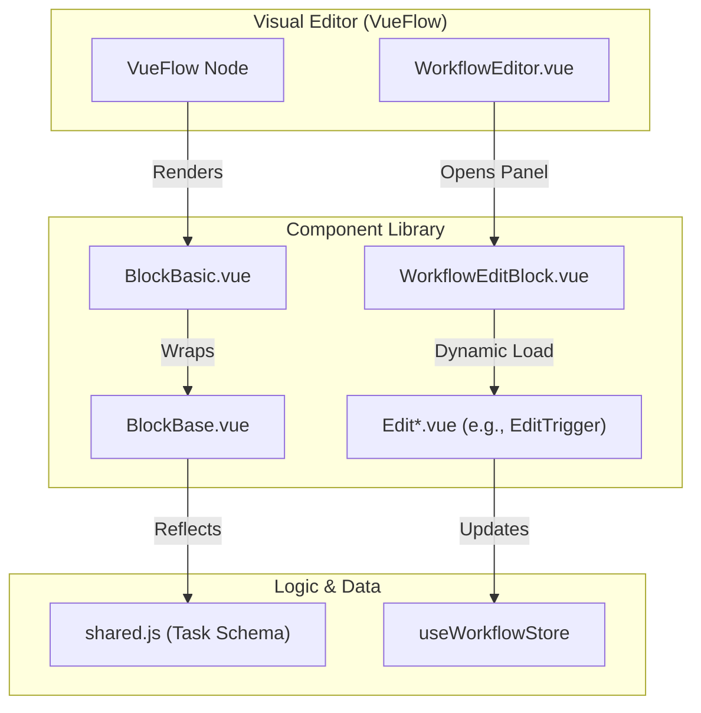
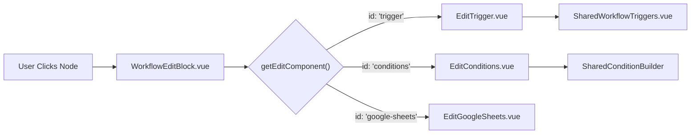

# UI Component Library

Relevant source files

The following files were used as context for generating this wiki page:

- [src/assets/css/drawflow.css](src/assets/css/drawflow.css)
- [src/components/block/BlockBase.vue](src/components/block/BlockBase.vue)
- [src/components/block/BlockBasic.vue](src/components/block/BlockBasic.vue)
- [src/components/block/BlockConditions.vue](src/components/block/BlockConditions.vue)
- [src/components/block/BlockElementExists.vue](src/components/block/BlockElementExists.vue)
- [src/components/newtab/workflow/WorkflowDetailsCard.vue](src/components/newtab/workflow/WorkflowDetailsCard.vue)
- [src/components/newtab/workflow/WorkflowEditBlock.vue](src/components/newtab/workflow/WorkflowEditBlock.vue)
- [src/components/newtab/workflow/edit/EditConditions.vue](src/components/newtab/workflow/edit/EditConditions.vue)
- [src/components/newtab/workflow/edit/EditTrigger.vue](src/components/newtab/workflow/edit/EditTrigger.vue)
- [src/components/ui/UiInput.vue](src/components/ui/UiInput.vue)

The Automa UI is built on a modular architecture of reusable components designed to provide a consistent experience across the Dashboard, Popup, and Content Script overlays. The library is split into two primary categories: block-specific components used within the workflow editor and generic UI primitives (`Ui*`) used for forms, layouts, and data visualization.

### Component Architecture Overview

The UI library bridges the gap between the visual workflow representation and the underlying task schema. Components are primarily located in `src/components/`, with block visuals in `src/components/block/` and configuration panels in `src/components/newtab/workflow/edit/`.

#### Visual to Code Mapping
The following diagram illustrates how visual entities in the Workflow Editor map to specific Vue components and data structures.

"Visual to Code Mapping"

Sources: [src/components/newtab/workflow/WorkflowEditBlock.vue:23-34](), [src/components/block/BlockBasic.vue:2-13](), [src/components/block/BlockBase.vue:2-6]()

---

## Block Visual Components
Block visual components are the nodes rendered within the `VueFlow` canvas. They handle the display of block status (enabled/disabled), input/output handles, and basic metadata like names and icons.

*   **Block Hierarchy**: Most blocks inherit from `BlockBase`, which provides the standard context menu (delete, settings, duplicate, run from here) [src/components/block/BlockBase.vue:21-68]().
*   **Specialized Visuals**: Some blocks require custom layouts to represent complex logic. For example, `BlockConditions` renders multiple output handles based on defined paths [src/components/block/BlockConditions.vue:57-78](), and `BlockElementExists` provides a dedicated fallback output [src/components/block/BlockElementExists.vue:40-45]().
*   **Validation**: Blocks utilize the `useBlockValidation` composable to display error indicators directly on the canvas if parameters are missing or invalid [src/components/block/BlockBasic.vue:156-165]().

For details, see [Block Visual Components](#10.1).

---

## Block Configuration Panels (Edit Components)
When a user clicks a block in the editor, the `WorkflowEditBlock` component dynamically resolves and mounts the corresponding configuration panel from the `src/components/newtab/workflow/edit/` directory [src/components/newtab/workflow/WorkflowEditBlock.vue:43-58]().

| Component | Responsibility |
| --- | --- |
| `EditTrigger` | Manages workflow entry points (cron, interval, etc.) and runtime parameters [src/components/newtab/workflow/edit/EditTrigger.vue:1-43](). |
| `EditConditions` | Interface for the condition builder and path management [src/components/newtab/workflow/edit/EditConditions.vue:109-119](). |
| `EditWorkflowParameters` | Defines the schema for data requested from the user at runtime [src/components/newtab/workflow/edit/EditTrigger.vue:26-32](). |

### Configuration Flow
"Configuration Component Resolution"

Sources: [src/components/newtab/workflow/WorkflowEditBlock.vue:137-142](), [src/components/newtab/workflow/edit/EditTrigger.vue:49-50](), [src/components/newtab/workflow/edit/EditConditions.vue:128]()

---

## Generic UI Components (Ui*)
Automa maintains a set of generic, theme-aware UI primitives in `src/components/ui/`. These are used throughout the application to ensure a unified design language.

*   **Input & Forms**: `UiInput`, `UiSelect`, `UiCheckbox`, and `UiTextarea`. `UiInput` supports masking via `vue-imask` and status-based styling (e.g., error rings) [src/components/ui/UiInput.vue:34-56]().
*   **Overlays**: `UiModal` and `UiPopover` handle z-index management and portal-based rendering. `UiPopover` is frequently used for icon pickers and quick actions [src/components/newtab/workflow/WorkflowDetailsCard.vue:3-37]().
*   **Data Display**: `UiTable` and `UiPagination` are used in the Logs and Storage sections to manage large datasets.

For details, see [Generic UI Components (Ui*)](#10.2).

---

## Shared Utility Components
Beyond basic primitives, several complex components are shared across different views:
*   **SharedCodemirror**: A wrapper for the CodeMirror editor used for JavaScript blocks, JSON configuration, and data viewing.
*   **SharedConditionBuilder**: A recursive UI for building nested logical statements (AND/OR groups) used in `EditConditions` [src/components/newtab/workflow/edit/EditConditions.vue:113-117]().
*   **WorkflowBlockList**: Renders the searchable list of available blocks in the editor sidebar, including "Pinned" blocks stored in local storage [src/components/newtab/workflow/WorkflowDetailsCard.vue:61-78]().

Sources: [src/components/newtab/workflow/WorkflowDetailsCard.vue:180-201](), [src/components/newtab/workflow/edit/EditConditions.vue:128]()

---

