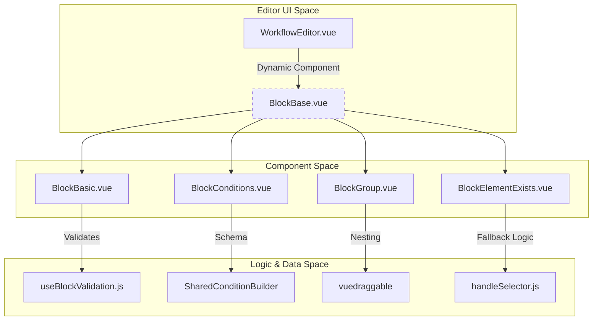
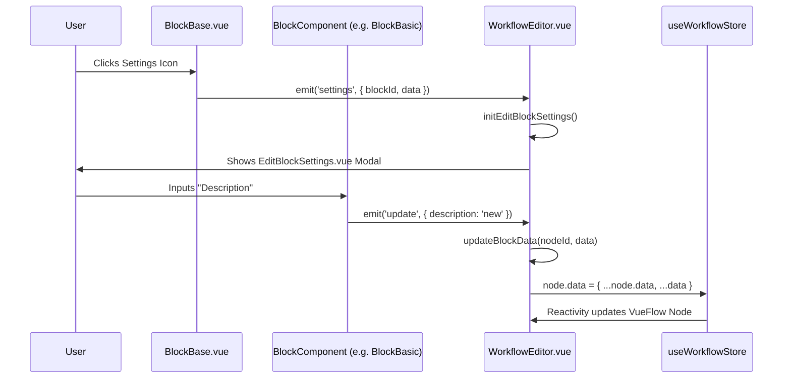

# Block Visual Components

Relevant source files

The following files were used as context for generating this wiki page:

- [src/assets/css/drawflow.css](src/assets/css/drawflow.css)
- [src/components/block/BlockBase.vue](src/components/block/BlockBase.vue)
- [src/components/block/BlockBasic.vue](src/components/block/BlockBasic.vue)
- [src/components/block/BlockBasicWithFallback.vue](src/components/block/BlockBasicWithFallback.vue)
- [src/components/block/BlockConditions.vue](src/components/block/BlockConditions.vue)
- [src/components/block/BlockDelay.vue](src/components/block/BlockDelay.vue)
- [src/components/block/BlockElementExists.vue](src/components/block/BlockElementExists.vue)
- [src/components/block/BlockGroup.vue](src/components/block/BlockGroup.vue)
- [src/components/block/BlockGroup2.vue](src/components/block/BlockGroup2.vue)
- [src/components/block/BlockLoopBreakpoint.vue](src/components/block/BlockLoopBreakpoint.vue)
- [src/components/block/BlockPackage.vue](src/components/block/BlockPackage.vue)
- [src/components/block/BlockRepeatTask.vue](src/components/block/BlockRepeatTask.vue)
- [src/components/newtab/package/PackageDetails.vue](src/components/newtab/package/PackageDetails.vue)
- [src/components/newtab/workflow/WorkflowEditor.vue](src/components/newtab/workflow/WorkflowEditor.vue)
- [src/components/newtab/workflow/edit/EditAutocomplete.vue](src/components/newtab/workflow/edit/EditAutocomplete.vue)
- [src/components/newtab/workflow/edit/EditConditions.vue](src/components/newtab/workflow/edit/EditConditions.vue)
- [src/components/newtab/workflow/editor/EditorLocalSavedBlocks.vue](src/components/newtab/workflow/editor/EditorLocalSavedBlocks.vue)
- [src/components/newtab/workflow/editor/EditorPkgActions.vue](src/components/newtab/workflow/editor/EditorPkgActions.vue)
- [src/components/ui/UiAutocomplete.vue](src/components/ui/UiAutocomplete.vue)
- [src/components/ui/UiButton.vue](src/components/ui/UiButton.vue)
- [src/newtab/pages/Packages.vue](src/newtab/pages/Packages.vue)
- [src/stores/package.js](src/stores/package.js)

The visual representation of blocks in the Automa workflow editor is built on a hierarchical component system using **VueFlow**. This system abstracts common UI logic—such as handle placement, context menus, and execution triggers—into base wrappers, allowing specific block types to focus on their unique parameters and data displays.

## Component Hierarchy Overview

Automa utilizes a tiered structure for block components located in `src/components/block/`.

### BlockBase
`BlockBase.vue` is the universal wrapper for every node in the editor. It provides the standard "Block Menu" that appears on hover or selection.

*   **Implementation**: Wraps content in a `ui-card` and manages the absolute-positioned menu container [src/components/block/BlockBase.vue:7-81]().
*   **Key Features**:
    *   **Block Menu**: Includes buttons for Delete, Settings, Move to Group, Enable/Disable, and "Run from here" [src/components/block/BlockBase.vue:21-68]().
    *   **Breakpoint Toggle**: Displays a red record icon if `testingMode` is active and the block is marked as a breakpoint [src/components/block/BlockBase.vue:72-80]().
    *   **Execution Bridge**: Uses `workflow-utils` (injected) to call `executeFromBlock(blockId)` when the play button is clicked [src/components/block/BlockBase.vue:132-136]().
    *   **Drag & Drop**: Handles `dragstart` for moving blocks into groups by serializing block data into `event.dataTransfer` [src/components/block/BlockBase.vue:122-131]().

### BlockBasic
The most common implementation, used for blocks with a single input and single output.

*   **Logic**: Uses `useBlockValidation` to display error icons if parameters are missing [src/components/block/BlockBasic.vue:156-165]().
*   **Data Flow**: Emits `update`, `delete`, and `settings` events back to the `WorkflowEditor.vue` [src/components/block/BlockBasic.vue:149-150]().
*   **Visuals**: Dynamically resolves icons via `getIconPath` and handles special cases like the AI Workflow SVG [src/components/block/BlockBasic.vue:25-54]().

### Sources
Sources: [src/components/block/BlockBase.vue:1-148](), [src/components/block/BlockBasic.vue:1-204](), [src/components/newtab/workflow/WorkflowEditor.vue:51-63]()

---

## Control Flow Components

Blocks that alter the execution path (branching or looping) require custom handle configurations and internal layouts.

### BlockConditions (Multi-Output)
Represents the `conditions` block which branches the workflow based on logical evaluations.

*   **Dynamic Handles**: Each condition defined in `data.conditions` generates a unique `Handle` with an ID format of `${id}-output-${item.id}` [src/components/block/BlockConditions.vue:33-63]().
*   **Fallback Path**: Always provides a dedicated fallback handle at the bottom with ID `${id}-output-fallback` [src/components/block/BlockConditions.vue:72-78]().
*   **Editing**: Double-clicking a condition item emits an `edit` event with the specific `editCondition` ID, which triggers the `SharedConditionBuilder` in the settings panel [src/components/block/BlockConditions.vue:37-38](), [src/components/newtab/workflow/edit/EditConditions.vue:207-212]().

### BlockRepeatTask & BlockDelay
Specialized UI for timing and simple iteration.

*   **BlockRepeatTask**: Includes an inline input for the `repeatFor` value. It features two outputs: one for the loop body (`output-1`) and one for completion (`output-2`) [src/components/block/BlockRepeatTask.vue:22-44]().
*   **BlockDelay**: A simplified wrapper that allows direct input of time in milliseconds or seconds [src/components/block/BlockDelay.vue:28-38]().

### BlockLoopBreakpoint
Allows users to break out of a loop. It includes a `clearLoop` checkbox to determine if the loop should be completely terminated [src/components/block/BlockLoopBreakpoint.vue:37-43]().

### Block Visual Logic Mapping

The following diagram bridges the visual component types to their underlying code entities and data schemas.

**Diagram: Block Component Architecture**

Sources: [src/components/block/BlockConditions.vue:1-115](), [src/components/block/BlockRepeatTask.vue:1-87](), [src/components/block/BlockDelay.vue:1-90](), [src/components/block/BlockLoopBreakpoint.vue:1-79]()

---

## Nesting and Grouping

### BlockGroup & BlockGroup2
These components allow nesting multiple blocks within a single visual container.

*   **Implementation**: Uses `vuedraggable` to allow users to reorder blocks inside the group [src/components/block/BlockGroup.vue:40-48]().
*   **Internal CRUD**:
    *   **Add**: Blocks are added via `handleDrop` which parses the `event.dataTransfer` payload [src/components/block/BlockGroup.vue:219-236]().
    *   **Edit**: Individual items within the group can be edited via `editItemSettings`, which emits the `itemId` to the parent editor to open the correct settings panel [src/components/block/BlockGroup.vue:171-178]().
*   **Exclusions**: Certain blocks (like the `trigger` block) are restricted from being added to groups via `excludeGroupBlocks` [src/components/block/BlockGroup.vue:228-236]().

### BlockPackage
A specialized group block that references a reusable "Package" entity. Unlike standard groups, `BlockPackage` interacts with the `usePackageStore` and allows updating all instances of a package across different workflows.

### Sources
Sources: [src/components/block/BlockGroup.vue:1-236](), [src/components/newtab/workflow/WorkflowEditor.vue:143-157]()

---

## Interaction Data Flow

The flow of data from a user interaction on a block component to the state store follows a strict event-driven path.

**Diagram: Block Interaction Pipeline**

### Key Functions in WorkflowEditor.vue
*   **`updateBlockData(nodeId, data)`**: Finds the node in the VueFlow instance and merges the new data into `node.data` [src/components/newtab/workflow/WorkflowEditor.vue:222-229]().
*   **`updateBlockSettingsData(newSettings)`**: Handles updates specifically from the settings modal. It checks if the update is for a top-level block or an item nested inside a `BlockGroup` using `blockSettingsState.data.itemId` [src/components/newtab/workflow/WorkflowEditor.vue:230-249]().
*   **`nodeTypes`**: A computed object that maps block names (e.g., `node-BlockBasic`) to their imported Vue components using `require.context` [src/components/newtab/workflow/WorkflowEditor.vue:143-157]().

### Sources
Sources: [src/components/newtab/workflow/WorkflowEditor.vue:143-250](), [src/components/block/BlockBase.vue:31-36](), [src/components/block/BlockBasic.vue:11-12]()

---

