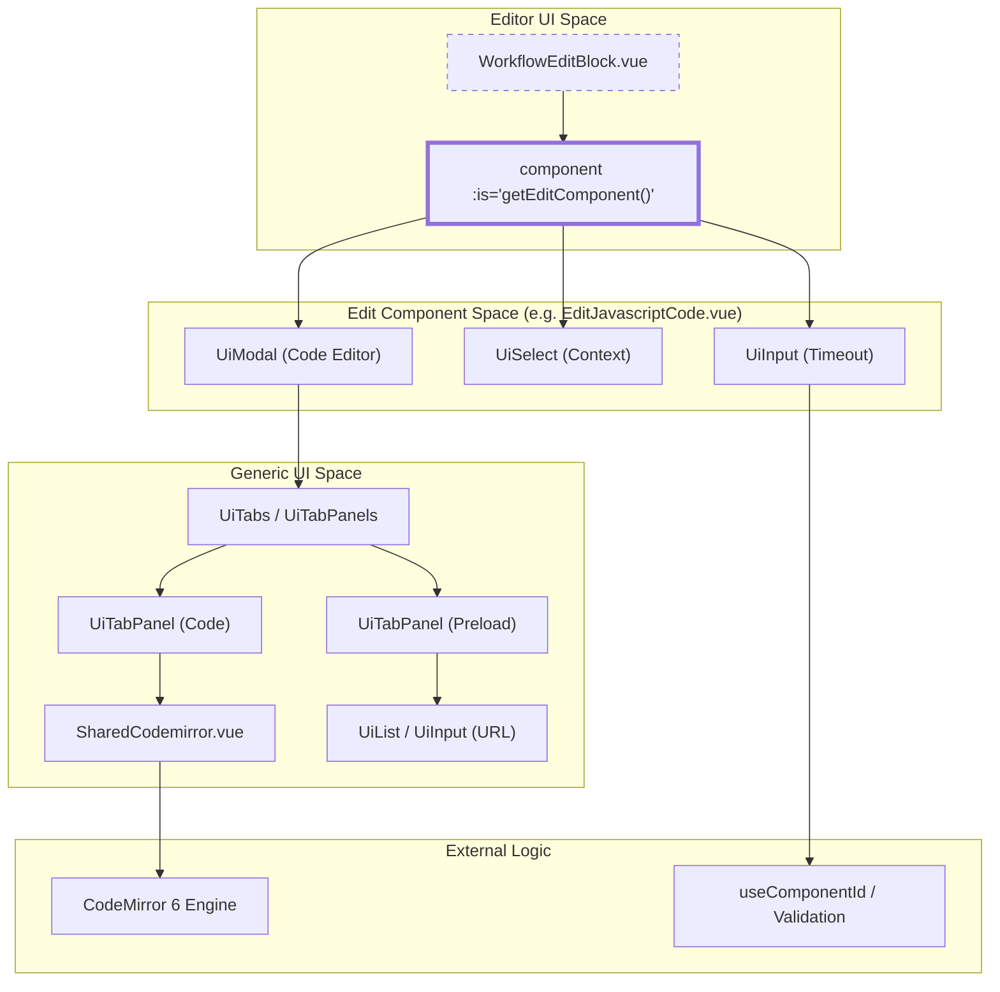
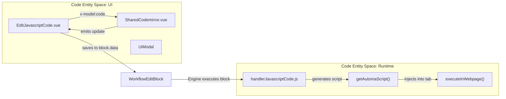

# Generic UI Components (Ui*)

Relevant source files

The following files were used as context for generating this wiki page:

- [src/components/block/BlockGroup2.vue](src/components/block/BlockGroup2.vue)
- [src/components/newtab/settings/SettingsBackupItems.vue](src/components/newtab/settings/SettingsBackupItems.vue)
- [src/components/newtab/settings/jsBlockWrap.js](src/components/newtab/settings/jsBlockWrap.js)
- [src/components/newtab/shared/SharedCodemirror.vue](src/components/newtab/shared/SharedCodemirror.vue)
- [src/components/newtab/shared/SharedConditionBuilder/ConditionBuilderInputs.vue](src/components/newtab/shared/SharedConditionBuilder/ConditionBuilderInputs.vue)
- [src/components/newtab/shared/SharedConditionBuilder/index.vue](src/components/newtab/shared/SharedConditionBuilder/index.vue)
- [src/components/newtab/workflow/WorkflowDetailsCard.vue](src/components/newtab/workflow/WorkflowDetailsCard.vue)
- [src/components/newtab/workflow/WorkflowEditBlock.vue](src/components/newtab/workflow/WorkflowEditBlock.vue)
- [src/components/newtab/workflow/edit/EditAutocomplete.vue](src/components/newtab/workflow/edit/EditAutocomplete.vue)
- [src/components/newtab/workflow/edit/EditCreateElement.vue](src/components/newtab/workflow/edit/EditCreateElement.vue)
- [src/components/newtab/workflow/edit/EditInteractionBase.vue](src/components/newtab/workflow/edit/EditInteractionBase.vue)
- [src/components/newtab/workflow/edit/EditJavascriptCode.vue](src/components/newtab/workflow/edit/EditJavascriptCode.vue)
- [src/components/newtab/workflow/edit/EditTrigger.vue](src/components/newtab/workflow/edit/EditTrigger.vue)
- [src/components/newtab/workflow/settings/SettingsGeneral.vue](src/components/newtab/workflow/settings/SettingsGeneral.vue)
- [src/components/ui/UiAutocomplete.vue](src/components/ui/UiAutocomplete.vue)
- [src/components/ui/UiCheckbox.vue](src/components/ui/UiCheckbox.vue)
- [src/components/ui/UiExpand.vue](src/components/ui/UiExpand.vue)
- [src/components/ui/UiInput.vue](src/components/ui/UiInput.vue)
- [src/components/ui/UiPagination.vue](src/components/ui/UiPagination.vue)
- [src/components/ui/UiTab.vue](src/components/ui/UiTab.vue)
- [src/components/ui/UiTabPanel.vue](src/components/ui/UiTabPanel.vue)
- [src/components/ui/UiTabPanels.vue](src/components/ui/UiTabPanels.vue)
- [src/components/ui/UiTabs.vue](src/components/ui/UiTabs.vue)
- [src/components/ui/UiTextarea.vue](src/components/ui/UiTextarea.vue)
- [src/content/blocksHandler/handlerCreateElement.js](src/content/blocksHandler/handlerCreateElement.js)
- [src/workflowEngine/blocksHandler/handlerJavascriptCode.js](src/workflowEngine/blocksHandler/handlerJavascriptCode.js)

The Automa UI library consists of a suite of reusable, generic components located in `src/components/ui/`. These components provide a consistent design language and behavioral logic across the Dashboard (New Tab), Popup, and custom element overlays. They abstract standard HTML form elements and complex UI patterns like modals, tabs, and autocompletion.

## Core Form Components

These components form the basis of the workflow editor's block configuration panels.

### UiInput & UiTextarea
`UiInput` is a wrapper around the standard HTML `<input>` element. It supports labels, icons (via `v-remixicon`), and data masking using `vue-imask` [src/components/ui/UiInput.vue:56-57](). It handles value updates via the `emitValue` function, supporting modifiers like `.lowercase` and `.number` [src/components/ui/UiInput.vue:144-160]().

`UiTextarea` provides similar functionality for multi-line text, often used for block descriptions or large data inputs. It frequently includes an `autoresize` prop to adjust height dynamically [src/components/newtab/workflow/edit/EditInteractionBase.vue:5-11]().

### UiSelect & UiCheckbox
`UiSelect` provides a styled dropdown menu. It is extensively used for selecting execution contexts (e.g., "background" vs "website") and block-specific options [src/components/newtab/workflow/edit/EditJavascriptCode.vue:19-37]().
`UiCheckbox` manages boolean states, such as the `everyNewTab` or `runBeforeLoad` settings in JavaScript blocks [src/components/newtab/workflow/edit/EditJavascriptCode.vue:49-63]().

### UiAutocomplete
A specialized component that provides a filtered list of suggestions as the user types. It is used for variable injection and selector suggestions.
*   **Trigger Mechanism**: Can be configured to trigger on specific characters (e.g., `{{`) via the `triggerChar` prop [src/components/ui/UiAutocomplete.vue:63-66]().
*   **Search Logic**: The `showPopover` function calculates the caret position and extracts search text to filter the `items` array [src/components/ui/UiAutocomplete.vue:158-187]().

**Sources:** [src/components/ui/UiInput.vue:1-161](), [src/components/ui/UiAutocomplete.vue:1-312](), [src/components/newtab/workflow/edit/EditInteractionBase.vue:1-143]()

---

## Layout and Navigation Components

### UiModal
Used for high-level interactions that require focus, such as the Code Editor modal or Workflow Triggers configuration. It supports custom headers and content classes [src/components/newtab/workflow/edit/EditTrigger.vue:21-42]().

### UiTabs, UiTab, & UiTabPanels
This suite of components manages local navigation within modals or panels.
*   **State Management**: Typically controlled by a `v-model` representing the `activeTab` [src/components/newtab/workflow/edit/EditJavascriptCode.vue:66-75]().
*   **Implementation**: `UiTabPanels` uses the active value to determine which `UiTabPanel` to render [src/components/ui/UiTabPanels.vue:1-20]().

### UiExpand
A collapsible container used to hide advanced options, such as "Selector Options" in interaction blocks [src/components/newtab/workflow/edit/EditInteractionBase.vue:41-53]().

**Sources:** [src/components/newtab/workflow/edit/EditJavascriptCode.vue:64-148](), [src/components/newtab/workflow/edit/EditTrigger.vue:21-42](), [src/components/ui/UiTabPanels.vue:1-20]()

---

## Specialized Shared Components

Automa includes complex shared components that integrate third-party libraries for specific workflow needs.

### SharedCodemirror
A wrapper for the CodeMirror 6 editor, used for JavaScript, CSS, and HTML editing.
*   **Extensions**: Supports dynamic extensions such as `oneDark` theme, language-specific support (JS, JSON, CSS, HTML), and custom autocompletion [src/components/newtab/shared/SharedCodemirror.vue:77-89]().
*   **Reactivity**: It watches the `modelValue` and dispatches changes to the CodeMirror `view` instance to keep the editor in sync with Vue state [src/components/newtab/shared/SharedCodemirror.vue:91-100]().

### SharedConditionBuilder
A complex UI for building logical expressions (e.g., `value == "test"`).
*   **Data Flow**: Uses `ConditionBuilderInputs.vue` to render rows of inputs. Each row allows selecting a `value` type and a `compare` operator [src/components/newtab/shared/SharedConditionBuilder/ConditionBuilderInputs.vue:2-25]().
*   **Integration**: Integrates `SharedCodemirror` for cases where a condition requires a JavaScript expression [src/components/newtab/shared/SharedConditionBuilder/ConditionBuilderInputs.vue:62-68]().

**Sources:** [src/components/newtab/shared/SharedCodemirror.vue:1-111](), [src/components/newtab/shared/SharedConditionBuilder/ConditionBuilderInputs.vue:1-219]()

---

## Data Flow: Component Interaction

The following diagram illustrates how a Block Edit panel (e.g., `EditJavascriptCode`) utilizes generic `Ui*` components and `Shared*` components to manage block data.

### Block Configuration Data Flow
| Component | Role | Data Target |
| :--- | :--- | :--- |
| `WorkflowEditBlock` | Parent container | `props.data` |
| `EditJavascriptCode` | Logic controller | `blockData` (v-model) |
| `UiInput` / `UiSelect` | Basic input | `blockData.timeout`, `blockData.context` |
| `SharedCodemirror` | Advanced editor | `blockData.code` |
| `UiModal` | Overlay | Visibility state |

### Component Hierarchy and Logic Diagram

Title: UI Component Hierarchy for Block Editing

**Sources:** [src/components/newtab/workflow/WorkflowEditBlock.vue:23-34](), [src/components/newtab/workflow/edit/EditJavascriptCode.vue:64-148]()

---

## JavaScript Execution UI Integration

The `Ui*` components are not just for visual display; they configure the parameters that `handlerJavascriptCode.js` uses at runtime.

Title: Bridge from UI Configuration to Code Execution

**Sources:** [src/components/newtab/workflow/edit/EditJavascriptCode.vue:81-86](), [src/workflowEngine/blocksHandler/handlerJavascriptCode.js:15-58](), [src/workflowEngine/blocksHandler/handlerJavascriptCode.js:59-73]()

---

## Implementation Details

### Autocomplete Filtering Logic
The `filteredItems` computed property in `UiAutocomplete` determines which suggestions to show based on whether a `triggerChar` was detected.

1.  **Detection**: `getLastKeyBeforeCaret` identifies if a trigger character (like `@` or `{{`) precedes the cursor [src/components/ui/UiAutocomplete.vue:122-134]().
2.  **Extraction**: `getSearchText` slices the string from the trigger character to the cursor [src/components/ui/UiAutocomplete.vue:135-157]().
3.  **Filtering**: The `customFilter` or default includes/check is applied to the `items` prop [src/components/ui/UiAutocomplete.vue:103-120]().

### CodeMirror Integration
`SharedCodemirror.vue` initializes the editor in the `onMounted` hook [src/components/newtab/shared/SharedCodemirror.vue:102-107](). It uses an `updateListener` to bridge the gap between CodeMirror's internal document state and Vue's reactivity system, emitting `update:modelValue` whenever the document changes [src/components/newtab/shared/SharedCodemirror.vue:62-71]().

**Sources:** [src/components/ui/UiAutocomplete.vue:103-157](), [src/components/newtab/shared/SharedCodemirror.vue:62-110]()

---

