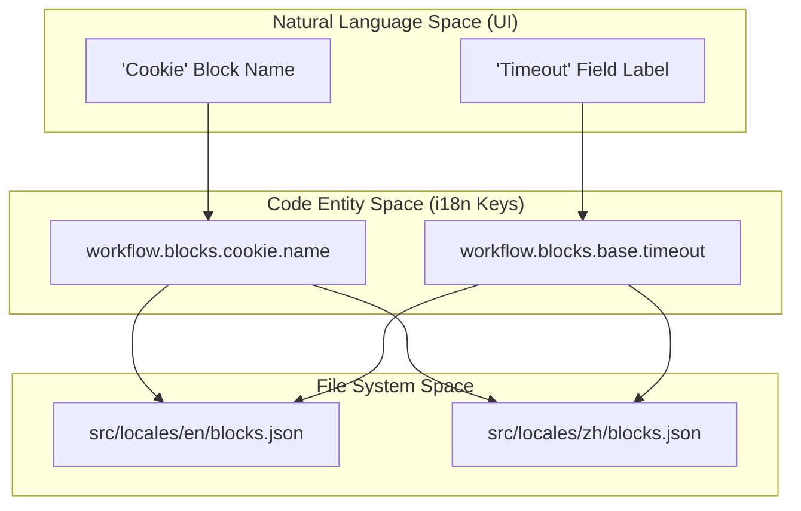
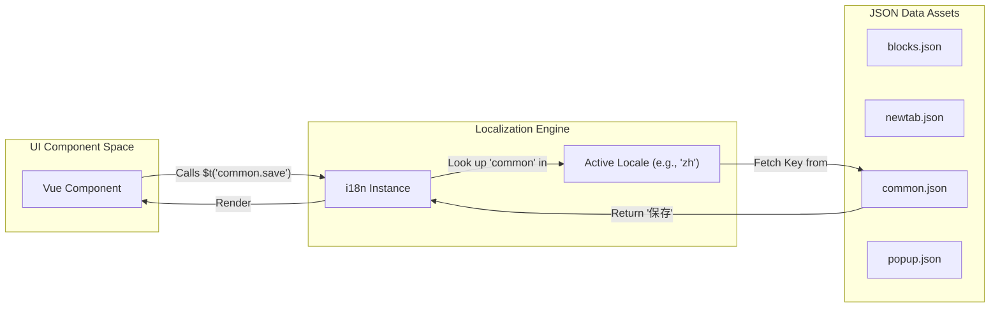

# Internationalization (i18n)

Relevant source files

The following files were used as context for generating this wiki page:

- [.vscode/settings.json](.vscode/settings.json)
- [src/locales/en/popup.json](src/locales/en/popup.json)
- [src/locales/es/newtab.json](src/locales/es/newtab.json)
- [src/locales/fr/blocks.json](src/locales/fr/blocks.json)
- [src/locales/fr/common.json](src/locales/fr/common.json)
- [src/locales/fr/newtab.json](src/locales/fr/newtab.json)
- [src/locales/fr/popup.json](src/locales/fr/popup.json)
- [src/locales/it/blocks.json](src/locales/it/blocks.json)
- [src/locales/it/common.json](src/locales/it/common.json)
- [src/locales/it/newtab.json](src/locales/it/newtab.json)
- [src/locales/it/popup.json](src/locales/it/popup.json)
- [src/locales/tr/newtab.json](src/locales/tr/newtab.json)
- [src/locales/uk/blocks.json](src/locales/uk/blocks.json)
- [src/locales/uk/common.json](src/locales/uk/common.json)
- [src/locales/uk/newtab.json](src/locales/uk/newtab.json)
- [src/locales/uk/popup.json](src/locales/uk/popup.json)
- [src/locales/vi/blocks.json](src/locales/vi/blocks.json)
- [src/locales/vi/common.json](src/locales/vi/common.json)
- [src/locales/vi/newtab.json](src/locales/vi/newtab.json)
- [src/locales/vi/popup.json](src/locales/vi/popup.json)
- [src/locales/zh-TW/blocks.json](src/locales/zh-TW/blocks.json)
- [src/locales/zh-TW/common.json](src/locales/zh-TW/common.json)
- [src/locales/zh-TW/newtab.json](src/locales/zh-TW/newtab.json)
- [src/locales/zh-TW/popup.json](src/locales/zh-TW/popup.json)
- [src/locales/zh/blocks.json](src/locales/zh/blocks.json)
- [src/locales/zh/common.json](src/locales/zh/common.json)
- [src/locales/zh/newtab.json](src/locales/zh/newtab.json)
- [src/locales/zh/popup.json](src/locales/zh/popup.json)
- [src/offscreen/index.js](src/offscreen/index.js)

The Internationalization (i18n) system in Automa enables the extension to support multiple languages by decoupling UI strings and block metadata from the source code. It uses a structured JSON-based localization approach, where translation keys map to specific functional areas of the application.

## Supported Languages

Automa currently supports the following locales, organized within the `src/locales/` directory:

| Locale Code | Language |
|---|---|
| `en` | English |
| `zh` | Chinese (Simplified) |
| `zh-TW` | Chinese (Traditional) |
| `fr` | French |
| `it` | Italian |
| `es` | Spanish |
| `vi` | Vietnamese |
| `tr` | Turkish |
| `uk` | Ukrainian |
| `pt-BR` | Portuguese (Brazil) |

Sources: `src/locales/` directory structure.

## Locale File Structure

The localization data is partitioned into four primary JSON files per locale to manage different contexts of the extension.

### 1. `blocks.json`
This file contains all strings related to workflow blocks, including their names, descriptions, and configuration field labels. It is structured hierarchically by block ID.
*   **Path Example:** `src/locales/zh/blocks.json` [src/locales/zh/blocks.json:1-267]()
*   **Key Sections:**
    *   `workflow.blocks.base`: Common settings for all blocks like "Timeout", "Selector", and "On Error" [src/locales/zh/blocks.json:12-104]().
    *   `workflow.blocks.[block-id]`: Specific strings for individual blocks (e.g., `cookie`, `javascript-code`, `google-sheets`) [src/locales/zh/blocks.json:111-267]().

### 2. `newtab.json`
Contains strings for the main Dashboard (the "New Tab" page).
*   **Path Example:** `src/locales/zh/newtab.json` [src/locales/zh/newtab.json:1-303]()
*   **Key Sections:**
    *   `settings`: General extension settings, editor preferences, and backup configurations [src/locales/zh/newtab.json:107-190]().
    *   `workflow`: Dashboard-specific workflow management strings (e.g., "Import", "Export", "Workflow Events") [src/locales/zh/newtab.json:191-303]().

### 3. `common.json`
General-purpose strings used across multiple contexts (Dashboard, Popup, Content Scripts).
*   **Path Example:** `src/locales/zh/common.json` [src/locales/zh/common.json:1-77]()
*   **Key Sections:**
    *   `common`: Standard actions like "Save", "Cancel", "Delete", and "Execute" [src/locales/zh/common.json:2-52]().
    *   `message`: Global error or info messages like "No data found" or "Something went wrong" [src/locales/zh/common.json:53-64]().

### 4. `popup.json`
Specific to the browser extension's popup interface.
*   **Path Example:** `src/locales/zh/popup.json` [src/locales/zh/popup.json:1-32]()
*   **Key Sections:**
    *   `recording`: Strings for the workflow recording overlay [src/locales/zh/popup.json:2-5]().
    *   `home`: The popup's main view, including the workflow list and element selector button [src/locales/zh/popup.json:6-31]().

## Implementation Logic

The system utilizes a nested key structure. In the code, these are accessed via a translation function (typically `$t` in Vue components).

### Translation Key Mapping
The following diagram illustrates how a logical block in the "Natural Language Space" (e.g., the "Cookie" block) maps to the "Code Entity Space" through the i18n JSON structure.

**Block Translation Mapping**

Sources: [src/locales/zh/blocks.json:12-113](), [src/locales/en/popup.json:23-29]().

### Workflow Engine Data Flow
During workflow execution, the engine may need to log localized messages or interact with UI components that require translation.

**Localization Resolution Flow**

Sources: [src/locales/zh/common.json:26-26](), [src/locales/zh/newtab.json:141-145]().

## Developer Configuration

For development, Automa uses the `i18n-ally` VS Code extension to manage these translations efficiently. The configuration ensures that keys are kept in a nested format and points to the correct locale paths.

*   **Locales Path:** `src/locales` [.vscode/settings.json:2-4]()
*   **Key Style:** `nested` [.vscode/settings.json:5-5]()

### Adding a New String
1.  Identify the context (e.g., if it's a new block setting, use `blocks.json`).
2.  Add the key to `src/locales/en/[file].json`.
3.  Add corresponding translations to other locale files to prevent missing key warnings.
4.  Use `@:path.to.key` for cross-file references within JSON files (e.g., referencing a common string inside `blocks.json`) [src/locales/zh/blocks.json:196-196]().

Sources: [.vscode/settings.json:1-7](), [src/locales/zh/blocks.json:196-196]().

---

