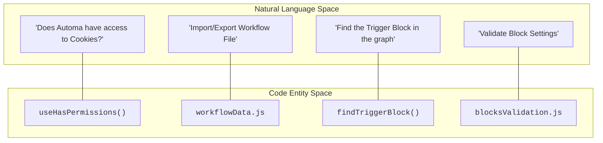
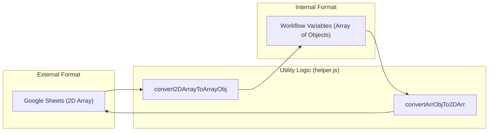

# Composables & Utilities

Relevant source files

The following files were used as context for generating this wiki page:

- [src/components/newtab/workflow/edit/EditCookie.vue](src/components/newtab/workflow/edit/EditCookie.vue)
- [src/components/newtab/workflow/edit/Trigger/TriggerContextMenu.vue](src/components/newtab/workflow/edit/Trigger/TriggerContextMenu.vue)
- [src/composable/blockValidation.js](src/composable/blockValidation.js)
- [src/composable/hasPermissions.js](src/composable/hasPermissions.js)
- [src/manifest.chrome.json](src/manifest.chrome.json)
- [src/manifest.firefox.json](src/manifest.firefox.json)
- [src/newtab/utils/blocksValidation.js](src/newtab/utils/blocksValidation.js)
- [src/utils/helper.js](src/utils/helper.js)

Automa leverages a robust layer of **Vue Composables** and **Utility Modules** to manage cross-cutting concerns such as browser permissions, data transformation, and UI state. This architecture ensures that complex logic—like converting a 2D array from a Google Sheet into an object array—is centralized and reusable across the Dashboard, Popup, and Content Scripts.

## Architecture Overview

The utility layer bridges the gap between the browser's low-level APIs (via `webextension-polyfill`) and the high-level Vue components. Composables primarily handle reactive state and lifecycle-bound logic, while utility modules provide pure functions for data manipulation and workflow parsing.

### Code Entity Mapping

The following diagram illustrates how natural language concepts in the Automa UI map to specific code entities in the utility and composable layers.

**System Concept to Code Entity Map**

**Sources:** [src/composable/hasPermissions.js:6-7](), [src/utils/helper.js:57-58](), [src/newtab/utils/blocksValidation.js:11-12]()

---

## Vue Composables (src/composable/)

Composables are the primary way Automa shares reactive logic between components. They handle complex integrations like keyboard shortcuts, undo/redo stacks, and permission requests.

| Composable | Purpose | Key Functionality |
| --- | --- | --- |
| `useHasPermissions` | Permission Management | Checks `browser.permissions.contains` and handles `request()` calls for optional permissions like `cookies` or `downloads`. [src/composable/hasPermissions.js:6-57]() |
| `useBlockValidation` | Editor Feedback | Watches block data changes and runs validation logic from `blocksValidation.js` to show error lists in the UI. [src/composable/blockValidation.js:4-40]() |
| `useShortcut` | Keyboard Bindings | Binds Mousetrap events to component actions (e.g., saving a workflow with `Ctrl+S`). |
| `useLiveQuery` | Dexie Reactivity | Provides a reactive wrapper around IndexedDB queries for the dashboard logs and storage views. |

For a deep dive into all available composables, see [Vue Composables](#12.1).

**Sources:** [src/composable/hasPermissions.js:1-57](), [src/composable/blockValidation.js:1-41]()

---

## Utility Modules (src/utils/)

Utility modules contain non-reactive helper functions used by the Workflow Engine and the UI. These are critical for data interoperability.

### Data Flow & Transformation
Automa frequently transforms data between different formats, particularly when interacting with external services like Google Sheets.

**Data Transformation Pipeline**

**Sources:** [src/utils/helper.js:87-141]()

### Key Utility Modules

*   **`helper.js`**: A collection of general-purpose functions. Includes `getActiveTab` for browser interaction [src/utils/helper.js:4-27](), `replaceMustache` for the templating engine [src/utils/helper.js:159-162](), and `clearCache` for workflow cleanup [src/utils/helper.js:251-271]().
*   **`blocksValidation.js`**: Contains the logic to ensure block configurations are valid before execution. It checks for empty URLs, missing selectors, and required permissions. [src/newtab/utils/blocksValidation.js:11-256]()
*   **`workflowData.js`**: Manages the serialization and deserialization of workflow files during import and export operations.
*   **`convertWorkflowData.js`**: Handles the migration of legacy `drawflow` data structures to the modern `VueFlow` format.

For details on all utility functions, see [Utility Modules](#12.2).

**Sources:** [src/utils/helper.js:1-290](), [src/newtab/utils/blocksValidation.js:1-260]()

---

## Permission Integration

A key intersection of utilities and composables is the permission system. The `blocksValidation.js` utility identifies which permissions are missing for a specific block [src/newtab/utils/blocksValidation.js:25-39](), while the `useHasPermissions` composable provides the UI with a `request()` method to prompt the user for those permissions. [src/composable/hasPermissions.js:12-41]()

**Example: Context Menu Permission Flow**
1.  The `TriggerContextMenu.vue` component uses `useHasPermissions(['contextMenus'])`. [src/components/newtab/workflow/edit/Trigger/TriggerContextMenu.vue:80]()
2.  If the permission is missing, it displays a "Grant Permission" button. [src/components/newtab/workflow/edit/Trigger/TriggerContextMenu.vue:3-10]()
3.  Clicking the button calls `permission.request(true)`, which triggers a browser prompt and reloads the extension if necessary. [src/composable/hasPermissions.js:12-37]()

**Sources:** [src/components/newtab/workflow/edit/Trigger/TriggerContextMenu.vue:1-102](), [src/composable/hasPermissions.js:12-37]()

---

