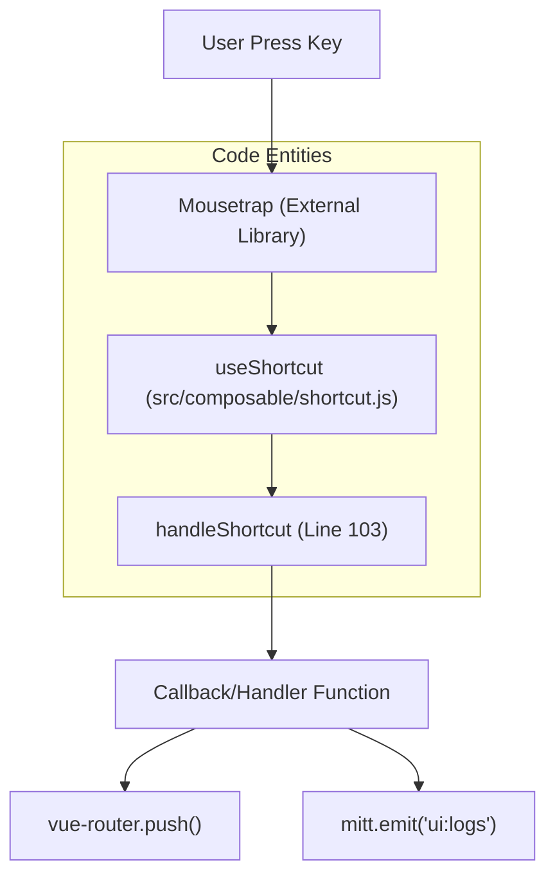
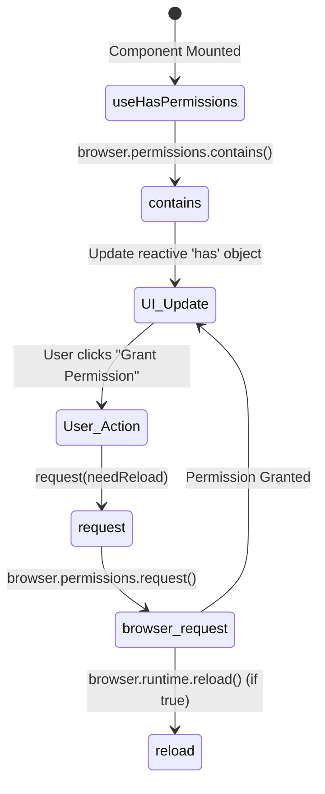

# Vue Composables

Relevant source files

The following files were used as context for generating this wiki page:

- [.gitignore](.gitignore)
- [src/components/newtab/app/AppSidebar.vue](src/components/newtab/app/AppSidebar.vue)
- [src/components/newtab/workflow/edit/EditCookie.vue](src/components/newtab/workflow/edit/EditCookie.vue)
- [src/components/newtab/workflow/edit/Trigger/TriggerContextMenu.vue](src/components/newtab/workflow/edit/Trigger/TriggerContextMenu.vue)
- [src/composable/blockValidation.js](src/composable/blockValidation.js)
- [src/composable/editorBlock.js](src/composable/editorBlock.js)
- [src/composable/hasPermissions.js](src/composable/hasPermissions.js)
- [src/composable/shortcut.js](src/composable/shortcut.js)
- [src/manifest.chrome.dev.json](src/manifest.chrome.dev.json)
- [src/newtab/pages/Settings.vue](src/newtab/pages/Settings.vue)
- [src/newtab/pages/settings/SettingsProfile.vue](src/newtab/pages/settings/SettingsProfile.vue)
- [src/newtab/router.js](src/newtab/router.js)
- [src/newtab/utils/blocksValidation.js](src/newtab/utils/blocksValidation.js)

Vue Composables in Automa are located in `src/composable/` and provide reusable logic for UI state management, browser API interactions, and workflow editor functionality. They encapsulate complex behaviors such as keyboard shortcut binding, permission handling, and reactive database queries.

## Keyboard and Navigation

### `useShortcut`
This composable utilizes the `Mousetrap` library to bind keyboard combinations to specific actions across the dashboard and editor [src/composable/shortcut.js:3-95](). It manages a registry of default shortcuts for page navigation (e.g., `option+w` for Workflows) and editor actions (e.g., `mod+shift+s` for Save) [src/composable/shortcut.js:6-59]().

**Key Functions:**
- `getReadableShortcut(str)`: Converts internal combo strings (like `mod`) into OS-specific labels (like `⌘` for Mac or `ctrl` for Windows) [src/composable/shortcut.js:65-82]().
- `useShortcut(shortcuts, handler)`: Registers a list of shortcuts. It automatically handles `onMounted` binding and `onUnmounted` unbinding to prevent memory leaks [src/composable/shortcut.js:137-142]().

### `useGroupTooltip`
Used in the `AppSidebar.vue` to initialize grouped tooltip behavior, ensuring that only one tooltip in a related group is visible at a time [src/components/newtab/app/AppSidebar.vue:108-113]().

### Keyboard Interaction Flow
The following diagram illustrates how a user keyboard press is mapped through the shortcut composable to trigger a UI action.

**Shortcut Mapping Flow**

Sources: [src/composable/shortcut.js:95-145](), [src/components/newtab/app/AppSidebar.vue:164-182]()

---

## Permissions and Validation

### `useHasPermissions`
Manages the lifecycle of requesting and checking browser-level optional permissions (e.g., `cookies`, `notifications`, `contextMenus`).

- **Reactivity**: Uses `shallowReactive` to track permission status, allowing UI components to update immediately when a permission is granted [src/composable/hasPermissions.js:7-11]().
- **Persistence**: Checks `browser.permissions.contains` on mount [src/composable/hasPermissions.js:43-51]().
- **Request Flow**: The `request` function prompts the user and can optionally trigger a background page reload (required for certain Chrome APIs to initialize) [src/composable/hasPermissions.js:12-36]().

### `useBlockValidation`
Provides logic for validating block settings before a workflow is executed or saved. It is heavily used in the Workflow Editor to highlight configuration errors.

- **Trigger Validation**: Validates `cron-job` expressions, `context-menu` names, and `visit-web` URLs [src/newtab/utils/blocksValidation.js:11-71]().
- **Permission Integration**: Checks if the required browser permissions are active for specific blocks, such as `downloads` for the Export Data block [src/newtab/utils/blocksValidation.js:133-137]().

### Permissions State Diagram
This diagram shows the relationship between UI components, the composable, and the Browser Extension API.

**Permission Request Lifecycle**

Sources: [src/composable/hasPermissions.js:1-57](), [src/components/newtab/workflow/edit/Trigger/TriggerContextMenu.vue:7-9]()

---

## Editor and UI Logic

### `useEditorBlock`
Provides metadata and category information for a specific block type within the editor [src/composable/editorBlock.js:5](). It maps a block's `label` to its detailed definition and UI category (e.g., Interaction, Data, Control Flow) [src/composable/editorBlock.js:15-19]().

### `useDialog`
Abstracts the logic for displaying confirmation and alert dialogs. It is used extensively for destructive actions, such as signing out or deleting workflows [src/newtab/pages/settings/SettingsProfile.vue:87-95]().

**Example Usage:**
In `SettingsProfile.vue`, it triggers a confirmation before clearing session storage and calling `userStore.signOut()` [src/newtab/pages/settings/SettingsProfile.vue:134-150]().

### `useComponentId`
Generates unique IDs for UI elements to ensure accessibility and correct DOM targeting within complex forms.

---

## Composable Summary Table

| Composable | Primary Responsibility | Key Files |
| :--- | :--- | :--- |
| `useShortcut` | Binding keyboard combos to router or editor actions | `shortcut.js` |
| `useHasPermissions` | Checking/Requesting `optional_permissions` from manifest | `hasPermissions.js` |
| `useEditorBlock` | Fetching block category and metadata for UI | `editorBlock.js` |
| `useDialog` | Standardized confirmation/alert modals | `dialog.js` |
| `useBlockValidation` | Validating block configuration data | `blocksValidation.js` |
| `useGroupTooltip` | Managing tooltip groups in the sidebar | `groupTooltip.js` |
| `useTheme` | Toggling between light and dark modes | `theme.js` |

Sources: [src/composable/shortcut.js:1-145](), [src/composable/hasPermissions.js:1-57](), [src/composable/editorBlock.js:1-23](), [src/newtab/utils/blocksValidation.js:1-156](), [src/components/newtab/app/AppSidebar.vue:107-113]()

---

