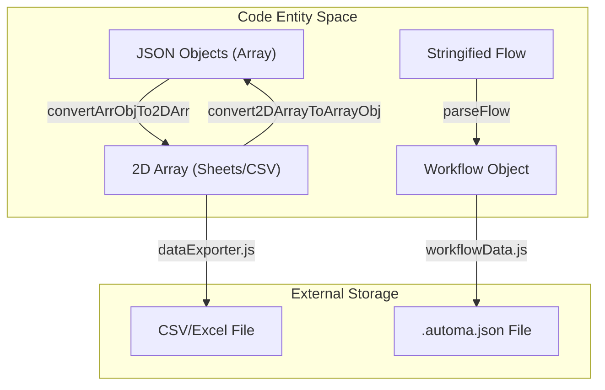
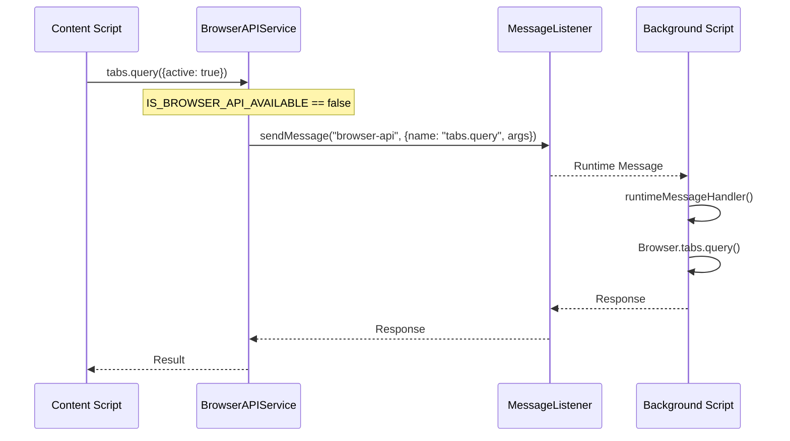

# Utility Modules

Relevant source files

The following files were used as context for generating this wiki page:

- [pnpm-lock.yaml](pnpm-lock.yaml)
- [src/components/newtab/settings/SettingsCloudBackup.vue](src/components/newtab/settings/SettingsCloudBackup.vue)
- [src/components/newtab/shared/SharedPermissionsModal.vue](src/components/newtab/shared/SharedPermissionsModal.vue)
- [src/components/newtab/workflow/edit/EditInsertData.vue](src/components/newtab/workflow/edit/EditInsertData.vue)
- [src/content/blocksHandler/handlerUploadFile.js](src/content/blocksHandler/handlerUploadFile.js)
- [src/manifest.chrome.json](src/manifest.chrome.json)
- [src/manifest.firefox.json](src/manifest.firefox.json)
- [src/newtab/pages/workflows/Shared.vue](src/newtab/pages/workflows/Shared.vue)
- [src/service/browser-api/BrowserAPIService.js](src/service/browser-api/BrowserAPIService.js)
- [src/service/browser-api/browser-api-map.js](src/service/browser-api/browser-api-map.js)
- [src/stores/hostedWorkflow.js](src/stores/hostedWorkflow.js)
- [src/stores/sharedWorkflow.js](src/stores/sharedWorkflow.js)
- [src/utils/getFile.js](src/utils/getFile.js)
- [src/utils/helper.js](src/utils/helper.js)
- [src/utils/message.js](src/utils/message.js)
- [src/utils/serialization.js](src/utils/serialization.js)
- [src/utils/workflowData.js](src/utils/workflowData.js)
- [src/workflowEngine/WorkflowEngine.js](src/workflowEngine/WorkflowEngine.js)
- [src/workflowEngine/WorkflowManager.js](src/workflowEngine/WorkflowManager.js)
- [src/workflowEngine/WorkflowWorker.js](src/workflowEngine/WorkflowWorker.js)
- [src/workflowEngine/blocksHandler/handlerDataMapping.js](src/workflowEngine/blocksHandler/handlerDataMapping.js)
- [src/workflowEngine/blocksHandler/handlerInsertData.js](src/workflowEngine/blocksHandler/handlerInsertData.js)
- [src/workflowEngine/blocksHandler/handlerLogData.js](src/workflowEngine/blocksHandler/handlerLogData.js)

The Automa codebase utilizes a suite of utility modules located primarily in `src/utils/` to handle cross-cutting concerns such as data transformation, browser tab management, workflow serialization, and cross-context communication. These modules provide the foundational logic used by both the `WorkflowEngine` and the Dashboard UI.

## Core Helpers (`helper.js`)

The `helper.js` module contains general-purpose utility functions ranging from DOM viewport checks to complex data structure conversions.

### Tab and Navigation
*   **`getActiveTab`**: Retrieves the currently active tab in the last focused window, specifically filtering for `http`, `https`, and `file` schemes [src/utils/helper.js:4-27]().
*   **`sleep`**: A Promise-based wrapper for `setTimeout` used extensively in the `WorkflowEngine` to handle delays [src/utils/helper.js:49-55]().

### Data Transformation
Automa frequently converts between 2D arrays (used for Google Sheets and CSVs) and Arrays of Objects (used for internal JSON logic).
*   **`convertArrObjTo2DArr`**: Flattens an array of objects into a 2D array where the first row contains keys [src/utils/helper.js:87-111]().
*   **`convert2DArrayToArrayObj`**: Reconstructs objects from a 2D array, generating keys like `_row1` if headers are missing [src/utils/helper.js:113-141]().

### Workflow Parsing and Cache
*   **`parseFlow`**: Normalizes workflow data, ensuring stringified JSON is converted to objects [src/utils/helper.js:153-157]().
*   **`clearCache`**: Cleans up temporary execution state from `browser.storage.local` and `localStorage` indices for specific blocks like `loop-data` [src/utils/helper.js:251-271]().

**Diagram: Data Transformation Flow**

**Sources:** [src/utils/helper.js:87-157](), [src/utils/workflowData.js:235-250]()

---

## Workflow Data Management (`workflowData.js`)

This module handles the lifecycle of workflow files, including importing, exporting, and permission auditing.

### Import and Export Logic
*   **`exportWorkflow`**: Aggregates a workflow and its nested dependencies (found via `findIncludedWorkflows`) into a single JSON blob. It uses `fileSaver` to trigger a browser download [src/utils/workflowData.js:235-250]().
*   **`importWorkflow`**: Opens a file picker, reads the JSON, and populates the `useWorkflowStore`. It also triggers `registerWorkflowTrigger` for any found trigger blocks [src/utils/workflowData.js:95-162]().
*   **`findIncludedWorkflows`**: Recursively searches for `execute-workflow` blocks to ensure sub-workflows are included in the export package [src/utils/workflowData.js:201-234]().

### Permission Auditing
The `getWorkflowPermissions` function analyzes a workflow's nodes to determine which browser permissions are required before execution [src/utils/workflowData.js:70-93]().

| Block Name | Required Permission | Implementation Site |
| :--- | :--- | :--- |
| `trigger` (context-menu) | `contextMenus` / `menus` | [src/utils/workflowData.js:16-33]() |
| `clipboard` | `clipboardRead` | [src/utils/workflowData.js:34-43]() |
| `cookie` | `cookies` | [src/utils/workflowData.js:62-67]() |
| `handle-download` | `downloads` | [src/utils/workflowData.js:50-55]() |

**Sources:** [src/utils/workflowData.js:11-93](), [src/utils/workflowData.js:235-250]()

---

## Browser API Service (`BrowserAPIService.js`)

Because Automa operates across different contexts (Background, Content Scripts, Popup), it uses `BrowserAPIService` as an abstraction layer to route API calls correctly, especially in Manifest V3 (MV3).

### Cross-Context Routing
If the Browser API is unavailable (e.g., inside a content script), the service serializes the request and sends it to the background script via `MessageListener` [src/service/browser-api/BrowserAPIService.js:23-34]().

*   **`browserAPIMap`**: A registry of supported browser APIs (tabs, windows, storage, debugger) and their paths [src/service/browser-api/browser-api-map.js:4-115]().
*   **`serializeFunctions` / `deserializeFunctions`**: Handles the transmission of callback functions across process boundaries by assigning them unique IDs [src/utils/serialization.js:1-40]().

### Content Script Injection
The `BrowserContentScript` class handles the differences between MV2 (`tabs.executeScript`) and MV3 (`scripting.executeScript`) [src/service/browser-api/BrowserAPIService.js:86-103](). It includes a `waitUntilInjected` mechanism that polls the target tab until a "content-script-exists" message is acknowledged [src/service/browser-api/BrowserAPIService.js:105-139]().

**Diagram: Cross-Context API Call**

**Sources:** [src/service/browser-api/BrowserAPIService.js:21-34](), [src/service/browser-api/browser-api-map.js:4-115](), [src/utils/serialization.js:1-40]()

---

## Communication & Messaging

### MessageListener (`message.js`)
A wrapper around `browser.runtime.sendMessage` and `onMessage` that provides a structured way to handle requests across the extension. It supports "listeners" identified by names like `workflow-engine` or `browser-api` [src/utils/message.js:1-50]().

### CallbackBridge
Used primarily for handling asynchronous callbacks that occur in a different context than the original caller. This is essential for the `debugger` API and `webNavigation` events where the response is not immediate.

---

## Serialization & Data Handling

### Serialization (`serialization.js`)
Converts complex objects and functions into a JSON-compatible format for messaging.
*   **`serializeFunctions`**: Replaces functions in an object with a placeholder `__func__` and a unique ID [src/utils/serialization.js:4-20]().
*   **`deserializeFunctions`**: Replaces placeholders back into executable functions that, when called, trigger a message back to the original context [src/utils/serialization.js:22-40]().

### File Utilities (`getFile.js`)
Handles fetching files from both `http` and `file://` protocols.
*   **`getLocalFile`**: Uses `XMLHttpRequest` or `fetch` to retrieve local file blobs, which is critical for the `upload-file` and `insert-data` blocks [src/utils/getFile.js:29-96]().
*   **`readFileAsBase64`**: Converts Blobs to Base64 strings for storage or transmission [src/utils/getFile.js:1-9]().

**Sources:** [src/utils/serialization.js:4-40](), [src/utils/getFile.js:1-102]()

---

## Workflow Migration (`convertWorkflowData.js`)

As Automa transitioned from `Drawflow` to `VueFlow`, this utility provides the logic to migrate legacy workflow schemas to the new node-based graph format. It maps legacy block IDs, coordinates, and connection structures to the standard `nodes` and `edges` arrays used in the current editor.

**Sources:** [src/utils/helper.js:57-71](), [src/workflowEngine/WorkflowEngine.js:239-247]()

---

