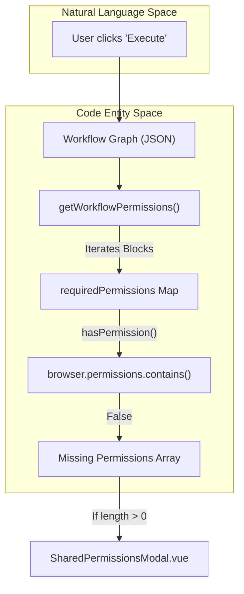
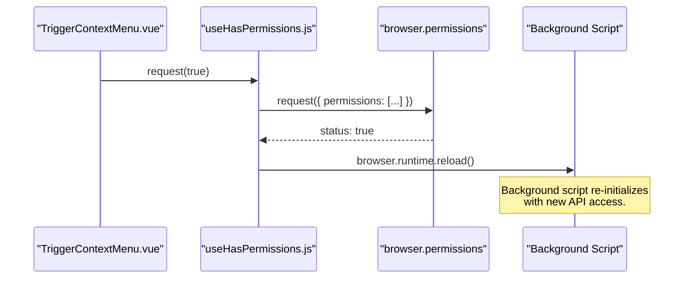

# Extension Permissions Model

Relevant source files

The following files were used as context for generating this wiki page:

- [src/components/newtab/settings/SettingsCloudBackup.vue](src/components/newtab/settings/SettingsCloudBackup.vue)
- [src/components/newtab/shared/SharedPermissionsModal.vue](src/components/newtab/shared/SharedPermissionsModal.vue)
- [src/components/newtab/workflow/edit/EditCookie.vue](src/components/newtab/workflow/edit/EditCookie.vue)
- [src/components/newtab/workflow/edit/Trigger/TriggerContextMenu.vue](src/components/newtab/workflow/edit/Trigger/TriggerContextMenu.vue)
- [src/composable/blockValidation.js](src/composable/blockValidation.js)
- [src/composable/hasPermissions.js](src/composable/hasPermissions.js)
- [src/manifest.chrome.json](src/manifest.chrome.json)
- [src/manifest.firefox.json](src/manifest.firefox.json)
- [src/newtab/pages/workflows/Shared.vue](src/newtab/pages/workflows/Shared.vue)
- [src/newtab/utils/blocksValidation.js](src/newtab/utils/blocksValidation.js)
- [src/stores/hostedWorkflow.js](src/stores/hostedWorkflow.js)
- [src/stores/sharedWorkflow.js](src/stores/sharedWorkflow.js)
- [src/utils/helper.js](src/utils/helper.js)
- [src/utils/workflowData.js](src/utils/workflowData.js)

The Automa extension utilizes a hybrid permissions model designed to balance functionality with security. While core automation capabilities are requested at install-time, specialized features—such as cookie manipulation, file downloads, and context menu integration—are treated as **Optional Permissions**. This approach minimizes the extension's initial footprint and ensures users are informed when a workflow requires elevated access.

## Manifest Declarations

Automa maintains separate manifest files for Chrome (MV3) and Firefox (MV2) to accommodate platform-specific API requirements and permission naming conventions.

### Chrome (MV3)
The Chrome manifest [src/manifest.chrome.json]() defines a strict separation between mandatory and optional permissions.
- **Mandatory Permissions**: Includes `tabs`, `storage`, `scripting`, and `debugger` (used for CSP bypass) [src/manifest.chrome.json:59-70]().
- **Host Permissions**: Requests access to `<all_urls>` to allow automation on any web page [src/manifest.chrome.json:32]().
- **Optional Permissions**: Includes `cookies`, `downloads`, `contextMenus`, `clipboardRead`, and `notifications` [src/manifest.chrome.json:52-58]().

### Firefox (MV2)
The Firefox manifest [src/manifest.firefox.json]() follows MV2 standards.
- **Permission Names**: Uses `menus` instead of `contextMenus` [src/manifest.firefox.json:54]().
- **Optional Permissions**: Includes both `clipboardRead` and `clipboardWrite` [src/manifest.firefox.json:50]().

**Sources:** [src/manifest.chrome.json:32-70](), [src/manifest.firefox.json:50-60]()

---

## Permission Discovery & Verification

Automa dynamically inspects workflow graphs to determine if the required permissions have been granted before execution starts.

### The `getWorkflowPermissions` Function
Located in [src/utils/workflowData.js](), this function iterates through all nodes in a workflow's `drawflow` data. It maps block names to a `requiredPermissions` object to identify gaps.

| Block Name | Permission Required | Check Logic |
| :--- | :--- | :--- |
| `trigger` | `contextMenus` (Chrome) / `menus` (FF) | Checks if any trigger in the list is of type `context-menu` [src/utils/workflowData.js:16-33](). |
| `clipboard` | `clipboardRead` | Checks for read access; adds `clipboardWrite` for Firefox [src/utils/workflowData.js:34-43](). |
| `cookie` | `cookies` | Standard cookie API access [src/utils/workflowData.js:62-67](). |
| `handle-download` | `downloads` | Required for the Download block [src/utils/workflowData.js:50-55](). |
| `notification` | `notifications` | Required for desktop notifications [src/utils/workflowData.js:44-49](). |

### Workflow Permissions Data Flow
The following diagram illustrates how the system transitions from a raw workflow graph to a permission request.

**Diagram: Permission Detection Pipeline**

**Sources:** [src/utils/workflowData.js:15-93](), [src/components/newtab/shared/SharedPermissionsModal.vue:1-32]()

---

## UI Components & Composables

### `useHasPermissions` Composable
This composable provides a reactive interface for checking and requesting permissions within Vue components. It is extensively used in block editors (e.g., `TriggerContextMenu.vue`).

- **`has`**: A `shallowReactive` object storing the boolean status of permissions [src/composable/hasPermissions.js:7]().
- **`request(needReload)`**: Triggers the `browser.permissions.request` API. If `needReload` is true, it reloads the background script/service worker to initialize the newly granted APIs [src/composable/hasPermissions.js:12-41]().

### `SharedPermissionsModal.vue`
When a workflow is triggered but lacks permissions, this modal displays a list of required access levels with human-readable descriptions.
- **Icons**: Maps permissions to Remix icons (e.g., `cookies` -> `mdiCookieOutline`) [src/components/newtab/shared/SharedPermissionsModal.vue:49-55]().
- **Granting**: Calls `browser.permissions.request` with the raw permission array [src/components/newtab/shared/SharedPermissionsModal.vue:57-64]().

### `blocksValidation.js`
In addition to runtime checks, the editor performs validation. For example, `validateTrigger` checks if the user has granted the `contextMenus` permission before allowing them to save a context menu trigger [src/newtab/utils/blocksValidation.js:25-39]().

**Sources:** [src/composable/hasPermissions.js:6-57](), [src/components/newtab/shared/SharedPermissionsModal.vue:1-66](), [src/newtab/utils/blocksValidation.js:11-71]()

---

## Technical Implementation Details

### Cross-Browser Compatibility
The system handles the discrepancy between Chrome and Firefox using the `BROWSER_TYPE` global constant.
- **Context Menus**: Chrome uses `contextMenus`, Firefox uses `menus` [src/utils/workflowData.js:11-12]().
- **Clipboard**: Firefox requires both `clipboardRead` and `clipboardWrite` for full clipboard block functionality [src/newtab/utils/blocksValidation.js:210-212]().

### Permission Request Lifecycle
The following diagram shows the interaction between the UI and the Browser Extension API.

**Diagram: Permission Request Sequence**

**Sources:** [src/composable/hasPermissions.js:12-41](), [src/components/newtab/workflow/edit/Trigger/TriggerContextMenu.vue:77-80]()

---

