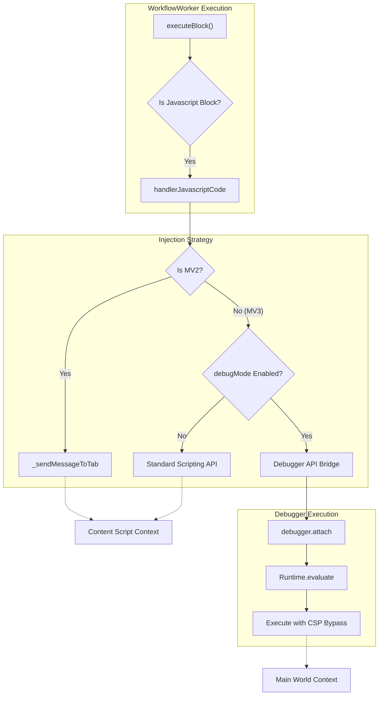
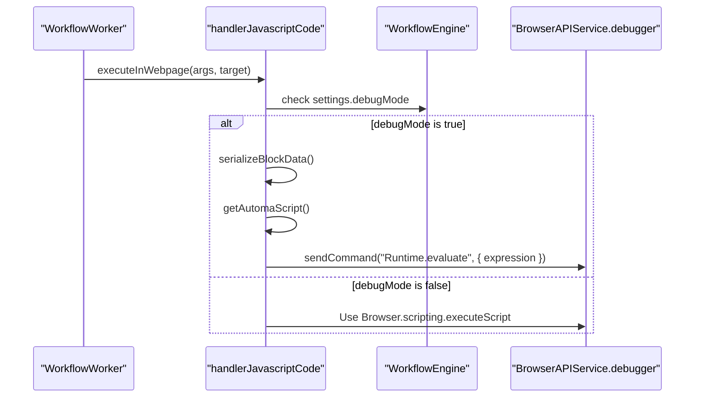

# CSP Bypass & Debugger API

Relevant source files

The following files were used as context for generating this wiki page:

- [jsconfig.json](jsconfig.json)
- [pnpm-lock.yaml](pnpm-lock.yaml)
- [src/background/BackgroundOffscreen.js](src/background/BackgroundOffscreen.js)
- [src/background/BackgroundWorkflowUtils.js](src/background/BackgroundWorkflowUtils.js)
- [src/components/newtab/settings/jsBlockWrap.js](src/components/newtab/settings/jsBlockWrap.js)
- [src/components/newtab/shared/SharedCodemirror.vue](src/components/newtab/shared/SharedCodemirror.vue)
- [src/components/newtab/workflow/edit/EditCreateElement.vue](src/components/newtab/workflow/edit/EditCreateElement.vue)
- [src/components/newtab/workflow/edit/EditJavascriptCode.vue](src/components/newtab/workflow/edit/EditJavascriptCode.vue)
- [src/components/newtab/workflow/settings/SettingsGeneral.vue](src/components/newtab/workflow/settings/SettingsGeneral.vue)
- [src/content/blocksHandler/handlerCreateElement.js](src/content/blocksHandler/handlerCreateElement.js)
- [src/offscreen/index.html](src/offscreen/index.html)
- [src/offscreen/message-listener.js](src/offscreen/message-listener.js)
- [src/service/browser-api/BrowserAPIEventHandler.js](src/service/browser-api/BrowserAPIEventHandler.js)
- [src/service/browser-api/BrowserAPIService.js](src/service/browser-api/BrowserAPIService.js)
- [src/service/browser-api/browser-api-map.js](src/service/browser-api/browser-api-map.js)
- [src/utils/serialization.js](src/utils/serialization.js)
- [src/workflowEngine/WorkflowEngine.js](src/workflowEngine/WorkflowEngine.js)
- [src/workflowEngine/WorkflowManager.js](src/workflowEngine/WorkflowManager.js)
- [src/workflowEngine/WorkflowWorker.js](src/workflowEngine/WorkflowWorker.js)
- [src/workflowEngine/blocksHandler/handlerBrowserEvent.js](src/workflowEngine/blocksHandler/handlerBrowserEvent.js)
- [src/workflowEngine/blocksHandler/handlerJavascriptCode.js](src/workflowEngine/blocksHandler/handlerJavascriptCode.js)

This page details the mechanisms Automa employs to bypass Content Security Policy (CSP) restrictions when injecting scripts, the implementation of the `chrome.debugger` API bridge, and the architecture for executing these high-privileged operations across different Manifest Versions (MV2 vs MV3).

## Overview

Modern web applications often use Content Security Policy (CSP) headers to prevent the execution of inline scripts or scripts from unauthorized domains. Automa's core functionality—injecting custom JavaScript—is frequently blocked by these policies. To overcome this, Automa utilizes the `chrome.debugger` API, which allows the extension to attach to a tab as a debugger and execute code via the Chrome DevTools Protocol (CDP), effectively bypassing CSP restrictions.

### System Flow: CSP Bypass Injection

The following diagram illustrates how the system decides between standard content script messaging and the Debugger API bypass.

**CSP Bypass Logic Flow**

Sources: [src/workflowEngine/blocksHandler/handlerJavascriptCode.js:59-75](), [src/workflowEngine/WorkflowWorker.js:232-250]()

## The Debugger API Bridge

Automa abstracts the `chrome.debugger` API through the `BrowserAPIService` to provide a consistent interface for the `WorkflowEngine`. This bridge allows the engine to send raw CDP commands to the browser.

### Implementation Details

The `BrowserAPIService` maps Chrome's debugger methods to its internal service, enabling cross-context calls (e.g., from the Offscreen Document to the Background script).

| Method | Path | Description |
| --- | --- | --- |
| `attach` | `debugger.attach` | Attaches the debugger to the specified target tab. |
| `sendCommand` | `debugger.sendCommand` | Sends a command to the debugger (e.g., `Runtime.evaluate`). |
| `detach` | `debugger.detach` | Detaches the debugger from the target. |
| `onEvent` | `debugger.onEvent` | Listens for CDP events like console logs or network requests. |

Sources: [src/service/browser-api/browser-api-map.js:74-79](), [src/service/browser-api/BrowserAPIService.js:192-194]()

### Debug Mode Configuration
Users can enable `debugMode` in the Workflow Settings. When enabled, the `WorkflowEngine` initializes the `onDebugEvent` listener to capture CDP events from the `WorkflowWorker`.

Sources: [src/workflowEngine/WorkflowEngine.js:94-107](), [src/components/newtab/workflow/settings/SettingsGeneral.vue:188-192]()

## check-csp-and-inject Routine

In `handlerJavascriptCode.js`, the injection routine evaluates the environment to determine the safest and most effective way to execute user-provided JavaScript.

### Execution Contexts
Automa supports multiple execution contexts for the JavaScript block:
1.  **Website**: Executed within the tab's DOM. This is where CSP bypass is critical.
2.  **Background**: Executed within the extension's background process (or offscreen document), where CSP is less restrictive but DOM access is unavailable.

Sources: [src/components/newtab/workflow/edit/EditJavascriptCode.vue:25-37](), [src/workflowEngine/blocksHandler/handlerJavascriptCode.js:59-62]()

### Injection Logic (MV3)
For MV3, if `debugMode` is active, the system serializes the script and its dependencies into a single string for evaluation via the debugger.

**Code Entity Association: Injection Pipeline**

Sources: [src/workflowEngine/blocksHandler/handlerJavascriptCode.js:59-81](), [src/workflowEngine/WorkflowWorker.js:232-245]()

## MV3 Offscreen Document Pattern

In Chrome MV3, the `WorkflowEngine` cannot run directly in the background service worker due to execution time limits (5-minute timeout). Automa solves this by using an **Offscreen Document**.

### Data Flow
1.  **Trigger**: An event occurs in the background (e.g., a Cron alarm).
2.  **Dispatch**: `BackgroundWorkflowUtils` detects the environment.
3.  **Offscreen Execution**: The workflow data is sent to `BackgroundOffscreen`, which communicates with `offscreen/index.html`.
4.  **Engine Lifecycle**: The `WorkflowEngine` runs inside the offscreen document, allowing it to maintain state and debugger attachments indefinitely.

| Component | File | Role |
| --- | --- | --- |
| `BackgroundOffscreen` | `src/background/BackgroundOffscreen.js` | Manages the creation and messaging of the offscreen doc. |
| `Offscreen Listener` | `src/offscreen/message-listener.js` | Receives `workflow:execute` and starts the engine. |
| `WorkflowUtils` | `src/background/BackgroundWorkflowUtils.js` | Routes execution based on browser type (Firefox vs Chrome). |

Sources: [src/background/BackgroundWorkflowUtils.js:124-137](), [src/background/BackgroundOffscreen.js:1-5](), [src/workflowEngine/WorkflowEngine.js:508-515]()

## Automa Script API (Internal)

When scripts are injected via the debugger or standard scripting, Automa injects a helper wrapper (`getAutomaScript`) that provides the `automa*` functions.

### Key Internal Functions
*   **`automaNextBlock(data, insert)`**: Dispatches a `CustomEvent` (`__automa-next-block__`) to the document body to signal the engine to continue.
*   **`automaRefData(keyword, path)`**: Resolves data from variables, tables, or global data using a path string.
*   **`automaFetch(type, resource)`**: Proxies fetch requests through the extension background to bypass CORS.

Sources: [src/workflowEngine/blocksHandler/handlerJavascriptCode.js:15-58](), [src/workflowEngine/blocksHandler/handlerJavascriptCode.js:92-120]()

---

