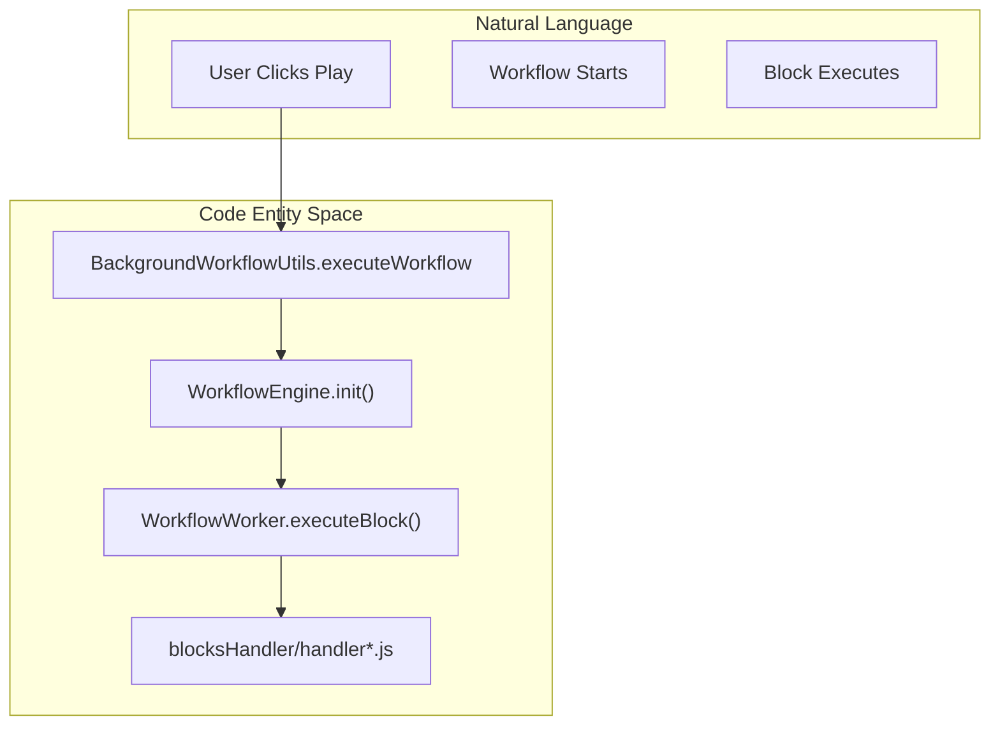
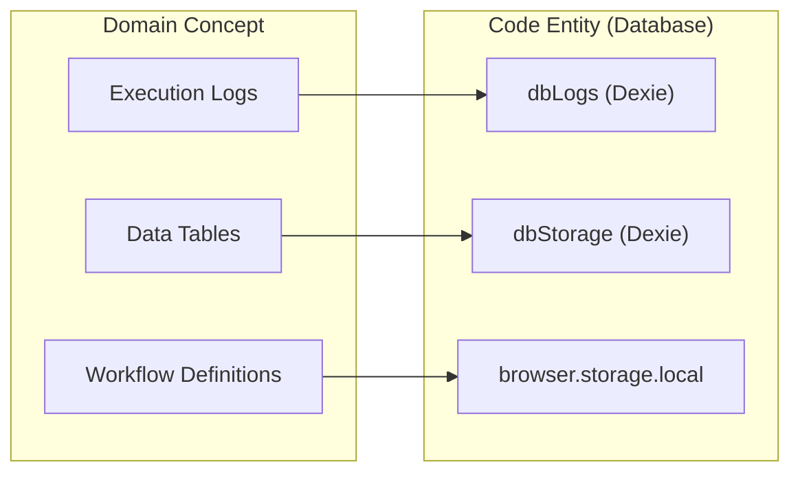

# Glossary

Relevant source files

The following files were used as context for generating this wiki page:

- [.vscode/settings.json](.vscode/settings.json)
- [package.json](package.json)
- [pnpm-lock.yaml](pnpm-lock.yaml)
- [src/assets/css/drawflow.css](src/assets/css/drawflow.css)
- [src/background/index.js](src/background/index.js)
- [src/components/block/BlockBase.vue](src/components/block/BlockBase.vue)
- [src/components/block/BlockBasic.vue](src/components/block/BlockBasic.vue)
- [src/components/block/BlockConditions.vue](src/components/block/BlockConditions.vue)
- [src/components/block/BlockElementExists.vue](src/components/block/BlockElementExists.vue)
- [src/components/newtab/logs/LogsVariables.vue](src/components/newtab/logs/LogsVariables.vue)
- [src/components/newtab/settings/jsBlockWrap.js](src/components/newtab/settings/jsBlockWrap.js)
- [src/components/newtab/shared/SharedCodemirror.vue](src/components/newtab/shared/SharedCodemirror.vue)
- [src/components/newtab/shared/SharedWorkflowTriggers.vue](src/components/newtab/shared/SharedWorkflowTriggers.vue)
- [src/components/newtab/workflow/WorkflowSettings.vue](src/components/newtab/workflow/WorkflowSettings.vue)
- [src/components/newtab/workflow/edit/EditConditions.vue](src/components/newtab/workflow/edit/EditConditions.vue)
- [src/components/newtab/workflow/edit/EditCreateElement.vue](src/components/newtab/workflow/edit/EditCreateElement.vue)
- [src/components/newtab/workflow/edit/EditJavascriptCode.vue](src/components/newtab/workflow/edit/EditJavascriptCode.vue)
- [src/components/newtab/workflow/edit/Trigger/TriggerCronJob.vue](src/components/newtab/workflow/edit/Trigger/TriggerCronJob.vue)
- [src/components/newtab/workflow/settings/SettingsGeneral.vue](src/components/newtab/workflow/settings/SettingsGeneral.vue)
- [src/components/ui/UiSelect.vue](src/components/ui/UiSelect.vue)
- [src/content/blocksHandler/handlerCreateElement.js](src/content/blocksHandler/handlerCreateElement.js)
- [src/content/handleSelector.js](src/content/handleSelector.js)
- [src/content/index.js](src/content/index.js)
- [src/content/showExecutedBlock.js](src/content/showExecutedBlock.js)
- [src/lib/cronstrue.js](src/lib/cronstrue.js)
- [src/locales/en/blocks.json](src/locales/en/blocks.json)
- [src/locales/en/newtab.json](src/locales/en/newtab.json)
- [src/locales/zh/blocks.json](src/locales/zh/blocks.json)
- [src/locales/zh/common.json](src/locales/zh/common.json)
- [src/locales/zh/newtab.json](src/locales/zh/newtab.json)
- [src/locales/zh/popup.json](src/locales/zh/popup.json)
- [src/manifest.chrome.json](src/manifest.chrome.json)
- [src/manifest.firefox.json](src/manifest.firefox.json)
- [src/newtab/App.vue](src/newtab/App.vue)
- [src/newtab/index.js](src/newtab/index.js)
- [src/newtab/pages/ScheduledWorkflow.vue](src/newtab/pages/ScheduledWorkflow.vue)
- [src/newtab/pages/Welcome.vue](src/newtab/pages/Welcome.vue)
- [src/newtab/pages/settings/SettingsBackup.vue](src/newtab/pages/settings/SettingsBackup.vue)
- [src/newtab/pages/workflows/[id].vue](src/newtab/pages/workflows/[id].vue)
- [src/offscreen/index.js](src/offscreen/index.js)
- [src/service/browser-api/BrowserAPIService.js](src/service/browser-api/BrowserAPIService.js)
- [src/service/browser-api/browser-api-map.js](src/service/browser-api/browser-api-map.js)
- [src/stores/workflow.js](src/stores/workflow.js)
- [src/utils/firstWorkflows.js](src/utils/firstWorkflows.js)
- [src/utils/helper.js](src/utils/helper.js)
- [src/utils/serialization.js](src/utils/serialization.js)
- [src/utils/shared.js](src/utils/shared.js)
- [src/utils/workflowTrigger.js](src/utils/workflowTrigger.js)
- [src/workflowEngine/WorkflowEngine.js](src/workflowEngine/WorkflowEngine.js)
- [src/workflowEngine/WorkflowManager.js](src/workflowEngine/WorkflowManager.js)
- [src/workflowEngine/WorkflowWorker.js](src/workflowEngine/WorkflowWorker.js)
- [src/workflowEngine/blocksHandler/handlerJavascriptCode.js](src/workflowEngine/blocksHandler/handlerJavascriptCode.js)

This glossary provides definitions for codebase-specific terms, abbreviations, and domain concepts used within Automa. It serves as a technical reference for engineers to understand how abstract concepts map to specific code entities.

## Core Domain Concepts

### Workflow
The primary entity in Automa, representing a series of automated steps.
*   **Implementation**: Defined as a JSON object containing metadata (name, icon), settings, and a graph of nodes/edges.
*   **Code Pointer**: The `defaultWorkflow` function in [src/stores/workflow.js:16-65]() defines the schema.
*   **Persistence**: Stored in `browser.storage.local` under the `workflows` key [src/stores/workflow.js:96-96]().

### Block (Task)
An individual unit of action within a workflow (e.g., "Click Element", "JavaScript Code").
*   **Definition**: Stored in a central registry called `tasks`.
*   **Code Pointer**: [src/utils/shared.js:1-51]().
*   **Structure**: Each block consists of a `component` (visual representation in the editor) and an `editComponent` (the configuration panel) [src/utils/shared.js:6-7]().

### Trigger
The entry point of a workflow execution.
*   **Types**: Manual, Interval, Cron, On Visit, etc. [src/utils/shared.js:17-29]().
*   **Registration**: Managed by the trigger system which interface with `browser.alarms` and `browser.webNavigation`.
*   **Code Pointer**: [src/utils/workflowTrigger.js:1-18]().

---

## Technical Architecture Terms

### Drawflow / VueFlow
The visual graph engine used to render the workflow editor. 
*   **Note**: The codebase migrated from `drawflow` to `@vue-flow/core`.
*   **Implementation**: `WorkflowEditor.vue` manages the graph state.
*   **Code Pointer**: [src/newtab/pages/workflows/[id].vue:171-185]().

### Content Script Context
Code that runs in the context of a web page, allowing DOM interaction.
*   **Entry Point**: [src/content/index.js:192-202]().
*   **Block Execution**: Content-related blocks are dispatched via `blocksHandler` within the content script [src/content/index.js:107-114]().

### Background Script
The long-running extension process that manages state, alarms, and coordinates execution.
*   **Entry Point**: [src/background/index.js:1-24]().
*   **Event Listeners**: Listens for browser events like `onRuntimeInstalled` or `onStartup` [src/background/index.js:34-39]().

### Browser API Service
An abstraction layer to handle browser-specific APIs (Chrome vs Firefox) and facilitate cross-context messaging.
*   **Code Pointer**: [src/service/browser-api/BrowserAPIService.js:1-3]().
*   **Map**: Defines which browser APIs are available to the engine [src/service/browser-api/browser-api-map.js:1-10]().

---

## Code Entity Mapping

### Natural Language to Code Entity Space
The following diagrams bridge the gap between user-facing concepts and the actual classes/functions in the source code.

**Workflow Execution Flow**

*Sources: [src/background/index.js:157-161](), [src/workflowEngine/WorkflowEngine.js:1-10](), [src/workflowEngine/WorkflowWorker.js:1-10]()*

**Data Persistence Mapping**

*Sources: [src/db/logs.js:80-80](), [src/stores/workflow.js:116-117](), [src/newtab/App.vue:80-80]()*

---

## Glossary Table

| Term | Definition | Relevant Code |
| :--- | :--- | :--- |
| **Mustache** | The templating syntax `{{ }}` used for dynamic data injection. | [src/utils/helper.js:159-162]() |
| **Selector** | CSS or XPath string used to find elements on a page. | [src/content/handleSelector.js:10-13]() |
| **Offscreen** | A hidden document used in MV3 to run DOM APIs in the background. | [src/background/BackgroundOffscreen.js:20-24]() |
| **State ID** | A unique identifier for a specific execution instance of a workflow. | [src/background/index.js:148-150]() |
| **Fallback** | Logic executed when a block fails (e.g., "Execute Fallback"). | [src/locales/en/blocks.json:44-64]() |
| **|> (Pipe)** | Special syntax used in selectors to traverse into iframes. | [src/content/index.js:54-57]() |
| **Reference Data** | Variables or table data accessible via `automaRefData`. | [src/background/index.js:14-14]() |

---

## System Abbreviations

*   **MV3**: Manifest V3 (Latest Chrome extension standard).
*   **MV2**: Manifest V2 (Legacy standard, used for Firefox compatibility).
*   **SPA**: Single Page Application (The Dashboard UI).
*   **CSP**: Content Security Policy (Often bypassed using the `chrome.debugger` API).
    *   *Implementation*: [src/background/index.js:99-128]().
*   **IDB**: IndexedDB (The underlying browser storage for Logs and Tables).

**Sources:**
- [src/utils/shared.js:1-51]()
- [src/stores/workflow.js:16-65]()
- [src/background/index.js:1-161]()
- [src/content/index.js:52-120]()
- [src/utils/helper.js:153-220]()
- [src/locales/en/blocks.json:1-104]()